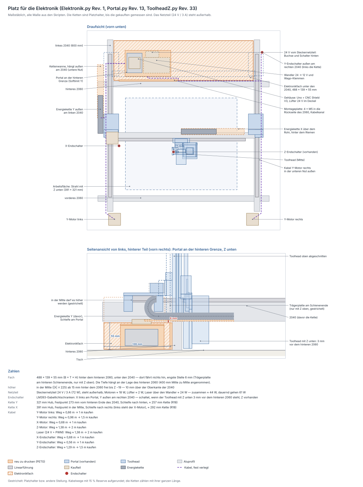
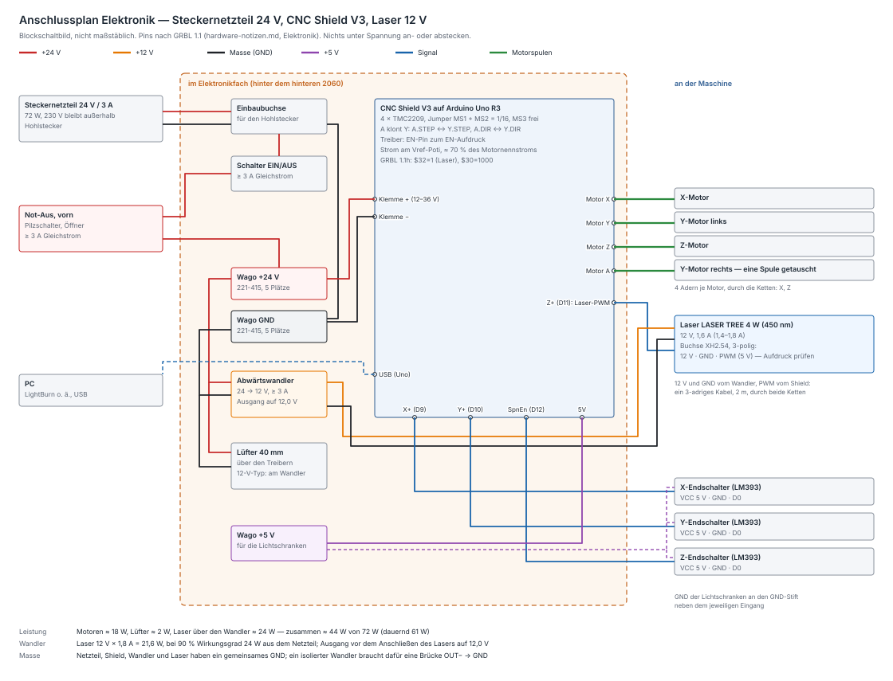

# Elektronik — Platz, Gehäuse, Endschalter, Kabel

Wohin mit Steuerung, Netzteil, Endschaltern und Kabeln. Der Platz ist
gerechnet: `python3 tools/portal_check.py`, Abschnitt 16. Das
[Gehäuse](#gehäuse-elektronikpy) erzeugt `fusion/Elektronik/Elektronik.py`,
geprüft mit `python3 tools/elektronik_check.py`. Die Zeichnung erzeugt
`python3 tools/elektronik_zeichnen.py`; sie gibt auch die Kabellängen aus;
den [Anschlussplan](#anschlussplan) erzeugt
`python3 tools/anschluss_zeichnen.py`. **Stand:** Gehäuse gezeichnet
(Elektronik.py Rev. 1); die Halter für Endschalter und Ketten folgen
([offen](#was-noch-fehlt)). Pinbelegung, Treiber und Jumper stehen in
[hardware-notizen.md, Elektronik](hardware-notizen.md#elektronik).

## Wohin: das Fach hinter dem hinteren 2060

Hinter dem hinteren 2060 stehen die 2040 frei nach hinten über. Darunter,
zwischen Tisch und 2040, fährt nichts hin:

| | |
|---|---|
| Fach | **488 × 139 × 55 mm** (Breite × Tiefe × Höhe) |
| Lage | zwischen den Innenseiten der 2040, von 3 mm hinter dem 2060 bis 3 mm vor ihr hinteres Ende, von 2 mm über dem Tisch bis 3 mm unter die 2040 |
| engste Stelle | **6 mm**: die Trägerplatte, wenn das Portal am hinteren Schienenende steht — das geht nur mit Z oben |
| höher geht es | in der Mitte (\|X\| ≤ 225 mm) ab 15 mm hinter dem 2060 bis 10 mm über die Oberkante der 2040 (108 mm über dem Fachboden) |

Mit Z unten steht das hintere 2060 selbst im Weg: Der Toolhead stieße
daran, lange bevor er das Fach erreicht. Die Prüfung fährt Portal und
Toolhead über den ganzen Y-Weg bis an das Schienenende, dazu über X und Z,
und lässt nur Stellungen gelten, in denen der Toolhead kein 2060
durchdringt.

Die Tiefe hängt an der Lage des hinteren 2060 — angenommen sind 400 mm
Mitte zu Mitte hinter dem vorderen `[?]`, also 145 mm Überstand der 2040.
Seit das Netzteil außerhalb steht, ist das unkritisch: Die Steuerung
braucht rund 85 mm.

## Was hinein kommt

| Teil | Platz | Stand |
|---|---|---|
| Steuerung: Uno R3 + CNC Shield V3 + 4 × TMC2209 | im [Gehäuse](#gehäuse-elektronikpy) links, 24-V-Lüfter im Deckel über den Treibern; USB nach hinten | gezeichnet |
| Netzteil | **Steckernetzteil GIDEALED 24 V / 3 A (72 W)**, steht außerhalb — ins Gehäuse kommt nur seine 24-V-Leitung | vorhanden |
| 24-V-Eingang | hinten am Gehäuse: Einbaubuchse 5,5 × 2,1 mm (M8) und Wippschalter KCD1 | gezeichnet |
| Verteiler | im Gehäuse rechts: Abwärtswandler 24 → 12 V für den Laser, davor drei Wago-Klemmen für +24 V, GND und die 5 V der Lichtschranken | gezeichnet, Wago vorhanden |
| Not-Aus | vorn, gut erreichbar, in der 24-V-Leitung (≥ 3 A Gleichstrom) — schaltet Laser und Motoren ab | — |

Das Gehäuse hängt an der **Rückseite des hinteren 2060** (untere und obere
Nut) mit 4 × M5 in Hammermuttern, wie die übrigen Halter — der Tisch trägt
nichts, die Maschine steht weiter nur auf den 2060.

## Gehäuse (Elektronik.py)

| Teil | Druck (PETG) | Masse (voll) | Bauraum |
|---|---|---|---|
| Gehäuse mit Montageplatte | auf dem Boden stehend | 150 cm³ ≈ 191 g | 202 × 108 × 55 mm |
| Deckel | Oberseite nach unten | 38 cm³ ≈ 48 g | 173 × 91 × 6 mm |
| Bohrlehre_Uno (PLA, ausgeblendet) | flach | 8 cm³ ≈ 10 g | 53 × 69 × 2 mm |

Die Massen stammen aus einer Nachbildung der Fusion-API; maßgeblich ist der
erste Lauf in Fusion. Keine Stützen, 4 Wandlinien, ≥ 30 % Infill. Die
Oberkante des USB-Fensters ist eine 48-mm-Brücke.

**Aufbau:** Kasten 160 × 91 × 50 mm, 17 mm hinter dem 2060. Die
Montageplatte liegt am 2060 an und trägt den Kasten über den Kanalboden und
drei niedrige Rippen; der Spalt dazwischen (12 mm) ist der **Kabelkanal**
nach rechts. Links im Kasten der Uno auf vier Stehbolzen, die Buchsenkante
hinten am **USB-Fenster**. Rechts der Verteiler: hinten **Einbaubuchse** und
**Schalter**, davor der **Wandler** quer mit zwei Kabelbindern (Schlitze im
Boden, Platz bis 30 mm Tiefe), davor die drei **Wago-Klemmen** nebeneinander
(Klebeband). Kabelausschnitte oben offen: links zur Y-Kette und zum linken
Y-Motor, vorn in den Kanal. Lüftungsschlitze rechts oben. Der Deckel sitzt
mit einer Lippe innen an den Wänden und 4 × M3 in Domen außen an den
Seitenwänden; der **Lüfter** steht obenauf über der Mitte des Uno und bläst
auf die Treiber.

**Warum es passt:** Kasten und Deckel bleiben im Fach. Nur der Lüfter ragt
7 mm darüber hinaus, 44 mm hinter dem 2060 und in der Mitte — dort ist bis
unter den X-Wagen Platz. `tools/elektronik_check.py` fährt Portal und
Toolhead über den ganzen Weg dagegen: engste Stelle 6 mm (Montageplatte ↔
Trägerplatte am hinteren Schienenende, nur mit Z oben).

**Montage:**

1. **Bohrlehre_Uno** drucken und den Uno darauflegen: Alle vier Löcher
   müssen fluchten. Erst dann das Gehäuse drucken.
2. 4 Messing-Einsätze M3 von oben in die Dome.
3. Uno mit 4 × M3×8 auf die Stehbolzen (Kernloch 2,8, die Schraube schneidet
   ihr Gewinde) — **bevor das Shield aufgesteckt wird**, danach liegt es über
   den Schrauben.
4. Shield aufstecken, Treiber (EN-Pin zum EN-Aufdruck), Jumper.
5. Einbaubuchse (Mutter innen) und Schalter (rastet ein) hinten einsetzen.
6. Wandler mit 2 Kabelbindern, Wago-Klemmen mit Klebeband; verdrahten nach
   dem [Anschlussplan](#anschlussplan). Den Wandler **ohne Laser** auf
   12,0 V stellen.
7. 4 Hammermuttern in die untere und obere Nut der Rückseite des hinteren
   2060, Gehäuse ansetzen, 4 × M5×12. Der Inbus kommt von hinten neben dem
   Kasten vorbei.
8. Kabel links durch den Ausschnitt; die für rechts vorn in den Kanal und
   darin nach rechts.
9. Lüfter mit 4 × M3×16 und Muttern auf den Deckel, **blasend nach unten**
   (Pfeil am Lüfterrahmen), Kabel durch die Öffnung. Deckel aufsetzen,
   4 × M3×8.

**Nicht gemessen `[w]`:** das Lochbild des Uno (Bohrlehre); die Höhe von
Uno, Shield und Treibern mit Kühlkörper, angenommen **34 mm** ab Unterseite
Uno — der Deckel liegt 8 mm darüber. Sobald das Shield da ist, nachmessen;
ist es höher, `stapel_h` anpassen. Die Einbaubuchse (Loch 8,2 für M8), den
Schalter KCD1 (Ausschnitt 19,2 × 12,9, Wand dort 1,6 mm für die
Rastnasen) und die Wago 221-415 (30,2 × 18,6 × 8,1).

| Parameter | Wert | Wirkung |
|---|---|---|
| `geh_x0` | −205 mm | linke Außenkante des Kastens |
| `geh_abstand` | 12 mm | Kabelkanal zwischen Montageplatte und Kasten |
| `stapel_h` / `luft_luefter` | 34 / 8 mm | Höhe Uno + Shield + Treiber, Luft bis zum Deckel — bestimmen die Kastenhöhe |
| `vert_b` | 94 mm | Breite des Verteilers (3 Wago nebeneinander) |
| `buchse_d` | 8,2 mm | Loch der Einbaubuchse |
| `schalter_b` / `schalter_h` / `schalter_wand` | 19,2 / 12,9 / 1,6 mm | Ausschnitt und Wand am Schalter |
| `uno_schraube_d` | 2,8 mm | Kernloch in den Stehbolzen |

## Leistung: Reichen 72 W?

Ja, mit Reserve: Alles zusammen braucht **≈ 44 W**, das Netzteil gibt
dauernd 61 W ab.

| Verbraucher | Leistung |
|---|---|
| 4 × NEMA 17 an TMC2209, je ≈ 1 A eingestellt | ≈ 18 W — je Motor 2 Phasen × (1 A)² × 2 Ω plus 0,6 W im Treiber; Wicklungswiderstand angenommen `[?]` |
| Lüfter 40 mm | ≈ 2 W |
| Laser LASER TREE 4 W: 12 V × 1,8 A (obere Angabe) = 21,6 W, über den Wandler (90 %) | ≈ 24 W |
| Uno | über USB, nicht aus dem Netzteil |
| **zusammen** | **≈ 44 W**, also ≈ 1,8 A auf der 24-V-Leitung |
| Netzteil, dauernd (85 % von 72 W) | 61 W — **≈ 17 W Reserve** |

Ein Chopper-Treiber zieht aus dem Netzteil nicht die Spulenströme, sondern
nur die Verluste in Wicklung und Treiber, dazu die mechanische Leistung —
bei einem Laser-Portal wenige Watt. Deshalb reichen für vier Motoren knapp
20 W.

Wird das Steckernetzteil überlastet, schaltet es ab: Die Motoren verlieren
Schritte, GRBL merkt davon nichts, weil der Uno über USB weiterläuft. Die
Reserve ist dafür da. Ein stärkerer Laser (10 W Lichtleistung und mehr, meist
60 W Aufnahme `[w]`) bräuchte ein größeres 24-V-Netzteil — nicht über 28 V,
das vertragen die TMC2209 nicht.

## Endschalter

Alle drei als **LM393-Gabellichtschranke**, wie Z (Maße in
[hardware-notizen.md](hardware-notizen.md#endschalter)): 5 V direkt an die
Eingänge des Shields, ohne Pegelwandler. Der induktive LJ12A3 ginge an X
und Y auch, bräuchte aber 6–36 V und einen Optokoppler.

| Achse | wo | Fahne | Referenz |
|---|---|---|---|
| X | links am Portal, beim X-Motor | am Toolhead | nach links |
| Y | außen am **rechten** 2040, hinten | am rechten Y-Schlitten | nach hinten |
| Z | am Toolhead (vorhanden) | Schaltfahne (vorhanden) | nach oben |

**Y rechts, weil links die Y-Kette läuft:** Die Fahne hinge außen neben dem
Schlitten, genau dort, wo links die Kette neben dem 2040 liegt, und der
obere Trum der Kette liegt über ihr. Rechts ist die Seite frei. Das Kabel
läuft mit dem des rechten Y-Motors an der Rückseite des 2060 entlang.

**X links ist eng:** Am linken Wegende steht der X-Motor 3 mm neben der
Trägerplatte, und der X-Riemen läuft vom Ritzel zum Riemenhalter. Wo die
Lichtschranke dort Platz findet, klärt die Prüfung, wenn die Halter
gezeichnet werden. Sonst kommt sie rechts an die Umlenkung, und X
referenziert nach rechts.

Die Näherungssensoren (LJ12A3) brauchst du dafür nicht, sie sind die
Reserve.

**Warum Y hinten am 2060 referenziert:** Der Schalter sitzt da, wo der
Toolhead mit Z unten 3 mm vor dem hinteren 2060 steht. Dann liegt der ganze
Weg der Softlimits zwischen den beiden 2060: 321 mm (215 hinter und 106 vor
der Mitte). Weiter hinten, bis zum Schienenende, kommt das Portal nur beim
Verfahren von Hand.

GRBL, vorläufig — die Werte folgen aus den Schaltpunkten, wenn die Halter
feststehen:

| | |
|---|---|
| `$22=1` | Referenzfahrt an: erst Z nach oben, dann X und Y |
| `$23=1` | X referenziert nach links (minus). Y nach hinten und Z nach oben sind die Plus-Richtungen, wenn `$3` so gesetzt ist, dass Y+ das Portal nach hinten fährt |
| `$27=1` | 1 mm vom Schalter zurück |
| `$20=1` | Softlimits an |
| `$130≈387` | X: 391 mm Weg, minus Schaltweg und Rückzug |
| `$131≈318` | Y: 321 mm zwischen den 2060, minus Rückzug und Reserve |
| `$132≈84` | Z: vom Schaltpunkt (8 mm unter der oberen Grenze) bis ganz unten, 85,6 mm |

Welche Richtung ausgelöst heißt, zeigt GRBL selbst: Mit `?` steht im Status
`Pn:X` (bzw. Y, Z), solange ein Schalter als ausgelöst gilt. `$5` so setzen,
dass `Pn` nur beim Unterbrechen erscheint. Wird D0 beim Unterbrechen HIGH
(bei diesen Modulen üblich `[w]`), meldet ein Kabelbruch über den internen
Pull-up „ausgelöst“ — die sichere Richtung.

## Kabel

**Fest verlegt** in den Nuten, mit Nutabdeckungen oder Clips gehalten:

* links aus dem Gehäuse, unter dem linken 2040 durch in die **untere Nut
  außen am linken 2040** — dort entlang zum linken Y-Motor und zum Festpunkt
  der Y-Kette;
* vorn aus dem Gehäuse in den Kabelkanal, darin nach rechts, dann an der
  **Rückseite des hinteren 2060** (mittlere Nut) zum rechten 2040 und in
  dessen unterer Nut außen nach vorn zum rechten Y-Motor bzw. nach hinten
  zum Y-Endschalter; das Kabel zum Not-Aus ebenso nach vorn.

**Bewegt** in zwei Energieketten:

| | Y-Kette | X-Kette |
|---|---|---|
| wo | außen am linken 2040, neben dem Schlitten (der steht bis 12 mm über das 2040 hinaus) | über dem Portalrohr, hinter dem X-Riemen |
| Hub | 321 mm | 391 mm |
| Festpunkt | 273 mm vom hinteren Ende des 2040 (halber Hub) | Mitte des X-Wegs |
| Schleife | nach hinten; die Wanne hängt in der unteren Nut außen am 2040 | nach rechts — links stünde am Wegende der X-Motor darin |
| bewegtes Ende | linker Y-Schlitten, am Stirnblock | hinten an der Trägerplatte, über dem Riemenhalter |
| Länge (R18, mit Anschlussgliedern) | ≈ 257 mm | ≈ 292 mm |
| darin | X- und Z-Motor, Laser, X- und Z-Endschalter | Z-Motor, Laser, Z-Endschalter |

Längen bis zum Gerät, Weg wie gezeichnet, 15 % Reserve, aufgerundet:

| Kabel | Weg | kaufen |
|---|---|---|
| Y-Motor links | 0,66 m | 1 m |
| Y-Motor rechts | 0,96 m | **1,5 m** |
| X-Motor | 0,68 m | 1 m |
| Z-Motor | 1,38 m | **2 m** |
| Laser (Versorgung + PWM) | 1,38 m | **2 m** |
| X-Endschalter | 0,68 m | 1 m |
| Y-Endschalter | 0,56 m | 1 m |
| Z-Endschalter | 1,29 m | 1,5 m |

In den Ketten nur **hochflexible Litzen** (Schleppkettenkabel), kein
Massivdraht und keine starren Flachbandkabel. Die üblichen 1-m-Motorkabel
reichen also nur links und für X. Der Laser bekommt ein eigenes 3-adriges
Kabel mit XH-Stecker ([Einkaufsliste](#einkaufsliste-vorschlag)).

## Anschlussplan

Kein 230 V in der Maschine: Das Steckernetzteil liefert 24 V, am Rahmen muss
nichts geerdet und keine Netzklemme abgedeckt werden.

| von | an | Hinweis |
|---|---|---|
| Hohlstecker + | Einbaubuchse → Schalter → Not-Aus → Wago +24 V | 0,5 mm², für 3 A |
| Hohlstecker − | Wago GND | |
| Wago +24 V / GND | Schraubklemme des Shields + / − | **Polung prüfen** — verpolt sind die Treiber hin |
| Wago +24 V / GND | Abwärtswandler IN+ / IN− | |
| Wago +24 V / GND | Lüfter (24-V-Typ; ein 12-V-Lüfter kommt an den Wandler) | |
| Wandler OUT+ / OUT− | Laser 12 V / GND | **Wandler erst ohne Laser auf 12,0 V stellen**, dann anschließen |
| Shield Z+ (D11), Signalstift | Laser PWM | im selben 3-adrigen Kabel, 2 m, durch beide Ketten |
| Shield X, Y, Z, A | X-Motor, Y-Motor links, Z-Motor, Y-Motor rechts | am Y-Motor rechts **eine Spule getauscht** ([Zwei Y-Motoren](hardware-notizen.md#zwei-y-motoren)) |
| Shield X+ (D9), Y+ (D10), SpnEn (D12) | D0 der Lichtschranken X, Y, Z | GND der Lichtschranke an den GND-Stift daneben |
| Shield 5 V | Wago +5 V → VCC der drei Lichtschranken | |
| Uno USB | PC | versorgt auch den Uno |

* **Abwärtswandler:** 24 → 12 V, mindestens 3 A dauernd — der Laser zieht
  bis 1,8 A. Am sichersten ein fest eingestellter 12-V-Wandler. Ein
  einstellbares Modul geht auch, aber die üblichen LM2596-Platinen sind bei
  1,8 A ohne Kühlkörper am Limit `[w]`; ein XL4015-Modul (5 A) hat Luft.
  Die gängigen Wandler haben ein gemeinsames Minus: Laser-GND und Uno-GND
  sind damit verbunden, wie es die PWM braucht. Hat der Wandler getrennte
  Massen, OUT− zusätzlich an den Wago GND.
* **Laserstecker:** XH2.54, 3-polig. Die Reihenfolge steht auf der Platine
  des Moduls neben der Buchse — vor dem ersten Einschalten ablesen.
* **Wago:** drei 5er-Klemmen (z. B. 221-415): +24 V, GND, +5 V.
* **Sicherung:** braucht es nicht, das Netzteil begrenzt den Strom selbst.
* Pins und Jumper im Einzelnen:
  [hardware-notizen.md](hardware-notizen.md#pins-grbl-11-gegen-den-aufdruck).
  Nichts unter Spannung an- oder abstecken, vor allem keine Motoren.

## Einkaufsliste (Vorschlag)

| Menge | Teil | wofür |
|---|---|---|
| 1 | CNC Shield V3 | Steuerung (Uno und 4 × TMC2209 vorhanden) |
| 1 | Abwärtswandler 24 → 12 V, ≥ 3 A (fest 12 V oder XL4015) | Laser |
| 1 | Einbaubuchse 5,5 × 2,1 mm mit M8-Gewinde (Gehäuse: Loch 8,2) | 24-V-Eingang |
| 1 | Wippschalter KCD1 (Ausschnitt 19,2 × 12,9 mm), ≥ 3 A | EIN/AUS |
| 1 | Not-Aus-Pilzschalter mit Öffner, ≥ 3 A Gleichstrom | vorn |
| 1 | Lüfter 40 × 40 × 10 mm, 24 V | über den Treibern |
| 2 | Energiekette 10 × 15 mm innen, R18, 1 m | Y und X |
| 1 + 1 | Motorkabel 1,5 m und 2 m, Stecker passend zum Motor (meist JST-PH 6-polig) auf Dupont 4-polig | Y-Motor rechts, Z-Motor |
| 2 m + 1 | 3-adrige Schleppkettenlitze + XH2.54-Stecker 3-polig mit Crimpkontakten | Laser |
| 3 | Wago 221-415 | vorhanden |
| 4 + 4 | M5×12 + Hammermutter M5 (Nut 6) | Gehäuse → Rückseite des 2060 |
| 4 + 4 | M3×8 + Messing-Einsatz M3 Ø5 | Deckel |
| 4 | M3×8 | Uno → Stehbolzen |
| 4 + 4 | M3×16 + M3-Mutter | Lüfter → Deckel |
| 2 | Kabelbinder, doppelseitiges Klebeband | Wandler, Wago |

Die übrigen Motoren reichen mit 1 m ([Kabel](#kabel)).

## Was noch fehlt

1. **Halter der Endschalter** X und Y (mit Fahnen) — kommen als Nächstes,
   alle Maße sind da.
2. **Halter der Energieketten** (Wannen, Festpunkte, bewegte Enden): wenn
   die Ketten da sind, die Anschlussglieder messen (Lochbild, Breite).
3. **Stapelhöhe** Uno + Shield + Treiber, sobald das Shield da ist (siehe
   [Gehäuse](#gehäuse-elektronikpy)).
4. Nicht dringend: Überstand der 2040 hinter dem hinteren 2060 (angenommen
   145 mm) und ob die 2040 mit Winkeln am 2060 sitzen.

Geklärt (2026-09-25/26): Netzteil ist das Steckernetzteil 24 V / 3 A mit
Hohlstecker 5,5 × 2,1; der Laser ein LASER TREE 4 W mit 12 V / 1,6 A;
Lüfter 24 V; Ketten werden wie in der Einkaufsliste gekauft;
Gabellichtschranken für X und Y sind da, Näherungssensoren als Reserve;
Wago-Klemmen sind da.
