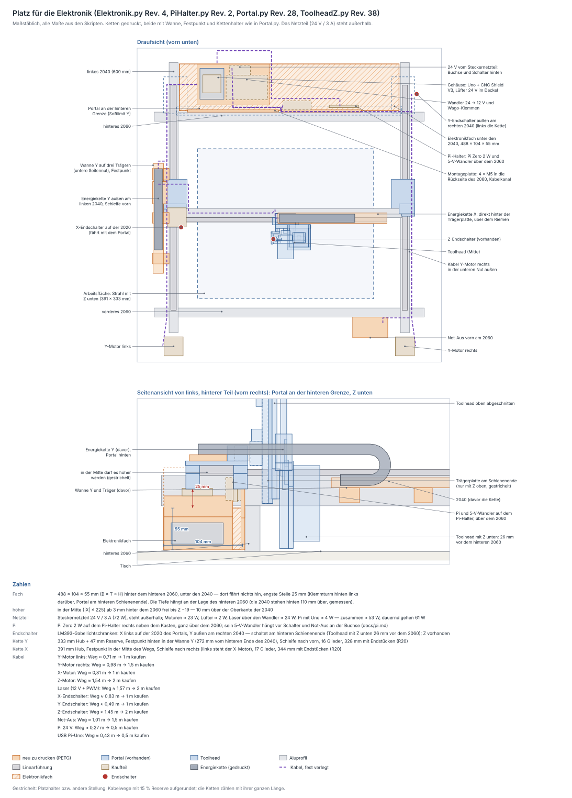
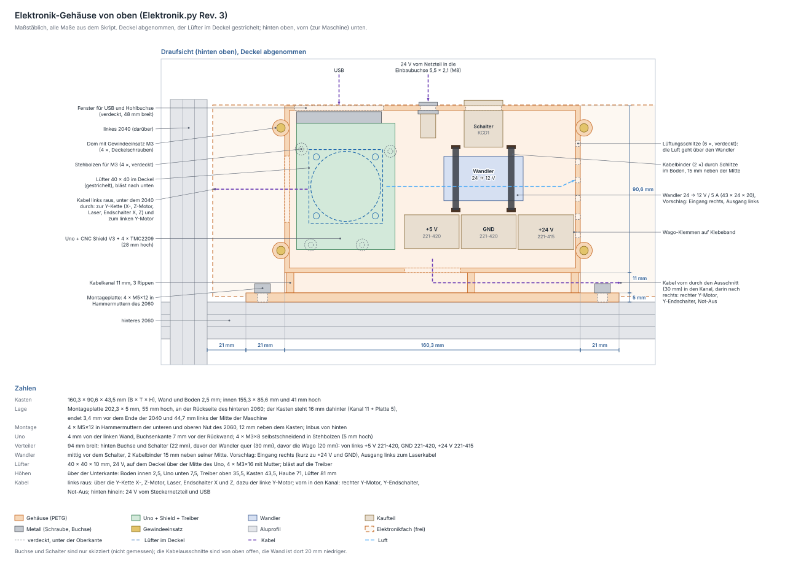
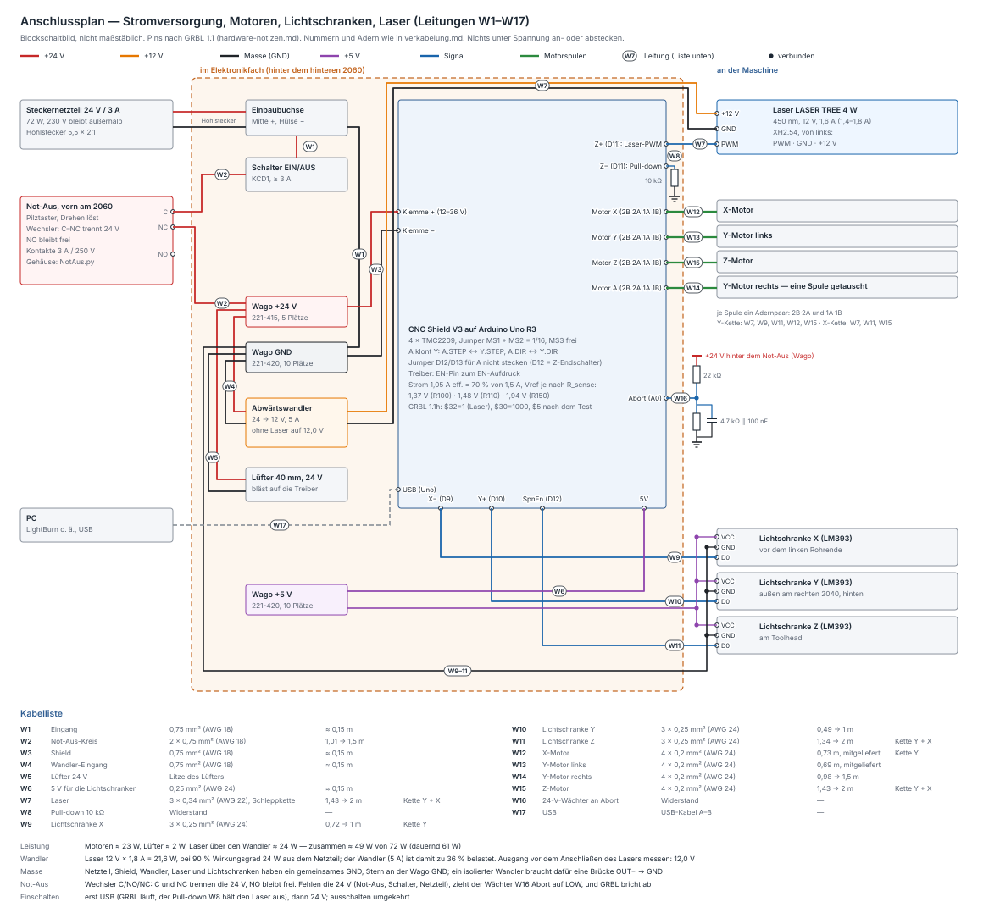

# Elektronik — Platz, Gehäuse, Endschalter, Kabel

Wohin mit Steuerung, Netzteil, Endschaltern und Kabeln. Der Platz ist
gerechnet: `python3 tools/portal_check.py`, Abschnitt 16. Das
[Gehäuse](#gehäuse-elektronikpy) erzeugt `fusion/Elektronik/Elektronik.py`,
geprüft mit `python3 tools/elektronik_check.py`. Die Zeichnung erzeugt
`python3 tools/elektronik_zeichnen.py`; sie gibt auch die Kabellängen und
die Spannungsfälle der [Litzen](#litzen) aus;
die [Draufsicht auf das Gehäuse](#gehäuse-elektronikpy)
`python3 tools/elektronik_box_zeichnen.py`, den
[Anschlussplan](#anschlussplan)
`python3 tools/anschluss_zeichnen.py`. **Stand:** Gehäuse gezeichnet
und gedruckt, der Deckel seit Rev. 3 eine höhere Haube (Elektronik.py
Rev. 3, der Kasten wie Rev. 2, mit den Angaben vom Aufbau vom 2026-09-27:
Stapelhöhe, Wandler 12 V / 5 A, Wago-Bestand, 110 mm Überstand der 2040
hinten, Laseranschluss); die Endschalter sind gebaut
([endschalter.md](endschalter.md)). Die Energieketten sind gedruckt, beide
mit Wanne, Festpunkt und Halter, dazu der Kabelweg zwischen ihnen
([energiekette.md](energiekette.md)). **Die ganze Verdrahtung** — Kabelliste,
Anschlussliste, Klemmen, Schritt für Schritt und Inbetriebnahme — steht in
[verkabelung.md](verkabelung.md). Pinbelegung, Treiber und Jumper stehen in
[hardware-notizen.md, Elektronik](hardware-notizen.md#elektronik). Ohne PC
bedient wird die Maschine über einen Pi mit CNCjs ([pi.md](pi.md)), auf
einem eigenen Halter rechts neben dem Gehäuse.

## Wohin: das Fach hinter dem hinteren 2060

Hinter dem hinteren 2060 stehen die 2040 frei nach hinten über. Darunter,
zwischen Tisch und 2040, fährt nichts hin:

| | |
|---|---|
| Fach | **488 × 104 × 55 mm** (Breite × Tiefe × Höhe) |
| Lage | zwischen den Innenseiten der 2040, von 3 mm hinter dem 2060 bis 3 mm vor ihr hinteres Ende, von 2 mm über dem Tisch bis 3 mm unter die 2040 |
| engste Stelle | **25 mm**: der hintere linke Klemmturm des Y-Schlittens über dem Fach, wenn das Portal am hinteren Schienenende steht (bis Portal Rev. 24: 23 mm) |
| höher geht es | in der Mitte (\|X\| ≤ 225 mm) gleich hinter dem 2060 bis 10 mm über die Oberkante der 2040 (108 mm über dem Fachboden) |

Nach hinten begrenzt das **Schienenende** den Y-Weg, nicht das 2060: Dort
steht der Toolhead mit Z unten noch 26 mm vor dem hinteren 2060, die
Trägerplatte 23 mm vor der Montageplatte. Die Prüfung fährt Portal und
Toolhead über den ganzen Y-Weg bis an das Schienenende, dazu über X und Z,
und lässt nur Stellungen gelten, in denen der Toolhead kein 2060
durchdringt.

Die Tiefe folgt aus dem Überstand der 2040 hinter dem hinteren 2060:
**110 mm** `[v]` (bis Rev. 1 waren 145 mm angenommen), die 2060 liegen damit
**435 mm** Mitte zu Mitte auseinander. Kasten, Kabelkanal und Montageplatte
brauchen 107 mm ab der Rückseite des 2060 und enden 3,4 mm vor dem Ende der
2040 — dafür ist der Kanal 11 statt 12 mm breit.

## Was hinein kommt

| Teil | Platz | Stand |
|---|---|---|
| Steuerung: Uno R3 + CNC Shield V3 + 4 × TMC2209 | im [Gehäuse](#gehäuse-elektronikpy) links, 24-V-Lüfter im Deckel über den Treibern; USB nach hinten zum Pi | gezeichnet |
| Netzteil | **Steckernetzteil GIDEALED 24 V / 3 A (72 W)**, steht außerhalb — ins Gehäuse kommt nur seine 24-V-Leitung | vorhanden |
| 24-V-Eingang | hinten am Gehäuse: Einbaubuchse 5,5 × 2,1 mm (M8) und runder Wippschalter (Blende Ø22,5) | gezeichnet |
| Verteiler | im Gehäuse rechts: Abwärtswandler 24 → 12 V / 5 A für den Laser (43 × 24 × 20 mm), davor drei Wago-Klemmen: +5 V für die Lichtschranken (221-420), GND (221-420), +24 V (221-415) | gezeichnet, Wandler und Wago vorhanden |
| Not-Aus | vorn am vorderen 2060 im eigenen Gehäuse ([notaus.md](notaus.md)); Pilztaster mit Wechsler, C–NC in der 24-V-Leitung — schaltet Laser und Motoren ab, der 24-V-Wächter meldet es an GRBL | vorhanden, Gehäuse gezeichnet |
| Pi: Raspberry Pi Zero 2 W mit CNCjs, 5-V-Wandler 24 → 5 V | auf dem [Pi-Halter](pi.md#halter) rechts neben dem Gehäuse, obere Nut des hinteren 2060; hängt vor Schalter und Not-Aus an der Buchse und versorgt über USB den Uno | Halter gezeichnet |

Das Gehäuse hängt an der **Rückseite des hinteren 2060** (untere und obere
Nut) mit 4 × M5 in Hammermuttern, wie die übrigen Halter — der Tisch trägt
nichts, die Maschine steht weiter nur auf den 2060.

## Gehäuse (Elektronik.py)

| Teil | Druck (PETG) | Masse (voll) | Bauraum |
|---|---|---|---|
| Gehäuse mit Montageplatte (Rev. 4) | auf dem Boden stehend | 150 cm³ ≈ 190 g | 202 × 107 × 55 mm |
| Deckel als Haube (Rev. 3) | Oberseite nach unten | 75 cm³ ≈ 96 g | 175 × 91 × 30,5 mm |
| Bohrlehre_Uno (PLA, ausgeblendet) | flach | 7 cm³ ≈ 9 g | 53 × 69 × 2 mm |

Die Massen sind aus den Schritten des Skripts nachgerechnet (Raster,
0,2 mm); maßgeblich ist der erste Lauf in Fusion. Der Kasten war mit
Rev. 2 gedruckt. Rev. 3 hat den Deckel zur [Haube](#deckel-als-haube-rev-3)
gemacht. Rev. 4 gibt dem Kasten ein rundes Loch für den Schalter, dafür
wird er neu gedruckt; sonst ist er gleich geblieben, die Haube passt.
Fertige STL in Drucklage: [`stl/Elektronik_Gehaeuse_r4.stl`](../stl/Elektronik_Gehaeuse_r4.stl)
und [`stl/Elektronik_Deckel_r4.stl`](../stl/Elektronik_Deckel_r4.stl)
(`python3 tools/stl_export.py`, braucht `pip install manifold3d`). Keine Stützen,
4 Wandlinien, ≥ 30 % Infill. Die Oberkante des USB-Fensters ist eine
48-mm-Brücke.

**Aufbau:** Kasten 160 × 91 × 44 mm, 16 mm hinter dem 2060. Die
Montageplatte liegt am 2060 an und trägt den Kasten über den Kanalboden und
drei niedrige Rippen; der Spalt dazwischen (11 mm) ist der **Kabelkanal**
nach rechts. Links im Kasten der Uno auf vier Stehbolzen, die Buchsenkante
hinten am **USB-Fenster**. Rechts der Verteiler: hinten **Einbaubuchse** und
**Schalter**, davor der **Wandler** (12 V / 5 A, 43 × 24 × 20 mm) quer,
mittig vor dem Schalter, mit zwei Kabelbindern 15 mm neben seiner Mitte —
sie laufen durch Schlitze im Boden, zwischen Buchse und Schalter bzw.
rechts am Schalter vorbei, und liegen 4 mm innerhalb seiner Enden. Links
und rechts vom Wandler bleiben 22,5 bzw. 28,5 mm für die Drähte. Davor die
drei **Wago-Klemmen** nebeneinander (Klebeband), von links: **+5 V**
(221-420, neben dem Uno), **GND** (221-420), **+24 V** (221-415, beim
Schalter); zusammen 89,8 mm auf 92 mm Platz. Kabelausschnitte oben offen:
links zur Y-Kette und zum linken Y-Motor, vorn in den Kanal.
Lüftungsschlitze rechts oben. Der Deckel ist seit Rev. 3 eine **Haube**:
Er sitzt mit einer Lippe innen an den Wänden und 4 × M3 in Domen außen an
den Seitenwänden, seine Platte liegt aber 25 mm höher. Der **Lüfter** steht
obenauf über der Mitte des Uno und bläst auf die Treiber.

**Warum es passt:** Der Kasten bleibt im Fach. Haube und Lüfter ragen
darüber hinaus, bis 26 mm über die Oberkante des Fachs. Sie stehen aber
16 mm hinter dem 2060 und in der Mitte, dort fährt nichts so tief
herunter. `tools/elektronik_check.py` fährt Portal und Toolhead über den
ganzen Weg dagegen. Die engste Stelle ist 22,7 mm (Montageplatte ↔
Trägerplatte, Portal am hinteren Schienenende). Die Haube bleibt 24,5 mm
vom hinteren linken Klemmturm weg.

### Deckel als Haube (Rev. 3)

Der flache Deckel von Rev. 2 lag 8 mm über den Kühlkörpern, das war zu
flach (Angabe 2026-10-08). Der Kasten war schon gedruckt und blieb, wie
er war. `elektronik_check.py` prüft das Maß für Maß gegen Rev. 2, bis auf
das Schalterloch aus Rev. 4. Neu gedruckt wurde nur der Deckel:

| | |
|---|---|
| Wände | 2,5 mm, stehen auf den Wänden des Kastens und heben die Platte um **25 mm** (`deckel_aufbau`). Unter der Platte sind es jetzt **33 mm** bis zu den Kühlkörpern statt 8 |
| Lippe | wie bisher innen an den Wänden des Kastens, 3 mm tief, 0,3 mm Spiel. Ein Ring innen am Fuß der Haube trägt sie |
| Schrauben | dieselben **4 × M3×8** in die Einsätze der Dome. Über jedem Dom steht eine Säule (Ø11) mit einem Kanal (Ø6,5) von oben, unten bleibt ein 3 mm Boden. Kopf und Inbus 2,5 gehen durch den Kanal bis auf diesen Boden, die Schraube greift 5 mm in den Einsatz |
| Lüfter | oben auf der Platte über der Mitte des Uno, wie bisher 4 × M3×16 mit Mutter |
| Druck | Oberseite aufs Bett, 30,5 mm hoch, keine Stützen. Die Böden über den Domen sind kurze Brücken über den Kanal. Fertig in Drucklage: [`stl/Elektronik_Deckel_r4.stl`](../stl/Elektronik_Deckel_r4.stl), seit Rev. 3 unverändert |

Höher ginge es bis etwa **65 mm** (`deckel_aufbau`), dann käme das
Portalrohr am hinteren Schienenende bis auf 3 mm an die Haube. Mit
`deckel_aufbau = 0` baut das Skript wieder den flachen Deckel.

**Montage:**

1. **Bohrlehre_Uno** drucken und den Uno darauflegen: Alle vier Löcher
   müssen fluchten. Erst dann das Gehäuse drucken.
2. 4 Messing-Einsätze M3 von oben in die Dome.
3. Uno mit 4 × M3×8 auf die Stehbolzen (Kernloch 2,8, die Schraube schneidet
   ihr Gewinde) — **bevor das Shield aufgesteckt wird**, danach liegt es über
   den Schrauben.
4. Shield aufstecken, Treiber (EN-Pin zum EN-Aufdruck), Jumper.
5. Einbaubuchse (Mutter innen) und Schalter (rastet ein) hinten einsetzen.
6. Wandler mit 2 Kabelbindern, Wago-Klemmen mit Klebeband; verdrahten nach
   [verkabelung.md](verkabelung.md#schritt-für-schritt). Den Wandler
   **ohne Laser** auf 12,0 V stellen.
7. 4 Hammermuttern in die untere und obere Nut der Rückseite des hinteren
   2060, Gehäuse ansetzen, 4 × M5×12. Der Inbus kommt von hinten neben dem
   Kasten vorbei.
8. Kabel links durch den Ausschnitt; die für rechts vorn in den Kanal und
   darin nach rechts.
9. Lüfter mit 4 × M3×16 und Muttern auf die Haube, **blasend nach unten**
   (Pfeil am Lüfterrahmen), Kabel durch die Öffnung. Haube aufsetzen, die
   Lippe innen an den Wänden, 4 × M3×8 von oben durch die Kanäle der
   Säulen. Dafür einen langen Inbus 2,5 nehmen, der Kanal ist 25 mm tief.

**Gemessen `[v]` (2026-09-27):** die Höhe von Uno, Shield und Treibern mit
Kühlkörper, **28 mm** ab Unterseite Uno (bis Rev. 1 mit 34 mm angenommen) —
der Kasten endet 8 mm darüber und ist dadurch 6 mm niedriger (die Platte
der Haube liegt seit Rev. 3 33 mm darüber); das
Lochbild des Uno stimmt mit der Bohrlehre; der Wandler, 43 × 24 × 20 mm.

**Schalter (Rev. 4):** rund, die Blende außen **22,5 mm** `[v]` (Angabe
2026-10-09; bis Rev. 3 war ein eckiger KCD1 mit 19,2 × 12,9 angenommen).
Das Einbauloch ist **Ø20,2** angenommen `[?]`, bei dieser Blende üblich
20 mm. Die Wand ist um das Loch innen auf 1,6 mm verdünnt, damit die
Rastnasen greifen. Oben endet das Loch mit zwei 45°-Flanken 0,6 mm über
dem Kreis flach. So druckt es in der senkrechten Wand ohne Überhang, und
die Blende deckt die Kappe. Miss vor dem Druck den Körper des Schalters:
Ist er dicker als 20 mm, `schalter_d` anpassen.

**Nicht gemessen `[w]`:** die Einbaubuchse (Loch 8,2 für M8) und die
Wago-Klemmen nach Datenblatt: 221-415 30,2 × 18,8 × 8,6 mm, 221-420
(10 Leiter, zwei Reihen) 29,8 × 18,3 × 15,8 mm (Breite × Tiefe × Höhe, je
die größere Händlerangabe).

| Parameter | Wert | Wirkung |
|---|---|---|
| `geh_x0` | −205 mm | linke Außenkante des Kastens |
| `geh_abstand` | 11 mm | Kabelkanal zwischen Montageplatte und Kasten |
| `stapel_h` / `luft_luefter` | 28 `[v]` / 8 mm | Höhe Uno + Shield + Treiber, Luft bis zur Oberkante des Kastens — bestimmen die Kastenhöhe (gedruckt, nicht mehr ändern) |
| `deckel_aufbau` | 25 mm | Haube: so viel höher liegt die Platte mit dem Lüfter; bis etwa 65 mm möglich, 0 = flacher Deckel |
| `haube_dom_d` / `haube_kanal_d` / `haube_boden` | 11 / 6,5 / 3 mm | Säulen über den Domen, Kanal für Kopf und Inbus, Boden unter dem Kopf |
| `vert_b` | 94 mm | Breite des Verteilers (3 Wago nebeneinander) |
| `wandler_l` / `_b` / `_h` | 43 / 24 / 20 mm `[v]` | Wandler; `wandler_binder` 15 mm: Kabelbinder neben seiner Mitte |
| `buchse_d` | 8,2 mm | Loch der Einbaubuchse |
| `schalter_d` / `schalter_blende_d` / `schalter_wand` | 20,2 `[?]` / 22,5 `[v]` / 1,6 mm | runder Wippschalter: Einbauloch, Blende außen, Wand am Loch; `schalter_kappe` 0,6 mm: flache Kappe oben |
| `uno_schraube_d` | 2,8 mm | Kernloch in den Stehbolzen |

## Leistung: Reichen 72 W?

Ja, mit Reserve: Alles zusammen braucht **≈ 53 W**, das Netzteil gibt
dauernd 61 W ab.

| Verbraucher | Leistung |
|---|---|
| 4 × NEMA 17 (Stepperonline, 1,5 A) an TMC2209, je 1,05 A eingestellt | ≈ 23 W — je Motor 2 Phasen × (1,05 A)² × 2,3 Ω plus 0,6 W im Treiber; 2,3 Ω laut Datenblatt des 17HE15-1504S `[w]` |
| Lüfter 40 mm | ≈ 2 W |
| Laser LASER TREE 4 W: 12 V × 1,8 A (obere Angabe) = 21,6 W, über den Wandler (90 %) | ≈ 24 W |
| Pi, Uno, Treiberlogik und 3 Lichtschranken: zusammen 755 mA aus 5 V, über den 5-V-Wandler des Pi (85 %) | ≈ 4,4 W |
| **zusammen** | **≈ 53 W**, also ≈ 2,2 A auf der 24-V-Leitung |
| Netzteil, dauernd (85 % von 72 W) | 61 W — **≈ 8 W Reserve** |

Ein Chopper-Treiber zieht aus dem Netzteil nicht die Spulenströme, sondern
nur die Verluste in Wicklung und Treiber, dazu die mechanische Leistung —
bei einem Laser-Portal wenige Watt. Deshalb reichen für vier Motoren rund
23 W.

Wird das Steckernetzteil überlastet, schaltet es ab, und mit ihm gehen auch
Pi und Uno aus: Der Auftrag bricht mitten im Werkstück ab, und die SD-Karte
des Pi kann Schaden nehmen. Die Reserve ist dafür da. Ein stärkerer Laser (10 W Lichtleistung und mehr, meist
60 W Aufnahme `[w]`) bräuchte ein größeres 24-V-Netzteil — nicht über 28 V,
das vertragen die TMC2209 nicht.

## Endschalter

Alle drei als **LM393-Gabellichtschranke**, wie Z (Maße in
[hardware-notizen.md](hardware-notizen.md#endschalter)): 5 V direkt an die
Eingänge des Shields, ohne Pegelwandler. Der induktive LJ12A3 ginge an X
und Y auch, bräuchte aber 6–36 V und einen Optokoppler.

| Achse | wo | Fahne | Referenz |
|---|---|---|---|
| X | vor dem linken Ende des Portalrohrs (der 2020), Block an der X-Schiene; fährt mit dem Portal | Klammer unten an der Trägerplatte | nach links |
| Y | außen am **rechten** 2040, 35 mm hinter dem hinteren 2060, untere Nut | Klammer an der rechten Schlittenplatte | nach hinten |
| Z | am Toolhead (vorhanden) | Schaltfahne (vorhanden) | nach oben |

**Y rechts, weil links die Y-Kette läuft:** Die Fahne hinge außen neben dem
Schlitten, genau dort, wo links die Kette neben dem 2040 liegt, und der
obere Trum der Kette liegt über ihr. Rechts ist die Seite frei. Das Kabel
läuft mit dem des rechten Y-Motors an der Rückseite des 2060 entlang.

**X links, vor dem Rohr:** Am linken Wegende steht der X-Motor 3 mm neben
der Trägerplatte, und der X-Riemen läuft vom Ritzel zum Riemenhalter. Die
Lichtschranke sitzt deshalb nicht am Motor, sondern auf einem Block vor
dem linken Rohrende, der an das Ende der X-Schiene stößt. Die Fahne hängt
an einer Klammer unten an der Trägerplatte. Halter, Fahnen, Montage und
Einstellen: [endschalter.md](endschalter.md).

Die Näherungssensoren (LJ12A3) brauchst du dafür nicht, sie sind die
Reserve.

**Warum Y hinten am Schienenende referenziert:** Seit die 2060 435 mm
auseinander liegen (gemessen), kommt der Toolhead mit Z unten nicht mehr an
das hintere 2060 — am hinteren Schienenende steht er noch 26 mm davor. Nach
hinten begrenzen also die Y-Wagen, die dort bündig mit dem Schienenende
stehen. Der Schalter soll 3 mm davor schalten: Die Wagen dürfen nicht über
das Ende hinaus, sonst fallen Kugeln heraus. Der Weg der Softlimits reicht
dann vom Schaltpunkt bis 3 mm vor das vordere 2060 (Z unten): 333 mm
zwischen Schienenende und vorderem 2060 (227 hinter und 106 vor der Mitte),
davon gehen Schaltabstand und Rückzug ab.

Die GRBL-Einstellungen mit diesen Wegen (`$130`–`$132`, gerechnet aus den
Schaltpunkten) und den Test der Lichtschranken mit `?` und `$5` beschreibt
[verkabelung.md](verkabelung.md#grbl-einstellungen); angeschlossen werden
sie nach [verkabelung.md](verkabelung.md#4-5-v-und-lichtschranken-w6-w9w11).

## Kabel

**Fest verlegt** an den Nuten: an den 2040 in den
[Kabelhaltern](kabelhalter.md) unter der unteren Außennut (links fünf,
rechts vier), in der oberen Nut des Portalrohrs mit Nutabdeckungen oder
Clips:

* links aus dem Gehäuse, unter dem linken 2040 durch an die **untere Nut
  außen am linken 2040** — dort entlang zum linken Y-Motor (an den drei
  Trägern der Wanne Y in den Kabelhaltern unter ihrer Wand durch) und bis
  hinter die Wanne Y, dort hinein zum Festpunkt der Y-Kette;
* auf dem linken Y-Schlitten vom Kettenhalter Y hinter Stirnblock und
  Rückwand nach innen, in die **obere Nut des Portalrohrs** und darin zum
  Kabelflügel am Festpunkt der X-Kette; das fährt alles mit dem Portal;
* vorn aus dem Gehäuse in den Kabelkanal, darin nach rechts, dann an der
  **Rückseite des hinteren 2060** (mittlere Nut) zum rechten 2040 und in
  dessen unterer Nut außen nach vorn zum rechten Y-Motor bzw. nach hinten
  zum Y-Endschalter; das Kabel zum Not-Aus ebenso nach vorn.
* Vorn belegt der [Y-Motorhalter](y-motorhalter.md) die letzten 30 mm der
  unteren Nuten beider Seitenflächen (Nutensteine), dahinter sitzen am
  vorderen 2060 die Winkel, die die 2040 halten. Das Motorkabel verlässt die
  Nut vor dem Winkel und läuft außen an Winkel und Schenkel zum Motor. Am
  hinteren 2060 sitzen ebenfalls Winkel (8 je Kreuzung), dort genauso.

**Bewegt** in zwei Energieketten:

| | Y-Kette | X-Kette |
|---|---|---|
| wo | außen am linken 2040, 3 mm neben der Schlittenplatte (die steht bis 12 mm über das 2040 hinaus) | direkt hinter der Trägerplatte, in einer Wanne über Portalrohr und X-Riemen |
| Hub | 333 mm, dazu 47 mm Reserve nach vorn | 391 mm |
| Festpunkt | hinten in der Wanne Y: Endstück 180 auf Wanne und Träger, 272 mm vom hinteren Ende des 2040 | Mitte des X-Wegs: Endstück 180 auf Wanne und Stütze |
| Schleife | nach vorn; die Wanne hängt an drei Trägern in der unteren Seitennut außen am 2040 | nach rechts — links stünde am Wegende der X-Motor darin |
| bewegtes Ende | Kettenhalter Y auf der Platte des linken Y-Schlittens, hinter dem Stirnblock | Kettenhalter hinten an der Trägerplatte, über dem Riemenhalter |
| Länge (R 20, mit Anfangs- und Endstück) | 16 Glieder, 328 mm (Arbeitsweg + Reserve) | 17 Glieder, 344 mm |
| darin | X- und Z-Motor, Laser, X- und Z-Endschalter: 17 Adern, 34 % gefüllt | Z-Motor, Laser, Z-Endschalter: 10 Adern, 21 % gefüllt |
| Stand | konstruiert (Portal Rev. 21), [energiekette.md](energiekette.md#y-kette) | konstruiert, [energiekette.md](energiekette.md) |

Beide Ketten sind **gedruckt** (Angabe vom 2026-10-01), nach dem Modell
„Energiekette“ von lingnau.florian: außen 18 × 14 mm, innen 10 × 8,8 mm,
Teilung 16, Biegeradius R 20: Um 180° gebogen ist die Schleife außen
50 mm hoch, 4 Gelenke knicken im Bogen (gemessen am 2026-10-02). Beide
Ketten sind gleich groß. Die
gekauften Ketten mit 10 × 20 mm innen und 15 × 27 mm außen braucht es
nicht mehr. Gezeichnet sind beide so, wie `Portal.py` sie baut, in der
Seitenansicht die Y-Kette mit dem Portal am hinteren Schienenende.

Die Längen bis zum Gerät (Weg wie gezeichnet, 15 % Reserve, aufgerundet)
stehen mit Litze, Weg und Kette jeder Leitung in der Kabelliste von
[verkabelung.md](verkabelung.md#leitungen); `tools/elektronik_zeichnen.py`
gibt sie auch beim Zeichnen aus.

In den Ketten nur **Einzellitzen aus Silikon**, keine Mantelleitungen,
kein Massivdraht und keine starren Flachbandkabel: Für Mantelleitungen ist
R 20 zu eng ([energiekette.md](energiekette.md#litzen-in-der-kette)). Die üblichen 1-m-Motorkabel
reichen also nur links und für X. Der Laser bekommt ein eigenes 3-adriges
Kabel mit XH-Stecker ([Einkaufsliste](#einkaufsliste-vorschlag)).

### Litzen

Kupfer, feindrähtig. Der Querschnitt folgt aus Strom und Länge und aus dem,
was Stecker und Klemmen nehmen `[w]`: XH-Crimpkontakt 0,08–0,34 mm²
(AWG 28–22), PH 0,05–0,22 mm² (AWG 30–24), Dupont AWG 28–22, Wago 221
feindrähtig 0,14–4 mm². Gerechnet in `tools/elektronik_zeichnen.py`, geprüft
in `tools/elektronik_check.py` (Abschnitt 14), jeweils am längsten Weg:

| Leitung | Strom | Litze | warum |
|---|---|---|---|
| 24 V: Buchse → Schalter → Not-Aus → Wago +24 V, Buchse − → Wago GND, Wago → Shield und Wandler | bis 3 A (Netzteil) | **0,75 mm² (AWG 18)**, rot und schwarz | belastbar 6 A (VDE 0298-4, flexible Leitung); 0,5 mm² hätte genau die 3 A. Not-Aus 1,5 m hin und zurück: 0,21 V bei 3 A |
| Laser: +12 V, GND, PWM | 1,8 A | **3 × 0,34 mm² (AWG 22)** | dicker passt nicht in den XH-Kontakt am Laser; 2 m: 0,37 V = 3 % von 12 V |
| Motoren | 1,05 A je Spule | **4 × AWG 24 (0,2 mm²)** | dicker passt nicht in den PH-Kontakt am Motor; Z-Motor, 2 m: 0,35 Ω = 15 % der Wicklung. Fertige Motorkabel mit AWG 26 gehen auch (24 %) |
| Endschalter: 5 V, GND, Signal | ≈ 20 mA | **3 × 0,25 mm² (AWG 24)** | 0,14 mm² ist das Minimum der Wago (AWG 26 hat nur 0,13); in den Dupont-Kontakt passen bis 0,34 |
| Lüfter | < 0,1 A | seine eigene Anschlusslitze | |

* In Schraubklemmen (Shield, Wandler, Not-Aus) mit **Aderendhülse**, in die
  Wago ohne.
* In den Ketten nur Einzellitzen aus Silikon, die Motorkabel nur als lose
  Adern ohne Schlauch. Die gedruckten Ketten biegen mit R 20, dafür sind
  Mantelleitungen zu steif.
* Die Y-Kette trägt fünf Leitungen (X- und Z-Motor, Laser, X- und
  Z-Endschalter) mit 17 Adern, die X-Kette drei mit 10 Adern. Innen sind
  10 × 8,8 mm frei. Die Adern füllen das zu 34 und 21 %, höchstens 60 %
  sind gut `[w]` (Prüfung in `tools/elektronik_check.py`).

## Anschlussplan

Kein 230 V in der Maschine: Das Steckernetzteil liefert 24 V, am Rahmen muss
nichts geerdet und keine Netzklemme abgedeckt werden.

Die Verdrahtung Leitung für Leitung (W1–W19), die Belegung von Wago-Klemmen
und Shield, die Reihenfolge beim Anschließen und die Inbetriebnahme mit
Tests stehen in [verkabelung.md](verkabelung.md). Plan und Tabellen
entstehen aus derselben Kabelliste (`tools/verkabelung.py`).

* **Abwärtswandler:** vorhanden, **12 V / 5 A**, 43 × 24 × 20 mm `[v]`.
  Der Laser zieht höchstens 1,8 A, der Wandler ist damit zu 36 % belastet —
  reichlich Luft.
* **Treiber:** GERUI TMC2209 V2.0 mit Kühlkörper (5 Stück: 4 + Ersatz),
  standalone, 1/16 über MS1 + MS2. Strom am Vref-Poti, Ziel **1,05 A eff.**
  = 70 % des Nennstroms 1,5 A. Vref hängt vom Messwiderstand ab: **1,37 V**
  bei R100, **1,48 V** bei R110, **1,94 V** bei R150. Ein Aufdruck R110 ist
  auf den Modulen nicht zu finden — deshalb **mit 1,37 V anfangen**: Das
  gibt bei jedem der drei höchstens 1,05 A. Rechnung und Vorgehen in
  [hardware-notizen.md](hardware-notizen.md#treiber-und-versorgung).
* **Sicherung:** braucht es nicht, das Netzteil begrenzt den Strom selbst.

## Einkaufsliste (Vorschlag)

| Menge | Teil | wofür |
|---|---|---|
| 1 | Abwärtswandler 24 → 12 V / 5 A, 43 × 24 × 20 mm | vorhanden |
| 1 | Einbaubuchse 5,5 × 2,1 mm mit M8-Gewinde (Gehäuse: Loch 8,2) | 24-V-Eingang |
| 1 | Wippschalter rund (Blende Ø22,5, Einbauloch Ø20), ≥ 3 A | EIN/AUS |
| 1 | Lüfter 40 × 40 × 10 mm, 24 V | über den Treibern |
| 2 | Energiekette, gedruckt: Anfangsstück und Endstück 180, 17 Glieder für X, 16 für Y (gleiche Größe) | X und Y; Wannen, Stützen, Träger und Halter: [energiekette.md](energiekette.md#verschraubung) |
| 1 + 2 | Wago 221-415 (+24 V), 221-420 (GND, +5 V); 221-413 Reserve | vorhanden |
| — | Not-Aus, Kabel, Litzen, Stecker, Aderendhülsen, Pull-down | [verkabelung.md](verkabelung.md#material-und-werkzeug) |
| 4 + 4 | M5×12 + Hammermutter M5 (Nut 6) | Gehäuse → Rückseite des 2060 |
| 4 + 4 | M3×8 + Messing-Einsatz M3 Ø5 | Deckel |
| 4 | M3×8 | Uno → Stehbolzen |
| 4 + 4 | M3×16 + M3-Mutter | Lüfter → Deckel |
| 2 | Kabelbinder, doppelseitiges Klebeband | Wandler, Wago |
| 1 | Pi Zero 2 W, 5-V-Wandler, USB-Kabel, Pi-Halter und Schrauben | ohne PC: [pi.md](pi.md#teile) |

## Was noch fehlt

1. **Endschalter:** Halter und Fahnen für X und Y sind gezeichnet und
   geprüft ([endschalter.md](endschalter.md)). Offen sind dort vier
   Kleinigkeiten am Aufbau: Boden des Gabelschlitzes, Lötstifte, ein
   Schmiernippel am X-Wagen und der Lagerbock der hinteren Umlenkung
   ([Noch offen](endschalter.md#noch-offen)).
2. **Energieketten** (gedruckt): Beide sind konstruiert, mit Wanne,
   Festpunkt und Kettenhalter, dazu der Kabelweg in der oberen Nut des
   Rohrs ([energiekette.md](energiekette.md)). Die Schleife ist gemessen
   (R 20), der linke Schlitten ist gedruckt und wird mit der Lehre
   nachgebohrt. Offen ist dort nur noch, ob die gedruckte Kette breiter
   als 18 mm ist.
3. **Treiber:** Messwiderstand unbekannt — mit Vref 1,37 V anfangen (siehe
   [Anschlussplan](#anschlussplan)). Wer den Aufdruck der zwei kleinen
   Widerstände neben dem Chip findet (je nach Modul oben oder unten),
   stellt nach der Tabelle ein.
4. **Winkel vor dem vorderen 2060:** Sitzt ein Winkel mit einem Schenkel an
   der Seitenfläche der 2040 **vor** dem 2060, also in den 35 mm bis zur
   Stirnseite? Dort belegt der [Y-Motorhalter](y-motorhalter.md) die untere
   Nut.
5. **Verkabelung:** drei Dinge, die sich erst beim Anschließen zeigen
   ([verkabelung.md](verkabelung.md#noch-offen)).
6. **Pi:** Lochbild und Buchsen des Pi sind nach dem Maßblatt gezeichnet,
   vor dem Druck den Pi auf die Zeichnung legen
   ([pi.md](pi.md#noch-offen)).

Geklärt (2026-09-25/26): Netzteil ist das Steckernetzteil 24 V / 3 A mit
Hohlstecker 5,5 × 2,1; der Laser ein LASER TREE 4 W mit 12 V / 1,6 A;
Lüfter 24 V; Gabellichtschranken für X und Y sind da, Näherungssensoren
als Reserve; Wago-Klemmen sind da. 2026-09-27: das CNC Shield V3 ist da;
die 2040 sitzen mit Winkeln an den 2060 (8 je Kreuzung, zwei davon in der
oberen Nut); Stapelhöhe 28 mm, Lochbild des Uno stimmt; Motoren
Stepperonline NEMA 17 (1,5 A); Treiber GERUI TMC2209 V2.0; die 2040 stehen
hinten 110 mm über; Wandler 43 × 24 × 20 mm; Wago: 1 × 221-413,
1 × 221-415, 2 × 221-420; Ketten 10 × 20 mm innen. Später am 2026-09-27:
Ketten 15 × 27 mm außen, je 1 m; Wandler 12 V / 5 A; 5 Treiber, ohne
Aufdruck R110; Motoren 17HE15-1504S (Etikett); hinteres Y-Ritzel mittig
zur 2040; die Winkel greifen in die obere Nut des 2060 und die untere der
2040; Laserstecker von links PWM · GND · +12 V. 2026-09-29: Winkel an den
Kreuzungen 20 mm; die Nuten für die Endschalterhalter sind frei; eine
Klammer an der Trägerplatte ist in Ordnung. 2026-09-30: der Not-Aus ist da,
ein Pilztaster mit Wechsler C/NO/NC und Lötfahnen, 3 A / 250 V, Gewinde
16 mm rund; er sitzt vorn. 2026-10-01: Die Energieketten werden gedruckt,
nach dem Modell „Energiekette“, auch für Y; die X-Kette liegt direkt
hinter der Trägerplatte; ein Glied dreht sich am gedruckten Teil höchstens
um 30°, gedruckt ist bisher eine Kette. Die Litzen zur X-Kette laufen in
der oberen Nut des Rohrs, am Festpunkt hält sie ein Halter mit
Kabelbindern; die Y-Kette reicht für den Arbeitsweg plus 26 mm; die Nut an
der Unterseite des linken 2040 ist belegt; die Motorkabel haben lose Adern
in einem Schlauch. 2026-10-02: Um 180° gebogen ist die Schleife außen
50 mm hoch, 4 Gelenke knicken im Bogen (die 30° waren zu klein); der linke
Y-Schlitten ist schon gedruckt; in der unteren Seitennut sitzen zwischen
den 2060 nur die Winkel.
