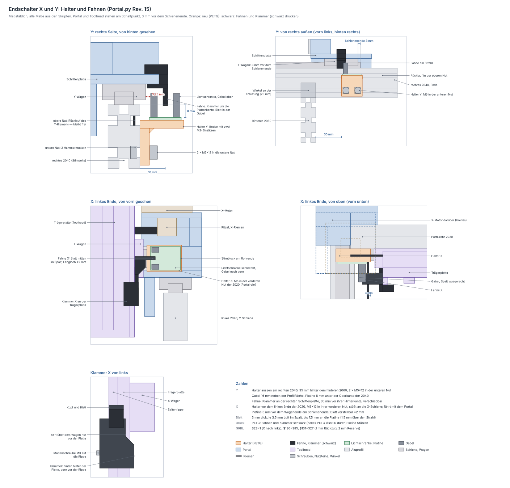

# Endschalter X und Y — Halter und Schaltfahnen

Die fünf Druckteile und die ausgeblendete Bohrlehre der Lichtschranke
erzeugt `fusion/Portal/Portal.py` (seit Rev. 15, jetzt Rev. 23) als eigene Komponenten der
Portal-Baugruppe, neben Schlitten, Klemmtürmen und Antrieben. Bis Portal
Rev. 14 standen sie im eigenen Skript `Endschalter.py`; Maße und Lagen sind
dieselben. Geprüft mit `python3 tools/endschalter_check.py`, Skizze in
[endschalter.svg](endschalter.svg) (neu erzeugen mit
`python3 tools/endschalter_zeichnen.py`).

## Was wo sitzt

Beide Achsen bekommen eine **LM393-Gabellichtschranke** wie Z (Maße in
[hardware-notizen.md](hardware-notizen.md#endschalter)). Warum Y rechts
hinten und X links, steht in [elektronik.md](elektronik.md#endschalter).
Deine Angaben vom 2026-09-29: Halter und Fahnen bauen, die Winkel an den
Kreuzungen sind 20 mm groß, die Nuten sind frei, und eine Klammer an der
Trägerplatte ist in Ordnung.

| Teil | Material | sitzt | hält mit |
|---|---|---|---|
| **Halter_Y** | PETG | außen am **rechten 2040**, 35 mm hinter dem hinteren 2060 | 2 × M5×12 + Scheibe + Hammermutter in der **unteren** Außennut |
| **Fahne_Y** | PETG **schwarz** | Klammer um die Außenkante der rechten Schlittenplatte, das Blatt hängt außen neben dem 2040 | Madenschraube M3×8 in einem Einsatz |
| **Halter_X** | PETG | Block vor dem **linken Ende des Portalrohrs**, also der 2020 der X-Achse, stößt an das Ende der X-Schiene | 1 × M5×12 + Hammermutter in der vorderen Nut der 2020, Kopf versenkt |
| **Klammer_X** | PETG **schwarz** | um die linke untere Kante der Trägerplatte und ihre Seitenrippe, unter dem X-Wagen | Madenschraube M3×8 in einem Einsatz |
| **Fahne_X** | PETG **schwarz** | flaches Blatt auf dem Kopf der Klammer | M3×8 in einen Einsatz, Langloch ±2 mm |
| 2 × LM393 | vorhanden | auf den Haltern | je 2 × M2×6 in Einsätze M2 3,2 × 2,5 |
| Bohrlehre_LM393 | PLA, ausgeblendet | — | Umriss und Lochbild der Platine |

**X und Y referenzieren unabhängig voneinander.** Halter und Fahne X
fahren beide mit dem Portal, X findet seinen Schaltpunkt also bei jeder
Stellung von Y. Der Halter Y sitzt am Rahmen, seine Fahne am rechten
Schlitten, das geht bei jeder Stellung von X. Jede Lichtschranke hat ihren
eigenen Eingang, X− an D9 und Y+ an D10.

Beide Schalter lösen **3 mm vor dem Schienenende** aus: Die Wagen dürfen
nicht über das Ende hinaus, sonst fallen Kugeln heraus. In der Skizze
stehen Portal und Toolhead genau am Schaltpunkt, die Fahnen stecken mit der
Kante im Strahl. Das Portal steht dort 224,3 mm hinter der Mitte, die
X-Wagenmitte bei −200,85 mm. Im Fusion-Modell steht das Portal dagegen in
der Mitte seines Wegs und der Toolhead in der Mitte des X-Wegs, wie alles
in `Portal.py`: Die Fahnen sitzen dort, wo sie montiert werden, und nicht
in ihrer Gabel.

### Korrektur: Y in der unteren Nut

Vorgeschlagen hatte ich die **obere** Außennut. Dort läuft aber der
**Rücklauf des Y-Riemens**, gerade in der äußeren oberen Nut
([hardware-notizen.md](hardware-notizen.md#y-achse-und-portal)). Der
Halter hängt deshalb in der **unteren** Außennut. Sein Fuß liegt außen an
der Fläche und deckt die obere Nut unten ein Stück ab, ragt aber nicht
hinein: Der Riemen läuft 2,9 mm dahinter im Nutkanal.

## Blatt in der Gabel

Für beide Achsen gilt dieselbe Regel wie bei der Schaltfahne am Toolhead
([toolhead-z.md](toolhead-z.md#die-neue-schaltfahne)):

* **3 mm dick**, mittig im 10-mm-Spalt, also **3,5 mm Luft je Seite**.
* Die Kante reicht bis **7,5 mm über die Platine**. Das sind 1,5 mm über
  dem Boden des Schlitzes (6 mm, nicht gemessen `[?]`), und der Strahl
  (9 mm) ist 1,5 mm tief abgedeckt.
* Das Blatt steht mindestens **2 mm über die offene Seite** der Gabel
  hinaus (Y: 3,35 mm).
* **Schwarz drucken.** Helles PETG lässt das Infrarot der Schranke durch.

## Y-Achse

**Halter_Y.** Ein 6 mm dicker **Fuß** liegt außen an der Seitenfläche des
rechten 2040 und hängt mit 2 × M5 in der unteren Nut. Die Schrauben sitzen
6 mm von den Enden und 16 mm auseinander. Oben steht ein 5 mm dicker
**Boden** waagerecht nach außen, darunter eine 3-mm-Fase zum Fuß. Auf dem
Boden liegt die Platine, **8 mm unter der Oberkante** der 2040, und hält
mit 2 × M2 in Einsätzen. Die Gabel zeigt **nach oben**, liegt an der
**vorderen** Kante der Platine (von dort kommt die Fahne), und der Spalt
läuft längs. Die Spaltmitte liegt **16 mm neben der Außenfläche**. So
bleibt der innere Arm der Gabel 3,25 mm neben dem Y-Wagen, der am
Schienenende an ihr vorbeifährt. Unter der Gabel ist eine 1,5 mm tiefe Tasche
für ihre Lötstifte.

Der Halter ist 28 mm lang und steht **34,8 mm hinter der Rückseite des
hinteren 2060**. Ein 20-mm-Winkel hinten am 2060 an der Außenfläche
(bis 20 mm dahinter) bleibt also 14,8 mm vor ihm. Nach hinten endet er
47 mm vor dem Profilende. Das hintere Ritzel steht dahinter, 11 mm hinter
der Stirnseite angenommen `[?]`.

**Fahne_Y.** Eine 12 mm lange Klammer greift von außen um die Kante der
rechten Schlittenplatte (6 mm dick, 0,3 mm Spiel). Die obere Backe reicht
9 mm auf die Platte und trägt den Einsatz für die Madenschraube, die von
oben auf die Platte drückt. Die untere Backe endet 1 mm neben dem Y-Wagen.
Außen hängt das Blatt senkrecht nach unten in die Gabel. Die Klammer sitzt
**35 mm vor der Hinterkante der Platte**, zwischen den Senkungen der
Wagenschrauben (je 0,75 mm Luft).

Über den ganzen Y-Weg bleibt die Fahne **8,5 mm** von Rahmen, Schiene,
Riemen, 2060 und Winkeln weg. Am Schienenende, 3 mm nach dem Schaltpunkt,
steht die Hinterkante des Blatts genau an der Rückseite der Gabel.

## X-Achse

Am linken Wegende steht der X-Motor 3 mm neben der Trägerplatte, und der
X-Riemen läuft vom Ritzel zum Riemenhalter. Beim Motor ist also kein
Platz. Die Lichtschranke sitzt deshalb **vor dem Rohr**, links neben dem
Ende der X-Schiene. Die Fahne kommt von einer Klammer unten an der
Trägerplatte.

**Halter_X.** Ein Block, 29 × 11 × 22 mm, liegt vorn am linken Rohrende.
Eine Zunge führt ihn in der vorderen Rohrnut. Rechts stößt er an das
**Ende der X-Schiene**, so steht er beim Einbau immer gleich. Er hängt an
einer M5 in einer Hammermutter, 8,4 mm vom Rohrende. Ihr Kopf sitzt
versenkt, weil die Platine darüber liegt. Die Platine steht **senkrecht**
vor dem Block, die **Gabel zeigt nach vorn**, der Spalt liegt waagerecht
auf der Rohrmitte. Die Platine endet 3 mm vor dem Wagen, wenn dieser am
Schienenende steht.

Der Block ist zugleich **Anschlag**. Fährt der Wagen über den Schaltpunkt
hinaus, stößt er 3 mm später genau am Schienenende an den Block und kann
nicht von der Schiene laufen.

**Klammer_X.** Sie sitzt unter dem X-Wagen und greift von links um die
Trägerplatte und ihre Seitenrippe, zusammen 14 mm, mit 0,3 mm Spiel. Die
hintere Backe liegt hinter der Platte, die vordere vor der Rippe. Eine
Madenschraube M3×8 im Einsatz der vorderen Backe drückt auf die Rippe. Die
vordere Backe ist 20 mm hoch, ihre **Unterkante liegt 26 mm über der
Unterkante der Trägerplatte**. Die hintere endet unter dem Wagen. Neben dem
Wagen bleibt die Seitenwand 3 mm vor seiner Stirnfläche, mit einer
45°-Schräge dazwischen. Oben trägt sie links einen **Kopf** mit einem
M3-Einsatz.

**Fahne_X.** Ein flaches Blatt, 17,2 × 9,5 × 3 mm, liegt waagerecht auf dem
Kopf und läuft mitten durch den Spalt. Mit M3×8 im **Langloch ±2 mm** wird
der Schaltpunkt eingestellt. Vor dem Kopf steht das Blatt 8,2 mm frei.

Über den ganzen X- und Z-Weg bleiben Klammer und Fahne **3 mm** von X-Wagen
und Z-Schlitten weg und 5,7 mm vom linken Y-Riemen. Am Schienenende bleibt
der Kopf der Klammer 2,2 mm vor der Gabel.

## Freigänge und engste Stellen

| Stelle | Luft | |
|---|---|---|
| Blatt ↔ Arme der Gabel, je Seite | 3,5 mm | beide Achsen |
| Gabel Y, innerer Arm ↔ Y-Wagen am Schienenende | 3,25 mm | legt 16 mm neben der Außenfläche fest |
| Blatt Y ↔ Platine | 7,5 mm | |
| Fahne Y ↔ Y-Schiene, über den ganzen Weg | 8,5 mm | engste Stelle der Fahne |
| Halter Y ↔ Y-Schiene | 9,8 mm | |
| Halter Y ↔ Rücklauf des Y-Riemens | 2,9 mm | Riemen im Nutkanal, der Fuß liegt außen |
| Halter Y ↔ hinteres 2060 | 34,8 mm | 20-mm-Winkel passen |
| Halter Y ↔ Profilende / Flansch des hinteren Ritzels | 47 / 50 mm | Lage des Ritzels `[?]` |
| X-Wagen ↔ Halter X am Schaltpunkt | 3,0 mm | am Schienenende 0: Anschlag |
| Kopf der Klammer X ↔ Gabel am Schienenende | 2,2 mm | |
| Klammer und Fahne X ↔ X-Wagen, Z-Schlitten | 3,0 mm | über X- und Z-Weg |
| Schräge der Klammer X ↔ Unterkante X-Wagen | 4,2 mm | |
| Zunge des Halters X ↔ erster Nutstein der X-Schiene | 10,75 mm | |

## Verschraubung

| Verbindung | Teile | Hinweis |
|---|---|---|
| Halter_Y → 2040 | **2 × M5×12 + Scheibe + Hammermutter M5 (Nut 6)** | untere Außennut. 5 mm ragen in die Nut, 3,2 mm Gewinde im Stein, 1 mm vor dem Nutgrund. Ohne Scheibe stünde die Spitze am Grund |
| Halter_X → Portalrohr (2020) | **1 × M5×12 + Hammermutter M5** | vordere Rohrnut, ohne Scheibe (Kopf in der Senkung Ø9,5). 6,2 mm in der Nut, 4 mm im Stein, 1,3 mm vor dem Grund |
| LM393 → Halter | **2 × M2×6** je Schranke | in Einsätze M2 3,2 × 2,5, Einpressbohrung Ø2,8 × 3 mm |
| Fahne_Y, Klammer_X | je **1 × Madenschraube M3×8** | in Einsätze M3 (Bohrung Ø4,6) |
| Fahne_X → Klammer_X | **1 × M3×8** | 5 mm im Einsatz |

## Druck (PETG, Bambu Lab A1)

| Teil | Farbe | Lage auf dem Bett | Größe |
|---|---|---|---|
| Halter_Y | beliebig | Fußfläche (die Seite am Profil) aufs Bett, der Boden steht senkrecht | 27,5 × 28,0 × 28,2 mm |
| Fahne_Y | **schwarz** | eine Stirnseite aufs Bett, das Profil steht senkrecht | 14,5 × 12,0 × 25,6 mm |
| Halter_X | beliebig | Platinenseite aufs Bett, die Zunge oben | 29,0 × 13,0 × 22,0 mm |
| Klammer_X | **schwarz** | Unterkante aufs Bett | 18,2 × 22,6 × 38,5 mm |
| Fahne_X | **schwarz** | flach | 17,2 × 9,5 × 3,0 mm |

Kein Teil braucht Stützen. An der Bettseite hält eine 0,4-mm-Fase den
Elefantenfuß heraus. 4 Wandlinien, ≥ 40 % Infill. Einsätze: 4 × M2
(3,2 × 2,5) und 3 × M3.

**Bohrlehre_LM393** (Komponente `Bohrlehren` in `Portal.py`, neben der
Lehre für den Y-Wagen): Die ausgeblendete, 3 mm dicke Platte hat Umriss und
Lochbild der Platine. Vor dem Druck der Halter die Platine auflegen: Beide
Löcher müssen fluchten.

## Montage

**Y**

1. **Zwei Hammermuttern M5** in die **untere** Außennut des rechten 2040
   setzen, hinter dem hinteren 2060.
2. **Halter_Y** ansetzen: Fuß an die Außenfläche, Boden nach außen, die
   Seite mit der Gabeltasche nach vorn. Vorderkante **35 mm hinter der
   Rückseite des 2060**. 2 × M5×12 mit Scheibe, festziehen.
3. **Lichtschranke** mit 2 × M2×6 aufschrauben, Gabel nach oben und vorn.
4. **Fahne_Y** von außen auf die Kante der rechten Schlittenplatte
   schieben, 35 mm vor ihrer Hinterkante. Die Madenschraube leicht
   anziehen.

**X**

1. **Hammermutter M5** in die vordere Nut am linken Rohrende setzen.
2. **Halter_X** vor das Rohr halten, die Zunge in die Nut, und nach rechts
   **an das Ende der X-Schiene** schieben. M5×12 festziehen.
3. **Erst dann die Lichtschranke** mit 2 × M2×6 aufschrauben, Gabel nach
   vorn. Sie deckt den Schraubenkopf ab.
4. **Klammer_X** von links auf die Trägerplatte und ihre Seitenrippe
   schieben, unter dem X-Wagen. Unterkante 26 mm über der Unterkante der
   Trägerplatte, sodass das Blatt mittig im Spalt läuft (je 3,5 mm Luft).
   Die Madenschraube anziehen.
5. **Fahne_X** mit M3×8 auf den Kopf schrauben, Langloch in der Mitte.

## Schaltpunkt einstellen

Die Signal-LED auf dem Modul zeigt den Ausgang an (bei den meisten dieser
Module `[w]`). Sicher ist die Anzeige in GRBL: `?` meldet `Pn:X` bzw.
`Pn:Y`, solange der Schalter als ausgelöst gilt.

* **Y:** Motoren stromlos, das Portal von Hand langsam nach hinten
  schieben. Die Schranke muss schalten, wenn die Y-Wagen noch **3 mm vor
  dem Schienenende** stehen. Sonst die Fahne längs der Plattenkante
  verschieben. Reicht das nicht, den Halter in der Nut versetzen.
* **X:** Den Toolhead von Hand nach links schieben. Schalten muss es,
  **3 mm bevor der Wagen am Block anliegt**. Als Lehre dient ein
  3-mm-Inbus zwischen Wagen und Block. Nachstellen im Langloch der
  Fahne_X, ±2 mm, also Schaltabstand 1 bis 5 mm.

**Vor der ersten Referenzfahrt** beide Schalter so von Hand prüfen. Für X
ist der Block ein Anschlag. Bei Y hält am Schienenende nichts die Wagen,
falls die Schranke nicht schaltet.

## GRBL

Aus den Schaltpunkten, gerechnet in `tools/endschalter_check.py`; die
übrigen Werte stehen in [elektronik.md](elektronik.md#endschalter):

| | |
|---|---|
| `$23=1` | X referenziert nach links (minus). Y nach hinten ist Plus, wenn `$3` so gesetzt ist |
| `$27=1` | 1 mm Rückzug vom Schalter |
| `$130=385` | X: vom Schaltpunkt bis ans rechte Schienenende 388,2 mm, minus 1 mm Rückzug und 2 mm Reserve. Mit 387 stünde der Wagen rechts bündig am Schienenende |
| `$131=327` | Y: 333 mm zwischen Schienenende und vorderem 2060, minus 3 mm Schaltabstand, 1 mm Rückzug und 2 mm Reserve |

## Kabel

Weg wie in [elektronik-platz.svg](elektronik-platz.svg) gezeichnet: Y
**0,49 m**, X **0,72 m**. Mit 15 % Reserve reicht für beide **1 m**
3 × 0,25 mm² (AWG 24). Y läuft mit dem Kabel des rechten Y-Motors an der
Rückseite des hinteren 2060 und dann in der unteren Außennut zum Halter. X
läuft in der Y-Kette zum linken Schlitten und von dort vorn am Rohrende zum
Halter. Adern und Anschlüsse (W9, W10): [verkabelung.md](verkabelung.md).

## Stückliste

| Anzahl | Teil | |
|---|---|---|
| 1 + 1 | Halter_Y, Halter_X | PETG |
| 1 + 1 + 1 | Fahne_Y, Klammer_X, Fahne_X | PETG **schwarz** |
| 2 | Gabellichtschranke LM393 | vorhanden |
| 4 + 4 | M2×6 + Einsatz M2 3,2 × 2,5 | vorhanden |
| 3 + 3 | M5×12 + Hammermutter M5 (Nut 6) | 2 für Y, 1 für X |
| 2 | Scheibe M5 (DIN 125) | nur Y |
| 3 | Einsatz M3 | |
| 2 | Madenschraube M3×8 | Klammern |
| 1 | M3×8 | Fahne_X |

## Noch offen

1. **Boden des Gabelschlitzes** `[?]`: Gerechnet ist mit 6 mm über der
   Platine. Das Blatt bleibt 1,5 mm darüber, also muss der Boden
   **≤ 6,5 mm** tief liegen. Ist er höher, `ls_schlitz_boden` eintragen
   und prüfen. Dann rückt das Blatt weg von der Platine und deckt den
   Strahl weniger tief ab.
2. **Lötstifte unter der Platine** `[?]`: Unter der Gabel ist eine
   1,5 mm tiefe Tasche. Stehen die Stifte weiter heraus, `ls_pin_tasche`
   erhöhen.
3. **Schmiernippel am X-Wagen** `[?]`: Der Wagen fährt am Schienenende bis
   an den Block. Ragt am linken Ende ein Nippel mehr als 3 mm heraus,
   stößt er schon vor dem Schaltpunkt an Block oder Platine. Dann den
   Nippel ans rechte Ende setzen oder gegen eine flache Verschlussschraube
   tauschen.
4. **Hintere Umlenkung** `[?]`: Wie weit reicht ihr Lagerbock außen am
   rechten 2040 nach vorn? Der Halter endet 47 mm vor dem Profilende.

## Parametrik

Alle Werte aus `MASSE` in `Portal.py` landen als User-Parameter im Dialog
*Ändern → Parameter*. Die Lagen rechnet `lage()` in Python: nach einer
Änderung das Skript neu laufen lassen und `tools/endschalter_check.py`
ausführen.

| Parameter | Wert | Wirkung |
|---|---|---|
| `schaltabstand` | 3 mm | so weit vor dem Schienenende schalten beide |
| `fahne_dicke` / `fahne_ab_platine` / `fahne_ueber_gabel` | 3 / 7,5 / 2 mm | Blatt im Spalt, siehe [oben](#blatt-in-der-gabel) |
| `gy_mitte_aussen` | 16 mm | Spaltmitte Y neben der Außenfläche des 2040 |
| `ly_unter_kante` | 8 mm | Platine Y unter der Oberkante der 2040 |
| `fy_hinten` | −66 mm | Fahne Y auf der Platte (35 mm vor ihrer Hinterkante) |
| `hy_m5_rand` | 6 mm | M5 des Halters Y von seinen Enden |
| `hx_luft_wagen` | 3 mm | Platine X links vom Wagenende am Schienenende |
| `hx_dicke` / `hx_senk_t` | 11 / 5,2 mm | Block X, Kopf der M5 versenkt (Senkung `m5_senkung` Ø9,5) |
| `kx_z0` / `kx_z1` | −40 / −20 mm | Höhe der Klammer X (Z = 0 ist die Rohrmitte) |
| `fx_verstellung` | 2 mm | Langloch der Fahne X, je Richtung |
| `ls_schlitz_boden` / `ls_pin_tasche` | 6 / 1,5 mm `[?]` | siehe [Noch offen](#noch-offen) |
