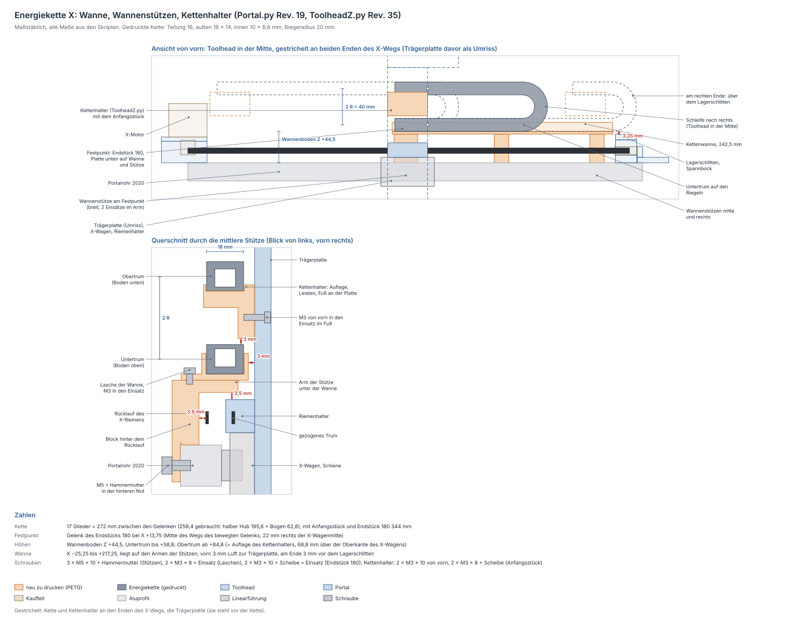

# Energiekette X — Wanne, Festpunkt und Kettenhalter

Die gedruckte Energiekette der X-Achse, vom Festpunkt über dem Portalrohr
bis zum Toolhead. Zwei Skripte bauen die Teile:

* `fusion/Portal/Portal.py` (seit Rev. 19) baut die **Kettenwanne** und
  drei **Wannenstützen** (Komponenten `Kettenwanne`,
  `Wannenstuetze_Festpunkt`, `Wannenstuetze_mitte`, `Wannenstuetze_rechts`).
  Die Kette selbst steht dort als Referenz (`Ref_Kette`).
* `fusion/ToolheadZ/ToolheadZ.py` (seit Rev. 35) baut den **Kettenhalter**
  für das bewegte Ende und die ausgeblendete `Bohrlehre_Kettenhalter`.

Geprüft mit `python3 tools/portal_check.py` (Abschnitt 17) und
`python3 tools/toolhead_check.py` (Abschnitt 9c). Die Zeichnung
[energiekette.svg](energiekette.svg) erzeugt
`python3 tools/kette_zeichnen.py` neu.

## Was hier zusammenkommt

Deine Frage vom 2026-10-01 war, wie die Energiekette an den Toolhead kommt.
Deine Vorgaben dazu:

* Die Kette ist **selbst gedruckt**, nach dem Modell „Energiekette“ von
  lingnau.florian (deine 3MF). Die gekauften Ketten (15 × 27 mm außen)
  fallen damit weg. **Auch die Y-Kette wird gedruckt.**
* Die X-Kette liegt **direkt hinter der Trägerplatte**.
* Konstruiert werden **Halter und Wanne**: der Kettenhalter am Toolhead,
  die Wanne mit dem Festpunkt am Portal und die Stützen, die sie tragen.

| Teil | Skript | Stück | Funktion |
|---|---|---|---|
| **Kettenhalter** | ToolheadZ.py | 1 | hinten an der Trägerplatte über dem Riemenhalter, trägt das Anfangsstück |
| **Kettenwanne** | Portal.py | 1 | Rinne über dem Portalrohr, 242,5 mm lang: führt den Untertrum und trägt den Festpunkt |
| **Wannenstütze Festpunkt** | Portal.py | 1 | die breite (26 mm), mit zwei Einsätzen für das Endstück 180 |
| **Wannenstütze mitte, rechts** | Portal.py | 2 | 16 mm breit, bei X = +95 und +200 |
| Anfangsstück, 17 Glieder mit Riegel, Endstück 180 | deine 3MF | 19 | die Kette |
| `Bohrlehre_Kettenhalter` | ToolheadZ.py | bei Bedarf | Bohrhilfe für die zwei Löcher in der schon gedruckten Trägerplatte |

Die 3MF liegt nicht im Repo, das Modell steht unter CC BY-NC-SA. Gemessen
habe ich daran die Maße im nächsten Abschnitt. Die Kette selbst bleibt,
wie du sie gedruckt hast.

## Die gedruckte Kette

Gemessen an den Netzen der 3MF (Glied, Riegel, Anfangsstück, Endstück,
Endstück 180):

| | Wert | |
|---|---|---|
| Teilung | **16 mm** | Gelenk zu Gelenk, das Glied ist 30 mm lang |
| außen | **18 × 14 mm** | der Riegel steht 0,3 mm über |
| innen | **10 × 8,8 mm** | Platz für die Litzen |
| Gelenk | Zapfen Ø5,0 im Loch Ø5,4 | mittig in der Höhe |
| Anschlag | **47,3°** je Gelenk | bis die Glieder aneinanderstoßen |
| Biegeradius | 16 / (2 · sin 23,65°) = 19,9 → **R 20** `[?]` | auf der Linie der Gelenke |
| Schleife | außen 2 R + 14 + 2 × 0,3 = **54,6 mm** hoch | um 180° gebogen, beide Riegel außen |
| rückwärts | **0°** | die Kette biegt nicht durch, der Obertrum trägt sich selbst |
| Anschlussstücke | 43 mm lang: 36 mm hinter dem Gelenk, 7 mm Auge davor | Platte 2 mm, zwei Löcher Ø5,5 18 und 30 mm hinter dem Gelenk |

Mit R 20 knickt jedes Gelenk im Bogen um 47,16°, die Prüfung verlangt
höchstens 47,3°. Den Radius habe ich nur aus dem Modell gerechnet: Prüfe
ihn am gedruckten Teil ([Noch offen](#noch-offen), Punkt 1).

Der **Boden** der Glieder liegt innen im Bogen, der Riegel außen. Im
Obertrum ist der Boden also unten, im Untertrum oben, und der Untertrum
liegt auf seinen Riegeln. Deshalb sitzt am Festpunkt das **Endstück 180**:
Seine Platte ist um 180° gedreht und liegt im Untertrum unten. Am Toolhead
sitzt das **Anfangsstück**, im Obertrum ebenfalls mit der Platte unten. Das
normale Endstück und die Drehkonsole für ein 18-mm-Rohr aus der 3MF
brauchst du nicht.

## Lage und Schleife

Koordinaten wie im Portal ([Koordinaten](portal-y-schlitten.md#koordinaten)):
X = 0 in der Mitte des Rohrs, Y nach vorn mit Y = 0 an der Rückseite der
Trägerplatte (= Stirnfläche des X-Wagens), Z = 0 in der Mitte des Rohrs.

Der Festpunkt sitzt in der Mitte des X-Wegs. Von dort läuft die Kette im
Untertrum nach rechts durch die Wanne, biegt um 180° nach oben und kommt
im Obertrum zurück zum Toolhead. **Die Schleife zeigt nach rechts**: Links
steht der X-Motor bis Z +75,25 hoch, dort käme der Bogen am Ende des Wegs
nicht vorbei. Rechts ist der Lagerschlitten nur bis Z +41,25 hoch, über ihn
läuft der Bogen hinweg.

### Quer (Y)

| Y | |
|---|---|
| 0 | Rückseite der Trägerplatte |
| −3,0 | Wanne vorn außen: 3 mm Luft zur Platte |
| −5,0 | Wanne vorn innen, ebenso die vordere Leiste des Kettenhalters |
| **−5,3 … −23,3** | **Kette**, 18 mm breit, Mitte −14,3 (Löcher der Anschlussstücke) |
| −8 | Arme der Stützen vorn |
| −9,6 … −11,0 | X-Riemen, gezogenes Trum (unter den Armen) |
| −14 | Riemenhalter hinten (unter den Armen) |
| −16 … −36 | Portalrohr 2020 |
| −21,7 … −23,1 | X-Riemen, Rücklauf (unter den Armen) |
| −23,6 | Wanne hinten innen, ebenso die hintere Leiste |
| −25,6 | Wanne hinten außen |
| −27 … −36 | Block der Stützen, steht auf dem Rohr hinter dem Rücklauf |
| −31,5 | M3 der Laschen im Block |
| −36 … −40 | Platte der Stützen an der Rückseite des Rohrs |

### Höhe (Z)

| Z | |
|---|---|
| +99,1 | Obertrum oben (Riegel) |
| +91,8 | Gelenklinie des Obertrums |
| +87,8 | Leisten des Kettenhalters oben |
| **+84,8** | **Obertrum unten = Auflage des Kettenhalters**, 68,8 mm über dem X-Wagen |
| +76,8 | Auflage unten |
| +72 | M3 des Kettenhalters in der Trägerplatte |
| +61,8 | Fuß des Kettenhalters unten: 3 mm über dem Untertrum |
| +58,8 | Untertrum oben |
| +54,5 | Wände der Wanne oben |
| +51,8 | Gelenklinie des Untertrums |
| **+44,5** | **Wannenboden oben = Untertrum unten** (Riegel) |
| +41,5 | Wanne unten = Arme der Stützen oben |
| +41,25 | Lagerschlitten oben (rechtes Rohrende) |
| +35,5 | Arme unten: 3,5 mm über dem Riemenhalter |
| +32 | Riemenhalter oben |
| +26,25 / +20,25 | X-Riemen oben / unten |
| +10 | Rohr oben = Block der Stützen unten |
| 0 | Mitte des Rohrs, M5 in der hinteren Nut |
| −8 | Platte der Stützen unten |

**Warum so hoch:** Am rechten Ende des X-Wegs reicht der Bogen über den
Lagerschlitten (oben Z +41,25). Darüber braucht er 3 mm Luft. Also liegt
der Untertrum bei Z +44,5 und der Obertrum 2 R = 40 mm höher bei +84,8.

### Längs (X)

| X | |
|---|---|
| −228,85 | X-Motor, rechte Kante |
| −225,85 | Kettenhalter links, Toolhead ganz links: 3 mm zum X-Motor wie die Trägerplatte |
| −25,25 | Wanne links |
| −23,25 … +2,75 | Stütze am Festpunkt, Mitte −10,25 |
| −22,25 | Endstück 180, Ende |
| −16,25 / −4,25 | Löcher des Endstücks 180, M3×10 |
| **+13,75** | **Gelenk am Festpunkt** = Mitte des Wegs des bewegten Gelenks |
| +20,5 … +216,1 | Beginn des Bogens, vom Toolhead ganz links bis ganz rechts |
| +87 … +103 | Stütze mitte |
| +192 … +208 | Stütze rechts |
| +217,25 | Wanne rechts |
| +220,25 | Lagerschlitten, linke Kante: 3 mm hinter der Wanne |

Das bewegte Gelenk sitzt 22 mm rechts der X-Wagenmitte, an der rechten
Kante der Säule. So liegt der Kettenhalter ganz an der Trägerplatte und
kommt dem X-Motor nicht näher als die Platte selbst. Es fährt von −181,85
bis +209,35. Der Festpunkt liegt genau in der Mitte dieses Wegs. Dann
reicht die kürzeste Kette.

### Länge

* Gebraucht wird der halbe Hub plus der Bogen:
  391,2 / 2 + π · 20 = 195,6 + 62,8 = **258,4 mm** zwischen den Gelenken.
* **17 Glieder** = 272 mm, also 13,6 mm Schlupf, weniger als ein Glied.
  Mit beiden Anschlussstücken ist die Kette **344 mm** lang.
* Der Schlupf schiebt den Bogen um 6,8 mm nach rechts. Mit dem Toolhead ganz
  links beginnt er 6,8 mm rechts vom Festpunkt. Ganz rechts beginnt er 1,1 mm
  vor dem Ende der Wanne: Der Untertrum liegt immer ganz in der Wanne.

## Kettenhalter (ToolheadZ.py Rev. 35)

Ein Winkel hinten an der Trägerplatte, 44 mm breit wie die Säule:

| | |
|---|---|
| Fuß | 8 mm dick, liegt hinten an der Säule (X ±22 um die Wagenmitte), Z +61,8 bis +84,8, über dem Riemenhalter |
| Auflage | 8 mm dick (Z +76,8 bis +84,8), reicht 24,8 mm nach hinten unter das Anfangsstück |
| Leisten | 3 mm hoch vor und hinter dem Anfangsstück, 0,3 mm Spiel je Seite; hinten 1,2 mm dick, vorn 5 mm |
| Anfangsstück | Platte unten, Gelenk an der rechten Kante, die Kette läuft nach rechts. 2 × M3×8 + Scheibe DIN 125 durch seine Löcher Ø5,5 in Einsätze der Auflage |
| Befestigung | 2 × M3×10 von vorn durch die Trägerplatte (X ±13,5, Z +72) in Einsätze im Fuß, Kopf in einer Senkung Ø6,5 × 3,2 |
| Zugentlastung | zwei Schlitze 4 × 2,2 mm in der Auflage, links neben dem Anfangsstück: ein Kabelbinder um die Litzen |

Die Litzen kommen links aus dem Anfangsstück und gehen von dort zu Laser,
Z-Motor und Z-Endschalter. Im Modell ist der Kettenhalter eine eigene
Komponente; im Portal-Modell steht er vereinfacht als Hülle.

### Bohrlehre für die gedruckte Trägerplatte

Eine neu gedruckte Trägerplatte bekommt die zwei Löcher aus dem Modell. In
die schon gedruckte bohrst du sie mit der `Bohrlehre_Kettenhalter`
(PLA, 6 mm dick, im ToolheadZ-Modell ausgeblendet). Sie ist wie die Lehre
des Riemenhalters gebaut, nur höher. Ein Ausschnitt lässt den Riemenhalter
frei, er darf schon montiert sein.

1. Z-Schlitten ganz nach unten fahren.
2. Lehre hinten an die Trägerplatte legen. Sie steht mit zwei Beinen links
   und rechts neben dem Riemenhalter auf der Flanke des X-Wagens, die
   Lippen fassen die Kanten der Säule.
3. Ø3,4 von hinten durchbohren. Hinter der Platte ist auf dieser Höhe frei.
4. Vorn Ø6,5 × 3,2 mm ansenken.

## Wanne und Wannenstützen (Portal.py Rev. 19)

**Wanne.** Eine Rinne von X −25,25 bis +217,25 (**242,5 mm**, ein Stück im
A1). Der Boden ist 3 mm dick, die Wände sind 2 mm dick und 10 mm hoch.
Innen ist sie 18,6 mm breit, 0,3 mm Spiel je Seite. Links und rechts ist
sie offen. Links ruht sie auf der Stütze am Festpunkt, sonst auf den Armen
der beiden anderen. Hinten stehen zwei Laschen ab (10 × 12 mm, bei X = +95
und +200), dort hält je eine M3×8 sie im Block der Stütze darunter. Am
Festpunkt hält das Endstück 180 sie fest.

**Festpunkt.** Das Endstück 180 liegt links in der Wanne, Platte unten,
Gelenk bei X = +13,75. 2 × M3×10 mit Scheibe DIN 125 gehen durch Endstück
und Wannenboden in die Einsätze im Arm der Stütze darunter.

**Stützen.** Vorn am Rohr sitzt die X-Schiene, oben laufen beide Trume des
X-Riemens und der Riemenhalter. Die Stützen greifen deshalb von hinten an:

| | |
|---|---|
| Platte | 4 mm, an der Rückseite des Rohrs (Y −36 bis −40), Z −8 bis +41,5. 1 × M5×10 in eine Hammermutter der hinteren Nut |
| Block | Y −27 bis −36, steht auf dem Rohr (Z +10 bis +41,5), 3,9 mm hinter dem Rücklauf |
| Arm | 6 mm dick (Z +35,5 bis +41,5), reicht nach vorn bis Y −8, über Riemen und Riemenhalter unter die Wanne |
| Breite | 16 mm; am Festpunkt 26 mm, 7 mm Rand neben den Löchern |
| Einsätze | am Festpunkt zwei von oben durch den Arm, sonst einer oben im Block für die Lasche |

Unter den Armen fährt der Riemenhalter mit 3,5 mm Luft durch. In der
Innenecke zwischen Platte und Block ist eine Fase von 1 mm in die Stütze
hinein ausgespart. So sitzt die Kante des Rohrs nicht auf, ob sie gerundet
ist oder scharf. Die M5 sind von hinten frei zugänglich, auch wenn alles
montiert ist.

## Freigänge und engste Stellen

`portal_check.py` schiebt die Kette mit dem Toolhead über den ganzen Weg
(Bogen und Obertrum als Hüllen) und prüft gegen alle Portalteile und den
Toolhead. Keine Stelle liegt unter 3 mm:

| Stelle | Luft | wo |
|---|---|---|
| Fuß des Kettenhalters ↔ Untertrum | 3,0 mm | überall über der Wanne |
| Kettenhalter ↔ X-Motor | 3,0 mm | linkes Ende, wie die Trägerplatte |
| Wanne ↔ Trägerplatte | 3,0 mm | der ganze Weg |
| Wanne ↔ Lagerschlitten | 3,0 mm | rechtes Rohrende |
| Bogen ↔ Arme der Stützen mitte und rechts | 3,0 mm | wenn der Bogen über ihnen steht |
| Bogen ↔ Lagerschlitten | 3,25 mm | rechtes Ende |
| Arme ↔ Riemenhalter | 3,5 mm | der Riemenhalter fährt darunter durch |
| Bogen ↔ Blöcke der Stützen | 3,7 mm | |
| Block ↔ Rücklauf des X-Riemens | 3,9 mm | |
| Obertrum ↔ Trägerplatte | 5,3 mm | quer |
| Arme ↔ X-Riemen | 9,25 mm | |

`toolhead_check.py` prüft den Kettenhalter für sich: Wände um die Einsätze,
Schraubenlängen, die Lage der Senkungen in der Platte und den Zugang mit dem
Inbus.

## Verschraubung

| Verbindung | Teile | Hinweis |
|---|---|---|
| Kettenhalter → Trägerplatte | **2 × M3×10 + 2 × Messing-Einsatz M3** | von vorn, Kopf in der Senkung Ø6,5 × 3,2; 5,2 mm Gewinde, 1,8 mm vor dem Grund |
| Anfangsstück → Kettenhalter | **2 × M3×8 + 2 × Scheibe DIN 125 + 2 × Einsatz** | von oben durch die Löcher Ø5,5; 5,5 mm Gewinde, die Scheibe deckt das Loch mit 1,5 mm Rand |
| Wannenstützen → Rohr | **3 × M5×10 + 3 × Hammermutter M5 (Nut 6)** | von hinten in die hintere Nut, 4,2 mm Eingriff |
| Wanne → Stützen mitte und rechts | **2 × M3×8 + 2 × Einsatz** | durch die Laschen von oben in den Block, 5 mm Gewinde |
| Endstück 180 → Wanne → Stütze am Festpunkt | **2 × M3×10 + 2 × Scheibe DIN 125 + 2 × Einsatz** | durch 2 mm Platte und 3 mm Boden in den Arm; 4,5 mm Gewinde, endet 1,5 mm vor der Unterseite |
| Litzen → Kettenhalter | 1 Kabelbinder | durch die zwei Schlitze der Auflage |

Zusammen: 4 × M3×10, 4 × M3×8, 4 Scheiben M3, 8 Messing-Einsätze M3 Ø5,
3 × M5×10, 3 Hammermuttern M5 und Kabelbinder.

## Montage

1. **Einsätze einschmelzen:** in den Kettenhalter 2 von vorn in den Fuß und
   2 von oben in die Auflage, in die Stütze am Festpunkt 2 von oben in den
   Arm, in die beiden anderen je 1 oben in den Block.
2. **Trägerplatte nachbohren**, wenn sie schon gedruckt ist
   ([Bohrlehre](#bohrlehre-für-die-gedruckte-trägerplatte)).
3. **Kettenhalter** hinten an die Trägerplatte über den Riemenhalter,
   2 × M3×10 von vorn. Den Z-Schlitten dafür ganz nach unten fahren.
4. **Stützen ansetzen:** je eine Hammermutter M5 in die hintere Nut des
   Rohrs, jede Stütze mit einer M5×10 lose. Der Block steht auf dem Rohr,
   der Arm reicht über den Riemen. Die Mitten liegen **239,75 / 345 /
   450 mm vom linken Rohrende** (X = −10,25, +95, +200). Den X-Riemen
   kannst du vorher einlegen oder später von vorn unter die Arme schieben.
5. **Wanne** auf die Arme legen, an den Laschen je 1 × M3×8 in die Blöcke.
   Dann die M5 der Stützen mitte und rechts festziehen.
6. **Kette** zusammenstecken: 17 Glieder, das Anfangsstück an das eine
   Ende, das Endstück 180 an das andere.
7. **Toolhead ganz nach rechts fahren**, dann ist über dem Festpunkt frei.
   Endstück 180 links in die Wanne legen, Platte unten, Gelenk nach rechts.
   2 × M3×10 + Scheibe durch Endstück und Boden in die Stütze, dann ihre M5
   festziehen.
8. **Kette einlegen:** den Untertrum mit den Riegeln nach unten nach rechts
   in die Wanne, um 180° nach oben und zurück. Das Anfangsstück mit der
   Platte nach unten zwischen die Leisten des Kettenhalters legen,
   2 × M3×8 + Scheibe von oben.
9. **Litzen** einziehen (Riegel öffnen), lose nebeneinander, nicht
   verdrillt. Am Kettenhalter einen Kabelbinder durch die zwei Schlitze.
10. **Von Hand durchfahren:** Den Toolhead langsam von Ende zu Ende
    schieben. Die Kette darf nirgends streifen, der Untertrum bleibt in der
    Wanne, und am rechten Ende läuft der Bogen über den Lagerschlitten.

## Druck (PETG, Bambu Lab A1)

| Teil | Lage aufs Bett | |
|---|---|---|
| Kettenhalter | auf der linken Seite liegend | das Profil ist über die ganze Breite gleich, alles steht senkrecht; die Einsatzbohrungen liegen waagerecht, keine Stützen |
| Kettenwanne | Boden unten, längs | 242,5 mm, passt in den A1 (256 mm) |
| Wannenstützen (3) | Rückseite der Platte unten | Block und Arm wachsen aus der Platte, keine Überhänge; die M5-Bohrung steht senkrecht |
| `Bohrlehre_Kettenhalter` (PLA) | Plattenseite unten, Lippen nach oben | nur bei Bedarf |

4 Wandlinien, ≥ 40 % Infill. An den Auflageflächen sitzt eine Fase gegen
den Elefantenfuß.

Massen (Vollmaterial, PETG 1,27 g/cm³, gerechnet; maßgeblich ist der erste
Fusion-Lauf):

| Teil | Volumen | Masse | Bauraum |
|---|---|---|---|
| Kettenhalter | 14,2 cm³ | ≈ 18 g | 44 × 24,8 × 26 mm |
| Kettenwanne | 26,8 cm³ | ≈ 34 g | 242,5 × 32,6 × 13 mm |
| Wannenstütze Festpunkt | 15,2 cm³ | ≈ 19 g | 26 × 32 × 49,5 mm |
| Wannenstütze mitte, rechts (je) | 9,3 cm³ | ≈ 12 g | 16 × 32 × 49,5 mm |
| **zusammen** | 74,8 cm³ | **≈ 95 g** | |
| Kette (Anfangsstück, 17 Glieder mit Riegel, Endstück 180) | 38,5 cm³ | ≈ 48 g in PLA | aus der 3MF |
| `Bohrlehre_Kettenhalter` | 15,7 cm³ | ≈ 19 g PLA | 49,4 × 12 × 64 mm |

Mit dem Toolhead bewegen sich der Kettenhalter, das Anfangsstück und etwa
die halbe Kette, zusammen rund 42 g ohne Litzen.

## Litzen in der Kette

* **Nur Einzellitzen aus Silikon**, keine Mantelleitungen. Bei R 20 sind
  Mantelleitungen zu steif. Faustregel `[w]`: Eine bewegte Leitung braucht
  einen Biegeradius vom 7,5- bis 10-fachen ihres Durchmessers. Eine
  Silikonlitze mit Ø1,4 bis 1,7 mm kommt mit R 20 aus, eine Mantelleitung
  mit Ø4,5 nicht.
* **Motorkabel:** Durch die Ketten laufen nur die losen Adern, ohne den
  Schlauch darum (W12 durch die Y-Kette, W15 durch beide).
* **Füllung:** Innen sind 10 × 8,8 = 88 mm² frei. Die X-Kette trägt W7
  (Laser, 3 × 0,34 mm²), W11 (Z-Endschalter, 3 × 0,25 mm²) und W15
  (Z-Motor, 4 × 0,2 mm²). Das sind 10 Adern, sie füllen **21 %**. Die
  Y-Kette trägt dazu X-Motor und X-Endschalter, 17 Adern füllen **34 %**.
  Zulässig sind höchstens 60 % `[w]`. Geprüft in
  `tools/elektronik_check.py`, die Kabelliste steht in
  [verkabelung.md](verkabelung.md#leitungen).

## Y-Kette

Auch die Y-Kette wird gedruckt, nach demselben Modell. Ihr Hub ist 333 mm.
Gebraucht werden 166,5 + 62,8 = 229,3 mm, also **15 Glieder** (240 mm,
10,7 mm Schlupf), mit Anfangsstück und Endstück 180 zusammen 312 mm.
**Wanne, Festpunkt und Halter der Y-Kette sind noch nicht konstruiert.**
In [elektronik-platz.svg](elektronik-platz.svg) steht sie als Platzhalter
außen am linken 2040, mit dem Querschnitt der gedruckten Kette.

## Noch offen

1. **Biegeradius am gedruckten Teil prüfen:** Die Kette um 180° biegen,
   bis die Glieder anschlagen. Außen darf die Schleife höchstens
   **54,6 mm** hoch sein. Ist sie höher, ist der Radius größer als 20 mm:
   dann `kette_r` in beiden Skripten erhöhen. Der Kettenhalter wandert mit
   nach oben, die Wanne bleibt. Danach beide Prüfungen laufen lassen.
2. **Breite der gedruckten Kette:** Aus dem Modell ist sie 18 mm breit.
   Wanne und Leisten lassen 0,3 mm je Seite. Ist deine Kette breiter, zum
   Beispiel durch den Elefantenfuß, dann `kette_spiel` erhöhen.
3. **Kabelweg zum Festpunkt:** W7, W11 und W15 kommen vom linken
   Y-Schlitten, wo die Y-Kette endet. Bis zum Festpunkt sind es rund
   225 mm am Rohr entlang, an beiden Trumen des X-Riemens und am
   Riemenhalter vorbei. Gezeichnet ist dieser Weg nur für die Kabellängen.
   Weg und Zugentlastung am Festpunkt sind noch nicht konstruiert. Das
   Endstück 180 hat keine Schlitze für einen Kabelbinder, und links neben
   ihm bleiben in der Wanne nur 3 mm.
4. **Y-Kette:** Wanne, Festpunkt und bewegtes Ende fehlen noch
   ([Y-Kette](#y-kette)).
5. **Motorkabel:** Haben die mitgelieferten Motorkabel lose Adern unter
   einem Schlauch oder einen runden Mantel? In die Ketten gehören nur die
   losen Adern.

## Parametrik

Die Werte stehen in `MASSE` und landen als User-Parameter im Dialog
*Ändern → Parameter*. Die Lagen rechnet `lage()` in Python: Nach einer
Änderung das Skript neu laufen lassen und die Prüfungen ausführen. Was
**beide** Skripte brauchen (Kette, Anschlussstücke, Lage), steht in beiden.
`portal_check.py` vergleicht diese Werte als Erstes.

| Parameter | Wert | Wirkung |
|---|---|---|
| `kette_teilung` | 16 mm | mit dem Hub die Zahl der Glieder (Portal.py) |
| `kette_b` / `kette_h` / `kette_riegel` | 18 / 14 / 0,3 mm | Außenmaße, der Riegel steht über |
| `kette_r` | 20 mm `[?]` | Biegeradius auf der Gelenklinie; der Obertrum liegt 2 R über dem Untertrum, darauf der Kettenhalter |
| `kette_innen_b` / `kette_innen_h` | 10 / 8,8 mm | Querschnitt für die Füllung (Portal.py) |
| `kette_spiel` | 0,3 mm | Spiel je Seite in der Wanne und zwischen den Leisten |
| `endstueck_l` / `endstueck_auge` | 36 / 7 mm | Anschlussstück hinter und vor dem Gelenk |
| `endstueck_loch_a` / `endstueck_loch_ab` | 18 / 12 mm | erstes Loch hinter dem Gelenk, Abstand zum zweiten |
| `endstueck_loch_d` / `endstueck_platte` | 5,5 / 2 mm | Löcher (für die Scheibe), Dicke der Platte (Schraubenlänge) |
| `xk_y_vorn` | −5,3 mm | Vorderkante der Kette, 5,3 mm hinter der Trägerplatte |
| `xk_boden_z` | 44,5 mm | Oberkante des Wannenbodens, 3 mm über dem Lagerschlitten |
| `xk_gelenk_x` | 22 mm | bewegtes Gelenk rechts der X-Wagenmitte, an der rechten Kante der Säule |
| `wanne_boden` / `wanne_wand` / `wanne_wand_h` | 3 / 2 / 10 mm | Wanne |
| `wanne_rand` | 3 mm | Boden links vor dem Endstück 180 |
| `wanne_lasche` / `wanne_lasche_b` | 10 / 12 mm | Laschen hinten an der Wanne |
| `st_platte` / `st_unten` | 4 / 8 mm | Platte der Stützen und wie weit sie unter die Mitte des Rohrs reicht |
| `st_block_y` | −27 mm | Vorderkante des Blocks, hinter dem Rücklauf |
| `st_arm` / `st_arm_vorn` | 6 / −8 mm | Arm unter der Wanne und seine Vorderkante |
| `st_b` / `st_rand` | 16 / 7 mm | Breite der Stützen; am Festpunkt der Rand neben den Löchern |
| `st_x_mitte` / `st_x_rechts` | 95 / 200 mm | Mitte der beiden anderen Stützen |
| `profil_fase` | 1 mm | Fase in der Innenecke der Stützen, dort liegt die Kante des Rohrs frei |
| `kh_fuss` / `kh_auflage` | 8 / 8 mm | Dicke von Fuß und Auflage des Kettenhalters (ToolheadZ.py) |
| `kh_leiste` / `kh_leiste_h` | 1,2 / 3 mm | hintere Leiste und Höhe der Leisten |
| `kh_schraube_z` | 72 mm | Höhe der M3 in der Trägerplatte |
| `kh_binder_b` / `kh_binder_t` / `kh_binder_abstand` | 4 / 2,2 / 9 mm | Schlitze für den Kabelbinder |
