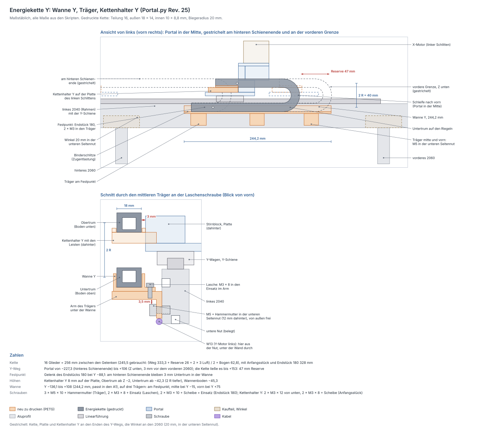

# Energieketten X und Y — Wannen, Festpunkte, Kettenhalter, Kabelweg

Die gedruckten Energieketten der X- und der Y-Achse. Die X-Kette läuft vom
Festpunkt über dem Portalrohr bis zum Toolhead, die Y-Kette vom Rahmen
außen am linken 2040 bis zum linken Y-Schlitten. Dazwischen laufen die
Litzen in der oberen Nut des Rohrs. Zwei Skripte bauen die Teile:

* `fusion/Portal/Portal.py` baut seit Rev. 19 die **Kettenwanne** und
  drei **Wannenstützen** (Komponenten `Kettenwanne`,
  `Wannenstuetze_Festpunkt`, `Wannenstuetze_mitte`, `Wannenstuetze_rechts`).
  Seit Rev. 21 trägt die Stütze am Festpunkt den **Kabelflügel**. Dazu
  kommen für Y der **Kettenhalter Y**, die **Kettenwanne Y**, drei
  **Träger Y** (`Kettenhalter_Y`, `Kettenwanne_Y`,
  `Wannentraeger_Y_Festpunkt`, `_mitte`, `_vorn`) und die ausgeblendete
  `Bohrlehre_Kettenhalter_Y`. Beide Ketten stehen dort als Referenz.
* `fusion/ToolheadZ/ToolheadZ.py` baut seit Rev. 35 den **Kettenhalter**
  für das bewegte Ende der X-Kette und die ausgeblendete
  `Bohrlehre_Kettenhalter`.

Geprüft wird mit `python3 tools/portal_check.py` (Abschnitt 17: X und
Kabelweg, Abschnitt 18: Y) und mit `python3 tools/toolhead_check.py`
(Abschnitt 9c). Die Zeichnungen [energiekette.svg](energiekette.svg) und
[energiekette-y.svg](energiekette-y.svg) erzeugt
`python3 tools/kette_zeichnen.py` neu.

## Was hier zusammenkommt

Deine Frage vom 2026-10-01 war, wie die Energiekette an den Toolhead kommt.
Deine Vorgaben und Antworten dazu (vom 2026-10-01 und -02):

* Die Ketten sind **selbst gedruckt**, nach dem Modell „Energiekette“ von
  lingnau.florian (deine 3MF). Die gekauften Ketten (15 × 27 mm außen)
  fallen damit weg. **Auch die Y-Kette wird gedruckt.**
* Die X-Kette liegt **direkt hinter der Trägerplatte**.
* Konstruiert werden **Halter und Wanne**: der Kettenhalter am Toolhead,
  die Wanne mit dem Festpunkt am Portal und die Stützen, die sie tragen.
* **Kabelweg zur X-Kette:** in der **oberen Nut** des Rohrs, an der Stütze
  am Festpunkt ein **Halter mit Schlitzen** für Kabelbinder
  ([Kabelweg am Festpunkt](#kabelweg-am-festpunkt)).
* **Y-Kette:** gleich mit konstruieren. Ihr Weg ist der **Arbeitsweg plus
  mindestens 26 mm** nach vorn. Die **Nut an der Unterseite** des linken
  2040 ist **belegt**, die Wanne hängt deshalb an der unteren Seitennut
  ([Y-Kette](#y-kette)).
* **Motorkabel:** Die mitgelieferten Kabel haben lose Adern in einem
  Schlauch ([Litzen in der Kette](#litzen-in-der-kette)).
* **Gedruckt ist bisher eine Kette.** Um 180° gebogen ist ihre Schleife
  außen **50 mm** hoch, im Bogen knicken **4 Gelenke** (mit dem
  Messschieber gemessen, 2026-10-02). Eine Seite des Kanals ist nur durch
  einzelne Streben geschlossen, die Litzen lassen sich dort jederzeit ein-
  und ausfädeln. Die zweite Kette kannst du noch anpassen: Ich empfehle
  **dieselbe Größe** mit **16 Gliedern** für Y.
* **Der linke Y-Schlitten ist schon gedruckt:** Die zwei Löcher für den
  Kettenhalter Y bohrst du mit der Lehre nach. Druckst du ihn neu, sind
  sie im Modell gleich mit drin.
* **Spiel der Kette:** 0,5 mm je Seite in Wannen und Kettenhaltern
  (2026-10-02, vorher 0,3).
* **In der unteren Seitennut** des linken 2040 sitzen zwischen den 2060 nur
  die 20-mm-Winkel, direkt an den 2060.

| Teil | Skript | Stück | Funktion |
|---|---|---|---|
| **Kettenhalter** | ToolheadZ.py | 1 | hinten an der Trägerplatte über dem Riemenhalter, trägt das Anfangsstück der X-Kette |
| **Kettenwanne** | Portal.py | 1 | Rinne über dem Portalrohr, 242,5 mm lang: führt den Untertrum und trägt den Festpunkt |
| **Wannenstütze Festpunkt** | Portal.py | 1 | die breite (26 mm), mit zwei Einsätzen für das Endstück 180 und links dem Kabelflügel |
| **Wannenstütze mitte, rechts** | Portal.py | 2 | 16 mm breit, bei X = +95 und +200 |
| X-Kette: Anfangsstück, 17 Glieder mit Riegel, Endstück 180 | deine 3MF | 19 | |
| **Kettenhalter Y** | Portal.py | 1 | auf der Platte des linken Y-Schlittens hinter dem Stirnblock, trägt das Anfangsstück der Y-Kette |
| **Kettenwanne Y** | Portal.py | 1 | Rinne außen am linken 2040, 244,2 mm lang: führt den Untertrum und trägt den Festpunkt |
| **Träger Y Festpunkt, mitte, vorn** | Portal.py | 3 | an der unteren Seitennut des 2040, tragen die Wanne Y |
| Y-Kette: Anfangsstück, 16 Glieder mit Riegel, Endstück 180 | deine 3MF | 18 | |
| `Bohrlehre_Kettenhalter` | ToolheadZ.py | bei Bedarf | Bohrhilfe für die schon gedruckte Trägerplatte |
| `Bohrlehre_Kettenhalter_Y` | Portal.py | 1 | Bohrhilfe für den schon gedruckten linken Schlitten |

Die 3MF liegt nicht im Repo, das Modell steht unter CC BY-NC-SA. Gemessen
habe ich daran die Maße im nächsten Abschnitt. Die Ketten selbst bleiben,
wie du sie druckst.

## Die gedruckte Kette

Gemessen an den Netzen der 3MF (Glied, Riegel, Anfangsstück, Endstück,
Endstück 180):

| | Wert | |
|---|---|---|
| Teilung | **16 mm** | Gelenk zu Gelenk, das Glied ist 30 mm lang |
| außen | **18 × 14 mm** | der Riegel steht 0,3 mm über |
| innen | **10 × 8,8 mm** | Platz für die Litzen |
| Gelenk | Zapfen Ø5,0 im Loch Ø5,4 | mittig in der Höhe |
| Anschlag | **47°** je Gelenk im Modell; am gedruckten Teil knicken im 180°-Bogen **4 Gelenke**, je etwa 45° | gezählt 2026-10-02 |
| Biegeradius | 16 / (2 · sin 23,5°) = 20,1 → gerechnet **R 20** | auf der Linie der Gelenke |
| Schleife | gemessen außen **50 mm**; gerechnet 2 R + 14 + 2 × 0,3 = **54,6 mm** | um 180° gebogen, beide Riegel außen; Messschieber, 2026-10-02 |
| rückwärts | **0°** | die Kette biegt nicht durch, der Obertrum trägt sich selbst |
| Anschlussstücke | 43 mm lang: 36 mm hinter dem Gelenk, 7 mm Auge davor | Platte 2 mm, zwei Löcher Ø5,5 18 und 30 mm hinter dem Gelenk |

Mit R 20 ist die Schleife der Konstruktion 4,6 mm höher, als du gemessen
hast. **Enger darf sie nicht sein**, sonst drückt die Kette den
Kettenhalter hoch. Etwas weiter schadet nicht: Die Gelenke im Bogen
knicken dann ein wenig weniger. `portal_check.py` vergleicht die
Konstruktion mit der Messung, höchstens 5 mm weiter. Läuft der Bogen nach
der Montage unruhig oder hängt er durch, geht auch R 19 (Schleife 52,6 mm,
die X-Kette dann mit 16 Gliedern).

**Der Radius hat sich zweimal geändert.** Portal Rev. 19 und ToolheadZ
Rev. 35 rechneten mit R 20 aus dem Modell, dort stoßen zwei Glieder bei 47°
aneinander. Rev. 20 und 21 (ToolheadZ Rev. 36) rechneten mit R 32, weil
sich ein Glied am gedruckten Teil nur um 30° drehen sollte (Angabe vom
2026-10-01). Die gemessene Schleife (50 mm außen, 4 Gelenke im Bogen) passt
aber zu den 47° des Modells. **Seit Portal Rev. 22 und ToolheadZ Rev. 37
gilt wieder R 20:** die X-Kette mit 17 statt 19 Gliedern, der Kettenhalter
24 mm tiefer wie in Rev. 35, die Y-Kette mit 16 statt 18 Gliedern und die
Wanne Y 24 mm höher. Wanne und Stützen der X-Kette bleiben, wie sie sind.

Der **Boden** der Glieder liegt innen im Bogen, der Riegel außen. Im
Obertrum ist der Boden also unten, im Untertrum oben, und der Untertrum
liegt auf seinen Riegeln. Deshalb sitzt am Festpunkt das **Endstück 180**:
Seine Platte ist um 180° gedreht und liegt im Untertrum unten. Am bewegten
Ende sitzt das **Anfangsstück**, im Obertrum ebenfalls mit der Platte
unten. Das gilt für beide Ketten. Das normale Endstück und die Drehkonsole
für ein 18-mm-Rohr aus der 3MF brauchst du nicht.

**Die zweite Kette** druckst du in derselben Größe: Wannen, Halter und
Prüfungen rechnen für beide mit denselben Maßen. Für Y reichen
**16 Glieder** ([Länge](#lage-und-länge-der-y-kette)).

## Lage und Schleife

Koordinaten wie im Portal ([Koordinaten](portal-y-schlitten.md#koordinaten)):
X = 0 in der Mitte des Rohrs, Y nach vorn mit Y = 0 an der Rückseite der
Trägerplatte (= Stirnfläche des X-Wagens), Z = 0 in der Mitte des Rohrs.

Der Festpunkt sitzt in der Mitte des X-Wegs. Von dort läuft die Kette im
Untertrum nach rechts durch die Wanne, biegt um 180° nach oben und kommt
im Obertrum zurück zum Toolhead. **Die Schleife zeigt nach rechts**: Links
steht der X-Motor bis Z +75,25 hoch, dort käme der Bogen am Ende des Wegs
nicht vorbei. Rechts ist der Lagerschlitten nur bis Z +41,25 hoch, über ihn
läuft der Bogen hinweg.

### Quer (Y)

| Y | |
|---|---|
| 0 | Rückseite der Trägerplatte |
| −3,0 | Wanne vorn außen: 3 mm Luft zur Platte |
| −5,0 | Wanne vorn innen, ebenso die vordere Leiste des Kettenhalters |
| **−5,5 … −23,5** | **Kette**, 18 mm breit, Mitte −14,5 (Löcher der Anschlussstücke) |
| −8 | Arme der Stützen vorn |
| −9,6 … −11,0 | X-Riemen, gezogenes Trum (unter den Armen) |
| −14 | Riemenhalter hinten (unter den Armen) |
| −16 … −36 | Portalrohr 2020, obere Nut bei −26 |
| −21,7 … −23,1 | X-Riemen, Rücklauf (unter den Armen) |
| −24,0 | Wanne hinten innen, ebenso die hintere Leiste |
| −26,0 | Wanne hinten außen |
| −27 … −36 | Block der Stützen, steht auf dem Rohr hinter dem Rücklauf |
| −30 … −36 | Litzen vor dem Kabelflügel |
| −31,5 | M3 der Laschen im Block |
| −36 … −40 | Platte der Stützen an der Rückseite des Rohrs, ebenso der Kabelflügel |

### Höhe (Z)

| Z | |
|---|---|
| +99,1 | Obertrum oben (Riegel) |
| +91,8 | Gelenklinie des Obertrums |
| +87,8 | Leisten des Kettenhalters oben |
| **+84,8** | **Obertrum unten = Auflage des Kettenhalters**, 68,8 mm über dem X-Wagen |
| +76,8 | Auflage unten |
| +72 | M3 des Kettenhalters in der Trägerplatte |
| +61,8 | Fuß des Kettenhalters unten: 3 mm über dem Untertrum |
| +58,8 | Untertrum oben |
| +54,5 | Wände der Wanne oben |
| +51,8 | Gelenklinie des Untertrums |
| +45,5 … +51,5 | Litzen vom Kabelflügel über den Riemen in die Wanne |
| **+44,5** | **Wannenboden oben = Untertrum unten** (Riegel) |
| +41,5 | Wanne unten = Arme der Stützen oben = Kabelflügel oben |
| +41,25 | Lagerschlitten oben (rechtes Rohrende) |
| +35,5 | Arme unten: 3,5 mm über dem Riemenhalter |
| +34 / +18 | Kabelbinder am Kabelflügel |
| +32 | Riemenhalter oben |
| +26,25 / +20,25 | X-Riemen oben / unten |
| +10 | Rohr oben = Block der Stützen und Kabelflügel unten |
| 0 | Mitte des Rohrs, M5 in der hinteren Nut |
| −8 | Platte der Stützen unten |

**Warum so hoch:** Am rechten Ende des X-Wegs reicht der Bogen über den
Lagerschlitten (oben Z +41,25). Darüber braucht er 3 mm Luft. Also liegt
der Untertrum bei Z +44,5 und der Obertrum 2 R = 40 mm höher bei +84,8.

### Längs (X)

| X | |
|---|---|
| −228,85 | X-Motor, rechte Kante |
| −225,85 | Kettenhalter links, Toolhead ganz links: 3 mm zum X-Motor wie die Trägerplatte |
| −224 … −37,45 | Litzen in der oberen Nut des Rohrs |
| −39,65 … −23,25 | Kabelflügel, links an der Stütze am Festpunkt |
| −35,45 … −27,45 | Litzen vor dem Flügel, zwischen den Schlitzen |
| −25,25 | Wanne links |
| −23,25 … +2,75 | Stütze am Festpunkt, Mitte −10,25 |
| −22,25 | Endstück 180, Ende: hier gehen die Litzen hinein |
| −16,25 / −4,25 | Löcher des Endstücks 180, M3×10 |
| **+13,75** | **Gelenk am Festpunkt** = Mitte des Wegs des bewegten Gelenks |
| +20,5 … +216,1 | Beginn des Bogens, vom Toolhead ganz links bis ganz rechts |
| +87 … +103 | Stütze mitte |
| +192 … +208 | Stütze rechts |
| +217,25 | Wanne rechts |
| +220,25 | Lagerschlitten, linke Kante: 3 mm hinter der Wanne |

Das bewegte Gelenk sitzt 22 mm rechts der X-Wagenmitte, an der rechten
Kante der Säule. So liegt der Kettenhalter ganz an der Trägerplatte und
kommt dem X-Motor nicht näher als die Platte selbst. Es fährt von −181,85
bis +209,35. Der Festpunkt liegt genau in der Mitte dieses Wegs. Dann
reicht die kürzeste Kette.

### Länge

* Gebraucht wird der halbe Hub plus der Bogen:
  391,2 / 2 + π · 20 = 195,6 + 62,8 = **258,4 mm** zwischen den Gelenken.
* **17 Glieder** = 272 mm, also 13,6 mm Schlupf, weniger als ein Glied.
  Mit beiden Anschlussstücken ist die Kette **344 mm** lang.
* Der Schlupf schiebt den Bogen um 6,8 mm nach rechts. Mit dem Toolhead ganz
  links beginnt er 6,8 mm rechts vom Festpunkt. Ganz rechts beginnt er 1,1 mm
  vor dem Ende der Wanne: Der Untertrum liegt ganz in der Wanne. Der Bogen
  reicht dann bis X +243,4, über Lagerschlitten und Spannbock hinweg. Biegt
  die Kette dort etwas enger als ein Halbkreis, steht der Untertrum ein paar
  Millimeter über das Ende der Wanne hinaus, 3,25 mm über dem Lagerschlitten.
  Das stört nicht.

## Kettenhalter (ToolheadZ.py, seit Rev. 35; R 20 seit Rev. 37)

Ein Winkel hinten an der Trägerplatte, 44 mm breit wie die Säule:

| | |
|---|---|
| Fuß | 8 mm dick, liegt hinten an der Säule (X ±22 um die Wagenmitte), Z +61,8 bis +84,8, über dem Riemenhalter |
| Auflage | 8 mm dick (Z +76,8 bis +84,8), reicht 25,2 mm nach hinten unter das Anfangsstück |
| Leisten | 3 mm hoch vor und hinter dem Anfangsstück, 0,5 mm Spiel je Seite; hinten 1,2 mm dick, vorn 5 mm |
| Anfangsstück | Platte unten, Gelenk an der rechten Kante, die Kette läuft nach rechts. 2 × M3×8 + Scheibe DIN 125 durch seine Löcher Ø5,5 in Einsätze der Auflage |
| Befestigung | 2 × M3×10 von vorn durch die Trägerplatte (X ±13,5, Z +72, mitten im Fuß) in Einsätze, Kopf in einer Senkung Ø6,5 × 3,2 |
| Zugentlastung | zwei Schlitze 4 × 2,2 mm in der Auflage, links neben dem Anfangsstück: ein Kabelbinder um die Litzen |

Die Litzen kommen links aus dem Anfangsstück und gehen von dort zu Laser,
Z-Motor und Z-Endschalter. Im Modell ist der Kettenhalter eine eigene
Komponente; im Portal-Modell steht er vereinfacht als Hülle.

### Bohrlehre für die gedruckte Trägerplatte

Eine neu gedruckte Trägerplatte bekommt die zwei Löcher aus dem Modell. In
die schon gedruckte bohrst du sie mit der `Bohrlehre_Kettenhalter`
(PLA, 6 mm dick, im ToolheadZ-Modell ausgeblendet). Sie ist wie die Lehre
des Riemenhalters gebaut, nur höher. Ein Ausschnitt lässt den Riemenhalter
frei, er darf schon montiert sein.

1. Z-Schlitten ganz nach unten fahren.
2. Lehre hinten an die Trägerplatte legen. Sie steht mit zwei Beinen links
   und rechts neben dem Riemenhalter auf der Flanke des X-Wagens, die
   Lippen fassen die Kanten der Säule.
3. Ø3,4 von hinten durchbohren. Hinter der Platte ist auf dieser Höhe frei.
4. Vorn Ø6,5 × 3,2 mm ansenken.

## Wanne und Wannenstützen (Portal.py, seit Rev. 19)

**Wanne.** Eine Rinne von X −25,25 bis +217,25 (**242,5 mm**, ein Stück im
A1). Der Boden ist 3 mm dick, die Wände sind 2 mm dick und 10 mm hoch.
Innen ist sie 19 mm breit, 0,5 mm Spiel je Seite. Links und rechts ist
sie offen. Links ruht sie auf der Stütze am Festpunkt, sonst auf den Armen
der beiden anderen. Hinten stehen zwei Laschen ab (10 × 12 mm, bei X = +95
und +200), dort hält je eine M3×8 sie im Block der Stütze darunter. Am
Festpunkt hält das Endstück 180 sie fest.

**Festpunkt.** Das Endstück 180 liegt links in der Wanne, Platte unten,
Gelenk bei X = +13,75. 2 × M3×10 mit Scheibe DIN 125 gehen durch Endstück
und Wannenboden in die Einsätze im Arm der Stütze darunter.

**Stützen.** Vorn am Rohr sitzt die X-Schiene, oben laufen beide Trume des
X-Riemens und der Riemenhalter. Die Stützen greifen deshalb von hinten an:

| | |
|---|---|
| Platte | 4 mm, an der Rückseite des Rohrs (Y −36 bis −40), Z −8 bis +41,5. 1 × M5×10 in eine Hammermutter der hinteren Nut |
| Block | Y −27 bis −36, steht auf dem Rohr (Z +10 bis +41,5), 3,9 mm hinter dem Rücklauf |
| Arm | 6 mm dick (Z +35,5 bis +41,5), reicht nach vorn bis Y −8, über Riemen und Riemenhalter unter die Wanne |
| Breite | 16 mm; am Festpunkt 26 mm, 7 mm Rand neben den Löchern |
| Einsätze | am Festpunkt zwei von oben durch den Arm, sonst einer oben im Block für die Lasche |
| Kabelflügel | nur am Festpunkt (seit Rev. 21): die Platte geht links über dem Rohr 16,4 mm weiter, mit vier Schlitzen für zwei Kabelbinder |

Unter den Armen fährt der Riemenhalter mit 3,5 mm Luft durch. In der
Innenecke zwischen Platte und Block ist eine Fase von 1 mm in die Stütze
hinein ausgespart. So sitzt die Kante des Rohrs nicht auf, ob sie gerundet
ist oder scharf. Die M5 sind von hinten frei zugänglich, auch wenn alles
montiert ist.

## Kabelweg am Festpunkt

Seit Portal Rev. 21. Die Litzen der X-Kette (W7 Laser, W11 Z-Endschalter,
W15 Z-Motor) kommen hinten aus der Y-Kette am linken Y-Schlitten
([Y-Kette](#y-kette)). Bis Rev. 20 war ihr Weg zum Festpunkt nur für die
Kabellängen gezeichnet. Entschieden hast du: in der oberen Nut des Rohrs,
an der Stütze am Festpunkt ein Halter mit Schlitzen für Kabelbinder.

1. **Auf dem Schlitten:** Vom Kettenhalter Y laufen sie auf der
   Schlittenplatte hinter Stirnblock und Rückwand nach innen. Rechts neben
   der Rückwand (X −224, 3 mm Luft) gehen sie an der Rückseite des Rohrs
   hoch in die obere Nut. Bis hier fährt alles mit dem Portal, nichts
   reibt.
2. **In der oberen Nut** bis X −37,45, das sind **rund 187 mm**. Eine
   Nutabdeckung oder Clips halten sie dort. Die Nut bleibt unter den Trumen
   des X-Riemens, sie laufen darüber hinweg.
3. **Am Kabelflügel hoch:** Links neben der Stütze am Festpunkt kommen sie
   aus der Nut und laufen **vor dem Kabelflügel** senkrecht hoch, in einem
   Bündel von 8 × 6 mm. Der Flügel ist die nach links verlängerte Platte der
   Stütze: X −39,65 bis −23,25, Y −40 bis −36, Z +10 bis +41,5. Durch je
   zwei Schlitze 2,2 × 4,5 mm (X −36,55 und −26,35) geht ein Kabelbinder
   bei Z +18 und einer bei Z +34, um Litzen und Flügel. Das ist die
   Zugentlastung am Festpunkt, die Köpfe der Binder liegen hinten.
4. **Über den Riemen nach vorn:** Oben (Z +45,5 bis +51,5) biegen sie nach
   vorn, über Rücklauf, Riemenhalter und gezogenes Trum hinweg, und gehen
   von links in die offene Wanne und in das Endstück 180.

| Stelle | Luft | |
|---|---|---|
| Litzen am Flügel ↔ Rücklauf des X-Riemens | 6,9 mm | quer |
| Litzen über dem Riemenhalter | 13,5 mm | wenn der Toolhead darunter durchfährt |
| Litzen ↔ Fuß des Kettenhalters | 3,3 mm | quer, wenn der Toolhead links steht |
| Litzen in der Nut ↔ Rückwand des Schlittens | 3 mm | links in der Nut |
| Wand neben den Schlitzen | 2 mm | |

Im Endstück 180 ist kein Platz für einen Binder, und links daneben bleiben
in der Wanne nur 3 mm. Deshalb hält der Flügel die Litzen, bevor sie in
die Wanne gehen. Der Schnitt rechts unten in
[energiekette.svg](energiekette.svg) zeigt den Weg.

## Freigänge und engste Stellen

`portal_check.py` schiebt die Kette mit dem Toolhead über den ganzen Weg
(Bogen und Obertrum als Hüllen) und prüft gegen alle Portalteile und den
Toolhead. Keine Stelle liegt unter 3 mm:

| Stelle | Luft | wo |
|---|---|---|
| Fuß des Kettenhalters ↔ Untertrum | 3,0 mm | überall über der Wanne |
| Kettenhalter ↔ X-Motor | 3,0 mm | linkes Ende, wie die Trägerplatte |
| Wanne ↔ Trägerplatte | 3,0 mm | der ganze Weg |
| Wanne ↔ Lagerschlitten | 3,0 mm | rechtes Rohrende |
| Bogen ↔ Arme der Stützen mitte und rechts | 3,0 mm | wenn der Bogen über ihnen steht |
| Bogen ↔ Lagerschlitten | 3,25 mm | rechtes Ende |
| Litzen ↔ Fuß des Kettenhalters | 3,3 mm | links, am Festpunkt |
| Arme ↔ Riemenhalter | 3,5 mm | der Riemenhalter fährt darunter durch |
| Bogen ↔ Blöcke der Stützen | 3,7 mm | |
| Block ↔ Rücklauf des X-Riemens | 3,9 mm | |
| Obertrum ↔ Trägerplatte | 5,3 mm | quer |
| Litzen am Flügel ↔ Rücklauf | 6,9 mm | quer |
| Arme ↔ X-Riemen | 9,25 mm | |

`toolhead_check.py` prüft den Kettenhalter für sich: Wände um die Einsätze,
Schraubenlängen, die Lage der Senkungen in der Platte und den Zugang mit dem
Inbus.

## Verschraubung

| Verbindung | Teile | Hinweis |
|---|---|---|
| Kettenhalter → Trägerplatte | **2 × M3×10 + 2 × Messing-Einsatz M3** | von vorn, Kopf in der Senkung Ø6,5 × 3,2; 5,2 mm Gewinde, 1,8 mm vor dem Grund |
| Anfangsstück → Kettenhalter | **2 × M3×8 + 2 × Scheibe DIN 125 + 2 × Einsatz** | von oben durch die Löcher Ø5,5; 5,5 mm Gewinde, die Scheibe deckt das Loch mit 1,5 mm Rand |
| Wannenstützen → Rohr | **3 × M5×10 + 3 × Hammermutter M5 (Nut 6)** | von hinten in die hintere Nut, 4,2 mm Eingriff |
| Wanne → Stützen mitte und rechts | **2 × M3×8 + 2 × Einsatz** | durch die Laschen von oben in den Block, 5 mm Gewinde |
| Endstück 180 → Wanne → Stütze am Festpunkt | **2 × M3×10 + 2 × Scheibe DIN 125 + 2 × Einsatz** | durch 2 mm Platte und 3 mm Boden in den Arm; 4,5 mm Gewinde, endet 1,5 mm vor der Unterseite |
| Litzen → Kettenhalter | 1 Kabelbinder | durch die zwei Schlitze der Auflage |
| Litzen → Kabelflügel | 2 Kabelbinder | durch je zwei Schlitze, Z +18 und +34 |
| Litzen in der oberen Nut | Nutabdeckung Nut 6 oder Clips, rund 187 mm | X −224 bis −37,45 |

Zusammen: 4 × M3×10, 4 × M3×8, 4 Scheiben M3, 8 Messing-Einsätze M3 Ø5,
3 × M5×10, 3 Hammermuttern M5, 3 Kabelbinder und die Nutabdeckung. Die
Teile der Y-Kette stehen unter [Verschraubung Y](#verschraubung-y).

## Montage

1. **Einsätze einschmelzen:** in den Kettenhalter 2 von vorn in den Fuß und
   2 von oben in die Auflage, in die Stütze am Festpunkt 2 von oben in den
   Arm, in die beiden anderen je 1 oben in den Block.
2. **Trägerplatte nachbohren**, wenn sie schon gedruckt ist
   ([Bohrlehre](#bohrlehre-für-die-gedruckte-trägerplatte)).
3. **Kettenhalter** hinten an die Trägerplatte über den Riemenhalter,
   2 × M3×10 von vorn. Den Z-Schlitten dafür ganz nach unten fahren.
4. **Stützen ansetzen:** je eine Hammermutter M5 in die hintere Nut des
   Rohrs, jede Stütze mit einer M5×10 lose. Der Block steht auf dem Rohr,
   der Arm reicht über den Riemen, der Kabelflügel der Stütze am Festpunkt
   zeigt nach links. Die Mitten liegen **239,75 / 345 / 450 mm vom linken
   Rohrende** (X = −10,25, +95, +200). Den X-Riemen kannst du vorher
   einlegen oder später von vorn unter die Arme schieben.
5. **Wanne** auf die Arme legen, an den Laschen je 1 × M3×8 in die Blöcke.
   Dann die M5 der Stützen mitte und rechts festziehen.
6. **Kette** zusammenstecken: 17 Glieder, das Anfangsstück an das eine
   Ende, das Endstück 180 an das andere.
7. **Toolhead ganz nach rechts fahren**, dann ist über dem Festpunkt frei.
   Endstück 180 links in die Wanne legen, Platte unten, Gelenk nach rechts.
   2 × M3×10 + Scheibe durch Endstück und Boden in die Stütze, dann ihre M5
   festziehen.
8. **Kette einlegen:** den Untertrum mit den Riegeln nach unten nach rechts
   in die Wanne, um 180° nach oben und zurück. Das Anfangsstück mit der
   Platte nach unten zwischen die Leisten des Kettenhalters legen,
   2 × M3×8 + Scheibe von oben.
9. **Litzen** einziehen: Sie kommen von der Y-Kette in der oberen Nut
   ([Kabelweg](#kabelweg-am-festpunkt)). Durch die offene Seite der Glieder
   einfädeln, lose nebeneinander, nicht verdrillt. Am Kettenhalter einen
   Kabelbinder durch die zwei Schlitze, am Kabelflügel zwei. Dann die
   Nutabdeckung eindrücken.
10. **Von Hand durchfahren:** Den Toolhead langsam von Ende zu Ende
    schieben. Die Kette darf nirgends streifen, der Untertrum bleibt in der
    Wanne, und am rechten Ende läuft der Bogen über den Lagerschlitten.
    Die Litzen am Flügel bleiben hinter dem Fuß des Kettenhalters.

## Druck (PETG, Bambu Lab A1)

| Teil | Lage aufs Bett | |
|---|---|---|
| Kettenhalter | auf der linken Seite liegend | das Profil ist über die ganze Breite gleich, alles steht senkrecht; die Einsatzbohrungen liegen waagerecht, keine Stützen |
| Kettenwanne | Boden unten, längs | 242,5 mm, passt in den A1 (256 mm) |
| Wannenstützen (3) | Rückseite der Platte unten | Block und Arm wachsen aus der Platte, keine Überhänge; die M5-Bohrung steht senkrecht, der Kabelflügel liegt flach |
| Kettenhalter Y | Unterseite (Auflage auf dem Schlitten) unten | die Leisten oben, die Einsatzbohrungen senkrecht |
| Kettenwanne Y | Boden unten, längs | 244,2 mm, passt in den A1 |
| Träger Y (3) | Oberseite des Arms unten (die Auflage der Wanne) | die Wand steht darauf; die M5-Bohrung Ø5,5 liegt waagerecht und druckt ohne Stütze |
| `Bohrlehre_Kettenhalter` (PLA) | Plattenseite unten, Lippen nach oben | nur bei Bedarf |
| `Bohrlehre_Kettenhalter_Y` (PLA) | Oberseite der Platte unten, Lippe nach oben | nur bei Bedarf |

4 Wandlinien, ≥ 40 % Infill. An den Auflageflächen sitzt eine Fase gegen
den Elefantenfuß.

Massen (Vollmaterial, PETG 1,27 g/cm³, gerechnet; maßgeblich ist der erste
Fusion-Lauf):

| Teil | Volumen | Masse | Bauraum |
|---|---|---|---|
| Kettenhalter | 14,3 cm³ | ≈ 18 g | 44 × 25,2 × 26 mm |
| Kettenwanne | 27,0 cm³ | ≈ 34 g | 242,5 × 33 × 13 mm |
| Wannenstütze Festpunkt mit Kabelflügel | 17,0 cm³ | ≈ 22 g | 42,4 × 32 × 49,5 mm |
| Wannenstütze mitte, rechts (je) | 9,3 cm³ | ≈ 12 g | 16 × 32 × 49,5 mm |
| **zusammen X** | 76,9 cm³ | **≈ 98 g** | |
| Kettenhalter Y | 12,8 cm³ | ≈ 16 g | 32,5 × 49,5 × 11 mm |
| Kettenwanne Y | 27,0 cm³ | ≈ 34 g | 30,7 × 244,2 × 13 mm |
| Träger Y Festpunkt | 6,8 cm³ | ≈ 9 g | 36,5 × 26 × 19,7 mm |
| Träger Y mitte, vorn (je) | 6,4 cm³ | ≈ 8 g | 36,5 × 24 × 19,7 mm |
| **zusammen Y** | 59,4 cm³ | **≈ 75 g** | |
| X-Kette (Anfangsstück, 17 Glieder mit Riegel, Endstück 180) | 38,5 cm³ | ≈ 48 g in PLA | aus der 3MF |
| Y-Kette (Anfangsstück, 16 Glieder mit Riegel, Endstück 180) | 36,6 cm³ | ≈ 45 g in PLA | aus der 3MF |
| `Bohrlehre_Kettenhalter` | 15,7 cm³ | ≈ 19 g PLA | 49,4 × 12 × 64 mm |
| `Bohrlehre_Kettenhalter_Y` | 4,4 cm³ | ≈ 5 g PLA | 12,5 × 50 × 12 mm |

Mit dem Toolhead bewegen sich der Kettenhalter, das Anfangsstück und etwa
die halbe X-Kette, zusammen rund 42 g ohne Litzen. Mit dem Portal fahren
der Kettenhalter Y, sein Anfangsstück und etwa die halbe Y-Kette mit, rund
40 g.

## Litzen in der Kette

* **Nur Einzellitzen aus Silikon**, keine Mantelleitungen. Bei R 20 sind
  Mantelleitungen zu steif. Faustregel `[w]`: Eine bewegte Leitung braucht
  einen Biegeradius vom 7,5- bis 10-fachen ihres Durchmessers. Eine
  Silikonlitze mit Ø1,4 bis 1,7 mm kommt mit R 20 aus (sie braucht 11 bis
  17 mm), eine Mantelleitung mit Ø4,5 nicht: Sie bräuchte 34 bis 45 mm.
* **Motorkabel:** Die mitgelieferten Kabel haben lose Adern in einem
  Schlauch (Angabe vom 2026-10-01). Der Schlauch kommt ab, durch die Ketten
  laufen nur die Adern (W12 durch die Y-Kette, W15 durch beide).
* **Füllung:** Innen sind 10 × 8,8 = 88 mm² frei. Die X-Kette trägt W7
  (Laser, 3 × 0,34 mm²), W11 (Z-Endschalter, 3 × 0,25 mm²) und W15
  (Z-Motor, 4 × 0,2 mm²). Das sind 10 Adern, sie füllen **21 %**. Die
  Y-Kette trägt dazu X-Motor und X-Endschalter, 17 Adern füllen **34 %**.
  Zulässig sind höchstens 60 % `[w]`. Geprüft in
  `tools/elektronik_check.py`, die Kabelliste steht in
  [verkabelung.md](verkabelung.md#leitungen).
* **Einfädeln:** Eine Seite des Kanals ist nur durch einzelne Streben
  geschlossen. Dort lassen sich die Litzen jederzeit einlegen und
  herausnehmen, ohne die Kette zu öffnen.
* **Zugentlastung** an jedem Ende einer Kette, keine Löt- oder
  Steckstelle in der Kette: X am Kettenhalter (1 Binder) und am Kabelflügel
  (2), Y am Kettenhalter Y (1) und hinten in der Wanne Y (1).

## Y-Kette

Seit Portal Rev. 21 konstruiert. Dieselbe gedruckte Kette wie X, außen am
linken 2040, die **Schleife zeigt nach vorn**. Das bewegte Ende sitzt auf
dem **Kettenhalter Y** auf der Platte des linken Y-Schlittens, der
Festpunkt hinten in der **Wanne Y**. Sie hängt an drei **Trägern** an der
unteren Seitennut des 2040.

### Lage und Länge der Y-Kette

Rahmenkoordinaten wie in `portal_check.py` Abschnitt 14: X und Z wie oben,
Y wie im Portal, wenn es **in der Mitte seines Wegs** steht. Fährt das
Portal um Δ nach vorn, wandern Schlitten, Kettenhalter Y und bewegtes
Gelenk um Δ mit, der Bogen um Δ/2.

**Quer:** Die Kette läuft **3 mm außen neben der Schlittenplatte**, bei
X −300 bis −282 (Mitte −291). Die Platte steht bis X −279 über das 2040
(Außenseite −267) hinaus.

| Z | |
|---|---|
| +12,3 | Obertrum oben |
| +5 | Gelenklinie des Obertrums |
| −2 … +1 | Leisten des Kettenhalters Y |
| **−2** | **Obertrum unten = Oberseite des Kettenhalters Y** |
| −10 | Oberseite der Schlittenplatte = Kettenhalter Y unten |
| −28 | Untertrum oben |
| −29 | 2040 oben, darauf die Y-Schiene |
| −32,3 | Wände der Wanne Y oben |
| −35 | Gelenklinie des Untertrums (2 R = 40 mm unter dem Obertrum) |
| **−42,3** | **Wannenboden oben = Untertrum unten** (Riegel) |
| −45,3 | Wanne Y unten = Arme der Träger oben |
| −51,3 | Arme der Träger unten |
| −59 | Mitte der unteren Seitennut, M5 der Träger |
| −65 | Wände der Träger unten, darunter geht W13 durch |
| −69 | 2040 unten = Oberkante der 2060 |

| Y (Portal in der Mitte) | |
|---|---|
| −250 … −230 | hinteres 2060 |
| −136,1 | Wanne Y hinten, Binderschlitze bei −130,1 |
| −125,1 … −99,1 | Träger am Festpunkt, M5 bei −112,1 |
| −124,1 | Endstück 180, hinteres Ende: hier gehen die Litzen hinein |
| −118,1 / −106,1 | Löcher des Endstücks 180, M3×10 |
| −96 … −46,5 | Kettenhalter Y, Binderschlitze bei −90 |
| **−88,1** | **Gelenk am Festpunkt** |
| −84 … −41 | Anfangsstück, die Litzen kommen hinten heraus |
| **−48** | **bewegtes Gelenk** |
| −46 … −19 | Stirnblock des linken Schlittens |
| −27 … −3 | Träger mitte, M5 bei −21, Lasche bei −9 |
| +28,5 | Beginn des Bogens |
| +63 … +87 | Träger vorn, M5 bei +69, Lasche bei +81 |
| +108 | Wanne Y vorn |
| +185 … +205 | vorderes 2060 |

**Weg:** Das Portal fährt aus der Mitte **227,3 mm nach hinten** bis ans
Schienenende und **106 mm nach vorn**, bis der Toolhead mit Z unten 3 mm
vor dem vorderen 2060 steht (wie `portal_check.py` Abschnitt 14). Das
sind 333,3 mm.

**Länge:** Du wolltest den Arbeitsweg plus mindestens 26 mm Reserve nach
vorn. Mit 3 mm Luft an beiden Enden braucht die Kette
(333,3 + 26 + 2 × 3) / 2 + π · 20 = 182,7 + 62,8 = **245,5 mm** zwischen
den Gelenken. **16 Glieder** = 256 mm, mit beiden Anschlussstücken
**328 mm**. In Rev. 21 waren es mit R 32 noch 18 Glieder.

**Festpunkt:** Er liegt so, dass am hinteren Schienenende noch **3 mm
Untertrum** in der Wanne bleiben. Vorn reicht die Kette dann, bis das
Portal 153 mm vor der Mitte steht: **47 mm Reserve** über die vordere
Grenze hinaus. Das Portal fährt nie gegen das Ende der Kette.

### Kettenhalter Y (Portal.py, seit Rev. 21)

Eine Platte hinter dem Stirnblock auf der Schlittenplatte. Sie reicht nach
außen unter das Anfangsstück:

| | |
|---|---|
| Platte | 8 mm dick (Z −10 bis −2), X −303,5 bis −271: liegt 8 mm breit auf der Schlittenplatte, der Rest steht 24,5 mm nach außen über; Y −96 bis −46,5, endet 0,5 mm vor dem Stirnblock |
| Leisten | 3 mm hoch links und rechts des Anfangsstücks, 0,5 mm Spiel je Seite; außen 3 mm dick, innen bis an die Kante der Schlittenplatte |
| Anfangsstück | Platte unten, Gelenk bei Y −48, die Kette läuft nach vorn. 2 × M3×8 + Scheibe DIN 125 durch seine Löcher in Einsätze von oben |
| Befestigung | 2 × M3×12 von unten durch die Schlittenplatte (X −275, Y −56 und −90) in Einsätze von unten; der Kopf sitzt 1,75 mm neben dem Y-Wagen |
| Zugentlastung | zwei Schlitze 4 × 2,2 mm hinter dem Anfangsstück (Y −90): ein Kabelbinder um die Litzen |

Die zwei Löcher Ø3,4 sind im Modell des linken Schlittens (`Schlitten_links`,
seit Portal Rev. 21, 5 mm neben den Senkungen der Wagenschrauben): Druckst
du ihn neu, sind sie gleich mit drin. Dein schon gedruckter Schlitten hat
sie noch nicht (Angabe vom 2026-10-02). Dort bohrst du sie mit der
`Bohrlehre_Kettenhalter_Y` nach (PLA, im Portal-Modell ausgeblendet, 150 mm
unter dem Schlitten), sie hat dasselbe Lochbild:

1. Lehre hinter dem Stirnblock auf die Schlittenplatte legen: Die Lippe
   fasst die Außenkante der Platte, vorn stößt die Lehre an den Stirnblock.
2. Ø3,4 von oben durch die Platte bohren (6 mm). Unter den Löchern ist
   neben dem Y-Wagen frei.

### Wanne Y und Träger (Portal.py, seit Rev. 21)

**Wanne Y.** Eine Rinne von Y −136,1 bis +108 (**244,2 mm**, ein Stück
im A1), wie die Wanne X: Boden 3 mm, Wände 2 × 10 mm, innen 19 mm, an den
Enden offen. Hinten trägt sie den Festpunkt, dahinter zwei Schlitze für
einen Kabelbinder. Innen, zum 2040 hin, stehen zwei Laschen ab
(7,7 × 12 mm, bei Y −9 und +81), je eine M3×8 hält sie im Arm des Trägers
darunter. Vorn reicht sie, bis der Untertrum am Ende der Kette 3 mm vor
ihrem Ende aufhört.

**Festpunkt.** Das Endstück 180 liegt hinten in der Wanne, Platte unten,
Gelenk bei Y −88,1. 2 × M3×10 mit Scheibe DIN 125 gehen durch Endstück und
Boden in die Einsätze im Arm des Trägers darunter.

**Träger.** Die Nut an der Unterseite des 2040 ist belegt (deine Angabe),
deshalb hängen die Träger an der **unteren Seitennut** außen (Z −59). Die
Wanne liegt mit R 20 höher als diese Nut, der Arm sitzt deshalb oben an
der Wand:

| | |
|---|---|
| Wand | 4 mm an der Außenseite des 2040 (X −271 bis −267), Z −65 bis −45,3. 1 × M5×10 in eine Hammermutter der unteren Seitennut, 4,2 mm Eingriff; 1,75 mm Wand unter dem Kopf |
| Arm | 6 mm dick (Z −51,3 bis −45,3), oben an der Wand, reicht nach außen bis X −303,5 unter die Wanne |
| Breite | 24 mm; am Festpunkt 26 mm, 7 mm Rand neben den Löchern |
| Lage | Festpunkt: unter dem Endstück 180, M5 in der Mitte. Mitte und vorn: Mitte bei Y −15 und +75, die M5 6 mm dahinter, die Lasche 6 mm davor. So treffen sich die Köpfe nicht (5 mm Luft) |
| Einsätze | am Festpunkt zwei von oben in den Arm, sonst einer für die Lasche |

Der M5-Kopf sitzt 3,45 mm unter dem Arm: Du erreichst ihn mit dem Inbus
von außen unter der Wanne, auch wenn sie schon liegt. Die Laschenschrauben
und das Endstück 180 schraubst du von oben; steht das Portal in der Mitte,
ist darüber frei (bis zum Motorhalter 49 mm).

**Kabel in der Seitennut.** In der unteren Seitennut läuft W13 zum linken
Y-Motor nach vorn. An jedem Träger kommt es kurz aus der Nut und geht
**unter der Wand durch**: Oben sitzen Arm und Wanne, vor der Wand der
M5-Kopf. Die Wand endet 4 mm über der Unterkante des 2040, darunter ist
frei. Die Litzen zur Y-Kette verlassen die Nut schon hinter der Wanne: Sie
gehen hinten über den Wannenboden in das Endstück 180, ein Kabelbinder
durch die zwei Schlitze hält sie.

### Freigänge Y

`portal_check.py` (Abschnitt 18) fährt das Portal in Schritten von 2,5 mm
vom hinteren Schienenende bis ans Ende der Kette und prüft Obertrum,
Bogen und Schlitten gegen den Rahmen (2040, 2060, Winkel, Y-Motorhalter,
Elektronikfach) und gegen Wanne, Träger und Untertrum:

| Stelle | Luft | wo |
|---|---|---|
| Kette ↔ Schlittenplatte, Stirnblock, Motorhalter | 3,0 mm | quer, über den ganzen Weg |
| Bogen ↔ Arme der Träger mitte und vorn | 3,0 mm | quer, wenn der Bogen über ihnen steht |
| Untertrum am hinteren Schienenende | 3 mm | so viel bleibt in der Wanne |
| Reserve vorn | 47 mm | über die vordere Grenze hinaus |
| Kettenhalter Y ↔ Stirnblock | 0,5 mm | Fuge, beide auf der Platte |
| Kopf der M3 ↔ Y-Wagen | 1,75 mm | unter der Platte |
| Rand der Schlittenplatte neben den Löchern | 2,3 mm | |
| Wanne Y ↔ Winkel an den 2060 | 57 / 74 mm | vorn / hinten |
| M5 der Träger ↔ Arm | 3,45 mm | der Inbus kommt von außen unter der Wanne an den Kopf |

### Verschraubung Y

| Verbindung | Teile | Hinweis |
|---|---|---|
| Kettenhalter Y → Schlittenplatte | **2 × M3×12 + 2 × Messing-Einsatz M3** | von unten durch die 6 mm Platte, 6 mm Gewinde, 1 mm vor dem Grund |
| Anfangsstück → Kettenhalter Y | **2 × M3×8 + 2 × Scheibe DIN 125 + 2 × Einsatz** | von oben, 5,5 mm Gewinde |
| Träger → 2040 | **3 × M5×10 + 3 × Hammermutter M5 (Nut 6)** | untere Seitennut außen, 4,2 mm Eingriff |
| Wanne Y → Träger mitte und vorn | **2 × M3×8 + 2 × Einsatz** | durch die Laschen von oben in den Arm, 5 mm Gewinde, endet 1 mm vor der Unterseite |
| Endstück 180 → Wanne Y → Träger am Festpunkt | **2 × M3×10 + 2 × Scheibe DIN 125 + 2 × Einsatz** | 4,5 mm Gewinde, endet 1,5 mm vor der Unterseite |
| Litzen → Kettenhalter Y, Wanne Y | 2 Kabelbinder | durch je zwei Schlitze |

Zusammen: 2 × M3×12, 4 × M3×8, 2 × M3×10, 4 Scheiben M3, 10 Messing-Einsätze
M3 Ø5, 3 × M5×10, 3 Hammermuttern M5 und 2 Kabelbinder.

### Montage Y

1. **Einsätze einschmelzen:** in den Kettenhalter Y 2 von unten (für die
   Schlittenplatte) und 2 von oben (für das Anfangsstück), in den Träger am
   Festpunkt 2 von oben in den Arm, in die anderen je 1.
2. **Schlittenplatte nachbohren**, deine ist schon gedruckt
   ([Kettenhalter Y](#kettenhalter-y-portalpy-seit-rev-21)). Ein neu
   gedruckter linker Schlitten hat die Löcher schon.
3. **Kettenhalter Y** hinter den Stirnblock auf die Platte, die äußere
   Leiste außen. 2 × M3×12 von unten, das Portal steht dafür in der Mitte.
4. **Träger:** je eine Hammermutter M5 in die untere Seitennut außen am
   linken 2040. Die M5 liegen **117,9 / 209 / 299 mm vor der Vorderseite
   des hinteren 2060** (Y −112,1, −21, +69). Träger mit M5×10 anschrauben,
   den Arm oben und nach außen. Die Köpfe bleiben später von außen frei.
5. **Portal in die Mitte fahren**, dann ist über der Wanne frei. **Wanne Y**
   auf die Arme legen, die Laschen innen, je 1 × M3×8 von oben.
6. **Kette** zusammenstecken: 16 Glieder, das Anfangsstück an das eine
   Ende, das Endstück 180 an das andere.
7. **Endstück 180** hinten in die Wanne legen, Platte unten, Gelenk nach
   vorn. 2 × M3×10 + Scheibe durch Endstück und Boden in den Träger.
8. **Kette einlegen:** den Untertrum mit den Riegeln nach unten nach vorn
   in die Wanne, um 180° nach oben und zurück. Das Anfangsstück mit der
   Platte nach unten zwischen die Leisten des Kettenhalters Y,
   2 × M3×8 + Scheibe von oben.
9. **Litzen** von der offenen Seite einlegen. Je ein Kabelbinder am
   Kettenhalter Y und hinten in der Wanne Y. W13 in der Seitennut an jedem
   Träger unter der Wand durchführen.
10. **Von Hand durchfahren:** Das Portal langsam vom hinteren Schienenende
    bis vorn schieben. Die Kette darf nirgends streifen. Hinten bleibt der
    Untertrum in der Wanne, vorn bleibt Reserve.

## Noch offen

Nichts mehr. Geklärt am 2026-10-02: Die Schleife ist um 180° gebogen
außen 50 mm hoch, 4 Gelenke knicken im Bogen (daher R 20). Wannen und
Kettenhalter lassen der Kette 0,5 mm Spiel je Seite (vorher 0,3), damit
eine etwas breitere gedruckte Kette (Elefantenfuß) nicht klemmt. Der linke
Schlitten ist schon gedruckt (Bohrlehre); ein Neudruck hat die Löcher. In
der unteren Seitennut sitzen zwischen den 2060 nur die 20-mm-Winkel
direkt an den 2060; Wanne und Träger enden 57 und 74 mm davor. Die Kabel
in der Nut gehen außen um die Winkel herum, wie vorn am Y-Motorhalter.

## Parametrik

Die Werte stehen in `MASSE` und landen als User-Parameter im Dialog
*Ändern → Parameter*. Die Lagen rechnet `lage()` in Python: Nach einer
Änderung das Skript neu laufen lassen und die Prüfungen ausführen. Was
**beide** Skripte brauchen (Kette, Anschlussstücke, Lage), steht in beiden.
`portal_check.py` vergleicht diese Werte als Erstes.

| Parameter | Wert | Wirkung |
|---|---|---|
| `kette_teilung` | 16 mm | mit dem Hub die Zahl der Glieder (Portal.py) |
| `kette_b` / `kette_h` / `kette_riegel` | 18 / 14 / 0,3 mm | Außenmaße, der Riegel steht über |
| `kette_r` | 20 mm | Biegeradius auf der Gelenklinie (47° je Glied im Modell ergeben 20,1; Schleife gemessen außen 50 mm); der Obertrum liegt 2 R über dem Untertrum, darauf der Kettenhalter |
| `kette_innen_b` / `kette_innen_h` | 10 / 8,8 mm | Querschnitt für die Füllung (Portal.py) |
| `kette_spiel` | 0,5 mm | Spiel je Seite in den Wannen und zwischen den Leisten (bis Rev. 22: 0,3) |
| `endstueck_l` / `endstueck_auge` | 36 / 7 mm | Anschlussstück hinter und vor dem Gelenk |
| `endstueck_loch_a` / `endstueck_loch_ab` | 18 / 12 mm | erstes Loch hinter dem Gelenk, Abstand zum zweiten |
| `endstueck_loch_d` / `endstueck_platte` | 5,5 / 2 mm | Löcher (für die Scheibe), Dicke der Platte (Schraubenlänge) |
| `xk_y_vorn` | −5,5 mm | Vorderkante der Kette: 3 mm Luft, 2 mm Wand und 0,5 mm Spiel hinter der Trägerplatte |
| `xk_boden_z` | 44,5 mm | Oberkante des Wannenbodens, 3 mm über dem Lagerschlitten |
| `xk_gelenk_x` | 22 mm | bewegtes Gelenk rechts der X-Wagenmitte, an der rechten Kante der Säule |
| `wanne_boden` / `wanne_wand` / `wanne_wand_h` | 3 / 2 / 10 mm | beide Wannen |
| `wanne_rand` | 3 mm | Boden links vor dem Endstück 180 |
| `wanne_lasche` / `wanne_lasche_b` | 10 / 12 mm | Laschen hinten an der Wanne; die Breite gilt auch für Y |
| `st_platte` / `st_unten` | 4 / 8 mm | Platte der Stützen und wie weit sie unter die Mitte des Rohrs reicht |
| `st_block_y` | −27 mm | Vorderkante des Blocks, hinter dem Rücklauf |
| `st_arm` / `st_arm_vorn` | 6 / −8 mm | Arm unter der Wanne und seine Vorderkante |
| `st_b` / `st_rand` | 16 / 7 mm | Breite der Stützen; am Festpunkt (auch Y) der Rand neben den Löchern |
| `st_x_mitte` / `st_x_rechts` | 95 / 200 mm | Mitte der beiden anderen Stützen |
| `profil_fase` | 1 mm | Fase in der Innenecke der Stützen, dort liegt die Kante des Rohrs frei |
| `kf_buendel_b` / `kf_buendel_t` | 8 / 6 mm | Platz für die Litzen vor dem Kabelflügel: breit (X) und tief (Y) |
| `kf_steg` | 2 mm | Wand neben den Schlitzen, Abstand zur Stütze |
| `kf_binder_b` / `kf_binder_t` | 4,5 / 2,2 mm | Schlitze im Kabelflügel |
| `kf_binder_z1` / `kf_binder_z2` | 18 / 34 mm | Höhe der beiden Kabelbinder |
| `y_weg_vorn` | 106 mm | Y-Weg nach vorn aus der Mitte (Z unten, 3 mm vor dem 2060); `portal_check.py` vergleicht ihn mit Abschnitt 14 |
| `yk_reserve` | 26 mm | Reserve der Y-Kette nach vorn über den Y-Weg |
| `yk_abstand` | 3 mm | Y-Kette außen neben der Schlittenplatte |
| `yk_gelenk_y` | −48 mm | bewegtes Gelenk der Y-Kette (Portal in der Mitte) |
| `khy_dicke` / `khy_auflage_b` / `khy_hinten` | 8 / 8 / 12 mm | Kettenhalter Y: Dicke, Auflage auf der Schlittenplatte, Rand hinter dem Anfangsstück |
| `khy_leiste` / `khy_leiste_h` | 3 / 3 mm | äußere Leiste und Höhe der Leisten |
| `khy_schraube_y1` | −56 mm | vordere M3 des Kettenhalters Y |
| `khy_binder_b` / `khy_binder_t` / `khy_binder_abstand` | 4 / 2,2 / 9 mm | Binderschlitze am Kettenhalter Y und in der Wanne Y |
| `ywanne_hinten` / `ywanne_lasche` | 12 / 7,7 mm | Wanne Y: Boden hinter dem Endstück 180, Laschen innen |
| `ytr_wand` / `ytr_arm` / `ytr_m5_rand` | 4 / 6 / 6 mm | Träger Y: Wand, Arm; die Wand reicht so weit über und unter die Mitte der M5 |
| `ytr_b` / `ytr_versatz` | 24 / 6 mm | Breite der Träger mitte und vorn; M5 dahinter, Lasche davor |
| `ytr_y_mitte` / `ytr_y_vorn` | −15 / +75 mm | Mitte der Träger mitte und vorn |
| `kh_fuss` / `kh_auflage` | 8 / 8 mm | Dicke von Fuß und Auflage des Kettenhalters (ToolheadZ.py) |
| `kh_leiste` / `kh_leiste_h` | 1,2 / 3 mm | hintere Leiste und Höhe der Leisten |
| `kh_schraube_z` | 72 mm | Höhe der M3 in der Trägerplatte, mitten im Fuß |
| `kh_binder_b` / `kh_binder_t` / `kh_binder_abstand` | 4 / 2,2 / 9 mm | Schlitze für den Kabelbinder |
