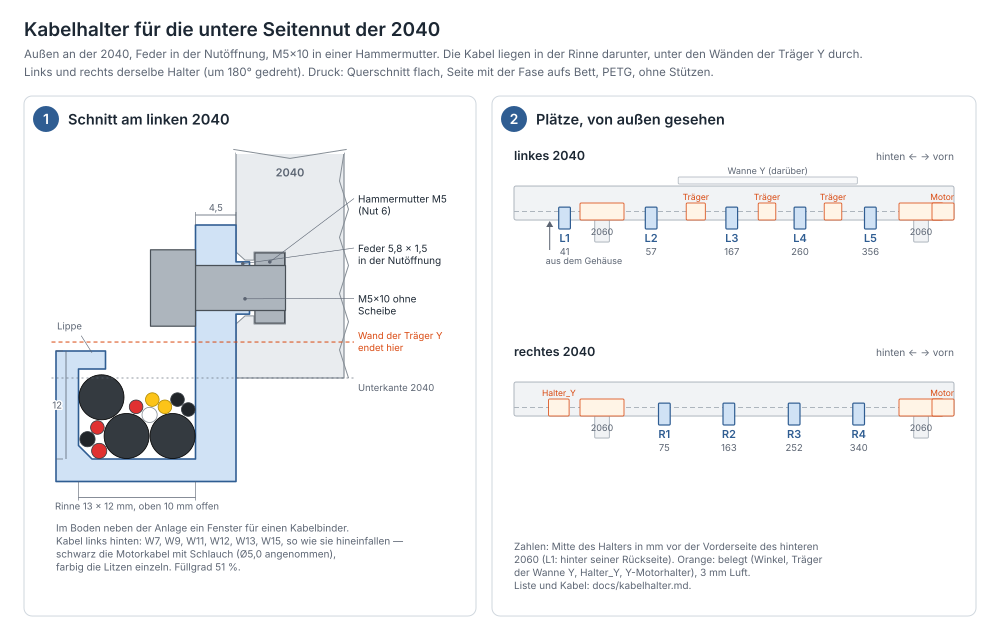

# Kabelhalter — untere Seitennut außen an den 2040

Erzeugt von `fusion/Kabelhalter/Kabelhalter.py` (ein Druckteil, Rev. 1).
Geprüft mit `python3 tools/kabelhalter_check.py`, Skizze in
[kabelhalter.svg](kabelhalter.svg) (neu erzeugen mit
`python3 tools/kabelhalter_zeichnen.py`). Welche Kabel dort laufen, steht
in der Kabelliste von [verkabelung.md](verkabelung.md#leitungen); den Weg
beschreibt [elektronik.md](elektronik.md#kabel).

## Wofür

Die fest verlegten Kabel laufen außen an den 2040 entlang der **unteren
Seitennut** ([elektronik.md](elektronik.md#kabel)): links alles, was hinten
aus dem Gehäuse kommt (W7, W9, W11, W12, W13, W15), rechts W2 und W14. In
die Nut selbst passen sie nicht: Links sind es hinter der Wanne Y drei
Motorkabel und neun Litzen, zusammen rund 76 mm². Die Nut hat im
vereinfachten Profil aus `Portal.py` nur etwa 40 mm² Platz. Außerdem sitzen dort die Hammermuttern der
Winkel und der Träger. Der Halter hält die Kabel deshalb **unter** der Nut,
in einer Rinne, die an der Nut hängt.

## Der Halter

| | |
|---|---|
| Anlage | 4,5 mm dick an der Seitenfläche, von 7 mm über der Nutmitte bis unter die Rinne |
| Feder | 5,8 × 1,5 mm in der Nutöffnung, links und rechts neben der Schraube. Sie richtet den Halter aus und hält ihn gerade |
| Schraube | **1 × M5×10 ohne Scheibe** in eine Hammermutter M5 (Nut 6): 3,7 mm im Stein, die Spitze bleibt 0,5 mm vor dem Nutgrund |
| Rinne | lichte **13 × 12 mm**, oben 10 mm offen, Oberkante 7 mm unter der Nutmitte (3 mm über der Unterkante der 2040). Boden und Außenwand 2,5 mm |
| Lippe | oben an der Außenwand, 3 mm nach innen: Die Kabel fallen von oben hinein und rutschen nicht nach außen heraus |
| Fenster | 2,2 × 4 mm im Boden, direkt neben der Anlage, für einen Kabelbinder |
| Breite | 16 mm längs der Nut |
| Gewicht | etwa 4 g (PETG) |

**Unter den Trägern der Wanne Y durch:** Die Wände der Träger enden 4 mm
über der Unterkante des 2040 ([energiekette.md](energiekette.md#wanne-y-und-träger-portalpy-seit-rev-21)).
Die Rinne liegt 1 mm tiefer. Die Kabel laufen dort also gerade durch und
müssen nicht mehr aus der Nut heraus und unter der Wand hindurch.

**Links wie rechts derselbe Halter:** Auf der rechten Seite wird er um 180°
gedreht angeschraubt. Die Rinne hängt immer außen und unten.

## Kabel in der Rinne

Die Prüfung legt die Kabel jedes Abschnitts nacheinander in die Rinne, das
dickste zuerst, und jedes fällt so tief wie möglich. So liegen sie auch in
der Skizze.

| Abschnitt | Kabel | Füllgrad |
|---|---|---|
| links hinten, Gehäuse bis hinter die Wanne Y | W7, W9, W11 (Litzen einzeln), W12, W13, W15 (Motorkabel) | 51 % |
| links vorn, Wanne Y bis vorderes 2060 | W13 | 13 % |
| rechts, hinteres bis vorderes 2060 | W2, W14 | 32 % |

Die Litzen der Y-Kette (W7, W9, W11, W12, W15) gehen hinter der Wanne aus
der Rinne nach oben über den Wannenboden in das Endstück. Dort hält sie ein
Kabelbinder durch das Fenster von **L2**, ein zweiter in der Wanne
([energiekette.md](energiekette.md#montage-y)). W10 läuft rechts nur ein
kurzes Stück nach hinten zum Halter_Y, dort ist kein Halter nötig.

## Plätze

Neun Halter, links fünf und rechts vier. Die Prüfung verteilt sie in den
freien Lücken der Nut so, dass zwischen zwei Haltern höchstens rund 100 mm
frei hängen. Länger sind nur die Spannen über die hintere Kreuzung (L1–L2,
118 mm) und über den Träger am Festpunkt (L2–L3, 110 mm). Gemessen wird die Mitte des Halters, also die Schraube, vom hinteren 2060,
so wie bei den Trägern der Wanne Y.

<!-- tabelle:plaetze -->
| Halter | Seite | Mitte (Schraube), vom hinteren 2060 | Y | Kabel |
|---|---|---|---|---|
| **L1** | links | 41 mm hinter der Rückseite | −291 | W7 · W9 · W11 · W12 · W13 · W15 |
| **L2** | links | 57 mm vor der Vorderseite | −173 | W7 · W9 · W11 · W12 · W13 · W15 |
| **L3** | links | 167 mm vor der Vorderseite | −63 | W13 |
| **L4** | links | 260 mm vor der Vorderseite | 30 | W13 |
| **L5** | links | 356 mm vor der Vorderseite | 126 | W13 |
| **R1** | rechts | 75 mm vor der Vorderseite | −155 | W2 · W14 |
| **R2** | rechts | 163 mm vor der Vorderseite | −67 | W2 · W14 |
| **R3** | rechts | 252 mm vor der Vorderseite | 22 | W2 · W14 |
| **R4** | rechts | 340 mm vor der Vorderseite | 110 | W2 · W14 |
<!-- /tabelle:plaetze -->

Frei bleiben jeweils 3 mm zu den Winkeln an den 2060, zum 2060 selbst (die
Rinne hängt unter die 2040), zu den Trägern der Wanne Y, zum Halter_Y und
zum Y-Motorhalter. Unter der Wanne Y sind es 6,7 mm, unter der Fahne Y
22,5 mm. Den Inbus setzt du von außen waagerecht an den Kopf, die Lippe
liegt 2,75 mm darunter.

## Montage

1. **Hammermuttern** an den Plätzen von außen in die untere Seitennut
   einschwenken, links fünf, rechts vier. Einschieben geht nicht, die
   Nutenden belegen Winkel und Y-Motorhalter.
2. **Halter** mit der Feder in die Nutöffnung, Rinne unten und außen.
   M5×10 ohne Scheibe, handfest anziehen. Längs lässt er sich noch
   verschieben, bis die Schraube fest ist.
3. **Kabel** von oben in die Rinne legen und nach außen unter die Lippe
   schieben. Die dicken Kabel zuerst.
4. **Kabelbinder** dort, wo Kabel die Rinne verlassen: bei L2 (Litzen zur
   Y-Kette) und bei L5 und R4 (Motorkabel nach vorn). Den Binder von oben
   neben der Anlage durch das Fenster, unter dem Boden nach außen, außen an
   der Wand hoch und über die Kabel zurück.

## Druck

* **PETG**, 4 Wandlinien, 30 % Infill, keine Stützen.
* **Lage:** Querschnitt flach, die Seite mit der 0,4-mm-Fase aufs Bett. Die
  16 mm Breite wachsen nach oben. So liegen Rinne, Lippe und Feder ganz in
  der Schicht und brechen nicht an einer Lagengrenze. Das Loch für die M5
  ist eine Träne mit der Spitze nach oben.
* Neun Stück, am besten zehn mit einem Reserveteil.

## Stückliste

| Teil | Anzahl |
|---|---|
| Kabelhalter (PETG) | 9 |
| Zylinderschraube M5×10 (ISO 4762 / DIN 912) | 9 |
| Hammermutter M5, Nut 6 | 9 |
| Kabelbinder bis 3,6 mm breit | 3 |

## Parametrik

Die Werte stehen in `MASSE` und landen als User-Parameter im Dialog
*Ändern → Parameter*. Die Lagen rechnet `lage()` in Python. Nach einer
Änderung das Skript neu laufen lassen und die Prüfung ausführen.

| Parameter | Wert | Wirkung |
|---|---|---|
| `kanal_b` / `kanal_h` | 13 / 12 mm | lichte Rinne |
| `kanal_oben` | 7 mm | Oberkante der Rinne unter der Nutmitte |
| `kanal_wand` | 2,5 mm | Boden und Außenwand |
| `lippe_b` / `lippe_h` | 3 / 2 mm | Lippe oben an der Außenwand |
| `anlage_t` | 4,5 mm | Anlage; mit M5×10 sitzt die Spitze 0,5 mm vor dem Nutgrund |
| `feder_b` / `feder_t` | 5,8 / 1,5 mm | Feder in der Nutöffnung |
| `kh_b` | 16 mm | Breite längs der Nut |
| `binder_b` / `binder_t` | 4 / 2,2 mm | Fenster für den Kabelbinder |
| `kh_y` | −173 mm | nur das Modell: Lage des gezeigten Halters (L2) |

## Noch offen

1. **Kabeldurchmesser** `[?]`: Die Motorkabel mit Schlauch sind mit Ø5
   gerechnet, die Not-Aus-Leitung W2 mit Ø6. Sind sie dicker, zeigt die
   Prüfung das am Füllgrad. Dann `kanal_b` größer machen.
2. **Nut 6** `[w]`: Lippe 1,8 mm, Platz bis zum Nutgrund 6,0 mm, wie in
   `Portal.py`. Ist die Nut flacher, kommt die Schraube nicht fest. Dann
   eine Scheibe M5 unter den Kopf legen.
