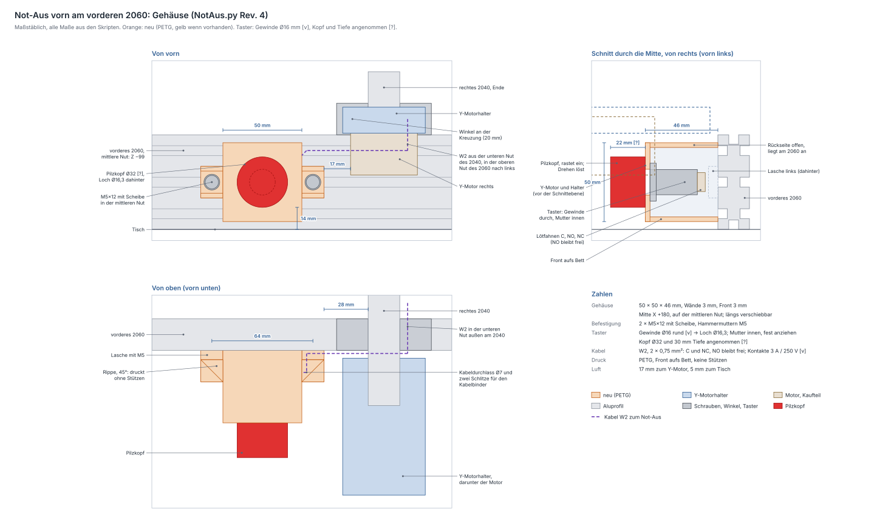

# Not-Aus — Gehäuse vorn am vorderen 2060

Erzeugt von `fusion/NotAus/NotAus.py` (ein Druckteil, Rev. 4). Geprüft mit
`python3 tools/notaus_check.py`, Skizze in [notaus.svg](notaus.svg) (neu
erzeugen mit `python3 tools/notaus_zeichnen.py`). Wie er verdrahtet wird,
steht in [verkabelung.md](verkabelung.md) (W2 und W16).

## Der Taster

Nach deinem Bild und deinen Angaben vom 2026-09-30 `[v]`: roter Pilzkopf
„STOP“, rastet beim Drücken ein, Drehen im Uhrzeigersinn löst ihn. Das
Gewinde hat **16 mm** und ist rund, ohne Abflachung. Er hat **einen
Wechsler** mit drei Lötfahnen, **C**, **NO** und **NC**, belastbar mit
**3 A / 250 V**.

* **C und NC** liegen in der 24-V-Leitung (W2). Gedrückt trennt der Öffner
  die 24 V für Shield, Wandler und Lüfter, also Motoren und Laser.
* **NO bleibt frei.** Beim Drücken liegt dort C, also +24 V. An einen Pin
  des Uno darf das nicht.
* **3 A reichen:** Die Maschine zieht dauernd gut 2 A (Motoren, Laser über
  den Wandler, Lüfter), das Netzteil liefert bis 3 A. 250 V ist ein
  Wechselstromwert; bei 24 V Gleichstrom und 2 A genügt der Kontakt `[w]`.
* GRBL erfährt vom Not-Aus über den **24-V-Wächter** (W16), einen
  Spannungsteiler an Abort. Fehlen die 24 V, bricht GRBL ab
  ([verkabelung.md](verkabelung.md#7-24-v-wächter-w16)).

## Wo er sitzt

An der **Vorderseite des vorderen 2060**, rechts innen neben dem rechten
2040, die Mitte bei X +180 auf der mittleren Nut. Dort ist er mit der
rechten Hand schnell zu erreichen, und nichts fährt davor: Der Toolhead
bleibt am vorderen Wegende 23 mm hinter dem Gehäuse. Zum rechten Y-Motor
bleiben 17 mm, zum Tisch 5 mm, der Pilzkopf steht 14 mm über dem Tisch.

Längs der Nut lässt sich das Gehäuse verschieben. Soll es woanders sitzen,
`na_x` im Skript ändern und die Prüfung laufen lassen. Nach links geht es
beliebig weit, nach rechts bis etwa X +205; dann bleiben zum Y-Motor noch
3 mm.

## Aufbau

| | |
|---|---|
| Kasten | 50 × 50 × 46 mm, Wände 3 mm, Rückseite offen: sie liegt am 2060 an |
| Frontwand | 3 mm, Loch Ø16,3 für das 16-mm-Gewinde (0,3 mm Spiel); die Mutter sitzt innen |
| Laschen | links und rechts, 14 × 20 mm, 6 mm dick, je eine M5 in einer Hammermutter der mittleren Nut |
| Rippen | zwei je Lasche, an ihren Kanten, 45°: tragen die Lasche beim Druck, Scheibe und Inbus bleiben frei |
| Kabel | rechts oben ein Durchlass Ø7 für W2 (2 × 0,75 mm²), davor und dahinter je ein Schlitz für einen Kabelbinder |
| innen | 44 × 44 mm, 43 mm tief: die Mutter dreht sich (bis 40 mm über Eck), hinter den Lötfahnen bleiben 10 mm für die Litze |

**Rev. 2:** Gewinde 16 mm `[v]` nach deiner Angabe; Rev. 1 hatte 19 mm
angenommen. Geändert hat sich nur das Loch, Ø16,3 statt Ø19,3. Kasten,
Laschen und Lage bleiben. **Rev. 3** ändert nur den Bericht des Skripts
(Mutter fest anziehen), **Rev. 4** nur einen Kommentar; die Geometrie ist
dieselbe wie in Rev. 2.

## Montage

1. **W2** von außen durch den Kabeldurchlass ins Gehäuse ziehen. Das muss
   vor dem Löten sein, mit dem Taster daran passt das Kabel nicht mehr
   durch.
2. **Anlöten:** Ader 1 an **C**, Ader 2 an **NC**, **NO frei**.
   Schrumpfschlauch über jede Fahne.
3. **Taster** von vorn durch das Loch stecken, die Mutter von hinten durch
   die offene Rückseite **fest** anziehen. Das Gewinde ist rund: Beim
   Entriegeln dreht man am Pilz, und nur die Mutter hält den Taster gegen
   Verdrehen. Dreht er sich doch mit, die Mutter nachziehen.
4. **Zugentlastung:** einen Kabelbinder durch die zwei Schlitze um das
   Kabel legen.
5. Zwei **Hammermuttern M5** in die mittlere Nut vorn am 2060 setzen, das
   Gehäuse ansetzen, **2 × M5×12 mit Scheibe** festziehen. Der Inbus kommt
   von vorn zwischen den Rippen an die Schraube.
6. **W2** in der oberen Nut des 2060 nach rechts führen, vor dem 2060 in
   die untere Nut außen am rechten 2040 und darin nach hinten
   ([Kabelwege](verkabelung.md#kabelwege-und-ketten)).
7. **Prüfen:** Not-Aus drücken, dann sind die 24 V weg
   ([Prüfung B](verkabelung.md#b-24-v-ohne-verbraucher)). GRBL meldet
   `Pn:R` ([Prüfung I](verkabelung.md#i-not-aus)).

## Druck (PETG, Bambu Lab A1)

**Frontwand aufs Bett**, die Fläche mit dem Loch. Die Wände stehen
senkrecht, die offene Rückseite liegt oben. Die Laschen hängen oben seitlich
heraus; die 45°-Rippen tragen sie, dazwischen bleibt eine 14-mm-Brücke.
**Keine Stützen.** Der Kabeldurchlass liegt waagerecht, bei Ø7 geht das
ohne Tropfenform. 78 × 50 × 46 mm, 4 Wandlinien, 30 % Infill. **Gelb**, wenn
vorhanden: roter Pilz auf gelbem Grund ist die übliche Kennzeichnung.

## Verschraubung

| Verbindung | Teile | Hinweis |
|---|---|---|
| Gehäuse → vorderes 2060 | **2 × M5×12 + Scheibe + Hammermutter M5 (Nut 6)** | mittlere Nut vorn; 5 mm in der Nut, 3,2 mm Gewinde im Stein, 1 mm vor dem Nutgrund (wie Halter_Y) |
| Taster → Frontwand | seine Mutter | innen |

Keine Bohrlehre: Das Gehäuse verbindet kein zweites Druckteil, und die
2060 wird nicht gebohrt.

## Noch offen

Nichts, was den Druck aufhält. Nur **Kopf, Tiefe und Mutter** `[?]` sind
angenommen: 32 mm Kopf, 22 mm vor der Front, 30 mm dahinter und 24 mm über
Eck. Das dient nur der Zeichnung und der Prüfung; bis 33 mm Tiefe passt der
Taster.

Geklärt (2026-09-30): Gewinde 16 mm, rund; Kontakte 3 A / 250 V.

## Parametrik

Alle Werte aus `MASSE` landen als User-Parameter im Dialog *Ändern →
Parameter*. Die Lagen rechnet `lage()` in Python: nach einer Änderung das
Skript neu laufen lassen und `tools/notaus_check.py` ausführen.

| Parameter | Wert | Wirkung |
|---|---|---|
| `schalter_d` | 16 mm `[v]` | Gewinde des Tasters; das Loch ist 0,3 mm größer |
| `na_x` | 180 mm | Lage längs des 2060 (Mitte des Gehäuses, X ab der Maschinenmitte) |
| `na_b` / `na_h` / `na_t` | 50 / 50 / 46 mm | Kasten: Breite, Höhe, Tiefe vor dem 2060 |
| `na_wand` / `na_front` | 3 / 3 mm | Wände; die Frontwand muss der Taster klemmen können (`klemm_max` 6 mm `[?]`) |
| `lasche_b` / `lasche_h` / `lasche_t` | 14 / 20 / 6 mm | Laschen mit M5 |
| `kabel_d` | 7 mm | Durchlass für W2 |
| `schalter_kopf_d` / `schalter_kopf_h` / `schalter_tiefe` / `schalter_mutter` | 32 / 22 / 30 / 24 mm `[?]` | nur Zeichnung und Prüfung |
