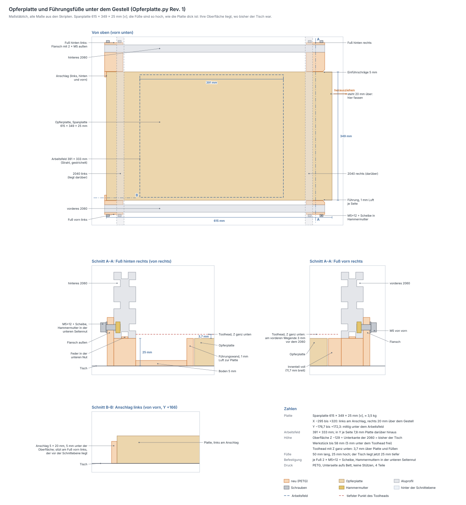

# Opferplatte und Führungsfüße

Erzeugt von `fusion/Opferplatte/Opferplatte.py` (vier Druckteile, Rev. 2).
Geprüft mit `python3 tools/opferplatte_check.py`, Zeichnung in
[opferplatte.svg](opferplatte.svg) (neu erzeugen mit
`python3 tools/opferplatte_zeichnen.py`).

## Die Platte

Deine Opferplatte ist eine **Spanplatte 615 × 349 × 25 mm** (Angabe vom
2026-10-02), gemessen **25,3 mm** dick `[v]`, rund 3,5 kg. Gezogen wird
sie **nach rechts**, sie liegt also längs in X.

Läge sie einfach auf dem Tisch, kostete ihre Dicke genau so viel
Werkstückhöhe: Statt 50 passten nur noch knapp 33 mm unter den Toolhead,
und der Z-Schlitten setzte in seinen untersten 22 mm auf der Platte auf.
Deshalb steht die Maschine auf **vier Füßen, die so hoch sind, wie die
Platte dick ist**. Die Plattenoberfläche liegt dann genau dort, wo bisher
der Tisch war (Unterkante der 2060), und alles, was `ToolheadZ.py` für
Fokus und Werkstückhöhe rechnet, bleibt gültig. Gewählt am 2026-10-02
statt höherer Schlitten: weniger Teile, und am Portal ändert sich nichts.

## Wo sie liegt

Koordinaten wie in `Portal.py`: X nach rechts, Y nach vorn, Z = 0 in der
Mitte des Portalrohrs, das Portal in der Mitte seines Wegs.

| | |
|---|---|
| X | −295 bis +320: links am Anschlag, rechts steht sie 20 mm über das Gestell, dort fasst du sie zum Herausziehen |
| Y | −176,65 bis +172,35: mittig unter dem Arbeitsfeld, zwischen den Füßen mit 1 mm Luft je Seite |
| Z | −154,3 bis −129: auf dem Tisch, Oberfläche auf der Unterkante der 2060 |
| Arbeitsfeld | 391 × 333 mm (X −204 bis +187, Y −168,8 bis +164,5), so weit kommt der Strahl |
| Rand | in Y je Seite 7,85 mm Platte über das Feld hinaus, in X links 91 und rechts 133 mm |

In Y ist die Platte nur knapp 16 mm breiter als das Arbeitsfeld. Deshalb liegt
sie mittig darunter und wird von den Füßen geführt.

## Die Füße

Je ein Fuß sitzt unter einem Ende der beiden 2060, 50 mm lang (X ±250 bis
±300), also unter den Kreuzungen mit den 2040. Hinten bleiben sie damit
außerhalb des Elektronikfachs.

| | |
|---|---|
| Block | unter dem 2060, 25,3 mm hoch wie die gemessene Platte: trägt die Maschine |
| Feder | 5,8 × 1,5 mm oben auf dem Block, greift in die untere Nut des 2060 |
| Flansch | 6 mm dick außen am 2060, reicht 19 mm über dessen Unterkante. 2 × M5×12 mit Scheibe, 32 mm auseinander, in Hammermuttern der unteren Seitennut (10 mm über der Unterkante) |
| Innenteil vorn | 11,65 mm breit bis an die Platte, voll |
| Innenteil hinten | 52,35 mm breit: Boden 5 mm auf dem Tisch, an der Platte eine Führungswand 6 mm |
| Anschlag | an den beiden linken Füßen: 5 mm dick, greift 15 mm vor das Plattenende, 20 mm hoch, also 5,3 mm unter der Oberfläche |
| Einführschräge | an den beiden rechten Füßen: 5 mm unter 45°, damit die Platte beim Einschieben nicht hängen bleibt |

Es sind **vier verschiedene Teile**: links mit Anschlag, rechts mit
Schräge, vorn schmal, hinten breit.

Eine Bohrlehre gibt es nicht: Alle Schrauben gehen in Hammermuttern,
gebohrt wird nichts.

## Höhen

| Z | was |
|---|---|
| −69 | Oberkante der 2060 |
| −119 | untere Seitennut: M5 der Flansche |
| −123,8 | Unterkante des Lasers, Z ganz unten, Laser ganz unten im Langloch |
| −125,3 | tiefster Punkt des Toolheads (Schlittenplatte), Z ganz unten |
| **−129** | **Oberfläche der Platte** = Unterkante der 2060 = bisher der Tisch |
| −154,3 | Tisch: Die Maschine steht jetzt 25,3 mm höher |

* **Werkstückhöhe:** 58 mm über der Platte bis 5 mm unter die tiefste feste
  Kante des Toolheads (−66), also mehr als die geplanten 50.
* **Toolhead über der Platte:** Mit Z ganz unten bleiben 3,7 mm, über dem
  ganzen X- und Y-Weg; über den Füßen genauso, sie reichen innen nicht
  höher als die Platte.
* **Fokus:** `ToolheadZ.py` rechnet mit 130 mm von der Rohrmitte bis zum
  Bett `[?]` (deine Angabe, auf cm gerundet). Aus den Profilmaßen ergeben
  sich 129 mm bis zur Plattenoberfläche. Den Fokus stellst du ohnehin über Z
  ein.
* **Ohne Platte**, zum Beispiel auf einem großen Werkstück: Dessen
  Oberfläche liegt dann 25,3 mm tiefer als die Platte, und der Laser kommt
  nur bis 30,5 mm Fokusabstand an sie heran. Fokussiert dein Modul kürzer,
  schraubst du dafür die Füße ab.
* Not-Aus-Gehäuse und Elektronikkasten hängen jetzt 30,3 bzw. 27,3 mm über dem
  Tisch. Dass sie hängen, ändert sich nicht.

## Montage

1. 8 Hammermuttern M5 in die untere Seitennut **außen** an beiden 2060
   schieben, je 2 nahe jedem Ende. Hinten laufen die Kabel in der
   mittleren Nut, vorn W2 in der oberen: Die untere Nut ist frei.
2. Die Maschine an einer Seite anheben und die beiden Füße dieser Seite
   unterstellen: Feder in die untere Nut, Flansch außen anlegen. Absetzen,
   dann je Fuß 2 × M5×12 mit Scheibe durch den Flansch in die
   Hammermuttern. Der Inbus kommt von außen, nichts steht im Weg.
3. Die andere Seite ebenso.
4. Die Platte von rechts zwischen die Füße schieben, bis sie links am
   Anschlag steht.

## Druck (PETG, Bambu Lab A1)

Unterseite (Tischseite) aufs Bett. Flansch, Wand und Anschlag stehen
senkrecht, die Feder liegt oben, die M5-Löcher waagerecht, keine Stützen.
4 Wandlinien, 20 % Infill.

| Teil | Volumen | Masse (voll) | Bauraum |
|---|---|---|---|
| Fuß vorn links | 55,0 cm³ | ≈ 70 g | 50 × 52,65 × 44,3 mm |
| Fuß vorn rechts | 53,2 cm³ | ≈ 68 g | 50 × 37,65 × 44,3 mm |
| Fuß hinten links | 59,4 cm³ | ≈ 75 g | 50 × 93,35 × 44,3 mm |
| Fuß hinten rechts | 57,6 cm³ | ≈ 73 g | 50 × 78,35 × 44,3 mm |

Die Massen gelten für Vollmaterial; mit 20 % Infill wird es deutlich
weniger.

## Stückliste

| Stück | Teil | wofür |
|---|---|---|
| 4 | Fuß (PETG): vorn links, vorn rechts, hinten links, hinten rechts | trägt die Maschine, führt die Platte |
| 8 | M5×12 Zylinderkopf + Scheibe DIN 125 | Flansch → Hammermutter |
| 8 | Hammermutter M5 (Nut 6) | untere Seitennut außen an den 2060 |
| 1 | Spanplatte 615 × 349 × 25 mm (gemessen 25,3) | Opferplatte (vorhanden) |

## Noch offen

Nichts mehr. Geklärt am 2026-10-02: Die Platte ist 25,3 mm dick
(Nennmaß 25), die Füße sind seit Rev. 2 genau so hoch. Die untere Nut
und die untere Seitennut an den Enden der 2060 sind frei.

## Parametrik

Alle Werte aus dem `MASSE`-Block landen als Fusion-User-Parameter. Nach
einer Änderung das Skript neu laufen lassen und
`tools/opferplatte_check.py` ausführen. Die Rahmenmaße und das Arbeitsfeld
vergleicht die Prüfung mit `Portal.py` und `ToolheadZ.py`.

| Parameter | Wert | Wirkung |
|---|---|---|
| `platte_l` / `platte_b` / `platte_dicke` | 615 / 349 / 25,3 mm | Opferplatte; die gemessene Dicke ist zugleich die Höhe der Füße (Rev. 1: 25) |
| `platte_spiel` | 1 mm | Luft je Seite zwischen Platte und Führung |
| `feld_x0` … `feld_y1` | −203,85 / +187,35 / −168,8 / +164,5 mm | Arbeitsfeld: die Platte liegt in Y mittig darunter |
| `fuss_l` | 50 mm | Länge der Füße unter den Enden der 2060 |
| `flansch_t` / `flansch_ueber` | 6 / 19 mm | Flansch außen am 2060 |
| `feder_b` / `feder_t` | 5,8 / 1,5 mm | Feder in der unteren Nut |
| `wand_t` / `boden_t` / `voll_bis` | 6 / 5 / 20 mm | Führungswand, Boden, bis zu welcher Breite der Innenteil voll ist |
| `m5_abstand` | 32 mm | Abstand der beiden M5 je Fuß |
| `anschlag_t` / `anschlag_tief` / `anschlag_h` | 5 / 15 / 20 mm | Anschlag an den linken Füßen |
| `einfuehr` | 5 mm | Einführschräge an den rechten Füßen |
