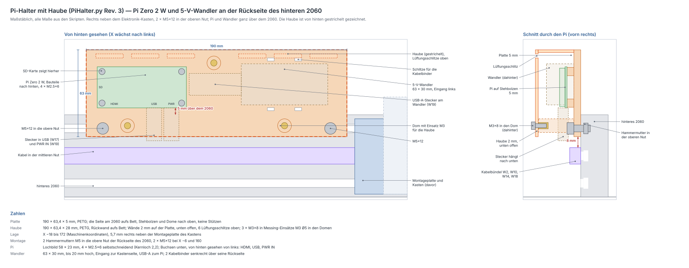

# Pi — die Maschine ohne PC bedienen

Ein **Raspberry Pi Zero 2 W** steckt statt eines Rechners am USB des Uno.
Auf ihm läuft [CNCjs](https://cnc.js.org/), eine Weboberfläche für GRBL.
Aufträge entwirfst du weiter in LightBurn auf dem Mac und speicherst sie als
G-Code-Datei. Die Datei liegt dann auf dem Pi, und gestartet wird im
Browser: am iPad, am iPhone oder am Mac. Der Pi schickt die Datei selbst
über USB an den Uno. Bricht das WLAN ab, läuft der Auftrag deshalb weiter.

Der Pi sitzt mit seinem 5-V-Wandler auf einem gedruckten
[Halter](#halter) rechts neben dem Elektronik-Kasten, unter einer
[Haube](#haube) wie die Elektronik: Von außen sieht man keine Platine. Er
hängt **vor
Schalter und Not-Aus** am Netzteil: Pi und Uno laufen, solange das Netzteil
steckt. Not-Aus und Schalter trennen nur Motoren, Laser und Lüfter, und der
[24-V-Wächter](verkabelung.md#7-24-v-wächter-w16) meldet das wie bisher an
GRBL.



Die Dateien für den Pi stehen in [`pi/`](../pi). Das Einrichtungsskript,
der Dienst und die Konfiguration mit Makros und Befehlen sind mit
**CNCjs 1.11.5** geprüft. Der Halter kommt aus `fusion/PiHalter/PiHalter.py`
und ist mit `python3 tools/pihalter_check.py` geprüft. Die Leitungen W17–W19
stehen mit allen anderen in [verkabelung.md](verkabelung.md#8-pi-w17w19).

**Nie unbeaufsichtigt lasern.** Der Stopp-Knopf im Browser hängt am WLAN
und ist keine Sicherheitsfunktion. Der Not-Aus bleibt in Reichweite.

## Teile

| Menge | Teil | wofür |
|---|---|---|
| 1 | Raspberry Pi Zero 2 W (ohne Stiftleiste genügt) | CNCjs |
| 1 | microSD-Karte 16–32 GB | Raspberry Pi OS Lite |
| 1 | Abwärtswandler 24 → 5 V, ≥ 3 A, Eingang bis mindestens 28 V; 63 × 30 mm, höchstens 20 mm hoch, Schraubklemmen und USB-A-Buchse an den schmalen Seiten `[v]` | 5 V für Pi und Uno |
| 1 | USB-Kabel A → Micro-B, 0,25 m, Stromadern mindestens AWG 24 | W19 |
| 1 | OTG-Kabel Micro-B → USB-B, 1 m | W17 |
| 0,5 m | Leitung 2 × 0,75 mm², rot/schwarz (wie W2) | W18 |
| 1 + 1 | Pi-Halter und Haube, PETG: [`stl/PiHalter_r3.stl`](../stl/PiHalter_r3.stl), [`stl/PiHalter_Haube_r3.stl`](../stl/PiHalter_Haube_r3.stl) | Halter |
| 2 + 2 | M5×12 Zylinderkopf + Hammermutter M5 Nut 6 | Halter → obere Nut des 2060 |
| 4 | M2.5×6 Zylinderkopf | Pi → Stehbolzen |
| 3 + 3 | M3×8 Zylinderkopf + Messing-Einsatz M3 Ø5 (wie am Deckel des Kastens) | Haube → Dome |
| 2 | Kabelbinder 2,5 × 100 | Wandler |

Ein OTG-Kabel verbindet im Micro-B-Stecker den ID-Stift mit Masse; dann
arbeitet der Pi an dieser Buchse als Host. Solche Kabel gibt es für Handys
an Druckern.

## Halter

Eine Platte, 190 × 63,4 × 5 mm, liegt wie die Montageplatte des Kastens
an der Rückseite des hinteren 2060, 5,7 mm rechts neben ihr. Zwei M5×12
halten sie in Hammermuttern der **oberen Nut**. Unten reicht sie 6 mm unter
die Mitte dieser Nut. Die Kabel in der mittleren Nut (W2, W10, W14, W18)
laufen 8 mm darunter frei durch.

Oben steht die Platte 47 mm über das 2060 hinaus. Dort sitzen:

* **rechts der Pi** auf vier Stehbolzen (5 mm hoch, Lochbild 58 × 23 mm
  `[w]`), Bauteile nach hinten, Buchsen nach unten, die SD-Karte rechts
  (von hinten gesehen links). Der Pi liegt ganz über der Oberkante des 2060,
  5 mm darüber. Vor seiner Antenne ist kein Aluminium.
* **links der 5-V-Wandler**, Eingang zur Kastenseite, USB-A-Buchse zum Pi.
  Zwei Kabelbinder laufen senkrecht über seine Rückseite, durch Schlitze
  über und unter ihm. Beide Enden mit Eingang und Buchse bleiben frei. Der
  Wandler ist 63 × 30 mm und höchstens 20 mm hoch `[v]`. Links von ihm
  bleiben in der Haube 12 mm: Dort kommt W18 von unten zu den
  Schraubklemmen, mit Aderendhülsen und Bogen nach unten.
* dazwischen **40 mm** für den USB-A-Stecker, bevor das Kabel nach unten
  zum Pi abbiegt.
* **drei Dome** mit Messing-Einsätzen M3 für die Haube: einer oben zwischen
  Wandler und Pi, zwei unten.

### Haube

Die Haube deckt Pi und Wandler nach hinten, oben und zu den Seiten ab, wie
die Haube auf dem Elektronik-Kasten. Ihre Wände sind 2 mm dick und stehen
auf der Platte, im selben Umriss. 3 × M3×8 halten sie in den Einsätzen der
Dome. Die Dome enden 0,3 mm vor der Rückwand, so ziehen die Schrauben die
Haube fest auf die Platte.

* **Unten offen:** Dort kommen die Kabel heraus, und dort strömt kühle Luft
  nach.
* **Lüftung:** 6 Schlitze 20 × 3 mm oben in der Rückwand. Die warme Luft
  steigt dorthin. Die Schlitze liegen über Pi und Wandler, durch sie sieht
  man keine Platine.
* **Wärme:** Hinter dem Pi bleiben 15 mm frei. Da passt ein kleiner
  Kühlkörper auf den Prozessor, falls der Pi zu warm wird
  ([Fehlersuche](#fehlersuche)).
* **WLAN:** PETG dämpft das WLAN kaum. Kein Filament mit Kohlefaser oder
  Metall nehmen.
* **SD-Karte:** Zum Wechseln die Haube abnehmen.

| | |
|---|---|
| Lage | X −18 bis +172 (Maschinenkoordinaten wie `Portal.py`), Z −85 bis −21,6; die Haube reicht 28 mm nach hinten |
| Freiraum | 6,7 mm zum X-Wagen mit dem Portal am hinteren Schienenende (die engste Stelle über den ganzen Weg; bis Rev. 2 waren es 8,6 mm, die Platte ist seit Rev. 3 oben 3 mm höher), 5,7 mm zur Montageplatte des Kastens, 8 mm über den Kabeln |
| Schrauben | 2 × M5×12 wie die Montageplatte: 5,2 mm im Stein, 0,5 mm vor dem Nutgrund. Inbus von hinten, bevor die Haube draufkommt |
| Pi | 4 × M2.5×6 selbstschneidend in Kernlöcher Ø 2,2; die Schraube greift 4,4 bis 5 mm |
| Haube | 3 × M3×8 in Messing-Einsätzen M3 Ø5 (Bohrung 4,6, 7 mm tief), 5,7 mm im Gewinde. Inbus von hinten |
| Druck | PETG, keine Stützen. Halter: die Seite am 2060 aufs Bett, Stehbolzen und Dome nach oben, 31 mm hoch, ≈ 84 g voll. Haube: Rückwand aufs Bett, 28 mm hoch, ≈ 50 g |

`python3 tools/pihalter_check.py` prüft das alles gegen Portal, Toolhead,
Kasten, Rahmen und Kabel, dazu die Haube: innen frei, Dome, Schrauben,
Lüftung. `python3 tools/pihalter_zeichnen.py` zeichnet
[`pihalter.svg`](pihalter.svg), `python3 tools/stl_export.py PiHalter`
schreibt beide STL.

**Montage:**

1. Den Pi vor dem Druck auf die Zeichnung legen: Lochbild und Buchsen sind
   nach dem Maßblatt der Zero-Reihe gezeichnet `[w]`.
2. Die drei Messing-Einsätze M3 mit dem Lötkolben bündig in die Dome
   einschmelzen.
3. Pi mit 4 × M2.5×6 auf die Stehbolzen, Buchsen nach unten.
4. Wandler links aufsetzen, Eingang nach links, die zwei Kabelbinder durch
   die Schlitze und um ihn herum, die Köpfe hinten auf den Wandler.
5. 2 Hammermuttern in die obere Nut der Rückseite des hinteren 2060, rechts
   neben der Montageplatte des Kastens. Halter ansetzen, 2 × M5×12.
6. Verdrahten wie in [verkabelung.md, Schritt 8](verkabelung.md#8-pi-w17w19).
7. Haube aufsetzen, 3 × M3×8.

## Strom

```
Netzteil ── Buchse ─┬─ Schalter ── Not-Aus ── Wago +24 V: Shield, Wandler 12 V, Lüfter
                    └─ W18 ── 5-V-Wandler ── W19 ── Pi ── W17 (USB) ── Uno ── 5 V der Lichtschranken
```

| Zustand | Pi und Uno | Motoren, Laser, Lüfter |
|---|---|---|
| Netzteil gesteckt, Schalter aus | an, GRBL meldet `Pn:R` | aus |
| Schalter an | an | an |
| Not-Aus gedrückt | an, GRBL bricht ab: ALARM, `Pn:R` | aus |
| Netzteil gezogen | aus, der Pull-down W8 hält den Laser aus | aus |

* **Einschalten:** Netzteil einstecken. Der Uno bekommt seine 5 V sofort
  über W17 vom Pi, nicht erst, wenn der Pi gestartet ist. GRBL läuft nach
  etwa einer Sekunde und steht bis zur Referenzfahrt in ALARM: Es nimmt
  keinen G-Code an, auch kein `M3`. Den Schalter darfst du deshalb gleich
  anschalten, auch während der Pi noch startet. Der Laser bleibt aus, und
  kein Motor fährt. Nach etwa einer Minute ist CNCjs erreichbar: erst
  verbinden, dann **Homing** (beim Verbinden startet der Uno neu).
* **Ausschalten:** Schalter aus, in CNCjs **Pi herunterfahren**, erst dann
  das Netzteil ziehen. Ein harter Stromausfall kann die SD-Karte
  beschädigen. Steckt das Netzteil weiter, bleibt der Pi erreichbar
  (≈ 1 W im Leerlauf).
* **Leistung:** Pi, Uno, Treiberlogik und Lichtschranken ziehen zusammen
  höchstens 755 mA aus 5 V. Mit dem Wandler (85 %) sind das ≈ 4,4 W aus dem
  Netzteil. Zusammen mit allem anderen sind es ≈ 53 W, dauernd gehen 61 W
  ([Leistung](elektronik.md#leistung-reichen-72-w)).

## Einrichten

**1. Karte beschreiben** (am Mac, Raspberry Pi Imager):

* Gerät „Raspberry Pi Zero 2 W“, System „Raspberry Pi OS Lite (64-bit)“.
* In den Einstellungen: Hostname **laser**, Benutzer und Passwort (hier im
  Beispiel `laser`), WLAN mit Land DE (der Zero kann nur 2,4 GHz), SSH an.

**2. Dateien auf den Pi**, im Ordner des Repos am Mac:

```sh
scp -r pi laser@laser.local:
ssh laser@laser.local
```

**3. Auf dem Pi:**

```sh
sh pi/einrichten.sh
sudo reboot
```

Das Skript ([`pi/einrichten.sh`](../pi/einrichten.sh)) installiert Node.js
und CNCjs 1.11.5 und legt den Ordner `~/gcode` an. Es schreibt
[`pi/cncrc.json`](../pi/cncrc.json) als `~/.cncrc` und richtet CNCjs als
Dienst ein ([`pi/cncjs.service`](../pi/cncjs.service)). CNCjs startet dann
mit dem Pi. Dazu erlaubt es die Befehle zum Herunterfahren und Neustarten
([`pi/sudoers-cncjs`](../pi/sudoers-cncjs)) und schaltet das
WLAN-Energiesparen ab
([`pi/wlan-energiesparen-aus.conf`](../pi/wlan-energiesparen-aus.conf)).
Ohne das hält der Pi Pakete zurück, und Joggen und Anzeige im Browser
haken. Eine vorhandene `~/.cncrc` bleibt, wie sie ist. Auf dem Zero dauert
der Lauf einige Minuten.

## CNCjs

Im Browser: **`http://laser.local:8000`**. Am iPad oder iPhone in Safari
„Zum Home-Bildschirm“, dann öffnet es sich wie eine App. Ein altes iPad an
der Maschine ist ein gutes Bedienfeld.

* **Verbinden:** Port `/dev/ttyACM0` (Uno mit Nachbau-Chip CH340:
  `/dev/ttyUSB0`), 115200 Baud, Controller Grbl. Beim Verbinden startet der
  Uno neu, wie am Mac auch.
* **Nach dem Verbinden „Homing“** (`$H`), nicht „Unlock“ (`$X`): Die
  Softlimits stimmen nur nach der Referenzfahrt
  ([endschalter.md](endschalter.md#softlimits-statt-zweitem-y-schalter)).
* Nur aus dem Heimnetz erreichbar: CNCjs lässt ohne `allowRemoteAccess`
  nur private Adressen zu. Wer im WLAN nicht allein ist, legt unter
  Settings → User Accounts einen Zugang an.

Vorbereitet in [`pi/cncrc.json`](../pi/cncrc.json):

| Makro / Befehl | was | |
|---|---|---|
| **Rahmen** | fährt mit G0 die Außenkante der geladenen Datei ab, der Laser bleibt aus | `G0 X[xmin] Y[ymin]` … |
| **Laserpunkt 1 %** | Laser als Punkt an, z. B. für den [Nullpunkt](spannmittel.md#nullpunkt-einrichten-einmal); **Schutzbrille** | `G1 F600`, `M3 S10` |
| **Laser aus** | | `M5` |
| **Pi herunterfahren** (Befehl) | vor dem Ziehen des Netzteils | `sudo shutdown -h now` |
| **Pi neu starten** (Befehl) | | `sudo reboot` |

Die Außenkante für **Rahmen** liefert die 3D-Ansicht von CNCjs, wenn sie
die Datei geladen hat. Ist die 3D-Ansicht abgeschaltet, kennt CNCjs die
Kante nicht.

## LightBurn auf dem Mac

* **Nullpunkt** einmal einrichten wie in
  [spannmittel.md](spannmittel.md#nullpunkt-einrichten-einmal): an der
  Innenecke des Anschlags hinten links mit `G10 L20 P1 X0 Y0`. GRBL behält
  ihn. In LightBurn den Ursprung hinten links.
* Aufträge mit **„Start From: Absolute Coords“** anlegen und mit **„Save
  GCode“** speichern. So bezieht sich die Datei auf diesen Nullpunkt und
  läuft im Pi genauso wie direkt aus LightBurn. „Current Position“ und
  „User Origin“ gehören zu LightBurn am Kabel.
* „Constant Power Mode“ aus lassen (Standard, M4): Dann regelt GRBL die
  Leistung mit der Geschwindigkeit und hält den Laser im Stillstand aus.
* **Übertragen:**
  * im Browser mit „Upload G-code“. Die Datei bleibt geladen, bis CNCjs neu
    startet;
  * oder dauerhaft in den Ordner auf dem Pi:
    `scp auftrag.gc laser@laser.local:gcode/`. In CNCjs erscheint sie unter
    „Watch Directory“.

## Ablauf an der Maschine

1. Netzteil einstecken und warten, bis CNCjs erreichbar ist.
2. CNCjs öffnen, verbinden, Schalter an, **Homing**.
3. Werkstück an den Anschlag ([spannmittel.md](spannmittel.md)), Datei laden.
4. Makro **Rahmen**, die Hand am Not-Aus. Dann **Start**.
5. Bleib dabei, bis der Auftrag fertig ist.
6. Schalter aus. Soll die Maschine ganz aus: **Pi herunterfahren**, dann das
   Netzteil ziehen.

## Fehlersuche

| Was passiert | Ursache | Abhilfe |
|---|---|---|
| `laser.local` nicht erreichbar | Pi startet noch, WLAN-Daten falsch, 5-GHz-Netz | eine Minute warten; im Router nach dem Pi sehen; der Zero braucht 2,4 GHz |
| Seite lädt nicht, Pi antwortet auf `ping` | Dienst läuft nicht | auf dem Pi `systemctl status cncjs` und `journalctl -u cncjs` |
| Kein Port in CNCjs | W17 in PWR IN statt USB, Kabel ohne OTG | Micro-B in die mittlere Buchse **USB**; OTG-Kabel; `ls /dev/ttyACM* /dev/ttyUSB*` |
| Pi startet neu, Blitz-Symbol, Unterspannung | W19 dünn oder lang, Wandler zu schwach | kurzes Kabel mit dicken Adern; Wandler ≥ 3 A; am USB-Ausgang 5,0–5,2 V |
| Joggen und Anzeige haken | WLAN-Energiesparen an | `iw dev wlan0 get power_save` muss „off“ zeigen; sonst Schritt 3 wiederholen |
| ALARM:2 oder `error:15` beim Rahmen | Datei nicht auf den Nullpunkt bezogen | Nullpunkt prüfen, in LightBurn „Absolute Coords“ und Ursprung hinten links |
| Rahmen fährt nach 0, 0 | 3D-Ansicht aus oder keine Datei geladen | Datei laden, 3D-Ansicht an |
| Befehl „Pi herunterfahren“ tut nichts | sudo fragt nach dem Passwort | `pi/einrichten.sh` noch einmal laufen lassen (legt `/etc/sudoers.d/cncjs` an) |
| CNCjs wird träge, `vcgencmd measure_temp` zeigt um 80 °C | Pi zu warm unter der Haube, ab 80 °C drosselt er | Lüftungsschlitze frei halten, einen kleinen Kühlkörper auf den Prozessor kleben |

## Noch offen

**Pi** `[w]`: Lochbild und Lage der Buchsen nach dem Maßblatt der
Zero-Reihe, Platinendicke und Bauteilhöhe `[?]`. Vor dem Druck den Pi auf
die Zeichnung legen. Der 5-V-Wandler ist geklärt (2026-10-10, seit Rev. 2
im Halter).
