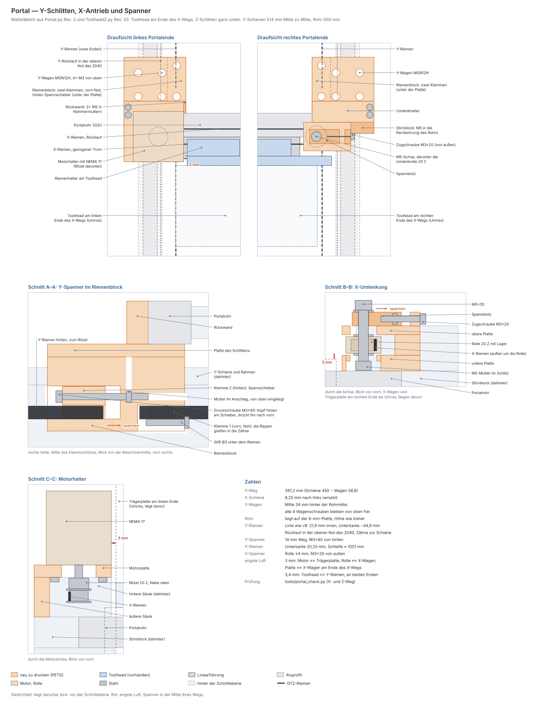
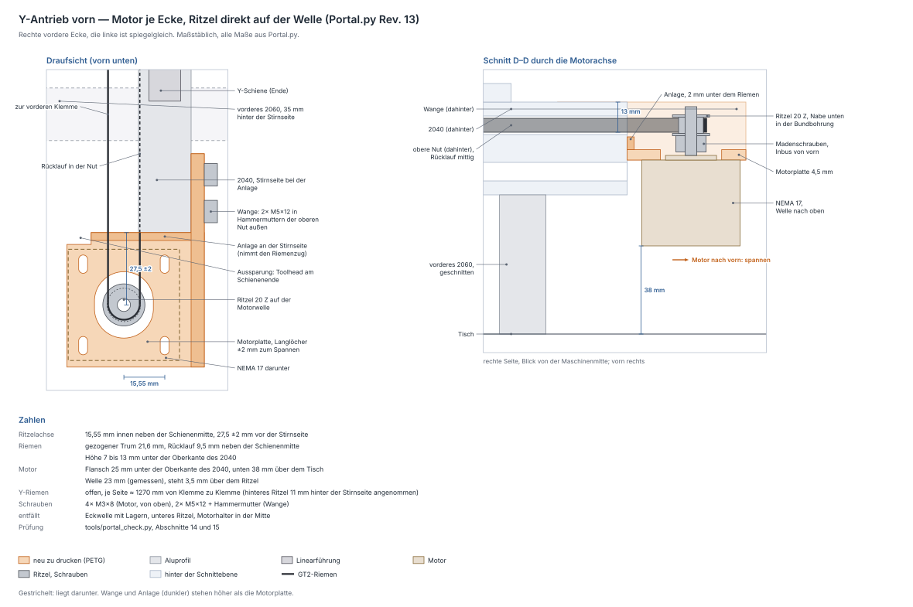

# Portal — Y-Schlitten, Y-Klemmtürme und X-Antrieb

Erzeugt von `fusion/Portal/Portal.py` (Baugruppe, elf gedruckte Teile).
Geprüft mit `python3 tools/portal_check.py` — zusammen mit dem Toolhead aus
`fusion/ToolheadZ/ToolheadZ.py`. Zeichnungen:
[portal-y-schlitten.svg](portal-y-schlitten.svg) (Portal) und
[portal-y-antrieb.svg](portal-y-antrieb.svg) (Y-Antrieb vorn).

## Was hier zusammenkommt

Die beiden Y-Schlitten sind die Riemenklemmenschlitten für die **MGN12H-Wagen
(20 × 20)**. Sie tragen das **2020-V-Slot-Portalrohr (500 mm)**, ohne seine
Vorderseite zu berühren — dort sitzt die **MGN15-Schiene (450 mm)** der
X-Achse. Links steht der X-Motor, rechts die Umlenkung mit Spanner. Den
Y-Riemen halten zwei gleiche Klemmtürme wie bei v8 unter jeder Platte.
Angetrieben wird er vorn an jeder Ecke von einem NEMA 17, das Ritzel sitzt
direkt auf der Motorwelle; gespannt wird am Motor (Langlöcher).

| Pos | Teil | Stück | Funktion |
|---|---|---|---|
| 1 | **Schlitten** | 2 (gespiegelt) | Platte auf dem Y-Wagen. Das Rohr liegt oben auf, eine **Rückwand** hält es hinten, ein **Stirnblock** am Rohrende |
| 2 | **Klemmturm** | 4 (2 je Seite, gespiegelt) | vorn und hinten gleich, wie die Türme aus v8: Schlitz mit Rippen, Querstift unter dem Riemen, je ein Riemenende |
| 3 | **Motorhalter** | 1 | X-Motor (NEMA 17) stehend über dem linken Rohrende, Welle nach unten; dünne Motorplatte, damit die 20-mm-Welle das ganze Ritzel trägt |
| 4 | **Umlenkhalter** | 1 | rechts: 20-Z-Rolle mit Lager auf einer M5 im Langloch |
| 5 | **Spannklotz** | 1 | eine M3 von außen zieht ihn und damit die Rolle nach außen |
| 6 | **Y-Motorhalter** | 2 (gespiegelt) | vorn an der Stirnseite jedes 2040: NEMA 17 hängend, Welle nach oben, das Ritzel des Y-Riemens direkt darauf. Liegt an der Stirnseite an, Wange mit 2 × M5 in der oberen Nut außen |
| — | **Riemenhalter** | 1 | am Toolhead (ToolheadZ.py Rev. 33), klemmt beide Enden des X-Riemens |

Warum so viele Teile: Jedes ist nur so **ohne Stützmaterial** druckbar. Die
Klemmtürme hängen unter der Platte, die Rohrhalterung steht auf ihr — an
einem Stück wäre eine der beiden Seiten ein Überhang.

## Referenzteile im Modell (nicht drucken)

Damit das Modell zeigt, wie alles zusammenhängt, baut das Skript die
Kaufteile und Riemen mit, in der Komponente **`Referenz_nicht_drucken`**.
Sie sind nur zur Ansicht da: nicht drucken und beim Export weglassen. Eine
Glühbirne an der Komponente blendet alles aus, im Validierungsbericht stehen
sie mit „[Referenz, nicht drucken]“.

| Gruppe | Inhalt |
|---|---|
| `Ref_Profile` | Portalrohr 2020 (500 mm), beide 2040 hochkant (600 mm) und die zwei 2060 quer darunter (600 mm, 400 mm auseinander, das vordere 35 mm hinter der Stirnseite), V-Slot vereinfacht: Nutöffnung 6,2, dahinter eine Kammer, Kernbohrung Ø4,2 |
| `Ref_Fuehrungen` | Y-Schienen MGN12 (500 mm) mit MGN12H, X-Schiene MGN15 mit MGN15H |
| `Ref_Riemen` | X-Riemen als Schleife um Ritzel und Umlenkrolle, beide Enden im Riemenhalter; je Seite der Y-Riemen: vorn die Schleife um das Ritzel des Y-Motors mit dem Rücklauf in der oberen Nut des 2040, hinten der gezogene Trum zur hinteren Klemme |
| `Ref_Antrieb` | NEMA 17 für X und beide Y mit Welle und Ritzel, die X-Umlenkrolle; der Riemenhalter des Toolheads |

Was dabei angenommen ist:

* **2040** (600 mm) und **Y-Schienen** (500 mm) liegen mittig zum Y-Wagen,
  das Portal steht also in der Mitte seines Wegs. Mittig ist angenommen
  `[?]`. Das vordere **2060** sitzt 35 mm hinter der Stirnseite der 2040
  `[v]`, das hintere 400 mm Mitte zu Mitte dahinter `[?]`.
* Der **Toolhead** steht in der Mitte des X-Wegs; von ihm sind nur X-Wagen
  und Riemenhalter drin. Die Umlenkrolle steht in der Mitte ihres Spannwegs.
* Der **Y-Rücklauf** liegt mittig in der oberen Nut (Z −42 bis −36), auf
  derselben Höhe wie in der Klemme. Die **Y-Motoren** stehen in der Mitte
  ihres Spannwegs. Die Umlenkung hinten ist nicht gezeichnet, ihre Lage
  kenne ich nicht; die Riemen enden dort an der Stirnseite.
* Ritzel und Rolle sind am Fuß der Verzahnung gezeichnet, damit der Riemen
  sie nicht durchdringt. Die Massen der Referenzteile stimmen nur grob.

### Y-Weg, die 2060 und die Y-Motorhalter

Mit Z unten hängt die Schlittenplatte bis Z −125,3 und die Laserlinse bis
Z −115,8; die 2060 beginnen oben bei Z −69. Über ein 2060 kommt der Toolhead
deshalb nur hochgefahren, und das vordere 2060 (auf der Seite des Lasers)
begrenzt den Y-Weg, nicht die Schiene. `portal_check.py` rechnet das in
Abschnitt 14 nach, mit der Lage wie im Modell:

| | |
|---|---|
| Y-Wagen ab Schienenmitte bis Schienenende | ± 227,3 mm |
| nach vorn (Laserseite), Z unten, bis 3 mm vor das 2060 | **106 mm** |
| nach hinten bis zum 2060 | 215 mm, die Schiene endet vorher |
| Strahl erreicht mit Z unten, ab Rahmenmitte | −96,5 bis +224,5 mm (321 mm) |
| über die 2060 hinweg | ab Wagenmitte zc = +19,3, Linse dann 73,5 mm über dem Bett |

Vor dem vorderen 2060 stehen die Y-Motorhalter, und sie sind höher als das
2060. Am vorderen Schienenende fährt der Toolhead erst ab zc = +39 über sie
hinweg (Linse 93 mm über dem Bett); mit Z ganz oben, also nach dem
Referenzieren, bleiben 3,05 mm. Am rechten X-Ende läuft er dort 2,1 mm neben
dem Ritzelbord vorbei: Der Bord steht 1,3 mm weiter innen als der Rücken des
Riemens, an dem überall 3,4 mm Luft bleiben.

Den Y-Weg in der Firmware also vorn auf die Grenze des 2060 setzen (die
Arbeitsfläche endet ohnehin dort), dann erreicht der Toolhead die Halter nie.
Liegen Schienen oder das hintere 2060 anders als angenommen, ändern sich die
Zahlen — `quer_abstand` und `y_schiene_laenge` anpassen und die Prüfung neu
laufen lassen.

## Koordinaten

Wie in `ToolheadZ.py`: **Y nach vorn** (vom Portal weg), **Z senkrecht**,
Y = 0 an der Stirnfläche des X-Wagens, Z = 0 in der Mitte des Portalrohrs.
**Abweichend liegt X = 0 in der Mitte des Rohrs**, nicht am X-Wagen — der
fährt ja. Was für beide Seiten gleich ist, steht als **u**: Abstand von der
Mitte der Y-Schiene nach innen (zur Maschinenmitte). X = s · (257 − u) mit
s = −1 links, +1 rechts. Im Fusion-Modell sind Y und Z getauscht (Modell-Z =
Maschinen-Y), wie beim Toolhead.

## Portal und Schienenabstand

| | |
|---|---|
| Y-Schienen | **514 mm** Mitte zu Mitte (X = ±257) |
| Rohr | 500 mm, endet 7 mm vor jeder Schienenmitte |
| X-Schiene | 450 mm, **8,25 mm nach links versetzt**: X −233,25 bis +216,75 |
| X-Wagenmitte | −203,85 bis +187,35 → **X-Weg 391,2 mm** |
| Portalhöhe | Rohr liegt direkt auf der 6-mm-Platte — wie bisher, 130 mm zum Bett |

**391,2 mm sind Schiene minus Wagen** (450 − 58,8): Mehr geht mit dieser
Schiene nicht, und nichts am Portal nimmt davon etwas weg. Motor und Umlenkung
sitzen über den Rohrenden, außerhalb des Wegs.

**Warum die Schiene versetzt ist:** Der Toolhead ragt rechts 44 mm
(Mutternwinkel) neben die Wagenmitte, links nur 27,5 mm (Fahnenlasche). Um
8,25 mm nach links verschoben, steht er an beiden Enden des X-Wegs gleich weit
vom Y-Riemen weg: **3,4 mm**.

**Schienenabstand = Rohrlänge + 2 × 7 mm.** Beim Aufbau zuerst das Portal mit
beiden Schlitten verschrauben, dann die Y-Schienen parallel dazu ausrichten —
der Abstand ergibt sich dann von selbst. Ist das Rohr kürzer, ziehen die
Kernschrauben die Stirnblöcke nach innen, und die Schienen rücken mit.

## Y-Schlitten

Der **Wagen sitzt hinter dem Rohr** (Mitte bei Y = −60, 34 mm hinter der
Rohrmitte). Nur so bleiben alle vier Wagenschrauben von oben frei — über der
Wagenmitte läge sonst das Rohr. Die Köpfe (M3×6) sitzen versenkt in der
6-mm-Platte.

Das Rohr liegt auf der Platte (23 × 17 mm Auflage) und wird an zwei Seiten
verschraubt:

* **Rückwand** hinter dem Rohr: 2 × M5×12 in Hammermuttern der hinteren Nut,
  Köpfe versenkt.
* **Stirnblock** am Rohrende: 1 × M5×25 in die Kernbohrung (Ø4,2). Dort
  **M5 schneiden, mindestens 15 mm tief**; die Schraube greift 13 mm.

Die **Vorderseite bleibt frei** — die Platte endet 3 mm hinter der
Rohrvorderseite, damit der X-Wagen am Ende seines Wegs daran vorbeifährt.

**Der Arbeitsbereich in Y liegt damit 34 mm weiter vorn**, als säße der Wagen
unter der Rohrmitte. Die Länge des Y-Wegs ändert sich nicht, nur seine Lage
zum Rahmen.

## Y-Riemen und Klemmtürme

Die Riemenlinie ist die von `RiemenklemmeSchlitten` v8: **21,6 mm innen**
neben der Schienenmitte, hochkant, **Zähne zur Schiene**. Die **Höhe** gibt
die obere Nut des 2040 vor, denn der Riemen läuft nur in ihr: Ihre Öffnung
beginnt **6 mm unter der Oberkante** des Profils, ihre Mitte liegt 10 mm
darunter. Der Riemen liegt mittig darin, 7 bis 13 mm unter der Profilkante,
also 20 bis 26 mm unter der Wagenoberseite (Z −42 bis −36). Rücklauf und
Riemenenden liegen damit auf derselben Höhe.

Der Schlitz der Klemmtürme reicht bis 0,5 mm über die Oberkante der Nut —
höher kann der Riemen nicht laufen. So war es auch bei v8: Dort endete der
Schlitz 19,0 mm unter der Wagenoberseite, genau an der Oberkante der Nut. Bis
Rev. 9 endete er 3,4 mm tiefer, deshalb passte der Riemen nicht hinein. Ein
Turm ist jetzt 32,6 mm lang.

**Riemenführung:** Vorn läuft der Riemen um das Ritzel des Y-Motors (siehe
[Y-Antrieb vorn](#y-antrieb-vorn)), hinten um eine Umlenkung, die noch
offen ist. Der **Rücklauf läuft in der oberen Nut des 2040**, 9,5 mm neben
der Schienenmitte. Auf dem Teilkreis (12,73 mm) liegen die Wirklinien, und
die liegen 0,31 mm neben der Riemenmitte zum Rücken hin: Die Mitten der
beiden Trume sind 12,1 mm auseinander. Bis Rev. 11 war hier der Teilkreis
als Abstand der Mitten gerechnet, der Rücklauf lag im Modell 0,6 mm zu tief.
Sein Rücken steckt 1,2 mm in der Nut, die Zahnspitzen stehen 0,2 mm vor der
Flanke. Die Zähne zeigen zur Innenseite der Schleife, also zur Schiene. Deshalb stehen die
Rippen beider Klemmen auf der Schienenseite: Nur so greifen sie in die Zähne
und nicht auf den glatten Rücken. `portal_check.py` prüft genau das. Der
Rücklauf liegt im Profil und kommt dem Toolhead nie nahe.

**Zwei gleiche Klemmtürme je Schlitten wie bei v8**, einer je
Riemenende, an derselben Stelle wie bei v8: 22,5 bis 40,5 mm vor und hinter
der Wagenmitte. Schnitt A–A der Zeichnung zeigt sie von innen.

Jeder Turm ist 18 mm lang, der Schlitz ist unten und an beiden Enden
offen, 7 Rippen stehen an der Wand zur Schiene. Den Riemen von unten in
den Schlitz drücken, dann einen **Stift Ø3 × 10 (oder eine M3×10) quer von
innen** unter ihm durchschieben — er sichert den Riemen von unten. Jeder
Turm hängt an zwei M3×8 von oben durch die Platte. Die des vorderen liegen
unter dem Rohr: Er kommt **vor dem Rohr** an die Platte.

**Spannen** am Y-Motor: Schrauben lösen, Motor nach vorn ziehen, festziehen
(Langlöcher ±2 mm, siehe [Y-Antrieb vorn](#y-antrieb-vorn)) — die Türme sind
starr.

**Klemmschlitz:** 1,6 mm vom Rippengrund bis zur glatten Wand, der Riemen ist
1,38 mm dick. Die Rippen sind 0,8 mm hoch (Teilung 2 mm) und greifen auch dann **0,58 mm**
zwischen die Zähne, wenn der Riemen ganz an der glatten Wand liegt. In v8
waren es im schlechtesten Fall 0,08 mm. Lässt sich der Riemen nicht
eindrücken, `klemm_schlitz` um 0,1 mm erhöhen; rutscht er, verringern. Das gilt
genauso für den Riemenhalter am Toolhead — beide lesen denselben Wert.

**Beide Seiten abgleichen:** Mit zwei Y-Motoren dürfen die Seiten nicht
gegeneinander ziehen. An einer Ecke die Madenschrauben des Ritzels lösen,
das Portal von Hand durchschieben, bis es frei läuft, und festziehen (siehe
[hardware-notizen.md, Elektronik](hardware-notizen.md#elektronik)). Grob geht
es auch in der Klemme, um einen Zahn (2 mm).

## Y-Antrieb vorn

An jeder vorderen Ecke ein NEMA 17, das Ritzel des Y-Riemens **direkt auf der
Motorwelle** — der X-Motor gespiegelt: Der Motor hängt unter einer
4,5-mm-Motorplatte, Welle nach oben, und die Nabe des Ritzels taucht 1 mm in
die Bundbohrung. So trägt die 20-mm-Welle das ganze Ritzel und steht 0,5 mm
darüber heraus. **Eckwelle, Lager und unteres Ritzel entfallen**, das obere
Ritzel kommt auf die Motorwelle, der Motorhalter in der Mitte des vorderen
2060 wird nicht mehr gebraucht. Warum zwei Motoren und wie sie angeschlossen
werden: [hardware-notizen.md, Elektronik](hardware-notizen.md#elektronik).

**Warum die Achse weiter vorn liegt:** Die alte Eckwelle stand 11 mm vor der
Stirnseite. Dort passt der Motor nicht, denn er ist 42,3 mm breit und reichte
10 mm unter das Ende des 2040. Darunter kommt er auch nicht: Mit 20 mm Welle
liegt sein Flansch 25 mm unter der Oberkante, das 2040 ist 40 mm hoch. Die
Achse steht deshalb **27,5 mm vor der Stirnseite** (±2 mm Langloch), der
Motor ganz hinten noch 4,35 mm davor. Die 3 mm mehr als nötig kommen vom
Toolhead: Am vorderen Schienenende ragt seine Trägerplatte (am linken
X-Ende) 1,3 mm über die Stirnseite. Innen hinten ist der Halter dafür
ausgespart.

**Lage:** Die Achse liegt 15,55 mm innen neben der Schienenmitte, damit der
gezogene Trum gerade von der Klemme zum Ritzel läuft. Das Ritzel steht mit
der Spur mittig auf dem Riemen, 7 bis 13 mm unter der Oberkante des 2040. Der
Motor endet unten 27 mm über der Unterkante der 2060, also über dem Tisch
(Motorlänge 48 mm angenommen).

**Halter:** Der Riemen zieht den Motor zum 2040 hin. Deshalb liegen die
Hinterkante der Motorplatte und eine 3 mm dicke **Anlage** darüber an der
Stirnseite an und nehmen den Zug. Die Anlage endet 2 mm unter dem Riemen,
darüber kommt der Rücklauf aus der Nut. Eine 5 mm dicke **Wange** außen am
2040 reicht 30 mm hinter die Stirnseite und hält den Halter mit 2 × M5×12 in
Hammermuttern der oberen Nut, 8 und 22 mm hinter der Stirnseite. Sie endet
5 mm vor dem vorderen 2060.

**Spannen:** Motorschrauben und Bundbohrung sind Langlöcher, ±2 mm längs Y.
Schrauben lösen, Motor nach vorn ziehen, festziehen. ±2 mm am Ritzel sind
±4 mm Riemen, zusammen mit der Klemme (ein Zahn = 2 mm) reicht das.

## X-Antrieb

GT2, 6 mm, hochkant. Unterkante **Z = +20,25**: 4,25 mm über der Flanke des
X-Wagens, 10,25 mm über dem Rohr. Beide Enden laufen auf der Wirklinie
Y = −10 in den Riemenhalter, der Rücklauf liegt bei Y = −22,73 und damit
7,7 mm hinter dem Riemenhalter.

**Motor links**, Achse X = −250, Y = −16,37: stehend, Welle nach unten, Ritzel
**mit der Nabe nach oben** auf Riemenhöhe. Die Welle ist **20 mm** lang (ab
Flanschfläche) und muss das ganze Ritzel tragen. Deshalb steht der Motor so
tief wie möglich, auf einer nur 4,5 mm dicken Motorplatte, und die Nabe
taucht in deren Bundbohrung (Rev. 5). Bis Rev. 4 lag eine 8-mm-Platte
zwischen Motor und Ritzel: auf einer 20-mm-Welle hätte das Ritzel nur
11,5 mm weit gesteckt, der Riemen wäre fast ganz unter dem Wellenende
gelaufen.

| Z | was |
|---|---|
| +38,25 | Flanschfläche = Oberseite der Motorplatte |
| +36,25 | Unterkante Zentrierbund (2 mm hoch, steckt in der Bohrung Ø22,4) |
| +34,75 | Oberkante Ritzel (Nabe), 1,5 mm unter dem Bund |
| +33,75 | Unterseite der Motorplatte: die Nabe steht 1 mm in der Bohrung |
| +31,25 | Madenschrauben (Mitte der Nabe), 2,5 mm unter der Platte |
| +26,25 … +20,25 | X-Riemen, mittig in der 7-mm-Spur |
| +18,75 | Unterkante Ritzel |
| +18,25 | Wellenende, 0,5 mm unter dem Ritzel |

Das Ritzel (Bord Ø16) dreht mit 3,2 mm Luft in der Bundbohrung und passt
auch mit dem Motor von oben hindurch. Die Madenschrauben erreicht der Inbus
von vorn, eine davon gehört auf die Abflachung der Welle. Eine längere Welle
stört nicht: bis 27 mm endet sie noch über dem Rohr. Vier M3×8 von unten
(3,5 mm im Flanschgewinde); alle vier sind erreichbar, der Inbus hat bis zum
Rohr 20,75 mm. Der Motorhalter sitzt mit 2 × M3×35 von oben in den
Gewindeeinsätzen des Stirnblocks. Der Motor steht 3 mm neben der
Trägerplatte, wenn der Toolhead links anschlägt.

**Umlenkung rechts**, Achse X = +230,65: eine **20-Z-Rolle mit Kugellager**
(Bohrung 5) auf einer M5×30 von oben — Kopf auf dem Spannklotz, Scheibe über
und unter der Rolle, Mutter im Schlitz unter der unteren Platte.

Warum die 20-Z-Rolle und nicht die glatte: In der geschlossenen Schleife läuft
die **Zahnseite** auf der Umlenkung. Eine glatte Rolle gehört auf den
Riemenrücken; auf den Zähnen läuft sie laut und verschleißt sie. Die 20-Z-Rolle
hat außerdem denselben Teilkreis wie das Ritzel, beide Trume laufen parallel.

**Spannen:** M3×20 von außen durch die Lasche in die Mutter im Spannklotz.
Eindrehen zieht Klotz und Rolle nach außen. Danach die M5 festziehen — sie
hält, die M3 stellt nur ein. Die Rolle hat ±4 mm Weg, das sind 16 mm
Riemenlänge.

**Riemenlänge:** Schleife ≈ **1001 mm**, beide Enden im Riemenhalter. Mit der
Rolle in Mittelstellung ablängen.

## Riemenhalter am Toolhead (ToolheadZ.py Rev. 33)

Der Riemenhalter steht hinten an der Trägerplatte auf der Flanke des X-Wagens
und klemmt **beide Enden** des X-Riemens. Schlitz und Rippen sind dieselben wie
am Y-Riemen: Riemen von oben in den Schlitz drücken (Zähne nach hinten), dann
einen Stift Ø3 (oder M3×20) seitlich über dem Riemen durchschieben.

Befestigung: **2 × M3×10 von vorn** durch die Trägerplatte, Kopf in einer
Senkung Ø6,5 × 3,2, in Gewindeeinsätze im Halter (5,2 mm Gewinde). Mit dem
Z-Schlitten ganz unten ist der Weg für den Inbus frei (`toolhead_check.py`
prüft das).

**Die gedruckte Trägerplatte hat die zwei Löcher noch nicht.** Dafür gibt es
die `Bohrlehre_Riemenhalter` (6 mm dick, im ToolheadZ-Modell ausgeblendet):

1. Z-Schlitten ganz nach unten fahren.
2. Lehre hinten an die Trägerplatte legen: die Lippen fassen die Kanten der
   Säule, die Unterkante steht auf der Flanke des X-Wagens.
3. Ø3,4 von hinten durchbohren. Die Lehre führt den Bohrer; nimm einen
   langen Bohrer, damit das Bohrfutter hinter dem Portalrohr bleibt.
4. Vorn Ø6,5 × 3,2 mm ansenken.

## Engste Stellen

`portal_check.py` fährt den Toolhead über 81 X- × 11 Z-Stellungen gegen alle
Portalteile und beide Riemen. Keine Stelle liegt unter 3 mm:

| Luft | wo |
|---|---|
| 3,0 mm | Motor ↔ Trägerplatte, am linken Ende des X-Wegs |
| 3,0 mm | Umlenkrolle ↔ X-Wagen (in Z), am rechten Ende |
| 3,0 mm | Schlittenplatte ↔ X-Wagen, am linken Ende (Klemmturm 3,5 mm) |
| 3,4 mm | Toolhead ↔ Y-Riemen, an beiden Enden |

Dazu wird geprüft, dass sich jede Schraube mit mindestens 20 mm Inbus
erreichen lässt. Außerdem geprüft: die Wände um Einsätze, Muttern und
Senkungen, die Schraubenlängen und die Druckbarkeit.

## Montagereihenfolge

1. Einsätze einschmelzen: 2 je Klemmturm, 2 je Stirnblock (alle oben).
2. Beide Klemmtürme unter die Platte, je 2 × M3×8 von oben. Das muss
   **vor dem Rohr** passieren: die Schrauben des vorderen liegen unter dem
   Rohr.
3. Schlitten auf die Y-Wagen, 4 × M3×6 (Kopf in der Senkung).
4. Hammermuttern in die hintere Nut des Rohrs, Kernbohrungen M5 schneiden.
   Portal (Rohr mit X-Schiene und Toolhead) auf die Platten legen: je Seite
   2 × M5×12 hinten, 1 × M5×25 stirnseitig.
5. Motor von oben auf den Motorhalter, 4 × M3×8 von unten. Ritzel von unten
   auf die Welle, Nabe voraus, bis die Welle 0,5 mm unten heraussteht;
   Madenschrauben von vorn. Halter aufs linke Rohrende (2 × M3×35).
6. Umlenkhalter aufs rechte Rohrende (2 × M3×30), Spannklotz, Rolle und M5
   einsetzen, Zugschraube lose.
7. Riemenhalter an den Toolhead (siehe oben).
8. X-Riemen: ein Ende in den Riemenhalter, um Motor und Rolle, zweites Ende
   einlegen, spannen. Läuft er nicht mittig in der Spur, das Ritzel
   nachstellen.
9. Y-Motorhalter: je Seite 2 Hammermuttern in die obere Nut außen am
   2040, Halter an die Stirnseite schieben, 2 × M5×12. Motor von unten,
   4 × M3×8 von oben, noch lose. Ritzel von oben auf die Welle, Nabe
   voraus, bis die Welle 0,5 mm heraussteht; Madenschrauben von vorn.
10. Y-Riemen: ein Ende in die vordere Klemme, um das Ritzel, durch die Nut
   nach hinten, um die hintere Umlenkung, in die hintere Klemme. Motor nach
   vorn ziehen und festschrauben, dann beide Seiten abgleichen (oben).

## Druck (PETG, Bambu Lab A1)

| Teil | Lage aufs Bett |
|---|---|
| Schlitten | Unterseite, die Wände stehen darauf |
| Klemmturm (4×) | Oberseite (Plattenseite) unten: Schlitz nach oben offen, Rippen senkrecht |
| Motorhalter | Motorplatte (Oberseite) unten |
| Umlenkhalter | auf der Rückseite (Säule) stehend |
| Spannklotz | Unterseite |
| Y-Motorhalter (2×) | Motorseite der Platte unten, Wange und Anlage stehen darauf |
| Riemenhalter (Toolhead) | Unterseite (Wagenflanke), Schlitz und Rippen stehen senkrecht |

Keine Stützen. 4 Wandlinien, ≥ 40 % Infill. Rechter Schlitten, die rechten
Klemmtürme und der rechte Y-Motorhalter sind gespiegelt modelliert — **im
Slicer nicht spiegeln**, die Körper so exportieren, wie sie im Modell liegen.

Massen (Vollmaterial, PETG 1,27 g/cm³, aus einer Nachbildung der Fusion-API
gerechnet — maßgeblich ist der erste Fusion-Lauf):

| Teil | Volumen | Masse | Bauraum |
|---|---|---|---|
| Schlitten (je) | 41,9 cm³ | ≈ 53 g | 52 × 82 × 26 mm |
| Klemmturm (je, 4×) | 4,5 cm³ | ≈ 6 g | 9 × 18 × 33 mm |
| Motorhalter | 31,5 cm³ | ≈ 40 g | 50 × 51 × 28 mm |
| Umlenkhalter | 35,1 cm³ | ≈ 45 g | 59 × 42 × 30 mm |
| Spannklotz | 1,7 cm³ | ≈ 2,2 g | 25 × 12 × 7 mm |
| Y-Motorhalter (je) | 18,7 cm³ | ≈ 24 g | 52 × 81 × 25 mm |
| **Portal zusammen** | 207 cm³ | **≈ 263 g** | |
| Riemenhalter (Toolhead) | 8,8 cm³ | ≈ 11 g | 44 × 14 × 16 mm |

Dazu die ausgeblendeten Bohrlehren aus PLA: `Bohrlehre_YWagen` (4,7 g) prüft
das Lochbild 20 × 20 am Wagen, `Bohrlehre_Riemenhalter` (8,4 g, im
ToolheadZ-Modell) führt den Bohrer an der Trägerplatte.

## Stückliste

| Menge | Teil | wofür |
|---|---|---|
| 8 | M3×6 Zylinderkopf | Schlitten → Y-Wagen |
| 8 + 8 | M3×8 Zylinderkopf + Messing-Einsatz M3 | Klemmtürme → Platte |
| 4 + 4 | M5×12 Zylinderkopf + Hammermutter M5 (Nut 6) | Rückwand → Rohr |
| 2 | M5×25 Zylinderkopf | Stirnblock → Kernbohrung (M5 schneiden) |
| 4 | Stift Ø3 × 10 oder M3×10 | Querstift im Klemmturm |
| 4 | Messing-Einsatz M3 | Stirnblöcke, für die Halter |
| 4 | M3×8 Zylinderkopf | NEMA 17 → Motorhalter |
| 2 | M3×35 Zylinderkopf | Motorhalter → Stirnblock |
| 2 | M3×30 Zylinderkopf | Umlenkhalter → Stirnblock |
| 1 + 1 + 3 | M5×30 Zylinderkopf + M5-Mutter + Scheibe M5 | Achse der Umlenkrolle |
| 1 + 1 | M3×20 + M3-Mutter | Zugschraube der Umlenkung |
| 1 | GT2-Umlenkrolle 20 Z mit Kugellager, Bohrung 5 | X-Umlenkung |
| 1 | GT2-Ritzel 20 Z, Bohrung 5 | X-Motor |
| 1 | NEMA 17 | X-Motor |
| 1 | GT2-Riemen 6 mm, ≈ 1001 mm | X-Achse |
| 2 | NEMA 17 | Y-Motoren, je Ecke vorn |
| 2 | GT2-Ritzel 20 Z, Bohrung 5 | auf den Y-Motoren (die oberen Ritzel der alten Eckwellen) |
| 8 | M3×8 Zylinderkopf | NEMA 17 → Y-Motorhalter, von oben |
| 4 + 4 | M5×12 Zylinderkopf + Hammermutter M5 (Nut 6) | Y-Motorhalter → obere Nut außen am 2040 |
| 2 + 2 + 2 | M3×10 + Messing-Einsatz M3 + Stift Ø3 | Riemenhalter am Toolhead |

## Nicht gemessen `[?]`

* **Umlenkrolle:** Außendurchmesser 18 mm (Bord) und Breite 8,5 mm sind
  angenommen. Maßgeblich für die Luft zu den Platten der Umlenkung (je 1 mm)
  und zum X-Wagen (3 mm).
* **X-Motor:** Länge 48 mm angenommen — geht nur in den Freigang nach oben
  ein. Die Welle (20 mm) ist deine Angabe; ist sie ab dem Bund gemessen,
  steht sie 2 mm weiter unten heraus, das stört nicht.
* **Ritzel 20 Z:** Spur 7 mm und Nabe 7 mm mit den Madenschrauben in der
  Mitte sind angenommen `[w]`. Sitzen sie höher, bleibt weniger als 2,5 mm
  Platz unter der Platte (am Y-Motor: über der Platte).
* **Y-Motoren:** Länge 48 mm angenommen; sie hängen frei, unten bleiben
  27 mm bis zum Tisch.
* **Y-Schienen:** mittig auf den 2040 angenommen. Davon hängt ab, wie weit
  das Portal vorn an die Y-Motorhalter heranfährt (Abschnitt 14).

## Parametrik

Alle Werte aus dem `MASSE`-Block landen als Fusion-User-Parameter. Die
absoluten Lagen rechnet `lage()` in Python — nach einer Parameteränderung das
Skript neu laufen lassen und `tools/portal_check.py` ausführen. Die Werte, die
beide Skripte teilen (Lage des X-Riemens, Klemmschlitz, X-Wagen), vergleicht
die Prüfung als Erstes.

| Parameter | Wert | Wirkung |
|---|---|---|
| `y_schienen_abstand` | 514 mm | Schienenabstand; das Rohr endet `R − 250` vor jeder Schienenmitte |
| `x_schiene_versatz` | 8,25 mm | Versatz der X-Schiene nach links — gleicher Abstand zum Y-Riemen an beiden Enden |
| `wagen_y` | −60 mm | Lage des Y-Wagens hinter dem Rohr |
| `y_riemen_linie` | 21,6 mm | Y-Riemen innen neben der Schienenmitte (wie v8) |
| `klemm_schlitz` / `klemm_rippe` | 1,6 / 0,8 mm | Klemmschlitz und Rippen, auch im Riemenhalter |
| `turm_abstand` / `kt_laenge` | 40,5 / 18 mm | Lage der Klemmtürme (Außenkante ab Wagenmitte) und ihre Länge, wie v8 |
| `x_riemen_z0` / `x_riemen_y` | 20,25 / −10 mm | Lage des X-Riemens, auch in ToolheadZ.py |
| `motor_u` | 7 mm | Motorachse innen neben der Schienenmitte |
| `motor_welle_l` | 20 mm | Wellenlänge ab Flansch; legt die Höhe des Motors fest |
| `mp_dicke` / `welle_ueberstand` | 4,5 / 0,5 mm | Motorplatte und wie weit die Welle unter dem Ritzel heraussteht |
| `rolle_u` / `rolle_weg` | 26,35 / 4 mm | Umlenkrolle in Mittelstellung und ihr Weg je Richtung |
| `rolle_d` | 18 mm `[?]` | Außendurchmesser der Umlenkrolle |
| `motor_laenge` | 48 mm `[?]` | Länge der Motoren (Freigang) |
| `ym_vor` / `ym_spannweg` | 27,5 / 2 mm | Y-Motorachse vor der Stirnseite des 2040 und das Langloch je Richtung |
| `ymh_wange` / `ymh_hinten` | 5 / 30 mm | Wange des Y-Motorhalters: Dicke und wie weit sie hinter die Stirnseite reicht |
| `ymh_nut_y1` / `ymh_nut_y2` | 8 / 22 mm | die beiden M5 in der oberen Nut, hinter der Stirnseite |
| `ymh_wand` / `ymh_wand_luft` | 3 / 2 mm | Anlage an der Stirnseite: Dicke und Luft unter dem Riemen |
| `ymh_innen` / `ymh_ausschnitt` | 28 / 4,5 mm | Aussparung innen hinten für den Toolhead am Schienenende |
| `quer_vorn_zurueck` | 35 mm | vorderes 2060 hinter der Stirnseite der 2040 (Referenz, Y-Weg) |
| `rahmen_laenge` / `y_schiene_laenge` | 600 / 500 mm | Länge der 2040 und der Y-Schienen (Referenz, Y-Weg) |
| `quer_laenge` / `quer_abstand` / `quer_h` | 600 / 400 / 60 mm | 2060 quer: Länge, Abstand Mitte zu Mitte, Höhe (Referenz, Y-Weg) |
