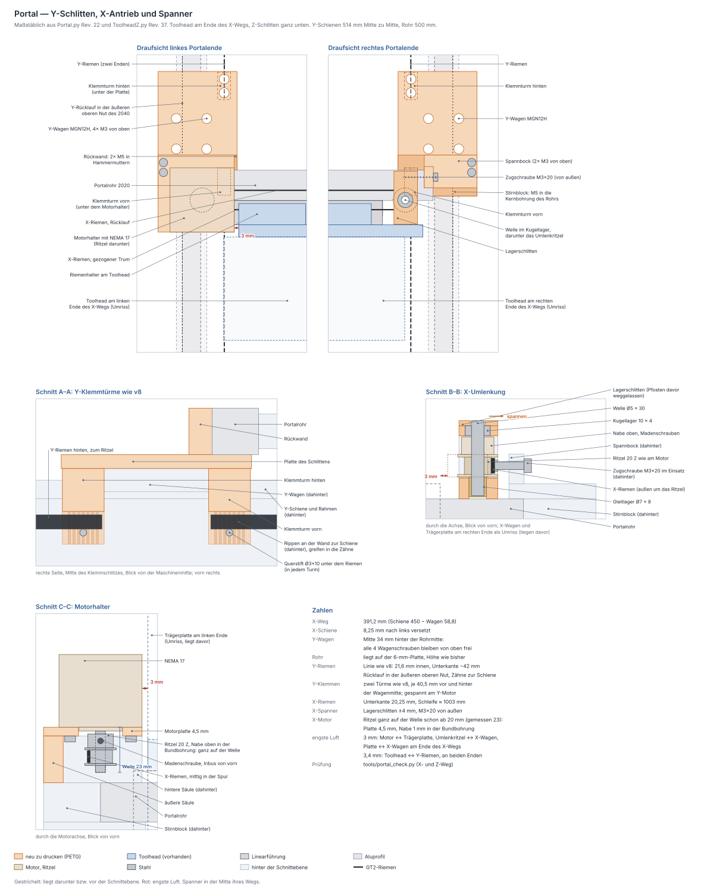

# Portal — Y-Schlitten, Y-Klemmtürme, X- und Y-Antrieb

Erzeugt von `fusion/Portal/Portal.py` (Baugruppe, Rev. 21, fünfundzwanzig
gedruckte Teile).
Geprüft mit `python3 tools/portal_check.py` — zusammen mit dem Toolhead aus
`fusion/ToolheadZ/ToolheadZ.py`. Zeichnungen:
[portal-y-schlitten.svg](portal-y-schlitten.svg) (Portal),
[y-motorhalter.svg](y-motorhalter.svg) (Y-Motorhalter vorn),
[energiekette.svg](energiekette.svg) (X-Energiekette und Kabelweg) und
[energiekette-y.svg](energiekette-y.svg) (Y-Energiekette).

## Was hier zusammenkommt

Die beiden Y-Schlitten sind die Riemenklemmenschlitten für die **MGN12H-Wagen
(20 × 20)**. Sie tragen das **2020-V-Slot-Portalrohr (500 mm)**, ohne seine
Vorderseite zu berühren — dort sitzt die **MGN15-Schiene (450 mm)** der
X-Achse. Links steht der X-Motor, rechts die Umlenkung mit Spanner. Den
Y-Riemen halten zwei gleiche Klemmtürme wie bei v8 unter jeder Platte.
Angetrieben wird er vorn an jeder Ecke von einem NEMA 17, das Ritzel sitzt
direkt auf der Motorwelle; gespannt wird am Motor (Langlöcher). Dazu
kommen seit Rev. 15 die Halter und Fahnen der Endschalter X und Y
([endschalter.md](endschalter.md)), seit Rev. 19 die Wanne der
gedruckten X-Energiekette mit ihren Stützen und seit Rev. 21 die
Y-Energiekette mit Kettenhalter, Wanne und Trägern sowie der Kabelflügel am
Festpunkt der X-Kette ([energiekette.md](energiekette.md)).

| Pos | Teil | Stück | Funktion |
|---|---|---|---|
| 1 | **Schlitten** | 2 (gespiegelt) | Platte auf dem Y-Wagen. Das Rohr liegt oben auf, eine **Rückwand** hält es hinten, ein **Stirnblock** am Rohrende |
| 2 | **Klemmturm** | 4 (2 je Seite, gespiegelt) | vorn und hinten gleich, wie die Türme aus v8: Schlitz mit Rippen, Querstift unter dem Riemen, je ein Riemenende |
| 3 | **Motorhalter** | 1 | X-Motor (NEMA 17) stehend über dem linken Rohrende, Welle nach unten; dünne Motorplatte, damit die 20-mm-Welle das ganze Ritzel trägt |
| 4 | **Spannbock** | 1 | rechts fest auf dem Stirnblock (2 × M3): Anschlag für die Zugschraube |
| 5 | **Lagerschlitten** | 1 | Rahmen um das Umlenkritzel: oben das Kugellager, unten das Gleitlager der Welle; gleitet auf dem Rohr (Feder in der oberen Nut), die Zugschraube zieht ihn nach außen. Seit Rev. 18, ersetzt Umlenkhalter und Spannklotz |
| 6 | **Y-Motorhalter** | 2 (dasselbe Teil) | vorn an jeder 2040: U-Bügel mit Schenkeln an beiden Seitenflächen (4 × M5 in den unteren Nuten), NEMA 17 hängend, Ritzel mittig zur 2040 direkt auf der Welle. Seit Rev. 16 in diesem Skript (vorher `YMotorhalter.py`), Einzelheiten in [y-motorhalter.md](y-motorhalter.md) |
| 7 | **Endschalter** | 5 | Halter_Y und Fahne_Y, Halter_X, Klammer_X und Fahne_X für die Gabellichtschranken; Fahnen und Klammer **schwarz**. Lage, Montage und Einstellen: [endschalter.md](endschalter.md) (bis Rev. 14 im eigenen Skript `Endschalter.py`) |
| 8 | **Kettenwanne** | 1 | Rinne über dem Portalrohr direkt hinter der Trägerplatte, führt den Untertrum der X-Energiekette und trägt ihren Festpunkt. Seit Rev. 19 |
| 9 | **Wannenstütze** | 3 | hinten am Rohr (M5 in der hinteren Nut), Arm über X-Riemen und Riemenhalter unter die Wanne; die am Festpunkt ist breiter und trägt seit Rev. 21 den Kabelflügel (Kabelbinder für die Litzen aus der oberen Nut). Seit Rev. 19 |
| 10 | **Kettenhalter Y** | 1 | auf der Platte des linken Schlittens hinter dem Stirnblock (2 × M3 von unten), trägt das bewegte Ende der Y-Energiekette. Seit Rev. 21 |
| 11 | **Kettenwanne Y** | 1 | Rinne außen am linken 2040 zwischen den 2060, führt den Untertrum der Y-Kette und trägt ihren Festpunkt. Seit Rev. 21 |
| 12 | **Träger Y** | 3 | an der unteren Seitennut außen am linken 2040 (je 1 × M5), tragen die Wanne Y; der am Festpunkt ist breiter. Seit Rev. 21 |
| — | **Riemenhalter** | 1 | am Toolhead (ToolheadZ.py Rev. 33), klemmt beide Enden des X-Riemens |
| — | **Kettenhalter** | 1 | am Toolhead (ToolheadZ.py Rev. 35), trägt das bewegte Ende der X-Energiekette |

Warum so viele Teile: Jedes ist nur so **ohne Stützmaterial** druckbar. Die
Klemmtürme hängen unter der Platte, die Rohrhalterung steht auf ihr — an
einem Stück wäre eine der beiden Seiten ein Überhang.

## Referenzteile im Modell (nicht drucken)

Damit das Modell zeigt, wie alles zusammenhängt, baut das Skript die
Kaufteile und Riemen mit, in der Komponente **`Referenz_nicht_drucken`**.
Sie sind nur zur Ansicht da: nicht drucken und beim Export weglassen. Eine
Glühbirne an der Komponente blendet alles aus, im Validierungsbericht stehen
sie mit „[Referenz, nicht drucken]“.

| Gruppe | Inhalt |
|---|---|
| `Ref_Profile` | Portalrohr 2020 (500 mm), beide 2040 hochkant (600 mm) und die zwei 2060 quer darunter (600 mm, 435 mm Mitte zu Mitte, das vordere 35 mm hinter der Stirnseite), V-Slot vereinfacht: Nutöffnung 6,2, dahinter eine Kammer, Kernbohrung Ø4,2 |
| `Ref_Fuehrungen` | Y-Schienen MGN12 (500 mm) mit MGN12H, X-Schiene MGN15 mit MGN15H |
| `Ref_Riemen` | X-Riemen als Schleife um Ritzel und Umlenkritzel, beide Enden im Riemenhalter; je Seite der offene Y-Riemen von Klemme zu Klemme: schräg um das mittige Ritzel des Y-Motors, als Rücklauf gerade durch die äußere obere Nut des 2040, um das hintere Ritzel und schräg zurück |
| `Ref_Antrieb` | NEMA 17 für X und beide Y mit Welle und Ritzel, die hinteren Y-Ritzel, das X-Umlenkritzel mit Welle, Kugellager und Gleitlager; vom Toolhead der Riemenhalter, der Kettenhalter und die Trägerplatte vereinfacht, mit der linken Säulenrippe (dort klemmt die Fahne X) |
| `Ref_Kette` | die X-Energiekette vereinfacht als U aus Untertrum, Bogen und Obertrum, mit dem Toolhead in der Mitte des X-Wegs (das bewegte Ende steht dann über dem Festpunkt); seit Rev. 21 ebenso die Y-Energiekette mit dem Portal in der Mitte |
| `Ref_Endschalter` | die beiden Lichtschranken LM393 (Platine und Gabel): Y fest am rechten 2040 hinter dem hinteren 2060, X vor dem linken Ende der 2020 |

Was dabei angenommen ist:

* **2040** (600 mm) und **Y-Schienen** (500 mm) liegen mittig zum Y-Wagen,
  das Portal steht also in der Mitte seines Wegs. Mittig ist angenommen
  `[?]`. Das vordere **2060** sitzt 35 mm hinter der Stirnseite der 2040
  `[v]`, das hintere 435 mm Mitte zu Mitte dahinter `[v]`: Die 2040 stehen
  hinten 110 mm über (gemessen 2026-09-27, Rev. 14; bis Rev. 13 400 mm
  `[?]`).
* Der **Toolhead** steht in der Mitte des X-Wegs; von ihm sind nur X-Wagen,
  Riemenhalter, Kettenhalter und die Trägerplatte (vereinfacht) drin. Lagerschlitten und
  Umlenkritzel stehen in der Mitte des Spannwegs. Die Fahnen der Endschalter stehen
  deshalb nicht in ihrer Gabel; den Schaltpunkt zeigt
  [endschalter.svg](endschalter.svg).
* Der **Y-Rücklauf** liegt mittig in der oberen Nut (Z −42 bis −36), auf
  derselben Höhe wie in der Klemme. Die **Y-Motoren** stehen in der Mitte
  ihres Spannwegs.
* Hinten sitzt ein **Ritzel auf einer Edelstahlwelle** (Kugellager und
  Gleitlager) `[v]`. Seine Achse ist 11 mm hinter der Stirnseite
  angenommen, wie vorn die alte Eckwelle `[?]`; Welle und Lager sind nicht
  gezeichnet. Von dieser Lage hängt nur die Riemenlänge ab.
* Die Ritzel sind am Fuß der Verzahnung gezeichnet, damit der Riemen
  sie nicht durchdringt. Die Massen der Referenzteile stimmen nur grob.

### Y-Weg, die 2060 und die Y-Motorhalter

Mit Z unten hängt die Schlittenplatte bis Z −125,3 und die Laserlinse bis
Z −115,8; die 2060 beginnen oben bei Z −69. Über ein 2060 kommt der Toolhead
deshalb nur hochgefahren, und das vordere 2060 (auf der Seite des Lasers)
begrenzt den Y-Weg, nicht die Schiene. Hinten ist es seit Rev. 14 umgekehrt:
Das hintere 2060 liegt weiter hinten, als der Wagen kommt, dort begrenzt das
Schienenende. `portal_check.py` rechnet das in Abschnitt 14 nach, mit der
Lage wie im Modell:

| | |
|---|---|
| Y-Wagen ab Schienenmitte bis Schienenende | ± 227,3 mm |
| nach vorn (Laserseite), Z unten, bis 3 mm vor das 2060 | **106 mm** |
| nach hinten (Portalseite), Z unten | **227,3 mm** — die Schiene begrenzt; bis 3 mm vor das 2060 wären es 250 mm, der Toolhead bleibt 26 mm davor (bis Rev. 13: 215 mm, das 2060 begrenzte) |
| Strahl erreicht mit Z unten, ab Rahmenmitte | −108,8 bis +224,5 mm (333 mm) |
| über die 2060 hinweg | ab Wagenmitte zc = +19,3, Linse dann 73,5 mm über dem Bett |

Vor dem vorderen 2060 stehen die Y-Motorhalter, und sie sind höher als das
2060. Am vorderen Schienenende fährt der Toolhead erst ab zc = +37 über sie
hinweg (Linse 91 mm über dem Bett); mit Z ganz oben, also nach dem
Referenzieren, bleiben 5,0 mm. Am rechten X-Ende läuft er dort 17,7 mm
neben dem Ritzelbord vorbei. Seit Rev. 16 rechnet `portal_check.py` mit dem
Y-Motorhalter, den das Skript selbst baut; bis Rev. 15 stand hier noch der
alte, höhere Halter.

Am **vorderen Schienenende**, wo die Y-Wagen bündig mit der Schiene stehen,
endet der vordere Klemmturm 2,2 mm hinter dem inneren Schenkel des
Y-Motorhalters, 2,9 mm über ihm und 1 mm weiter innen. Höhe und Seite
ändern sich über den Y-Weg nicht — berühren kann er ihn nie, die Kanten
bleiben 3,8 mm auseinander. `portal_check.py` misst aber achsweise und sieht
nur den größten Einzelabstand, 2,9 mm; dort verlangt es deshalb 2 statt
3 mm. So weit kommt das Portal ohnehin nur von Hand: Im Betrieb endet der
Y-Weg vorn bei +106 mm (siehe unten), und dort bleiben 99 mm.

Den Y-Weg in der Firmware also vorn auf die Grenze des 2060 setzen (die
Arbeitsfläche endet ohnehin dort), dann erreicht der Toolhead die Halter nie;
hinten auf das Schienenende, mit dem Y-Endschalter 3 mm davor — die Wagen
dürfen nicht über das Ende hinaus
([elektronik.md](elektronik.md#endschalter)). Hinter dem hinteren 2060
bleibt unter den 2040 ein Fach frei, in das nichts hineinfährt — dort ist
Platz für die Elektronik ([elektronik.md](elektronik.md)).
Liegen die Schienen anders als angenommen (mittig zu den 2040 `[?]`), ändern
sich die Zahlen — `y_schiene_laenge` und `quer_abstand` anpassen und die
Prüfung neu laufen lassen.

## Koordinaten

Wie in `ToolheadZ.py`: **Y nach vorn** (vom Portal weg), **Z senkrecht**,
Y = 0 an der Stirnfläche des X-Wagens, Z = 0 in der Mitte des Portalrohrs.
**Abweichend liegt X = 0 in der Mitte des Rohrs**, nicht am X-Wagen — der
fährt ja. Was für beide Seiten gleich ist, steht als **u**: Abstand von der
Mitte der Y-Schiene nach innen (zur Maschinenmitte). X = s · (257 − u) mit
s = −1 links, +1 rechts. Im Fusion-Modell sind Y und Z getauscht (Modell-Z =
Maschinen-Y), wie beim Toolhead.

## Portal und Schienenabstand

| | |
|---|---|
| Y-Schienen | **514 mm** Mitte zu Mitte (X = ±257) |
| Rohr | 500 mm, endet 7 mm vor jeder Schienenmitte |
| X-Schiene | 450 mm, **8,25 mm nach links versetzt**: X −233,25 bis +216,75 |
| X-Wagenmitte | −203,85 bis +187,35 → **X-Weg 391,2 mm** |
| Portalhöhe | Rohr liegt direkt auf der 6-mm-Platte — wie bisher, 130 mm zum Bett |

**391,2 mm sind Schiene minus Wagen** (450 − 58,8): Mehr geht mit dieser
Schiene nicht, und nichts am Portal nimmt davon etwas weg. Motor und Umlenkung
sitzen über den Rohrenden, außerhalb des Wegs.

**Warum die Schiene versetzt ist:** Der Toolhead ragt rechts 44 mm
(Mutternwinkel) neben die Wagenmitte, links nur 27,5 mm (Fahnenlasche). Um
8,25 mm nach links verschoben, steht er an beiden Enden des X-Wegs gleich weit
vom Y-Riemen weg: **3,4 mm**.

**Schienenabstand = Rohrlänge + 2 × 7 mm.** Beim Aufbau zuerst das Portal mit
beiden Schlitten verschrauben, dann die Y-Schienen parallel dazu ausrichten —
der Abstand ergibt sich dann von selbst. Ist das Rohr kürzer, ziehen die
Kernschrauben die Stirnblöcke nach innen, und die Schienen rücken mit.

## Y-Schlitten

Der **Wagen sitzt hinter dem Rohr** (Mitte bei Y = −60, 34 mm hinter der
Rohrmitte). Nur so bleiben alle vier Wagenschrauben von oben frei — über der
Wagenmitte läge sonst das Rohr. Die Köpfe (M3×6) sitzen versenkt in der
6-mm-Platte.

Das Rohr liegt auf der Platte (23 × 17 mm Auflage) und wird an zwei Seiten
verschraubt:

* **Rückwand** hinter dem Rohr: 2 × M5×12 in Hammermuttern der hinteren Nut,
  Köpfe versenkt.
* **Stirnblock** am Rohrende: 1 × M5×25 in die Kernbohrung (Ø4,2). Dort
  **M5 schneiden, mindestens 15 mm tief**; die Schraube greift 13 mm.

Die **Vorderseite bleibt frei** — die Platte endet 3 mm hinter der
Rohrvorderseite, damit der X-Wagen am Ende seines Wegs daran vorbeifährt.

**Der Arbeitsbereich in Y liegt damit 34 mm weiter vorn**, als säße der Wagen
unter der Rohrmitte. Die Länge des Y-Wegs ändert sich nicht, nur seine Lage
zum Rahmen.

## Y-Riemen und Klemmtürme

Die Riemenlinie ist die von `RiemenklemmeSchlitten` v8: **21,6 mm innen**
neben der Schienenmitte, hochkant, **Zähne zur Schiene**. Die **Höhe** gibt
die obere Nut des 2040 vor, denn der Riemen läuft nur in ihr: Ihre Öffnung
beginnt **6 mm unter der Oberkante** des Profils, ihre Mitte liegt 10 mm
darunter. Der Riemen liegt mittig darin, 7 bis 13 mm unter der Profilkante,
also 20 bis 26 mm unter der Wagenoberseite (Z −42 bis −36). Rücklauf und
Riemenenden liegen damit auf derselben Höhe.

Der Schlitz der Klemmtürme reicht bis 0,5 mm über die Oberkante der Nut —
höher kann der Riemen nicht laufen. So war es auch bei v8: Dort endete der
Schlitz 19,0 mm unter der Wagenoberseite, genau an der Oberkante der Nut. Bis
Rev. 9 endete er 3,4 mm tiefer, deshalb passte der Riemen nicht hinein. Ein
Turm ist jetzt 32,6 mm lang.

**Riemenführung:** Vorn läuft der Riemen um das Ritzel des Y-Motors (siehe
[Y-Antrieb vorn](#y-antrieb-vorn)), hinten um das Ritzel auf der
Edelstahlwelle. Der Riemen ist offen: **je Seite ≈ 1276 mm** von Klemme zu
Klemme (Portal in der Mitte, Motor in der Mitte des Spannwegs, hinteres
Ritzel 11 mm hinter der Stirnseite angenommen). Das hintere Ritzel muss wie
vorn mit der Spur mittig auf dem Riemen stehen, 7 bis 13 mm unter der
Oberkante des 2040. Der **Rücklauf läuft gerade in der äußeren oberen Nut
des 2040**, die Riemenmitte 6,05 mm neben der Schienenmitte. Auf dem
Teilkreis (12,73 mm) liegen die Wirklinien, und die liegen 0,31 mm neben der
Riemenmitte zum Rücken hin. Sein Rücken steckt 3,3 mm in der Nut, 1,5 mm
hinter der Lippe, die Zahnspitzen bleiben 1,4 mm vor dem Nutgrund. Die Zähne
zeigen zur Innenseite der Schleife, also zur Schiene. Deshalb stehen die
Rippen beider Klemmen auf der Schienenseite: Nur so greifen sie in die Zähne
und nicht auf den glatten Rücken. `portal_check.py` prüft genau das. Der
Rücklauf liegt im Profil und kommt dem Toolhead nie nahe.

**Mit dem mittigen Ritzel (2026-09-27):** Der Riemen läuft in der rechten
oberen Nut hin und in der linken zurück, das Ritzel sitzt mittig zur 2040 —
so baut es der [Y-Motorhalter](y-motorhalter.md). Die Klemmen bleiben, wo
Y-Wagen und Klemmtürme dieses Skripts sie haben (Angabe: so ist es gebaut):
Wirklinie 21,9 mm innen neben der Schienenmitte, 11,9 mm vor der inneren
Seitenfläche. Dazwischen laufen die **Wagen-Trume schräg** von der Klemme
zum Ritzel, dessen Wirklinie 6,4 mm neben der Profilmitte in der inneren Nut
liegt; der **Rücklauf läuft gerade** in der äußeren Nut. Nachgerechnet
(Ritzel vorn in der Mitte des Spannwegs; hinten ebenfalls mittig zur 2040
`[v]`, 11 mm hinter der Stirnseite angenommen). „In der Nutöffnung“ heißt:
Dort liegt ein Teil des Riemens zwischen Lippe und Seitenfläche. Bis
Rev. 15 stand hier, wo die Wirklinie allein durch die Lippe läuft; die
Bereiche waren kürzer.

| Portal ab Mitte | vorderer Trum | hinterer Trum |
|---|---|---|
| +227,3 (vorderes Schienenende) | 66 mm lang, 13,8°, läuft außen an der Nut vorbei direkt ans Ritzel (am Profilende 2,9 mm neben der Seitenfläche) | 498 mm, 1,8°, in der Nutöffnung 138 bis 36 mm vom hinteren Ende |
| +106 (vordere Grenze, Z unten) | 185 mm, 4,8°, in der Nutöffnung auf den letzten 25 mm vor dem vorderen Ende | 377 mm, 2,4°, 101 bis 24 mm vom hinteren Ende |
| 0 | 290 mm, 3,1°, auf den letzten 56 mm vor dem vorderen Ende | 271 mm, 3,3°, 70 bis 14 mm vom hinteren Ende |
| −227,3 (hinteres Schienenende) | 517 mm, 1,7°, 124 bis 18 mm vom vorderen Ende | 48 mm, 19,3°, nur auf den letzten 1,3 mm vor dem hinteren Ende |

Wo der Trum durch die Nutöffnung in den Kanal läuft, bleiben dem 6 mm
breiten Riemen in der 6,2 mm weiten Engstelle **0,1 mm je Seite** — Ritzel
und Klemmen stehen beide auf Nutmitte, er läuft also frei, solange die
Höhen stimmen. Schleift er an den Nutkanten (Geräusch, Abrieb an den
Riemenkanten), müssen die Klemmen näher an die Nut. Seit Rev. 16 rechnen
`Ref_Riemen` und `portal_check.py` (Abschnitt 15, `y_riemen_weg()`) mit den
mittigen Ritzeln; die Tabelle kommt von dort. Für den Toolhead nimmt die
Prüfung den Wagen-Trum weiter bei 21,9 mm an, der echte liegt weiter außen:
die sichere Seite.

**Die Riemenlänge wandert mit.** Weil die Wagen-Trume schräg laufen, ist
der Riemenweg in der Mitte des Y-Wegs am kürzesten (1276,2 mm) und wird zu
den Enden hin länger: am vorderen Schienenende um 1,3 mm, am hinteren um
2,0 mm. Ein in der Mitte gespannter Riemen wird dort also etwas gedehnt,
die Spannung steigt zu den Enden hin. Liefen die Klemmen auf der Nutlinie
(6,4 statt 21,9 mm neben der Schienenmitte), bliebe der Weg gleich lang.

**Zwei gleiche Klemmtürme je Schlitten wie bei v8**, einer je
Riemenende, an derselben Stelle wie bei v8: 22,5 bis 40,5 mm vor und hinter
der Wagenmitte. Schnitt A–A der Zeichnung zeigt sie von innen.

Jeder Turm ist 18 mm lang, der Schlitz ist unten und an beiden Enden
offen, 7 Rippen stehen an der Wand zur Schiene. Den Riemen von unten in
den Schlitz drücken, dann einen **Stift Ø3 × 10 (oder eine M3×10) quer von
innen** unter ihm durchschieben — er sichert den Riemen von unten. Jeder
Turm hängt an zwei M3×8 von oben durch die Platte. Die des vorderen liegen
unter dem Rohr: Er kommt **vor dem Rohr** an die Platte.

**Spannen** am Y-Motor: Schrauben lösen, Motor nach vorn ziehen, festziehen
(Langlöcher ±4 mm im [Y-Motorhalter](y-motorhalter.md#spannen)) — die Türme sind
starr.

**Klemmschlitz:** 1,6 mm vom Rippengrund bis zur glatten Wand, der Riemen ist
1,38 mm dick. Die Rippen sind 0,8 mm hoch (Teilung 2 mm) und greifen auch dann **0,58 mm**
zwischen die Zähne, wenn der Riemen ganz an der glatten Wand liegt. In v8
waren es im schlechtesten Fall 0,08 mm. Lässt sich der Riemen nicht
eindrücken, `klemm_schlitz` um 0,1 mm erhöhen; rutscht er, verringern. Das gilt
genauso für den Riemenhalter am Toolhead — beide lesen denselben Wert.

**Beide Seiten abgleichen:** Mit zwei Y-Motoren dürfen die Seiten nicht
gegeneinander ziehen. An einer Ecke die Madenschrauben des Ritzels lösen,
das Portal von Hand durchschieben, bis es frei läuft, und festziehen (siehe
[hardware-notizen.md, Elektronik](hardware-notizen.md#elektronik)). Grob geht
es auch in der Klemme, um einen Zahn (2 mm).

## Y-Antrieb vorn

An jeder vorderen Ecke ein NEMA 17 am **Y-Motorhalter**, das Ritzel des
Y-Riemens **direkt auf der Motorwelle**, mittig zur 2040. Der Halter ist ein
U-Bügel: Schenkel an beiden Seitenflächen der 2040 mit je 2 × M5 in
Nutensteinen der **unteren** Nut (in der oberen läuft der Riemen), ein Joch
an der Stirnseite, die Platte davor. Der Motor hängt unter der Platte,
Welle nach oben; gespannt wird, indem er in Langlöchern vom Profilende weg
rückt. Links und rechts ist es dasselbe Teil. Aufbau, Riemen in der Nut,
Montage und Druck: [y-motorhalter.md](y-motorhalter.md).

Seit Rev. 16 baut `Portal.py` diesen Halter selbst (Komponenten
`Y-Motorhalter_links` und `_rechts`), bis dahin stand er im eigenen Skript
`YMotorhalter.py` (Rev. 5). Maße und Lage sind dieselben; seine Werte heißen
jetzt `ymh_…` (Tabelle in [y-motorhalter.md](y-motorhalter.md#parametrik)).
Den alten Halter dieses Skripts (Achse 15,55 mm neben der Profilmitte,
Wange mit M5 in der oberen Nut, 2026-09-26 für überholt erklärt) gibt es
nicht mehr, ebenso seine Zeichnung. Warum zwei Motoren und wie sie
angeschlossen werden: [hardware-notizen.md, Elektronik](hardware-notizen.md#elektronik).

## X-Antrieb

GT2, 6 mm, hochkant. Unterkante **Z = +20,25**: 4,25 mm über der Flanke des
X-Wagens, 10,25 mm über dem Rohr. Beide Enden laufen auf der Wirklinie
Y = −10 in den Riemenhalter, der Rücklauf liegt bei Y = −22,73 und damit
7,7 mm hinter dem Riemenhalter.

**Motor links**, Achse X = −250, Y = −16,37: stehend, Welle nach unten, Ritzel
**mit der Nabe nach oben** auf Riemenhöhe. Die Welle ist **20 mm** lang (ab
Flanschfläche) und muss das ganze Ritzel tragen. Deshalb steht der Motor so
tief wie möglich, auf einer nur 4,5 mm dicken Motorplatte, und die Nabe
taucht in deren Bundbohrung (Rev. 5). Bis Rev. 4 lag eine 8-mm-Platte
zwischen Motor und Ritzel: auf einer 20-mm-Welle hätte das Ritzel nur
11,5 mm weit gesteckt, der Riemen wäre fast ganz unter dem Wellenende
gelaufen.

| Z | was |
|---|---|
| +38,25 | Flanschfläche = Oberseite der Motorplatte |
| +36,25 | Unterkante Zentrierbund (2 mm hoch, steckt in der Bohrung Ø22,4) |
| +34,75 | Oberkante Ritzel (Nabe), 1,5 mm unter dem Bund |
| +33,75 | Unterseite der Motorplatte: die Nabe steht 1 mm in der Bohrung |
| +31,25 | Madenschrauben (Mitte der Nabe), 2,5 mm unter der Platte |
| +26,25 … +20,25 | X-Riemen, mittig in der 7-mm-Spur |
| +18,75 | Unterkante Ritzel |
| +18,25 | Wellenende bei 20 mm Welle, 0,5 mm unter dem Ritzel (deine 23 mm: +15,25) |

Das Ritzel (Bord Ø16) dreht mit 3,2 mm Luft in der Bundbohrung und passt
auch mit dem Motor von oben hindurch. Die Madenschrauben erreicht der Inbus
von vorn, eine davon gehört auf die Abflachung der Welle. Eine längere Welle
stört nicht: bis 27 mm endet sie noch über dem Rohr — deine 23 mm enden
5,2 mm darüber. Vier M3×8 von unten
(3,5 mm im Flanschgewinde); alle vier sind erreichbar, der Inbus hat bis zum
Rohr 20,75 mm. Der Motorhalter sitzt mit 2 × M3×35 von oben in den
Gewindeeinsätzen des Stirnblocks. Der Motor steht 3 mm neben der
Trägerplatte, wenn der Toolhead links anschlägt.

**Umlenkung rechts**, Achse X = +231,75: ein **normales Ritzel 20 Z** wie am
Motor, mit den Madenschrauben fest auf einer **Welle Ø5 × 30**, die Nabe
oben. Die Welle läuft oben in einem **Rillenkugellager 10 × 4**, unten in
einem **Gleitlager Ø7 × 8**. Beide sitzen im **Lagerschlitten**, einem Rahmen
um das Ritzel:

* **unterer Arm** mit dem Gleitlager. Es steht 0,5 mm über den Arm, das
  Ritzel liegt mit dem unteren Bord darauf. Unter dem Ritzel sind bis zum
  Rohr nur 8,75 mm, genau Platz für das 8 mm lange Gleitlager.
* **oberer Arm** mit dem Kugellager, von unten eingepresst, darüber eine
  2 mm dicke Decke mit dem Durchgang für die Welle. Über der Nabe bleiben
  0,5 mm bis zum Kugellager.
* **Rücken** hinter dem Ritzel mit einem Gewindeeinsatz M3 für die
  Zugschraube, **Pfosten** davor. Zum X-Wagen hin und nach außen ist der
  Rahmen offen, dort läuft der Riemen hinein und um das Ritzel.

Der Schlitten liegt auf dem Rohr, eine **Feder** unter ihm läuft in der
oberen Nut und führt ihn. Am rechten Ende des X-Wegs bleibt er ganz innen
3,5 mm neben dem X-Wagen, das Ritzel 3,0 mm. Dessen unterer Bord steht nur
1,5 mm unter dem Riemen und 2,75 mm über dem Wagen. Deshalb liegt die Achse
1,1 mm weiter außen als bis Rev. 16.

**Seit Rev. 18.** Rev. 17 hatte ein Ritzel mit eingebauten Kugellagern auf
einer festen M5-Achse vorgesehen, Rev. 16 die 8,5 mm breite Umlenkrolle.
Umlenkhalter und Spannklotz beider Stände gibt es nicht mehr.

Warum ein Zahnrad und keine glatte Rolle: In der geschlossenen Schleife läuft
die **Zahnseite** auf der Umlenkung. Eine glatte Rolle gehört auf den
Riemenrücken; auf den Zähnen läuft sie laut und verschleißt sie. Das
Umlenkritzel hat außerdem denselben Teilkreis wie das Ritzel am Motor, beide
Trume laufen parallel.

**Spannen:** Der **Spannbock** sitzt fest mit 2 × M3×12 auf dem Stirnblock.
Eine M3×20 geht von außen durch seine Wand in den Einsatz im Rücken des
Schlittens, auf Riemenhöhe, damit der Schlitten nicht kippt. Eindrehen zieht
den Schlitten nach außen, die Schraube hält ihn dann gegen den Riemenzug.
Dass sie hinter der Achse zieht, fängt die Feder in der Nut ab. Der Schlitten
hat ±4 mm Weg, das sind 16 mm Riemenlänge. Ganz entspannt greift die
Schraube 5,5 mm in den Einsatz, ganz gespannt bleibt der Schlitten 0,5 mm vor
dem Spannbock.

**Riemenlänge:** Schleife ≈ **1003 mm**, beide Enden im Riemenhalter. Mit dem
Schlitten in Mittelstellung ablängen. Ein schon abgelängter Riemen
(≈ 1001 mm für Rev. 16) passt weiter: Das Ritzel steht dann 1,1 mm weiter
innen, der Spannweg reicht.

## Riemenhalter am Toolhead (ToolheadZ.py Rev. 33)

Der Riemenhalter steht hinten an der Trägerplatte auf der Flanke des X-Wagens
und klemmt **beide Enden** des X-Riemens. Schlitz und Rippen sind dieselben wie
am Y-Riemen: Riemen von oben in den Schlitz drücken (Zähne nach hinten), dann
einen Stift Ø3 (oder M3×20) seitlich über dem Riemen durchschieben.

Befestigung: **2 × M3×10 von vorn** durch die Trägerplatte, Kopf in einer
Senkung Ø6,5 × 3,2, in Gewindeeinsätze im Halter (5,2 mm Gewinde). Mit dem
Z-Schlitten ganz unten ist der Weg für den Inbus frei (`toolhead_check.py`
prüft das).

**Die gedruckte Trägerplatte hat die zwei Löcher noch nicht.** Dafür gibt es
die `Bohrlehre_Riemenhalter` (6 mm dick, im ToolheadZ-Modell ausgeblendet):

1. Z-Schlitten ganz nach unten fahren.
2. Lehre hinten an die Trägerplatte legen: die Lippen fassen die Kanten der
   Säule, die Unterkante steht auf der Flanke des X-Wagens.
3. Ø3,4 von hinten durchbohren. Die Lehre führt den Bohrer; nimm einen
   langen Bohrer, damit das Bohrfutter hinter dem Portalrohr bleibt.
4. Vorn Ø6,5 × 3,2 mm ansenken.

## Energieketten (X seit Rev. 19, Y seit Rev. 21)

Beide Ketten sind gedruckt (dein Modell „Energiekette“, Teilung 16,
außen 18 × 14, R 32 seit Rev. 20). Maße, Freigänge, Montage und Druck
stehen in [energiekette.md](energiekette.md).

**X:** direkt hinter der Trägerplatte. Der Festpunkt sitzt in der Mitte
des X-Wegs, die Schleife zeigt nach rechts. Der Untertrum läuft in der
**Kettenwanne** über dem Rohr (Boden Z +44,5), der Obertrum 64 mm höher auf
dem Kettenhalter des Toolheads. Drei **Wannenstützen** tragen die Wanne.
Sie sitzen mit je einer M5 in der hinteren Nut, ihr Block steht auf dem
Rohr hinter dem Rücklauf, der Arm reicht über Riemen und Riemenhalter.
19 Glieder reichen, am rechten Ende läuft der Bogen 3,25 mm über den
Lagerschlitten. Die Litzen kommen in der **oberen Nut** des Rohrs vom
linken Schlitten und laufen am **Kabelflügel** der Stütze am Festpunkt
hoch, zwei Kabelbinder halten sie.

**Y:** außen am linken 2040, 3 mm neben der Schlittenplatte, die Schleife
zeigt nach vorn. Das bewegte Ende liegt auf dem **Kettenhalter Y** hinter
dem Stirnblock des linken Schlittens, der Obertrum direkt darauf. Der
Untertrum läuft 2 R tiefer in der **Wanne Y** (Boden Z −66,3), die auf
drei **Trägern** an der unteren Seitennut hängt. Der Festpunkt sitzt hinten
in der Wanne. 18 Glieder reichen für den ganzen Y-Weg und 35,6 mm Reserve
nach vorn.

## Engste Stellen

`portal_check.py` fährt den Toolhead über 81 X- × 11 Z-Stellungen gegen alle
Portalteile und beide Riemen. Keine Stelle liegt unter 3 mm:

| Luft | wo |
|---|---|
| 3,0 mm | Motor ↔ Trägerplatte, am linken Ende des X-Wegs |
| 3,0 mm | Umlenkritzel ↔ X-Wagen, am rechten Ende, das Ritzel ganz innen (daneben; sein Bord steht 2,75 mm über dem Wagen) |
| 3,0 mm | Schlittenplatte ↔ X-Wagen, am linken Ende (Klemmturm 3,5 mm) |
| 3,4 mm | Toolhead ↔ Y-Riemen, an beiden Enden |
| 3,0 mm | Kettenhalter ↔ X-Motor, am linken Ende; Trägerplatte ↔ Kettenwanne |

Die Energieketten prüfen Abschnitt 17 (X) und 18 (Y, über den ganzen
Y-Weg) für sich, auch dort liegt keine Stelle unter 3 mm
([energiekette.md](energiekette.md#freigänge-und-engste-stellen)).
Dazu wird geprüft, dass sich jede Schraube mit mindestens 20 mm Inbus
erreichen lässt. Außerdem geprüft: die Wände um Einsätze, Muttern und
Senkungen, die Schraubenlängen und die Druckbarkeit.

## Montagereihenfolge

1. Einsätze einschmelzen: 2 je Klemmturm, 2 je Stirnblock (alle oben), 1 von
   außen in den Rücken des Lagerschlittens.
2. Beide Klemmtürme unter die Platte, je 2 × M3×8 von oben. Das muss
   **vor dem Rohr** passieren: die Schrauben des vorderen liegen unter dem
   Rohr.
3. Schlitten auf die Y-Wagen, 4 × M3×6 (Kopf in der Senkung).
4. Hammermuttern in die hintere Nut des Rohrs, Kernbohrungen M5 schneiden.
   Portal (Rohr mit X-Schiene und Toolhead) auf die Platten legen: je Seite
   2 × M5×12 hinten, 1 × M5×25 stirnseitig.
5. Motor von oben auf den Motorhalter, 4 × M3×8 von unten. Ritzel von unten
   auf die Welle, Nabe voraus, bis die Welle 0,5 mm unten heraussteht;
   Madenschrauben von vorn. Halter aufs linke Rohrende (2 × M3×35).
6. Lagerschlitten: Kugellager von unten in den oberen Arm, Gleitlager von
   oben in den unteren (steht 0,5 mm über). Ritzel mit der Nabe nach oben
   zwischen die Arme, Welle von oben durch Kugellager, Ritzel und Gleitlager,
   oben bündig. Ritzel auf das Gleitlager setzen, Madenschrauben fest (von
   innen durch die offene Seite). Schlitten aufs rechte Rohrende, Feder in
   die obere Nut. Spannbock auf den Stirnblock (2 × M3×12), Zugschraube
   M3×20 lose.
7. Riemenhalter an den Toolhead (siehe oben).
8. X-Riemen: ein Ende in den Riemenhalter, um Motor und Umlenkritzel, zweites Ende
   einlegen, spannen. Läuft er nicht mittig in der Spur, das Ritzel
   nachstellen.
9. Y-Motorhalter ([Montage](y-motorhalter.md#montage)) — je Seite
   4 Hammermuttern in die unteren Nuten beider
   Seitenflächen, Halter an die Stirnseite schieben, 4 × M5×12. Motor von
   unten, 4 × M3×10 von oben, noch lose. Ritzel mit der Nabe nach unten,
   Oberkante bündig mit dem Wellenende.
10. Y-Riemen: ein Ende in die vordere Klemme, um das Ritzel, durch die Nut
   nach hinten, um das hintere Ritzel, in die hintere Klemme (≈ 1276 mm je
   Seite). Motor nach
   vorn ziehen und festschrauben, dann beide Seiten abgleichen (oben).
11. Endschalter: Halter, Lichtschranken und Fahnen nach
   [endschalter.md](endschalter.md#montage), die Schaltpunkte vor der
   ersten Referenzfahrt von Hand prüfen.
12. Energiekette X: Stützen mit Hammermuttern in die hintere Nut, Wanne
   auflegen und an den Laschen verschrauben, Endstück 180 als Festpunkt,
   Anfangsstück auf den Kettenhalter, Litzen einziehen, am Kabelflügel mit
   zwei Kabelbindern halten ([energiekette.md](energiekette.md#montage)).
13. Energiekette Y: Kettenhalter Y von unten an den linken Schlitten,
   Träger mit Hammermuttern in die untere Seitennut, dann die Wanne Y,
   Endstück 180 hinten als Festpunkt, Anfangsstück auf den Kettenhalter Y
   ([energiekette.md](energiekette.md#montage-y)).

## Druck (PETG, Bambu Lab A1)

| Teil | Lage aufs Bett |
|---|---|
| Schlitten | Unterseite, die Wände stehen darauf |
| Klemmturm (4×) | Oberseite (Plattenseite) unten: Schlitz nach oben offen, Rippen senkrecht |
| Motorhalter | Motorplatte (Oberseite) unten |
| Spannbock | Boden |
| Lagerschlitten | auf dem Rücken liegend; die Lagersitze liegen dann waagerecht und sind als Träne gezeichnet, der Pfosten wird eine Brücke über 17 mm |
| Y-Motorhalter (2×, dasselbe Teil) | kopfüber, die Oberseite der Platte aufs Bett ([y-motorhalter.md](y-motorhalter.md#druck-petg-bambu-lab-a1)) |
| Riemenhalter (Toolhead) | Unterseite (Wagenflanke), Schlitz und Rippen stehen senkrecht |
| Kettenwanne | Boden unten, längs (242,5 mm) |
| Wannenstützen (3) | Rückseite der Platte unten: Block und Arm wachsen aus der Platte, der Kabelflügel liegt flach |
| Kettenhalter (Toolhead) | auf der linken Seite liegend |
| Kettenhalter Y | Unterseite (Auflage auf dem Schlitten) unten |
| Kettenwanne Y | Boden unten, längs (238,5 mm) |
| Träger Y (3) | Unterseite des Arms unten, die Wand steht darauf |
| Endschalter (5 Teile) | wie in [endschalter.md](endschalter.md#druck-petg-bambu-lab-a1); Fahne_Y, Klammer_X und Fahne_X **schwarz** |

Keine Stützen. 4 Wandlinien, ≥ 40 % Infill. Rechter Schlitten, die rechten
Klemmtürme sind gespiegelt modelliert — **im Slicer nicht spiegeln**, die
Körper so exportieren, wie sie im Modell liegen. Die Y-Motorhalter sind
symmetrisch, zweimal dasselbe Teil.

Massen (Vollmaterial, PETG 1,27 g/cm³, aus einer Nachbildung der Fusion-API
gerechnet — maßgeblich ist der erste Fusion-Lauf):

| Teil | Volumen | Masse | Bauraum |
|---|---|---|---|
| Schlitten (je) | 41,9 cm³ | ≈ 53 g | 52 × 82 × 26 mm |
| Klemmturm (je, 4×) | 4,5 cm³ | ≈ 6 g | 9 × 18 × 33 mm |
| Motorhalter | 31,5 cm³ | ≈ 40 g | 50 × 51 × 28 mm |
| Spannbock | 5,4 cm³ | ≈ 7 g | 35 × 22 × 18 mm |
| Lagerschlitten | 10,4 cm³ | ≈ 13 g | 16 × 35 × 33 mm |
| Y-Motorhalter (je) | 25,5 cm³ | ≈ 32 g | 52 × 87 × 17 mm |
| Kettenwanne | 26,8 cm³ | ≈ 34 g | 242,5 × 32,6 × 13 mm |
| Wannenstütze Festpunkt mit Kabelflügel | 17,0 cm³ | ≈ 22 g | 42,4 × 32 × 49,5 mm |
| Wannenstütze mitte, rechts (je) | 9,3 cm³ | ≈ 12 g | 16 × 32 × 49,5 mm |
| Kettenhalter Y | 12,7 cm³ | ≈ 16 g | 32,3 × 49,5 × 11 mm |
| Kettenwanne Y | 26,1 cm³ | ≈ 33 g | 30,3 × 238,5 × 13 mm |
| Träger Y Festpunkt | 7,1 cm³ | ≈ 9 g | 36,3 × 26 × 23,3 mm |
| Träger Y mitte, vorn (je) | 6,7 cm³ | ≈ 8,5 g | 36,3 × 24 × 23,3 mm |
| **Portal zusammen** (ohne Endschalter) | 321,8 cm³ | **≈ 409 g** | |
| Riemenhalter (Toolhead) | 8,8 cm³ | ≈ 11 g | 44 × 14 × 16 mm |
| Kettenhalter (Toolhead) | 22,7 cm³ | ≈ 29 g | 44 × 24,8 × 50 mm |

Dazu die ausgeblendeten Bohrlehren aus PLA: `Bohrlehre_YWagen` (4,7 g) prüft
das Lochbild 20 × 20 am Wagen, `Bohrlehre_LM393` Umriss und Lochbild der
Lichtschranke, `Bohrlehre_Kettenhalter_Y` (5 g) führt den Bohrer am schon
gedruckten linken Schlitten. `Bohrlehre_Riemenhalter` (8,4 g) und
`Bohrlehre_Kettenhalter` (25 g), beide im ToolheadZ-Modell, führen den
Bohrer an der Trägerplatte.

## Stückliste

| Menge | Teil | wofür |
|---|---|---|
| 8 | M3×6 Zylinderkopf | Schlitten → Y-Wagen |
| 8 + 8 | M3×8 Zylinderkopf + Messing-Einsatz M3 | Klemmtürme → Platte |
| 4 + 4 | M5×12 Zylinderkopf + Hammermutter M5 (Nut 6) | Rückwand → Rohr |
| 2 | M5×25 Zylinderkopf | Stirnblock → Kernbohrung (M5 schneiden) |
| 4 | Stift Ø3 × 10 oder M3×10 | Querstift im Klemmturm |
| 4 | Messing-Einsatz M3 | Stirnblöcke, für die Halter |
| 4 | M3×8 Zylinderkopf | NEMA 17 → Motorhalter |
| 2 | M3×35 Zylinderkopf | Motorhalter → Stirnblock |
| 2 | M3×12 Zylinderkopf | Spannbock → Stirnblock |
| 1 + 1 | M3×20 Zylinderkopf + Messing-Einsatz M3 | Zugschraube, Einsatz im Rücken des Lagerschlittens |
| 1 | GT2-Ritzel 20 Z, Bohrung 5 | X-Umlenkung, fest auf der Welle, Nabe oben |
| 1 | Welle Ø5 × 30 | X-Umlenkung |
| 1 | Rillenkugellager 10 × 4, Bohrung 5 (z. B. MR105ZZ) | im oberen Arm des Lagerschlittens |
| 1 | Gleitlager Ø7 × 8, Bohrung 5 | im unteren Arm des Lagerschlittens |
| 1 | GT2-Ritzel 20 Z, Bohrung 5 | X-Motor |
| 1 | NEMA 17 | X-Motor |
| 1 | GT2-Riemen 6 mm, ≈ 1003 mm | X-Achse |
| 2 | NEMA 17 | Y-Motoren, je Ecke vorn |
| 2 | GT2-Ritzel 20 Z, Bohrung 5 | auf den Y-Motoren (die oberen Ritzel der alten Eckwellen) |
| 8 + 8 | M3×10 Zylinderkopf + Scheibe DIN 125 | NEMA 17 → Y-Motorhalter, von oben |
| 8 + 8 + 8 | M5×12 Zylinderkopf + Scheibe + Hammermutter M5 (Nut 6) | Y-Motorhalter → untere Nuten beider Seitenflächen, je Seite 4 |
| 2 | GT2-Riemen 6 mm, je ≈ 1276 mm | Y, offen, von Klemme zu Klemme (hinteres Ritzel angenommen) |
| 2 + 2 + 2 | M3×10 + Messing-Einsatz M3 + Stift Ø3 | Riemenhalter am Toolhead |
| 3 + 3 | M5×10 Zylinderkopf + Hammermutter M5 (Nut 6) | Wannenstützen → hintere Nut des Rohrs |
| 2 + 2 | M3×8 Zylinderkopf + Messing-Einsatz M3 | Laschen der Kettenwanne → Wannenstützen |
| 2 + 2 + 2 | M3×10 Zylinderkopf + Scheibe DIN 125 + Messing-Einsatz M3 | Endstück 180 → Wanne → Stütze am Festpunkt |
| 1 | Energiekette, gedruckt: Anfangsstück, 19 Glieder mit Riegel, Endstück 180 | X-Achse |
| 1 + 2 | Nutabdeckung Nut 6 (oder Clips), ≈ 187 mm, + Kabelbinder | Litzen in der oberen Nut des Rohrs, am Kabelflügel |
| — | Schrauben und Einsätze des Kettenhalters | [energiekette.md](energiekette.md#verschraubung) |
| 1 | Energiekette, gedruckt: Anfangsstück, 18 Glieder mit Riegel, Endstück 180 | Y-Achse |
| 2 + 2 | M3×12 Zylinderkopf + Messing-Einsatz M3 | Kettenhalter Y, von unten durch die Schlittenplatte |
| 2 + 2 + 2 | M3×8 Zylinderkopf + Scheibe DIN 125 + Messing-Einsatz M3 | Anfangsstück → Kettenhalter Y |
| 3 + 3 | M5×10 Zylinderkopf + Hammermutter M5 (Nut 6) | Träger Y → untere Seitennut des linken 2040 |
| 2 + 2 | M3×8 Zylinderkopf + Messing-Einsatz M3 | Laschen der Wanne Y → Träger |
| 2 + 2 + 2 | M3×10 Zylinderkopf + Scheibe DIN 125 + Messing-Einsatz M3 | Endstück 180 → Wanne Y → Träger am Festpunkt |
| 2 | Kabelbinder | Zugentlastung Y: Kettenhalter Y und Wanne Y |
| — | Schrauben, Einsätze und Hammermuttern der Endschalter | [endschalter.md](endschalter.md#stückliste) |

## Nicht gemessen `[?]`

* **Lager der Umlenkung:** Kugellager 10 × 4 und Gleitlager Ø7 × 8 nach
  deiner Angabe, Bohrung 5 angenommen. Die Sitze sind Presspassungen
  (`spiel_press` 0,05 mm) und werden liegend gedruckt: sitzen die Lager zu
  fest oder zu lose, `spiel_press` anpassen oder die Sitze nachreiben.
* **Ritzel 20 Z:** Spur 7 mm und Nabe 7 mm mit den Madenschrauben in der
  Mitte sind angenommen `[w]`. Sitzen sie höher, bleibt am X-Motor weniger
  als 2,5 mm Platz unter der Platte. Am Y-Motor steckt die Nabe unten, 1 mm
  über der Platte ([y-motorhalter.md](y-motorhalter.md#ritzel-und-motorwelle)).
* **Hinteres Y-Ritzel:** Achse 11 mm hinter der Stirnseite angenommen.
  Davon hängt nur die Riemenlänge ab (≈ 1276 mm je Seite).
* **Y-Schienen:** mittig auf den 2040 angenommen. Davon hängt ab, wie weit
  das Portal vorn an die Y-Motorhalter heranfährt (Abschnitt 14).
* **Endschalter:** Boden des Gabelschlitzes, Lötstifte unter der Platine,
  Schmiernippel am X-Wagen ([endschalter.md](endschalter.md#noch-offen)).
* **Energiekette:** gerechnet mit R 32, weil sich ein Glied am gedruckten
  Teil nur um 30° dreht (bis Rev. 19: R 20 aus dem Modell). Um 180°
  gebogen darf die Schleife außen höchstens 78,6 mm hoch sein
  ([energiekette.md](energiekette.md#noch-offen)).
* **Winkel an den 2060:** außen am linken 2040 je 20 mm vor und hinter dem
  2060 angenommen, bis Z −49. Wanne Y und Träger enden 68 mm davor; die
  Kabel in der unteren Seitennut müssen um sie herum.

## Parametrik

Alle Werte aus dem `MASSE`-Block landen als Fusion-User-Parameter. Die
absoluten Lagen rechnet `lage()` in Python — nach einer Parameteränderung das
Skript neu laufen lassen und `tools/portal_check.py` ausführen. Die Werte, die
beide Skripte teilen (Lage des X-Riemens, Klemmschlitz, X-Wagen, Energiekette),
vergleicht die Prüfung als Erstes.

| Parameter | Wert | Wirkung |
|---|---|---|
| `y_schienen_abstand` | 514 mm | Schienenabstand; das Rohr endet `R − 250` vor jeder Schienenmitte |
| `x_schiene_versatz` | 8,25 mm | Versatz der X-Schiene nach links — gleicher Abstand zum Y-Riemen an beiden Enden |
| `wagen_y` | −60 mm | Lage des Y-Wagens hinter dem Rohr |
| `y_riemen_linie` | 21,6 mm | Y-Riemen innen neben der Schienenmitte (wie v8) |
| `klemm_schlitz` / `klemm_rippe` | 1,6 / 0,8 mm | Klemmschlitz und Rippen, auch im Riemenhalter |
| `turm_abstand` / `kt_laenge` | 40,5 / 18 mm | Lage der Klemmtürme (Außenkante ab Wagenmitte) und ihre Länge, wie v8 |
| `x_riemen_z0` / `x_riemen_y` | 20,25 / −10 mm | Lage des X-Riemens, auch in ToolheadZ.py |
| `motor_u` | 7 mm | Motorachse innen neben der Schienenmitte |
| `motor_welle_l` | 20 mm | Wellenlänge, auf die die Halter ausgelegt sind; legt die Höhe der Motoren fest |
| `motor_welle_ist` | 23 mm | gemessene Welle (60 − 37); steht 3,5 mm über das Ritzel hinaus |
| `mp_dicke` / `welle_ueberstand` | 4,5 / 0,5 mm | Motorplatte und wie weit die Welle unter dem Ritzel heraussteht |
| `rolle_u` / `rolle_weg` | 25,25 / 4 mm | Achse der Umlenkung in Mittelstellung und der Weg des Schlittens je Richtung (bis Rev. 16: 26,35) |
| `kl_d` / `kl_b` | 10 / 4 mm | Kugellager der Umlenkung (Angabe) |
| `gl_d` / `gl_l` | 7 / 8 mm | Gleitlager der Umlenkung (Angabe); legt mit dem Ritzel die Höhe fest |
| `uw_d` / `uw_laenge` | 5 / 30 mm | Welle der Umlenkung; oben bündig mit dem Schlitten |
| `ls_ruecken` / `ls_pfosten` / `ls_aussen` | 8 / 5 / 8 mm | Lagerschlitten: Rücken (mit dem Einsatz), Pfosten, wie weit er außen über die Achse reicht |
| `ls_feder_b` / `ls_feder_t` | 5,8 / 1,5 mm | Feder in der oberen Nut des Rohrs |
| `sb_boden` / `sb_wand` / `sb_wand_b` | 6 / 6 / 14 mm | Spannbock: Boden, Wand und ihre Breite |
| `spiel_press` | 0,05 mm | Presspassung der Lagersitze |
| `motor_laenge` | 37 mm | Länge der Motoren ohne Welle (gemessen) |
| `ymh_…` | | Y-Motorhalter, Tabelle in [y-motorhalter.md](y-motorhalter.md#parametrik) |
| `kette_…`, `endstueck_…`, `xk_…`, `wanne_…`, `st_…`, `kf_…`, `y_weg_vorn`, `yk_…`, `khy_…`, `ywanne_…`, `ytr_…` | | Energieketten X und Y, Wannen, Stützen, Träger und Kabelflügel, Tabelle in [energiekette.md](energiekette.md#parametrik) |
| `quer_vorn_zurueck` | 35 mm | vorderes 2060 hinter der Stirnseite der 2040 (Referenz, Y-Weg) |
| `yh_hinter` | 11 mm `[?]` | hinteres Y-Ritzel hinter der Stirnseite (Referenz, Riemenlänge) |
| `rahmen_laenge` / `y_schiene_laenge` | 600 / 500 mm | Länge der 2040 und der Y-Schienen (Referenz, Y-Weg) |
| `quer_laenge` / `quer_abstand` / `quer_h` | 600 / 400 / 60 mm | 2060 quer: Länge, Abstand Mitte zu Mitte, Höhe (Referenz, Y-Weg) |
