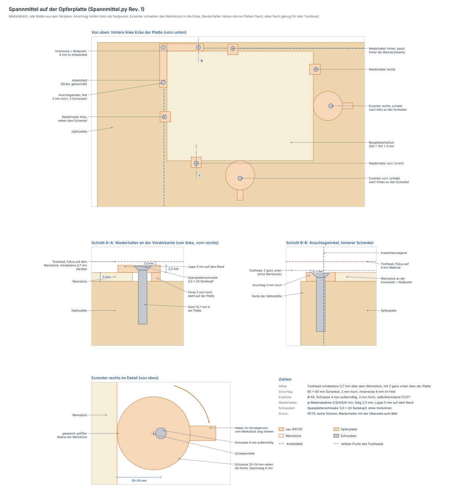

# Spannmittel für die Opferplatte

Erzeugt von `fusion/Spannmittel/Spannmittel.py` (Rev. 1). Geprüft mit
`python3 tools/spannmittel_check.py`, Zeichnung in
[spannmittel.svg](spannmittel.svg) (neu erzeugen mit
`python3 tools/spannmittel_zeichnen.py`). Die Opferplatte selbst steht in
[opferplatte.md](opferplatte.md).

## Wozu

Ein Laser drückt nicht auf das Werkstück, es muss also keine
Bearbeitungskräfte aufnehmen. Spannen heißt hier dreierlei:

1. **Feste Lage:** Das Werkstück liegt immer an derselben bekannten
   Stelle, damit die Gravur dort landet, wo sie im Programm steht.
2. **Nicht verrutschen:** Es darf sich nicht verschieben, wenn man aus
   Versehen dagegenstößt.
3. **Flach liegen:** Dünne, verzogene Platten (Sperrholz, MDF, Acryl
   2–6 mm) wölben sich sonst aus dem Fokus.

Dafür gibt es drei Druckteile: den **Anschlagwinkel** für die Lage, zwei
**Exzenter**, die das Werkstück in die Ecke schieben und dort halten, und
**Niederhalter**, die dünne Platten am Rand flach halten.

## Höhe: Alles bleibt unter dem Toolhead

Zwischen zwei Linien hebt der Laser nicht ab. Der Toolhead fährt in
Arbeitshöhe über das ganze Feld, also auch über alles, was neben dem
Werkstück liegt.

Mit Z ganz unten ist die Schlittenplatte, der tiefste Punkt des Toolheads,
**3,7 mm** über der Opferplatte. Liegt der Fokus auf einem Werkstück, ist
sie mindestens 3,7 mm über dessen Oberseite. Weniger wäre es nur, wenn der
Laser so hoch eingebaut ist, dass er nicht mehr auf die leere Platte
fokussieren kann. Darauf sind alle Teile ausgelegt:

| Teil | Höhe | Luft zum Toolhead |
|---|---|---|
| Anschlagwinkel | 3 mm über der Platte | 0,7 mm, auch mit Z ganz unten ohne Werkstück |
| Exzenter | 3 mm über der Platte | ebenso |
| Niederhalter | 2,5 mm über dem Werkstück | 1,2 mm |

Die Prüfung fährt den Toolhead über das ganze Feld: einmal mit Z ganz
unten ohne Werkstück, einmal mit dem Beispielwerkstück (3 mm) und dem
Fokus darauf. Er bleibt überall frei. Am knappsten wird es über dem
hinteren Niederhalter, dort sind es 1,2 mm.

## Anschlagwinkel

| | |
|---|---|
| Lage | fest auf der Platte **hinten links**, also in der Ecke, in der die Maschine referenziert (X nach links, Y nach hinten) |
| Innenecke | 4 mm im Arbeitsfeld, bei X −199,85 und Y −164,8 (Maschinenkoordinaten wie `Portal.py`) |
| Schenkel | 50 mm ab der Innenecke, 10 mm breit, 3 mm hoch |
| Befestigung | 3 Spanplattenschrauben 3,0 × 20 mit Senkkopf |
| Platz | Hinter dem Arbeitsfeld hat die Platte nur 7,85 mm Rand. Mit der Innenecke 4 mm im Feld bleiben hinter dem Schenkel noch 1,85 mm, und hinter einem Werkstück neben dem Schenkel ist Platz für einen Niederhalter. |
| Herausziehen | Die Platte lässt sich samt Anschlag herausziehen, er bleibt 2,85 mm vor der hinteren Führung |

### Nullpunkt einrichten (einmal)

1. Die Platte nach links an den Anschlag und nach hinten an die Führung
   schieben. Damit ist ihre Luft von 1 mm je Seite weg, und der Nullpunkt
   liegt jedes Mal gleich.
2. Referenzieren (`$H`). Dann den Laser mit 1 % Leistung als Punkt genau
   auf die Innenecke fahren (Schutzbrille).
3. `G10 L20 P1 X0 Y0` setzt dort den Werkstücknullpunkt (G54). GRBL
   behält ihn auch nach dem Ausschalten.
4. Im Laserprogramm den Auftrag auf diesen Nullpunkt beziehen, mit dem
   Ursprung hinten links. Weil Y+ bei GRBL nach hinten zeigt, liegt das
   Werkstück bei Y ≤ 0. Vor dem Start mit der Rahmenfunktion prüfen.

Vor jedem Auftrag die Platte wieder nach links und hinten schieben.

## Exzenter

| | |
|---|---|
| Form | Scheibe Ø 40, 3 mm hoch, die Schraube sitzt 4 mm außermittig; dazu ein Hebel, der 14 mm über die Scheibe ragt |
| Spannweg | 4 mm: Die Schraube sitzt 20 bis 24 mm neben der Werkstückkante |
| Selbsthemmung | Die größte Steigung ist 11,5°, der Reibwinkel bei einem Reibwert von 0,3 beträgt 16,7°. Ein Stoß gegen das Werkstück dreht ihn nicht zurück. |
| Stück | 2: einer an der rechten Kante schiebt nach links, einer an der vorderen schiebt nach hinten |

So spannst du:

1. Das Werkstück in die Ecke an den Anschlag legen.
2. Den Exzenter mit dem Hebel **quer zur Werkstückkante** an das Werkstück
   legen und so anschrauben. Nur so fest, dass er sich noch drehen lässt.
3. Den Hebel **im Uhrzeigersinn** vom Werkstück weg drehen. Die Scheibe
   schiebt das Werkstück bis 4 mm weit gegen den Anschlag.

Warum im Uhrzeigersinn: Die Reibung am Kopf nimmt die Schraube dabei mit
und zieht sie an, der Exzenter klemmt sich also selbst fest. Am rechten
Rand zeigt der Hebel dafür zuerst nach hinten, am vorderen nach rechts.

## Niederhalter

Ein Spanneisen je Materialstärke **2, 3, 4, 5 und 6 mm**:

| | |
|---|---|
| Lippe | liegt 5 mm auf dem Werkstückrand |
| Ferse | so hoch wie das Material, steht auf der Platte |
| Schraube | sitzt dazwischen, 3,5 mm neben der Kante, und zieht beides herunter |
| Steg | 2,5 mm dick: so weit ragt er über das Werkstück |
| Toleranz | ±0,5 mm Materialstärke gleicht er durch eine leichte Schräglage aus |
| Kraft | Handfest anziehen. Bei 50 N an der Schraube drückt die Lippe mit gut 20 N, und der Steg trägt das mit 12 MPa (PETG verträgt in der Schichtebene etwa 45). |
| Platz | Er passt an alle vier Kanten. Hinter der hinteren Kante bleiben 11,85 mm Platte, er braucht 9,5. |

Wo ein Niederhalter sitzt, **6 mm zwischen Gravur und Werkstückrand**
lassen, denn die Lippe liegt 5 mm auf.

Eine verzogene Platte legst du **hohl nach oben**, also mit den Rändern
nach oben, und ziehst die Ränder mit Niederhaltern herunter. Andersherum
läge sie auf den Rändern und wölbte sich in der Mitte, und dort hilft kein
Niederhalter.

## Schrauben

Spanplattenschrauben **3,0 × 20 mit Senkkopf (TX10)** gehen ohne
Vorbohren direkt in die Spanplatte. Der Kopf liegt in einer 90°-Senkung
0,2 mm unter der Oberseite. Je nach Teil fassen sie 11,7 bis 17,2 mm in
der Platte und kommen unten nicht heraus. Jede neue Stelle bedeutet ein
neues Loch, und genau dafür ist die Opferplatte da.

Eine Bohrlehre gibt es nicht, gebohrt wird nichts.

## Druck (PETG, Bambu Lab A1)

| Teil | Stück | Bauraum | Volumen | Masse (voll) | aufs Bett |
|---|---|---|---|---|---|
| Anschlagwinkel | 1 | 60 × 60 × 3 mm | 3,2 cm³ | ≈ 4 g | Unterseite |
| Exzenter | 2 | 54 × 40 × 3 mm | 4,1 cm³ | ≈ 5 g | Unterseite |
| Niederhalter 2 / 3 / 4 / 5 / 6 mm | je 4 für die Stärken, die du brauchst | 14,5 × 14 × 4,5 bis 8,5 mm | 0,55 bis 0,72 cm³ | ≈ 1 g | Oberseite |

Keine Stützen. Die Niederhalter liegen mit der Oberseite auf dem Bett, die
Ferse steht dann nach oben, und die Senkung öffnet sich zum Bett.

## Stückliste

| Stück | Teil |
|---|---|
| 1 | Anschlagwinkel (PETG) |
| 2 | Exzenter (PETG) |
| je 4 | Niederhalter (PETG) für jede Materialstärke, die du verwendest |
| 3 + je 1 | Spanplattenschraube 3,0 × 20 Senkkopf TX10: 3 für den Anschlag, dazu je eine für jeden Exzenter und Niederhalter |

## Noch offen

Nichts. Angenommen ist ein Reibwert von 0,3 für die Selbsthemmung des
Exzenters, sie reicht bis zu einem Reibwert von 0,2 hinunter.

## Parametrik

Alle Werte aus dem `MASSE`-Block landen als Fusion-User-Parameter. Nach
einer Änderung das Skript neu laufen lassen und
`tools/spannmittel_check.py` ausführen. Platte und Arbeitsfeld vergleicht
die Prüfung mit `Opferplatte.py`, den Freiraum unter dem Toolhead mit
`ToolheadZ.py`.

| Parameter | Wert | Wirkung |
|---|---|---|
| `aw_rand` | 4 mm | Innenecke des Anschlags so weit im Arbeitsfeld |
| `aw_h` / `aw_l` / `aw_b_hinten` / `aw_b_links` | 3 / 50 / 10 / 10 mm | Anschlag: Höhe, Schenkellänge, Breiten |
| `ex_r` / `ex_e` / `ex_h` | 20 / 4 / 3 mm | Exzenter: Radius, Außermittigkeit (= Spannweg), Höhe. asin(e/R) muss unter dem Reibwinkel bleiben |
| `ex_hebel_l` / `ex_hebel_b` | 14 / 8 mm | Hebel |
| `nh_d` / `nh_b` | 2,5 / 14 mm | Niederhalter: Dicke des Stegs, Breite |
| `nh_lippe` / `nh_schraube` / `nh_ferse` / `nh_ende` | 5 / 3,5 / 3 / 9,5 mm | Niederhalter quer zur Kante: Lippe, Schraube, Ferse, Gesamtlänge außen |
| `NH_STAERKEN` | 2, 3, 4, 5, 6 mm | für welche Materialstärken je ein Niederhalter gebaut wird (Liste im Skript, kein User-Parameter) |
| `nh_t` / `wst_l` / `wst_b` | 3 / 200 / 150 mm | Beispielwerkstück im Modell |
| `sch_l` / `sch_loch` / `sch_kopf_d` / `senk_d` | 20 / 3,4 / 6 / 6,4 mm | Spanplattenschraube 3,0 und ihre Senkung |
| `platte_*` / `feld_*` / `toolhead_frei` | wie `Opferplatte.py` und `ToolheadZ.py` | die Prüfung vergleicht |
