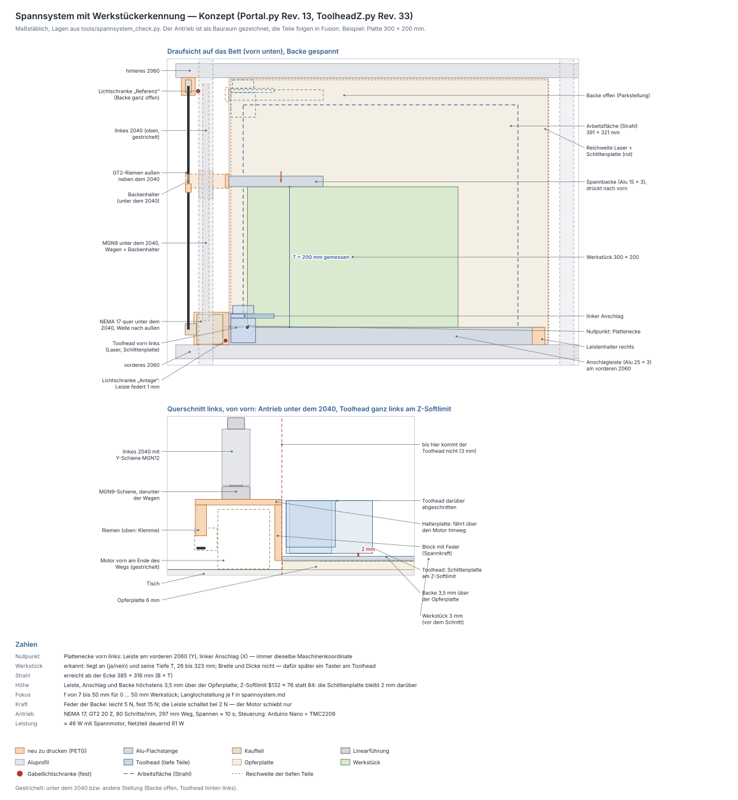

# Spannsystem mit Werkstückerkennung — Konzept

Ein fester Anschlag vorn links und eine Spannbacke, die ein eigener NEMA 17
verfährt: Die Backe schiebt die Platte in die Ecke, spannt sie und misst
dabei ihre Tiefe. Gerechnet mit `python3 tools/spannsystem_check.py`
(Reichweite des Toolheads, Höhen und Z-Softlimit, Bauraum des Antriebs über
den ganzen Weg, Plattengrößen, Kraft, Zeit, Leistung), gezeichnet mit
`python3 tools/spannsystem_zeichnen.py`. **Stand:** Konzept, alle
Prüfungen bestanden; die Druckteile (Fusion) und die Firmware folgen, wenn
das Konzept steht — [offen](#was-noch-fehlt).

## Kurz: Geht das mit zwei Winkeln?

Ja — mit drei Änderungen gegenüber der ersten Idee:

1. **Der feste Winkel gehört an den Rahmen, nicht an die Opferplatte.** Er
   ist der Nullpunkt jedes Jobs. Sitzt er auf der Opferplatte, wandert er
   mit, sobald sie verrutscht oder getauscht wird. Hier liegt eine
   Anschlagleiste mit der Vorderkante am **vorderen 2060**: das Profil legt
   sie parallel zu X und nimmt die Spannkraft auf. Ein linker Anschlag
   daneben legt X fest.
2. **Der bewegte Winkel fährt in Y, nicht diagonal — und misst eine
   Kante.** Ein starrer Winkel, der diagonal auf die Ecke zufährt, berührt
   zuerst *eine* Kante; welche, hängt vom Seitenverhältnis der Platte ab.
   Dort bleibt er stehen: Die Platte ist nur in dieser Richtung gespannt,
   die andere Kante liegt weder an noch ist sie gemessen. Ein Motor ist eine
   Bewegung, also eine Kante. Die Backe drückt die Platte deshalb von hinten
   gegen die Leiste und misst die **Tiefe T**; nach links schiebst du sie
   beim Einlegen selbst — dafür ist der Anschlag da.
3. **Der fünfte Motor braucht eine eigene kleine Steuerung.** Das CNC
   Shield hat vier Treiberplätze, alle belegt (X, Y, Z und A als Klon von
   Y), und GRBL auf dem Uno kennt nur drei Achsen. Ein Arduino Nano mit dem
   Ersatz-TMC2209 fährt die Backe; mit GRBL spricht er über zwei freie Pins
   ([Steuerung](#steuerung)).

Was „Werkstückerkennung“ damit heißt:

| | wie | Stand |
|---|---|---|
| **Nullpunkt** (Plattenecke) | fest: Leiste (Y) und Anschlag (X) — immer dieselbe Maschinenkoordinate | ohne Messen |
| **liegt eine Platte an?** | ja, wenn die Leiste schaltet, bevor die Backe vorn ankommt | Spannsystem |
| **Tiefe T** (Y) | Schritte vom Referenzschalter bis zum Schaltpunkt der Leiste, **26 bis 323 mm**, Auflösung 0,0125 mm | Spannsystem |
| **Breite B** (X) | nicht mit einem Motor — eingeben oder später der Taster | [Ausblick](#ausblick-breite-und-dicke-mit-einem-taster-am-toolhead) |
| **Dicke** (für den Fokus) | ebenfalls der Taster | Ausblick |

## Aufbau

| Teil | was | Material |
|---|---|---|
| **Anschlagleiste** | liegt auf der Opferplatte, Vorderkante am vorderen 2060; rechts geklemmt, links hält eine Feder sie 1 mm vom 2060 weg — drückt die Platte sie an, schaltet die Lichtschranke **„Anlage“** | Alu-Flach 25 × 3 |
| **linker Anschlag** | hinter der Leiste, links im Antriebshalter geklemmt, Langloch in X | Alu-Flach 25 × 3 |
| **Spannbacke** | 15 mm breit, schwebt 0,5 mm über der Opferplatte (bleibt nicht in Brandspuren hängen), sitzt auf einem gefederten Block | Alu-Flach 15 × 3 |
| **Backenhalter** | hängt am Wagen einer MGN9 unter dem linken 2040: Platte unter dem Wagen, innen der Block mit Feder, außen die Riemenklemme | PETG |
| **Führung** | MGN9-Schiene 350 mm an der Unterseite des linken 2040 (Nutensteine M3) | Kaufteil |
| **Antrieb** | NEMA 17 quer unter dem 2040, ganz vorn, Welle nach außen; Ritzel GT2 20 Z; offener Riemen **außen neben dem 2040**; Umlenkrolle 20 Z hinten | vorhanden + Kaufteile |
| **Antriebshalter** | Wiege für den Motor, am vorderen 2060 verschraubt; klemmt Leiste und Anschlag, trägt die Lichtschranke „Anlage“ | PETG |
| **Umlenkhalter** | am hinteren 2060, mit Spannschraube; trägt die Lichtschranke **„Referenz“** | PETG |
| **Leistenhalter rechts** | klemmt die Leiste rechts, außerhalb der Reichweite des Lasers | PETG |
| **Opferplatte** | 454 × 378 × 6 mm `[?]`, liegt lose zwischen den 2060 | MDF/Sperrholz |

Alles, was der Laser treffen kann, ist Aluminium — PETG läge sonst im Strahl.
Die Druckteile sitzen alle außerhalb der Reichweite des Toolheads.

## Ablauf: spannen und messen

1. **Referenz** (einmal nach dem Einschalten): Backe nach hinten, bis
   „Referenz“ schaltet. Dort parkt sie, 6,5 mm hinter der tiefsten Platte,
   die der Strahl erreicht.
2. **Einlegen**: Platte in die Ecke schieben — nach vorn an die Leiste, nach
   links an den Anschlag.
3. **Spannen** (Taster oder `M8`): Die Backe fährt mit 40 mm/s nach vorn und
   schiebt die Platte an die Leiste. Gibt die Leiste 0,6 mm nach, schaltet
   „Anlage“: stopp.
4. **Messen**: 3 mm zurück, mit 3 mm/s wieder an. Der Schaltpunkt ergibt
   **T** = Schritte ab Referenz in mm, minus eine Konstante, die einmal mit
   einer bekannten Platte eingemessen wird.
5. **Spannkraft**: um den Federweg weiter — leicht 2 mm (**5 N**) oder fest
   12 mm (**15 N**). Der Motor bleibt bestromt, der Riemen hält nicht von
   selbst.
6. **Melden**: T aufs Display (und seriell), an GRBL **Cycle Start** — der
   Job läuft weiter.
7. **Lösen** (Taster oder `M9`): Backe zurück in die Parkstellung.

Kommt die Backe vorn an, ohne dass die Leiste geschaltet hat, liegt **keine
Platte** da: Meldung, kein Cycle Start, der Job bleibt stehen. Von ganz offen
bis zur kleinsten Platte dauert das Spannen rund **10 s**.

**Warum die Lichtschranke an der Leiste sitzt und nicht in der Backe:**

* Sie steht fest — **kein Kabel fährt mit**, beide Lichtschranken sind
  ortsfest verdrahtet.
* Sie schaltet erst, wenn die Platte **wirklich an der Leiste liegt**. Ein
  Schalter in der Backe meldet schon die erste Berührung; lag die Platte da
  noch 5 mm hinter der Leiste, wäre T um 5 mm zu groß.
* Die Feder der Backe ist stärker vorgespannt (3 N) als die der Leiste
  (2 N). Bis die Leiste schaltet, bleibt die Backe also starr — die Messung
  hängt nicht an der Feder. Eine schwere Platte drückt die Feder beim ersten
  Schieben zwar ein (Reibung), aber gemessen wird beim zweiten, langsamen
  Anfahren an die schon anliegende Platte.

## Warum so

### Der Laser braucht keine Spannkraft

Gravieren und Schneiden üben keine Kraft aufs Werkstück aus. Die Backe hält
die Platte nur gegen Stöße, Luft und Verrutschen — dafür reichen wenige
Newton. Deshalb bestimmt eine **Feder** die Kraft, nicht der Motor:

| | |
|---|---|
| Leiste schaltet | 2 N |
| gespannt leicht / fest | **5 N / 15 N** |
| Motor schiebt (0,3 Nm `[?]`, davon 50 % beim langsamen Fahren) | 23,6 N — 1,4 × Reserve über „fest“ + Reibung |
| Knicklast Acryl 1,5 × 100 × 300 mm | 9,3 N |

Dünnes Material also **leicht** spannen: Fest knickt eine dünne Acrylplatte
nach oben. Verzogene Platten macht Randspannen ohnehin nicht flach — dafür
bleiben Gewichte oder Magnete.

### Im Bereich des Toolheads ist alles flach — und ein Z-Softlimit schützt es

Am tiefsten hängt nicht der Laser, sondern die **Schlittenplatte**: 9,5 mm
unter dem Gehäuse (Lochmitte), mit Z unten nur 3,7 mm über dem Tisch.¹ Hinter
dem Strahl und bis 44 mm rechts daneben streicht sie über alles, was um die
Platte herum liegt — über die Backe, wenn der Strahl die hintere Kante
graviert, über den Anschlag in der Ecke. Nur über die Leiste kommt allein
das Lasergehäuse.

Deshalb ist alles im Bereich des Toolheads **höchstens 3,5 mm** hoch
(Oberkante der Backe), und GRBL bekommt ein **Z-Softlimit**: `$132 ≈ 76`
statt 84. Die Schlittenplatte kommt damit nie tiefer als 5,5 mm über die
Opferplatte, bleibt also 2 mm über Leiste, Anschlag und Backe — egal, welche
Materialstärke oder welcher Fokus in LightBurn steht. Nebenbei schützt das
die Opferplatte selbst: Ohne Softlimit käme die Schlittenplatte 2,3 mm
*unter* die Oberkante einer 6-mm-Opferplatte.

¹ Der Tisch liegt im Rahmenmodell (Portal.py) 129 mm unter der Bezugsebene;
gemessen waren „130 mm, auf cm gerundet“ (`bett_abstand`), daher 4,7 mm in
[toolhead-z.md](toolhead-z.md). Die Rechnung hier nimmt das Rahmenmodell —
die Vergleichswerte „ohne Spannsystem“ unten stammen noch aus dem gemessenen
Bettabstand.

Was es kostet — Fokusabstand f (Gehäuseunterkante → Material, gemessen wird
er laut [hardware-notizen.md](hardware-notizen.md#fokusabstand---offen)):

| | ohne Spannsystem | mit (6-mm-Opferplatte, Softlimit) |
|---|---|---|
| Fokusfenster für 0 … 50 mm Werkstück | f = 6 … 57 mm | **f = 7 … 50 mm** |
| dickstes Werkstück (feste Teile, 5 mm Luft) | 59 mm | **52 mm** |
| Z-Weg nach unten | bis zc −40,05 | bis zc −32,25 |

Langlochstellung des Lasers je f, mit Softlimit gerechnet (Lochmitte, wo sie
passt):

| f | Laser | geht von … bis |
|---|---|---|
| 8 mm | −7,0 mm | −8,0 … −7,0 |
| 10 mm | −5,0 mm | −8,0 … −5,0 |
| 15 … 30 mm | 0 (Lochmitte) | ab −8,0 |
| 40 mm | 0 | −2,8 … +7,8 |
| 50 mm | +7,2 mm | +7,2 … +7,8 |

Die Tabelle in [toolhead-z.md](toolhead-z.md#laserhöhe-langloch-statt-rechnen)
gilt ohne Opferplatte; mit ihr diese hier.

### Der Antrieb steht neben der Reichweite des Toolheads

Die tiefen Teile des Toolheads (Laser, Schlittenplatte, Pad) überstreichen
mit Z unten **X −221,35 … +231,35** und **Y −192 … +182**
(Rahmenkoordinaten wie in `portal_check.py`, Abschnitt 14: X = 0 in der
Rahmenmitte, Y nach vorn). Links von X = −224,35 kommt also nichts hin — das
sind die 22,65 mm innen neben dem linken 2040, der Raum unter ihm und außen
daneben, zwischen den beiden 2060.

* Die **MGN9** hängt unter dem 2040: Mit 10 mm Bauhöhe fährt die Platte des
  Backenhalters 3,2 mm über den Motor hinweg — mit einer MGN12 ginge das
  nicht, dann stünde der Motor der Backe vorn im Weg.
* Der **Riemen** läuft außen neben dem 2040 (X = −282), unter der
  Kettenwanne der Y-Kette und der Leitung in der unteren Nut.
* Der **Motor** liegt vorn quer auf Tischhöhe, Welle nach außen, und endet
  innen 3,65 mm neben dem Block der Backe.
* `spannsystem_check.py` fährt Portal und Toolhead über den ganzen X-, Y-
  und Z-Weg (bis an beide Schienenenden) gegen alle Teile des Antriebs:
  engste Stelle **3,0 mm** (Antriebshalter ↔ Schlittenplatte).

### Weg und Plattengrößen

| | |
|---|---|
| Plattenecke | Leiste 25 mm hinter dem vorderen 2060, Anschlag bei X = −198 — der Strahl reicht 4,5 bzw. 5,85 mm darüber hinaus |
| größte Platte, die der Strahl ganz erreicht | **385 × 316 mm** (B × T) |
| Tiefe, die die Backe spannt | **26 … 323 mm** — vorn begrenzt der Antriebshalter, hinten die Umlenkung |
| Weg der Backe | 297 mm, Schiene mindestens 337 mm → **350 mm** |
| Riemen | offen, ≈ 0,76 m |
| Auflösung | 80 Schritte/mm (GT2, 20 Z, 1/16) → 0,0125 mm |

Der linke Anschlag sitzt im Langloch: nach dem Einrichten von GRBL so
stellen, dass der Strahl nach dem Referenzieren noch 2 mm links daran
vorbeikommt. Die Leiste parallel zu X einstellen: eine Linie entlang X
lasern, Abstand zur Leiste an beiden Enden messen, Folie hinter die Leiste
legen, wo sie zu weit vorn liegt.

## Steuerung

### Warum nicht über das CNC Shield

Alle vier Treiberplätze sind belegt, und GRBL 1.1 auf dem Uno hat genau drei
Achsen — A ist nur eine elektrische Kopie von Y. Ein Relais, das den
Z-Treiber zwischen Z-Motor und Spannmotor umschaltet, ginge theoretisch
(Z fährt nur zwischen den Jobs), aber Umschalten unter Strom kostet den
Treiber, und GRBL verlöre seine Z-Position. Eine eigene Steuerung für die
Backe ist einfacher und lässt GRBL unverändert.

### Spannsteuerung: Arduino Nano + TMC2209

| Nano | an | Hinweis |
|---|---|---|
| D2 | Lichtschranke „Anlage“ (D0) | Interrupt-Pin: der Schaltpunkt wird auf den Schritt genau gezählt |
| D3 | Lichtschranke „Referenz“ (D0) | Interrupt-Pin |
| D4 | Taster Spannen/Lösen | gegen GND, interner Pull-up |
| D5 / D6 / D7 | TMC2209 STEP / DIR / EN | |
| D8 | Shield **CoolEn** (A3) | `M8` = spannen, `M9` = lösen; über 1 kΩ |
| D9 | Shield **Resume** (A2) | Cycle Start: NPN-Transistor oder Pin als Open-Drain (LOW-Puls) |
| A4 / A5 | OLED 0,96″ (SSD1306, I²C) | optional: zeigt T und Zustand |
| 5 V / GND | beide Lichtschranken, OLED | GND gemeinsam mit dem Shield (Wago GND) |

* **TMC2209** (der Ersatz) auf einer Adapterplatine: VM an den Wago +24 V,
  100 µF dicht daneben, MS1 + MS2 an 5 V = 1/16, Strom am Vref-Poti auf
  ≈ 0,6 A — für 15 N reicht das weit. Nichts unter Spannung stecken.
* Der Nano hängt per **USB am PC**: Strom und die serielle Ausgabe von T.
  Steht er ohne PC, braucht er 5 V aus einem kleinen Wandler (24 → 5 V),
  nicht über VIN.
* Leistung: ≈ 2 W mehr, zusammen **≈ 46 W** von 61 W, die das Netzteil
  dauernd liefert.
* Wo die Platine hinkommt, ist offen: ins Elektronikfach neben das Gehäuse
  (dort ist rechts Platz) oder links an den Antriebshalter.

### Anbindung an GRBL und LightBurn

Die beiden Pins sind in GRBL 1.1 frei, GRBL bleibt, wie es ist.

* **LightBurn**, Geräteeinstellungen: Start-G-Code `M8` und `M0`,
  End-G-Code `M9`. Bei `M0` hält GRBL an; die Spannsteuerung spannt, misst
  und gibt Cycle Start — erst dann läuft der Job. Liegt keine Platte da,
  bleibt er im Halt. Spannen und Lösen gehen jederzeit auch per Taster oder
  per Makro (`M8` / `M9`).
* **Achtung, Air Assist:** LightBurn schaltet Air Assist bei GRBL über
  dieselben Kühlmittelbefehle (meist `M8`/`M9`). Kommt später eine
  Luftpumpe dazu, wandert das Spannen auf `M7` (Pin A4, GRBL mit
  `ENABLE_M7` neu übersetzen) oder nur auf den Taster.
* **Nullpunkt**: einmal den Laser (1 %) auf die Ecke fahren und in LightBurn
  als Ursprung setzen, Job-Ursprung „unten links“. Seitdem liegt jeder Job
  an der Plattenecke. T zeigt das Display; LightBurn selbst kann den Wert
  nicht lesen — zum Zentrieren in Y also eintippen.
* **ESP32 statt Nano?** Geht genauso (3,3-V-Pegel: CoolEn über Teiler
  einlesen, Resume per Transistor). Dafür gibt es WLAN/Bluetooth: T und
  „gespannt“ aufs Handy, Spannen per App — falls du dir dafür eine kleine
  App bauen willst.

## Ausblick: Breite und Dicke mit einem Taster am Toolhead

Die zweite Kante misst der Motor nicht. Das kann GRBL selbst: Der
Probe-Eingang (A5, auf dem Shield „SCL“) ist frei. Ein gefederter Stift mit
Gabellichtschranke links an der Schlittenplatte, die Spitze ein paar
Millimeter über der Fokusebene:

* `G38.2 Z…` auf die Platte → **Dicke**, also Autofokus;
* rechts neben der Platte abgesenkt, `G38.2 X…` nach links an die Kante →
  **Breite B**. Links am Toolhead, damit beim Antasten der rechten Kante der
  übrige Toolhead außerhalb der Platte steht.

Zusammen mit T aus dem Spannsystem ist die Platte dann ganz bekannt — mit
LightBurn-Makros, ohne weitere Elektronik. Das ist ein eigener Umbau am
Toolhead; erst, wenn das Spannsystem läuft.

## Einkaufsliste (Vorschlag)

| Menge | Teil | wofür |
|---|---|---|
| 1 | MGN9-Schiene 350 mm mit Wagen MGN9H | Führung der Backe |
| 8 + 8 | M3×8 + Nutenstein M3 (Nut 6) | Schiene an die Unterseite des 2040 |
| 1 | GT2-Riemen 6 mm, 1 m (offen) | Antrieb |
| 1 | GT2-Ritzel 20 Z, Bohrung 5 | Motor |
| 1 + 1 | Umlenkrolle 20 Z mit Lager, Bohrung 5 + M5×30 | hinten |
| 1 | Alu-Flachstange 25 × 3 mm, 0,5 m | Leiste und Anschlag |
| 1 | Alu-Flachstange 15 × 3 mm, 0,2 m | Backe |
| 1 + 1 | Druckfeder ≈ 1 N/mm, 30 mm lang, Ø 6–8 + kleine Druckfeder ≈ 2 N | Backe, Leiste |
| 2 | Gabellichtschranke LM393 (wie an X, Y, Z) | „Anlage“, „Referenz“ |
| 1 | Arduino Nano (oder ESP32) | Spannsteuerung |
| 1 + 1 | Treiber-Adapterplatine + Elko 100 µF / 35 V | für den Ersatz-TMC2209 |
| 1 / 1 | Taster, LED; optional OLED 0,96″ SSD1306 | Bedienung |
| 1 | Opferplatte 454 × 378 × 6 mm | Bett |
| — | Motorkabel 1 m, 2 × 3-adrig für die Lichtschranken, 3-adrig zum Shield (CoolEn, Resume, GND) | |
| 6 + 6 | M5 + Hammermutter (Nut 6) | Halter an die 2060 |

## Was noch fehlt

Bevor die Teile in Fusion gezeichnet werden:

1. **Konzept bestätigen**: Backe in Y, Breite von Hand an den Anschlag (und
   später der Taster) — oder lieber anders?
2. **Welcher NEMA 17?** Länge ohne Welle und Haltemoment. Angenommen: 37 mm
   wie die anderen, 0,3 Nm `[?]`.
3. **Opferplatte**: gibt es schon eine, wie dick, welches Material? Gab es
   schon ein Spannsystem, an dem etwas bleiben soll? Angenommen: 6 mm neu.
4. **Fokusabstand f** messen — davon hängt die Langlochstellung ab.
5. **Unterseite des linken 2040**: ist die Nut zwischen den 2060 frei (keine
   Winkel)?
6. **Nano oder ESP32**, und wohin mit der Platine.
7. Typische **Plattengrößen** und **-dicken**: Reicht ab 26 mm Tiefe und ab
   1,5 mm Dicke?

Danach: Antriebshalter, Umlenkhalter, Backenhalter mit Block und
Leistenhalter als `fusion/Spannsystem/`, die Prüfung wandert mit, und die
Firmware für den Nano.

## Parameter (in `tools/spannsystem_check.py`)

| Parameter | Wert | Wirkung |
|---|---|---|
| `opfer_dicke` | 6 mm | hebt das Bett; Softlimit, Fokusfenster und Werkstückhöhe wandern mit |
| `leiste_b` / `anschlag_x` | 25 mm / −198 | Plattenecke = Nullpunkt |
| `backe_h` / `backe_schwebt` | 3 / 0,5 mm | höchstes flaches Teil → Z-Softlimit |
| `riemen_x` | −282 | Riemenebene außen neben dem 2040 |
| `motor_laenge` | 37 mm `[?]` | ragt innen bis 3,65 mm an den Block der Backe |
| `leiste_vor` / `feder_vor` / `feder_k` | 2 N / 3 N / 1 N/mm | Schaltpunkt, starre Backe, Spannkraft |
| `spann_leicht` / `spann_fest` | 2 / 12 mm | 5 bzw. 15 N |
| `motor_moment` | 0,3 Nm `[?]` | Reserve des Antriebs |
