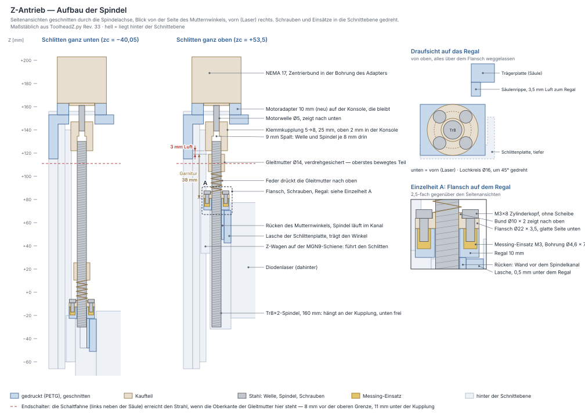

# Toolhead Z-Achse — kompletter Aufbau

Erzeugt von `fusion/ToolheadZ/ToolheadZ.py` (Baugruppe, sieben gedruckte Teile).
Geprüft mit `python3 tools/toolhead_check.py`, Layout in
[toolhead-z-layout.svg](toolhead-z-layout.svg).

## Was hier zusammenkommt

Der Toolhead hängt am **MGN15H-Wagen der Portalführung** und bringt seine
eigene Z-Achse mit: eine MGN9-Führung, angetrieben von einem NEMA 17 über eine
Kupplung 5 → 8 mm auf eine **Tr8×2-Trapezgewindespindel mit Anti-Backlash-Garnitur**.
Der Laser sitzt auf dem Z-Schlitten.

| Pos | Teil | Material | Funktion |
|---|---|---|---|
| 1 | **Trägerplatte** mit angeformter **Motorkonsole** | PETG, 8 mm | sitzt auf dem X-Wagen, trägt Schienensockel, Konsole, Säulen- und Führungsrippen |
| 2 | **Motoradapter** | PETG, 10 mm | Distanzplatte zwischen Konsole und Motor, hebt den Motor (Rev. 30) |
| 3 | **Schlittenplatte** | PETG | auf dem MGN9H-Z-Wagen, trägt den Laser und die Lasche für die Schaltfahne |
| 4 | **Mutternwinkel** | PETG | Flanschsitz für die Tr8×2-Garnitur, schwimmend verschraubt |
| 5 | **Schaltfahne** | PETG **schwarz** | dünnes Blatt für die Gabellichtschranke, Schaltpunkt über Langlöcher einstellbar (Rev. 32) |
| 6 | **Endschalterhalter** | PETG | hält die Gabellichtschranke — gedruckt und eingebaut, bleibt |
| 7 | **Riemenhalter** | PETG | hinten an der Trägerplatte, klemmt beide Enden des X-Riemens (Rev. 33) |

Die Motorkonsole ist **Teil der Trägerplatte**, kein eigenes Bauteil — siehe
[Motorbefestigung](#motorbefestigung-alle-vier-schrauben-erreichbar).

## Bezugsebene und Koordinaten

**Ursprung = Mitte des X-Wagen-Lochbildes, auf seiner Stirnfläche.** Das ist die
Passfläche, an der die Trägerplatte anliegt — genau die Ebene, deren Höhe beim
ersten Versuch gefehlt hat. Alles ist von hier aus bemaßt.

* X = quer, längs des Portals
* Y = nach vorn, weg vom Portal
* Z = senkrecht, Verfahrrichtung der Z-Achse

Im Fusion-Modell sind Y und Z getauscht (Modell-Z = Maschine Y), damit alle
Plattenskizzen in einer Ebenenfamilie liegen und es keine
Richtungsverwechslungen beim Extrudieren gibt.

## Y-Kette (ab X-Wagen-Stirnfläche)

| Y | Ebene |
|---|---|
| −16,0 | Portalprofil, Auflage der MGN15-Schiene |
| −6,0 | Oberkante X-Schiene (6 mm Luft zur Trägerplatte) |
| **0** | **X-Wagen-Stirnfläche = Rückseite Trägerplatte** |
| +8,0 | Vorderseite Trägerplatte |
| +13,0 | Sockelfläche = Auflage der MGN9-Z-Schiene |
| +19,5 | Oberkante Z-Schiene |
| +23,0 | Stirnfläche Z-Wagen = Rückseite Auflagepad |
| +35,0 | Rückseite Schlittenplatte (Auflagepad 12 mm) |
| +41,0 | Anschraubfläche des Lasers |
| **+58,5** | **Strahlachse** |

Die MGN9-Schiene sitzt auf einem **Sockel von 5 mm** — nur so sitzen die
M3-Gewindeeinsätze 7 mm tief im Material (5 mm Sockel + 8 mm Platte = 13 mm,
davon 7 mm Bohrung und 6 mm Rest). Der Sockel ist **genau so breit wie die
Schiene (9 mm)**; wäre er breiter, würden die Schürzen des Wagens daran
streifen. Das prüft `toolhead_check.py` ausdrücklich.

Damit ist diese Bohrung die **engste Stelle im ganzen Teil**: die vorhandenen
Messingeinsätze haben 5 mm Außendurchmesser, die Einpressbohrung ist **Ø4,6 mm**
— 0,4 mm Untermaß, damit der Einsatz beim Einschmelzen Material verdrängt und
greift. Es bleiben `(9 − 4,6)/2 = 2,20 mm` Wand je Seite; das Minimum aus
`references/hardware.md` ist 2,0 mm. Beim Einschmelzen trotzdem wenig Druck
geben und den Einsatz bündig setzen — ein überhitzter Einsatz treibt die Wand
nach außen, und dann sitzt die Schiene nicht mehr plan.

Reicht die Wand im Druck nicht, gibt es zwei Wege ohne Änderung der
Schienenbreite: den Einsatz 2 mm tiefer setzen, sodass sein unteres Ende in der
44 mm breiten Säule sitzt (dann M3×12 statt M3×10), oder den Sockelfuß
unterhalb der Wagenschürzen verbreitern. Für letzteres brauche ich das Maß, wie
hoch die Schürze des MGN9H über der Schienenauflage endet.

## Z-Kette und Verfahrweg

| Z | Ebene |
|---|---|
| −130,0 | Bettoberfläche (`bett_abstand`) |
| −125,3 | Unterkante Schlittenplatte, tiefste Stellung |
| −115,8 | Laser-Unterkante (Linse), tiefste Stellung |
| −66,0 | Unterkante Trägerplatte |
| −60,0 | Unterkante MGN9-Schiene (**200 mm lang, 10 Schrauben**) |
| −40,1 … +53,5 | Bereich der Wagenmitte `zc` |
| +119,0 | Oberkante der Garnitur in der höchsten Stellung (3 mm unter der Kupplung) |
| +122,0 … +147,0 | Kupplung 5 → 8 mm (modelliert mit 8 mm Einstecktiefe), oben 2 mm in der Bundbohrung der Konsole |
| +140,0 | Oberkante MGN9-Schiene |
| +145,0 | Unterseite Motorkonsole = Oberkante Trägerplatte |
| +153,0 | Oberseite Konsole = Unterseite Motoradapter |
| +163,0 | Motorflansch (Motoradapter 10 mm, seit Rev. 30) |
| +203,0 | Oberkante NEMA 17 |

**Nutzbarer Verfahrweg: 93,6 mm.** Vier Dinge begrenzen ihn; das Skript rechnet
alle vier aus und nennt die bindende:

| Grenze | zc max |
|---|---|
| **Antriebsmutter gegen Kupplung** | **+53,5** ← bindend |
| Schlittenplatte gegen Kupplung | +102,0 |
| Laser-Oberkante gegen Motorkonsole | +118,2 |
| Wagen am oberen Schienenende | +120,1 |

Die Anti-Backlash-Garnitur steht **nach oben** auf dem Regal des
Mutternwinkels (Flanschmutter + Feder + Gleitmutter, zusammen **38 mm**, am
Teil gemessen) und ist damit das oberste bewegte Teil — sie kostet rund 50 mm
Weg gegenüber der alten M6-Lösung. Bis Rev. 30 standen hier geschätzte 45 mm;
die 7 mm Unterschied kommen oben als Verfahrweg dazu.

**Was davon gebraucht wird:** für 0–50 mm Werkstück muss die Linse **50 mm**
fahren können. Gearbeitet wird aber nur bis zum Schaltpunkt des Endschalters,
der 8 mm unter der mechanischen Grenze liegt (`ls_ueberfahrt`). Also:

| | mm |
|---|---|
| mechanischer Verfahrweg | 93,6 |
| − Überfahrweg über dem Endschalter | 8,0 |
| = **Arbeitsweg** | **85,6** |
| − gebraucht für 0…50 mm Werkstück | 50,0 |
| = **Reserve** | **35,6** |

Hier stand bis Rev. 28 „gebraucht werden rund 30 mm". Das war falsch — es sind
50 mm plus der Überfahrweg des Endschalters.

### Motoradapter: 10 mm mehr Weg ohne neue Trägerplatte (Rev. 30)

Bis Rev. 29 saß der Motor direkt auf der Konsole; mit der gemessenen Garnitur
(38 mm) wären das 75,6 mm Arbeitsweg und ein Fokusfenster bis f = 47 mm.
Jeder Millimeter, den Motor und
Kupplung höher sitzen, bringt oben 1 mm Weg und 1 mm Fokusfenster. Statt die
Konsole anzuheben (neue, 10 mm längere Trägerplatte) sitzt jetzt eine
**Distanzplatte zwischen Konsole und Motor**, der `Motoradapter`:

* so groß wie der Motorflansch (42,3 × 42,3 × 10 mm, rund 17 g bei voller Füllung), unten
  zwischen den Führungsrippen der Konsole, die ihn wie vorher den Motor gegen
  Verdrehen halten;
* Bohrung Ø22,4 durch, wie in der Konsole — oben sitzt der Zentrierbund des
  Motors darin;
* die vier Motorschrauben gehen von unten durch Konsole **und** Adapter:
  **M3×22** (8 + 10 mm geklemmt, 4 mm Eingriff, 0,5 mm vor dem Gewindegrund).

Die **Trägerplatte bleibt, wie sie gedruckt ist.** `toolhead_check.py` prüft
das eigens: dieselbe Lage ohne Adapter gerechnet, dann müssen Konsole,
Rippen, Schraubenbilder, Schiene und Endschaltersockel exakt gleich bleiben.
Auch die Durchbiegung der Säule bleibt bei 0,24 mm — die Säule wird nicht
länger, das Gewicht des Motors hängt am selben Hebel. Mit einer um 10 mm
längeren Trägerplatte wären es 0,30 mm gewesen.

Was sich sonst ändert:

| | ohne Adapter (bis Rev. 29) | mit Adapter (ab Rev. 30) |
|---|---|---|
| Motorflansch | +153 | **+163** |
| Kupplung | +112 … +137 | **+122 … +147**, oben 2 mm in der Bundbohrung (Ø19 in Ø22,4: 1,7 mm Luft rundum) |
| Arbeitsweg / Reserve | 75,6 / 25,6 mm | **85,6 / 35,6 mm** |
| Fokusfenster | f = 6 … 47 mm | **f = 6 … 57 mm** |
| Motorschrauben | 4 × M3×12 | **4 × M3×22** |
| Spindel | auf 150 mm kürzen | **auf 160 mm** (147,6 mm gebraucht) |
| Endschalter | Oberkante der Platte schaltet | **eigene Schaltfahne**, Halter bleibt (Rev. 32) |

Beide Spalten mit der gemessenen Garnitur (38 mm). In Rev. 30/31 stand in der
letzten Zeile, die Platine müsse im Halter 17 mm höher sitzen — das war falsch
herum gerechnet, der Sockel ist anders gedruckt als angenommen. Richtig ist
es unter [Endschalter](#endschalter-gabellichtschranke).

Zwei Grenzen hat der Adapter:

* **Die obere Klemmschraube der Kupplung muss erreichbar bleiben.** Die
  Motorwelle ragt nur noch 6 mm unter der Konsole heraus. Die Kupplung kommt
  deshalb nur **8 mm** auf die Welle (nicht bis zur Mitte), dann liegt ihre
  obere Klemmschraube — etwa in der Mitte der oberen Nabe — 4,3 mm unter der
  Konsole. Ab 12 mm Adapter kommt der Inbus nicht mehr an sie heran.
* **Schraubenlänge.** M3×22 ist eine seltenere Länge. Ohne sie: entweder
  **8 mm Adapter mit M3×20** (2 mm weniger Weg, f bis 55 mm), oder die vier
  Löcher unten in der Konsole mit einem Ø6-Bohrer **2 mm tief ansenken** und
  M3×20 nehmen. Nicht M3×25: die setzt im 4,5 mm tiefen Motorgewinde auf und
  klemmt nichts.

| Motoradapter | Arbeitsweg | Reserve | Fokusfenster | Klemmschraube unter der Konsole | Motorschraube |
|---|---|---|---|---|---|
| 0 (bis Rev. 29) | 75,6 | 25,6 | f = 6 … 47 mm | 14,3 mm | M3×12 |
| 8 mm | 83,6 | 33,6 | f = 6 … 55 mm | 6,3 mm | M3×20 |
| **10 mm** | **85,6** | **35,6** | **f = 6 … 57 mm** | **4,3 mm** | **M3×22** |
| 12 mm | 87,6 | 37,6 | f = 6 … 59 mm | 2,3 mm ✗ | M3×24 |

### Die Schiene sitzt in Z fest — das begrenzt die Werkstückhöhe

Die Z-Schiene hängt an der Trägerplatte am X-Wagen: sie fährt in X und Y mit,
aber **nicht** in Z. Ihr unteres Ende ist damit ein dauerhaftes Hindernis auf
seiner Höhe und muss über dem dicksten Werkstück bleiben — sonst rammt es das
Werkstück beim Verfahren. Dasselbe gilt für die Unterkante der Trägerplatte,
die 6 mm tiefer liegt.

Genau deshalb wächst die 200-mm-Schiene **nach oben**: Unterkante bleibt bei
−60 (20 mm Luft über einem 50-mm-Werkstück), Oberkante geht auf +140, und die
Motorkonsole rückt von +68 auf +145. Nach unten wäre die Schiene mit 200 mm
bis −125 gekommen — 45 mm **in** das Werkstück hinein.

Damit ist nicht mehr der Verfahrweg die Grenze für dicke Werkstücke, sondern
die Plattenunterkante: **59 mm** bei 5 mm Luft (`werkstueck_frei` im Bericht).
Mehr geht nur, indem `traeger_z_unten` steigt — das kostet Weg nach unten und
damit den Fokus auf dünnem Material.

Die Kollisionsprüfung fährt den Weg in 21 Stellungen ab und prüft jedes bewegte
Teil gegen jedes feste, einschließlich Portalprofil und X-Schiene.

## Motorbefestigung: alle vier Schrauben erreichbar

Ein NEMA 17 hat **Gewinde im Flansch**, kein Durchgangsloch. Er wird also
zwangsläufig **von unten** verschraubt — ein Durchstecken von oben ist nicht
möglich. Beide Schraubenreihen brauchen deshalb einen freien senkrechten
Korridor.

Genau daran hängt die Lage der Spindelachse:

* Die hintere Reihe liegt bei `spindel_y − 15,5`. Damit ein Ø6-Korridor an der
  Trägerplatte (Y = 0…8) vorbeikommt, muss `spindel_y ≥ 28` sein.
* Nach vorn begrenzt die Haut vor der Spindelbohrung im Rücken des
  Mutternwinkels: `schlitten_y1 ≥ spindel_y + 6,3`.

Gewählt: **`spindel_y` = 28,5 mm**, damit 2,0 mm Luft zum Korridor und 2,2 mm
Haut im Rücken (mit Tr8×2 statt M6 ist die Bohrung 2 mm größer geworden — die
Spindel läuft damit 2,5 mm hinter der Schlittenplatte vorbei, über den ganzen
Verfahrweg gleich weit). Die Schlittenplatte muss dafür mit nach vorn — über
`pad_hoehe` = 12 mm (statt 6). Damit liegen die hinteren Schrauben bei
Y = +13,0 mm, also **13 mm vor der Trägerplatte**.

Zusätzlich fassen **zwei Führungsrippen** (3 mm hoch) den Motorflansch links und
rechts mit 0,4 mm Spiel: der Motor findet beim Einsetzen selbst seine Lage, und
die Schrauben müssen kein Moment übertragen (bei 0,4 Nm Haltemoment wären es
rund 9 N je Rippe). Seit Rev. 30 fassen die Rippen den **Motoradapter**, der
genau so groß ist wie der Flansch; der Motor darauf zentriert sich mit seinem
Bund in der Adapterbohrung, und die vier Schrauben (M3×22) gehen durch Konsole
und Adapter.

`toolhead_check.py` prüft für **jede** der vier Schrauben einen freien
senkrechten Korridor von Ø6 mm gegen alle festen Teile — auch an der Kupplung
vorbei — und prüft die Luft zur Trägerplatte als eigene Größe.

### Was diese Variante kostet

| | vorher | jetzt |
|---|---|---|
| Spindelachse Y | 21,0 | **28,5** mm |
| `pad_hoehe` | 6 | **12** mm |
| Strahlachse | 52,5 | **58,5** mm |
| Z-Wagen-Schraube | M3×8 | **M3×14** |
| Schlittenplatte | ~25 g | **38 g** (gemessen, Rev. 11) |

Trägerplatte, Z-Schiene und Spindel bleiben davon unberührt. Der
Verfahrweg lag damals bei 50,45 mm; er ist mit Rev. 14 auf 55,1 mm gewachsen
(Laser tiefer, also nicht mehr die Motorkonsole als Grenze), mit Rev. 16 auf
136,1 mm (Schiene 200 mm), mit Rev. 28 bei 76,6 mm (die
Anti-Backlash-Garnitur baut nach oben auf), mit Rev. 30 bei 86,6 mm
(Motoradapter) und liegt mit Rev. 31 bei 93,6 mm (Garnitur gemessen: 38 statt
geschätzter 45 mm).

**Beim Anziehen beachten:** die Z-Wagen-Schrauben klemmen jetzt **12 mm PETG**
statt 6 (der Kopf sitzt in der Ø6,5-Freibohrung auf der Pad-Vorderseite). Eine
doppelt so lange Kunststoffsäule setzt sich auch doppelt so viel, wenn das
Material kriecht — handfest anziehen und Schraubensicherung verwenden. Die
Freibohrung tiefer ins Pad zu legen (und so nur 6 mm zu klemmen) geht nicht
kostenlos: sie käme dem Ø8-Kopffreiraum der oberen Laserschraube auf 0,8 mm
nahe — zu wenig Wand für PETG.

## Laserhöhe: Langloch statt rechnen

Die Lage des Lasers am Schlitten (`laser_versatz_z`) hängt an zwei Dingen, die
nichts miteinander zu tun haben:

**Montage.** Das Gewinde der Laserbefestigung sitzt im Modul, also wird von
hinten verschraubt. Liegt die obere Lochreihe auf der Wagenmitte, steht der
Z-Wagen davor und der Inbus hat 12 mm Platz — zu wenig. Die Reihe muss weiter
weg als halbe Wagenlänge plus Werkzeugradius (19,95 + 3 = 22,95 mm).

**Fokus.** Gemessen sind **130 mm** von der Bezugsebene bis zur Bettoberfläche
(`bett_abstand`) und **50 mm** dickstes Werkstück (`werkstueck_max`). Die
Gehäuseunterkante des Lasers liegt in Lochmitte zwischen **14,2 und 99,8 mm**
über dem Bett (oben am Schaltpunkt des Endschalters, nicht an der mechanischen
Grenze). Der Fokusabstand *f* des Moduls steht nicht auf dem Modul —
deshalb sind die vier Laserbefestigungen **senkrechte Langlöcher**, ±8 mm, und
die Höhe wird beim Zusammenbau eingestellt:

| f | Langlochstellung | Bemerkung |
|---|---|---|
| 10 mm | 4,2 mm nach unten | die Linse kommt sonst nicht tief genug für dünnes Material |
| 15 … 45 mm | Lochmitte (0) | in beide Richtungen voller Verstellweg |
| 50 mm | 0,2 mm nach oben | praktisch Lochmitte |
| 55 mm | 5,2 mm nach oben | sonst reicht es oben nicht für 50 mm Werkstück |

**Nach oben nutzbar sind +7,8 mm** — nicht weil der Hub endet, sondern weil die
obere Schraubenreihe sonst hinter dem Z-Wagen verschwindet und nicht mehr
verschraubbar ist. Das Fenster reicht damit von **f = 6 bis 57 mm** (ohne
Motoradapter bis 47 mm). Du musst
*f* also nicht kennen, um die Platte zu drucken; nur zum Einstellen beim
Zusammenbau.

**Warum der Laser seit Rev. 27 5 mm tiefer hängt** (`laser_versatz_z` −46 →
−51): unten reicht die Linse damit 5 mm näher ans Bett (Fenster ab f = 6 statt
11 mm), und oben kostet es nichts — um genau so viel, wie die Linse oben
verliert, wächst der Langloch-Weg nach oben (vorher +2,8, jetzt +7,8 mm), weil
die obere Schraubenreihe weiter vom Z-Wagen wegrückt. Bis −51,2 geht diese
Rechnung auf, darunter ist der Hub von 8 mm ausgeschöpft. Den Preis zahlt die
Unterkante der Schlittenplatte: sie ragt 9,5 mm unter das Lasergehäuse (sie
muss die untere Langlochreihe samt Hub tragen) und kommt in der tiefsten
Stellung bis auf **4,7 mm** ans Bett (vorher 9,7). Die Prüfung verlangt dort
mindestens 3 mm. Z also nicht mit Werkstück oder Wabenplatte ganz nach unten
fahren — die Referenzfahrt geht ohnehin nach oben, ein Z-Softlimit in der
Firmware fängt den Rest ab.

### Motor höher oder tiefer?

Die untere Grenze legt das Schienenende fest, daran ändert der Motor nichts.
Motor und Kupplung verschieben nur die **obere** Grenze — die Garnitur fährt
mit dem Schlitten von unten an die Kupplung heran. Höher heißt also mehr Weg
und ein größeres Fokusfenster, Millimeter für Millimeter; tiefer das
Gegenteil. Umgesetzt ist **10 mm höher über den Motoradapter** (Tabelle oben),
weil so die gedruckte Trägerplatte bleiben kann und die Säule nicht länger
wird.

Die Feder der Garnitur ändert dabei nichts: Flanschmutter und Gleitmutter sind
über die Mitnehmernut verdrehgesichert und fahren gemeinsam, die Garnitur ist
beim Verfahren ein starrer Block. Die Feder wird nur zusammengedrückt, wenn die
Gleitmutter gegen etwas läuft — oben ist das die Kupplung, und das ist eine
harte Kollision, kein weicher Anschlag.

Eine dickere Opferplatte wirkt genau wie eine Langlochstellung nach unten
(1 mm dicker = 1 mm tiefer) — mit dem langen Verfahrweg brauchst du sie für den
Fokus nicht mehr.

## Endschalter: Gabellichtschranke

Referenziert wird **nach oben**, weg vom Werkstück. Die Lichtschranke
(LM393-Modul, Platine 25 × 20 mm, Gabelspalt 10 mm) sitzt **links neben der
Säule** im vorhandenen Halter — dort ist über die ganze Z-Höhe nichts, und der
X-Wagen ragt mit −29,4 mm ohnehin weiter nach außen als der Halter mit
−32 mm. Geschaltet wird seit Rev. 32 von einer **eigenen, schwarzen
Schaltfahne**, die an einer Lasche links an der Schlittenplatte sitzt.

| Maß | Wert |
|---|---|
| Strahl (Halter ganz unten im Langloch) | Z = +104 |
| Schaltpunkt | Wagenmitte zc = +45,5 — 8 mm unter der Grenze (+53,5) |
| Blatt der Fahne im 10-mm-Spalt | 3 mm dick, 2,5 und 4,5 mm Luft zu den Armen, bei beiden Halterständen |
| Blatt quer zur Platine | ab 7,5 mm über der Platine bis 2 mm über die offene Seite der Gabel |
| Oberkante der Fahne | 58,5 mm über der Wagenmitte |
| einstellbar | Fahne ±5 mm in der Lasche, Halter bis 8 mm nach oben |

### Was an Rev. 30/31 falsch war

Zwei Fehler, beide an deinem Aufbau aufgefallen:

* **Die Fahne war zu dick.** Das Blatt selbst war 2 mm dick, aber die
  Plattenecke dahinter wäre mit in die Gabel gefahren: zusammen 10 mm, der
  ganze Spalt. Die Gabel stand gar nicht im Modell, nur die Platine — die
  Kollisionsprüfung konnte das nicht sehen. Jetzt stehen ihre beiden Arme und
  der Boden des Schlitzes als eigene Bauräume drin.
* **Die Platine wanderte in die falsche Richtung.** Ich hatte angenommen,
  dein Sockel sei nach Rev. 28/29 gedruckt (Einsätze bei +43,5 und +63,5),
  und die Platine im Halter um 17 mm nach oben gesetzt, damit der Strahl dem
  gestiegenen Verfahrweg folgt. Gedruckt ist aber ein früher Stand mit den
  Einsätzen 18 mm unter der Konsole, rund 60 mm höher. Der Strahl lag schon
  bisher 36 mm über der alten Fahne, wenn der Wagen oben anstand — nach oben
  verschoben wäre es noch schlimmer geworden.

### Was die Messungen ergeben

| Messung | Wert | daraus |
|---|---|---|
| a Gabelhöhe über der Platine | 15 mm | offene Seite der Gabel bei X = −11,2 |
| b Gabel außen, quer zum Schlitz | 18,5 mm | Grundriss der Gabel 18,5 × 15 mm |
| c Gabeldicke entlang der Platine | 6 mm | Strahl 1 + 3 = **4 mm** über der Stirnkante (angenommen waren 5) |
| d Lichtfenster über der Platine | 9 mm | Strahl bei X = −17,2 |
| e Platinenrand bis Schlitz | 5 mm | Schlitz mittig |
| C Konsole bis Mitte oberer Einsatz | 18 mm | Einsätze bei +127 und +107, Sockel ab +99 |
| D Konsole bis Unterkante Kupplung | 20 mm | Kupplung unten bei +125 (noch ohne Adapter) |
| B Platine bis Oberkante Fahne, Wagen oben | 32 mm | Platine unten bei +108,5 |

Mit der Garnitur (38 mm) auf dem Regal steht der Wagen an, wenn zc = 125 −
65,5 = +59,5 ist. Die alte Fahne endet dann bei +76,5, die Platine beginnt
32 mm darüber bei +108,5. Ganz unten in seinen Langlöchern hätte sie bei +100
gelegen: **dein Halter steht am oberen Ende** (+4,5 gegen ±4 Langloch, im
Rahmen der Messgenauigkeit). Nach dem Modell von Rev. 20–22 hätte C 22 mm sein
müssen; die 4 mm Unterschied fangen die Langlöcher auf.

### Die neue Schaltfahne

Die Gabel steht mit ihrem ganzen Grundriss genau über Schlittenplatte,
Seitenrippe und Auflagepad. Hinein darf deshalb **nur ein dünnes Blatt**,
der Rest des Schlittens muss darunter bleiben. Selbst am mechanischen
Anschlag und mit der Fahne ganz oben im Langloch bleiben zu Gabel, Platine
und Halter mindestens 2,5 mm (`toolhead_check.py`, Abschnitt 9).

* **Blatt:** 3 mm dick, in der Mitte zwischen den Schlitzlagen beider
  Halterstände — bei Rev. 20 sitzt die Platine 1 mm über dem Flansch, ab
  Rev. 21 3 mm, und welcher Halter eingebaut ist, weiß ich nicht. So bleiben
  in beiden Fällen je Seite mindestens 2,5 mm. Quer zur Platine reicht es
  1,5 mm über das Lichtfenster hinaus und 2 mm über die offene Seite der
  Gabel.
* **Oberkante:** 58,5 mm über der Wagenmitte, sie erreicht den Strahl, wenn
  der Wagen 8 mm unter der Grenze steht. Am Anschlag steht das Blatt 8 mm
  über der Gabel, 7,5 mm vor der Platine.
* **Fuß** hinter einer neuen **Lasche** links an der Schlittenplatte: zwei
  M3×12 mit Scheibe von vorn durch senkrechte Langlöcher (±5 mm), die Muttern
  sitzen in Taschen hinten im Fuß. Ein **Steg** trägt das Blatt über
  Seitenrippe und Plattenkante, auch ganz nach unten verstellt noch 1 mm
  darüber.
* **Eigenes Teil**, weil ein dünnes Blatt in Spaltmitte an der
  Schlittenplatte nicht druckbar ist: die liegt mit der Laserfläche auf dem
  Bett, das Blatt hinge in der Luft. Und weil es **schwarz** sein muss — helles PETG
  lässt das Infrarot der Schranke durch.

Gedruckt wird die Fahne mit der Rückseite (Seite der Muttertaschen) auf dem
Bett; Fuß, Steg und Blatt beginnen alle dort. 18 × 60 × 5,5 mm, rund 3,4 g.

**Die Schlittenplatte muss dafür neu gedruckt werden**, die Lasche gibt es
erst ab Rev. 32. An einer alten Platte stört die angeformte Fahne nicht mehr
(sie bleibt 27 mm unter der Gabel), sie nützt nur nichts — und ihre
Plattenecke sitzt genau dort, wo jetzt der Fuß hingehört.

### Der Halter bleibt — nur ganz nach unten

Halter und Sockel sind gedruckt und eingebaut. Das Modell zeigt den Halter
so, wie er ist (Stand Rev. 22), und stellt ihn in seinen Langlöchern **ganz
nach unten** (`ls_halter_stellung` = −4): der Strahl kommt 8 mm näher an den
Schlitten, die Fahne wird entsprechend kürzer. Der Halter aus Rev. 30/31 mit
der um 17 mm höheren Platine ist hinfällig — **nicht drucken**.

### Einstellen

1. Halter lösen, ganz nach unten schieben (die Schrauben stehen dann am oberen
   Ende der Langlöcher), festziehen.
2. Fahne mit den Muttern in den Taschen hinter die Lasche, 2 × M3×12 mit
   Scheibe von vorn, noch lose.
3. Z hochfahren, bis ein 3-mm-Inbus gerade noch zwischen Gleitmutter und
   Kupplung passt — das ist die Grenze des Verfahrwegs. Dann **8 mm zurück**.
4. Fahne von unten an den Strahl schieben, bis die LED am Modul umschaltet,
   festziehen.
5. Probe: referenzieren lassen. Steht die Achse, bleiben zwischen Gleitmutter
   und Kupplung 11 mm.

Das gilt für den Aufbau **mit Motoradapter** und der Kupplung 8 mm auf der
Motorwelle. Ohne Adapter steht die Grenze 10 mm tiefer, und die Fahne käme
nicht mehr an den Strahl.

Zwei Dinge vor dem Druck der Fahne:

* **In den Schlitz schauen.** Seine Tiefe ist nicht gemessen: das Blatt
  reicht bis 7,5 mm über die Platine hinunter, der Boden des Schlitzes muss
  mindestens 1 mm tiefer liegen, also höchstens 6,5 mm über der Platine.
  Geschätzt sind 6 mm (`ls_schlitz_boden`). Liegt er höher, den Wert
  eintragen und `ls_fahne_ueber_strahl` verkleinern, bis die Prüfung wieder
  durchgeht — sie sagt auch, ob das Blatt dann noch über das Fenster reicht.
* **Über der Gabel** fährt das Blatt am Anschlag noch 8 mm weiter, 7,5 mm vor
  der Platine. Was dort auf der Platine sitzt (LEDs, Widerstände), muss
  flacher sein — bei den üblichen Modulen ist es das.

### Halter und Sockel (gedruckt)

Die Platine wird mit **M2 in Heat Inserts** (Ø3,2 × 2,5 mm) gehalten. Die
Wand ist nur 4 mm dick — für M3-Einsätze mit 7 mm Einpresstiefe wäre das zu
wenig, für M2 reicht es: Ø2,8 Sackloch, 3 mm tief, dahinter Ø2,4 frei für die
Schraubenspitze. Damit sitzt der Einsatz auf Anschlag und kann beim
Einschmelzen nicht durchrutschen.

Die Platine sitzt **3 mm über dem Flansch** (`ls_pcb_luft`). Beim ersten
gedruckten Halter stand der Flansch 0,9 mm in die untere Platinenbohrung
hinein — geprüft wurde bis dahin nur der Abstand nach oben. Jetzt prüft
`toolhead_check.py` beide Seiten; unter dem Loch bleiben 4,1 mm.

Der Sockel an der Trägerplatte trägt zwei Gewindeeinsätze. Er ist nötig, weil
die 8 mm dicke Platte allein für einen Ø4,6-Einsatz nur 1,7 mm Wand ließe; mit
Sockel sind es 16 mm Material und 2,2 mm Wand. Nach rechts endet er 3 mm vor
dem Z-Wagen.

Elektrisch: **VCC vom selben Pegel wie das Board** (3,3-V-Board → 3,3 V), D0
direkt an den Endschaltereingang. Der ebenfalls vorhandene induktive
LJ12A3-4-Z/BX wäre hier die schlechtere Wahl — 60 g statt 5, 12–36 V mit
Pegelwandler, ±0,1…0,2 mm statt ±0,03 mm. Der gehört an X und Y, wo er am
Rahmen sitzt.

## Versteifungsrippen an der Säule

Mit der Konsole auf +145 sitzt der Motor **132,5 mm** über der Verschraubung am
X-Wagen. Sein Gewicht (280 g) biegt die 8 mm dünne Säule dort um **0,57 mm**
durch — ein statischer Versatz, der die Gewindestange schiefstellt. Zwei
Rippen auf der Vorderseite (4 mm breit, 6,0 mm hoch, über die ganze
Säulenhöhe) bringen das auf **0,24 mm**; das Skript rechnet beide Werte im
Bericht mit.

Die Rippen sitzen an den **Kanten** der Säule (X = ±18 … ±22), nicht weiter
innen. Dazwischen ist kein Platz:

* bei X = +14,5 läuft der senkrechte Korridor der hinteren Motorschraube
  durch — eine Rippe dort macht sie unerreichbar (das hat `toolhead_check.py`
  beim ersten Entwurf sofort gemeldet),
* bei |X| < 13 fährt der Z-Wagen vorbei.

An der Kante wirken sie ohnehin am besten. Die Höhe war mit 6,5 mm auf den
alten Mutternblock (ab Y = 18) ausgelegt; mit dem Mutternwinkel bindet jetzt
der Ø22-Flansch der Antriebsmutter, der bis Y = 17,5 nach hinten reicht —
deshalb **6,0 mm**, und es bleiben dieselben 3,5 mm Luft. Gedruckt wird nichts
anders: sie stehen wie der Schienensockel nach oben, kein Stützmaterial.

## Warum Trägerplatte und Konsole ein Teil sind

Du hast es selbst vorgeschlagen, und es ist die bessere Lösung:

* Die Verschraubung Halter ↔ Platte entfällt komplett — vier Schrauben, vier
  Muttern und zwei Anschraublaschen weniger, und nichts kann sich lösen.
* Die Konsole wird steifer: sie hängt nicht an vier M3, sondern ist
  durchgehendes Material.
* **Es druckt sich sogar besser.** Mit der Rückseite (Passfläche) auf dem Bett
  stehen Platte, Sockel, Konsole *und* Führungsrippen alle auf dem Bett. Die
  Konsole wächst als Wand in Aufbaurichtung mit, ohne Überhang — kein
  Stützmaterial. Das Kragmoment des Motors an der Konsole beträgt 0,04 Nm; die
  Biegespannung quer zur Schicht liegt bei etwa 0,07 MPa, also weit unter allem,
  was PETG in der Schichthaftung kann.

Das Bauteil wird damit 78 × 222 × 56 mm groß und passt liegend in den A1
(Bett 256 mm).

## X-Riemenhalter (Rev. 33)

Der X-Antrieb sitzt auf den Y-Schlitten (`fusion/Portal`, siehe
[portal-y-schlitten.md](portal-y-schlitten.md)): der Motor über dem linken
Rohrende, die Umlenkung über dem rechten. Am Toolhead bleibt nur, den Riemen
festzuhalten. Das macht der **Riemenhalter**, ein Klotz 44 × 14 × 16 mm hinten
an der Trägerplatte. Er steht auf der Flanke des X-Wagens und klemmt **beide
Enden** des X-Riemens.

| Maß | Wert |
|---|---|
| Riemen | GT2 6 mm hochkant, Wirklinie Y = −10, Unterkante Z = +20,25 |
| Luft Riemen ↔ Flanke des X-Wagens | 4,25 mm |
| Klemmschlitz | 1,6 mm vom Rippengrund bis zur glatten Wand, Rippen 0,8 mm hoch, Teilung 2 |
| Eingriff der Rippen, schlechtester Fall | 0,58 mm (Riemen liegt an der glatten Wand) |
| glatte Wand | genau am Riemenrücken, der Riemen läuft gerade hinein |
| Befestigung | 2 × M3×10 von vorn durch die Trägerplatte in Einsätze, 5,2 mm Gewinde |

Die Lage des Riemens steht in **beiden** Skripten (`x_riemen_y`,
`x_riemen_z0`), ebenso Schlitz und Rippen. `portal_check.py` prüft als Erstes,
dass die Werte übereinstimmen. Die Unterkante liegt bei +20,25 statt direkt
über dem Wagen, damit die Umlenkrolle am rechten Ende 3 mm über dem X-Wagen
bleibt.

**Einlegen:** Riemenende von oben in den Schlitz drücken, **Zähne nach
hinten**, dann einen Stift Ø3 (oder eine M3×20) seitlich über dem Riemen durch
die Stiftbohrung schieben. Lässt sich der Riemen nicht eindrücken,
`klemm_schlitz` um 0,1 erhöhen; rutscht er, verringern.

**Befestigung:** Die Köpfe sitzen vorn in einer Senkung Ø6,5 × 3,2 mm und
stehen nicht vor, vor der Platte fährt der Z-Schlitten. Mit dem Z-Schlitten
ganz unten ist der Weg für den Inbus frei (Abschnitt 6 der Prüfung).

**Die gedruckte Trägerplatte hat die zwei Löcher noch nicht.** Eine neu
gedruckte Platte bekommt sie aus dem Modell. Für die vorhandene gibt es die
`Bohrlehre_Riemenhalter`, 6 mm dick, damit sie den Bohrer führt:

1. Z-Schlitten ganz nach unten fahren.
2. Lehre hinten an die Trägerplatte legen: zwei Lippen fassen die Kanten der
   Säule, die Unterkante steht auf der Flanke des X-Wagens.
3. Ø3,4 von hinten durchbohren. Einen langen Bohrer nehmen, damit das
   Bohrfutter hinter dem Portalrohr bleibt.
4. Vorn Ø6,5 × 3,2 mm ansenken.

## Massen

Alle Werte gemessen, PETG mit eingemessener Dichte 1,27 g/cm³ (Geometrie von Rev. 16 = Rev. 17, dort hat sich nur Berichtstext geändert):

| Teil | Volumen | Masse PETG | Bauraum | Lauf |
|---|---|---|---|---|
| Trägerplatte mit Konsole | ≈ 124 cm³ | **≈ 157 g** | 78 × 222 × 56 mm | Rev. 16 + Sockel |
| Motoradapter | ≈ 13,6 cm³ | **≈ 17 g** | 42 × 42 × 10 mm | gerechnet |
| Schlittenplatte | ≈ 44,1 cm³ | **≈ 56 g** | 72 × 115 × 18 mm | Rev. 14 + 5 mm (Rev. 27) + Fahnenlasche (Rev. 32) |
| Mutternwinkel | ≈ 11,3 cm³ | **≈ 14 g** | 28 × 36 × 22 mm | gerechnet |
| Schaltfahne | ≈ 2,6 cm³ | **≈ 3,4 g** | 18 × 60 × 5,5 mm | gerechnet |
| Endschalterhalter | ≈ 5,4 cm³ | **≈ 7 g** | 19 × 35 × 27 mm | gerechnet (gedruckt, bleibt) |
| Riemenhalter | ≈ 8,8 cm³ | **≈ 11 g** | 44 × 14 × 16 mm | gerechnet (Rev. 33) |
| **Druckteile zusammen** | ≈ 210 cm³ | **≈ 266 g** | | |

Die Werte für Trägerplatte und Schlittenplatte sind gemessen (154,3 / 50,9 g)
plus die gerechneten Zuwächse: Endschaltersockel (+3 g), an der
Schlittenplatte die 5 mm aus Rev. 27 und die Fahnenlasche anstelle der
angeformten Fahne (+1 g). Motoradapter, Schaltfahne, Halter und
Riemenhalter sind ganz gerechnet. **Maßgeblich ist der nächste Fusion-Lauf.**

Die Trägerplatte ist mit Rev. 16 von 145 auf 222 mm gewachsen (Schiene 200 mm,
Konsole auf +145) und wog vorher 98,4 g. Gerechnet hatte ich 154 g, gemessen
sind es 154,3 g. Der Mutternwinkel ersetzt den 12,4 g schweren Mutternblock;
die Schlittenplatte ändert sich nur an der Lasche (wenige Zehntel Gramm).

Dazu die vier Bohrlehren aus PLA (1,24 g/cm³), die nur bei Bedarf gedruckt
werden: 6,1 g (X-Wagen) · 3,6 g (Z-Wagen) · 6,7 g (Laser) · 8,4 g
(Riemenhalter).

Das sind **Vollmaterial-Massen** (100 % Füllung) und damit eine Obergrenze.
Für den Druck selbst ist die Dichte in Fusion ohne Bedeutung — Bambu Studio
rechnet mit der Dichte des gewählten Filamentprofils, das Modell trägt keine
Materialinformation. Mit 4 Wandlinien und 40 % Infill liegt das echte
Druckgewicht rund ein Drittel darunter; maßgeblich ist die Anzeige im Slicer.
Die Werte hier dienen der Plausibilitätskontrolle und der Abschätzung der
bewegten Masse.

Bewegte Masse auf der X-Achse, grob: 266 g Druckteile + 280 g NEMA 17 + 400 g
Laser + 115 g MGN9-Schiene (200 mm) und Wagen + 71 g Gewindestange und
Kupplung ≈ **1,13 kg**. Für einen MGN15H unkritisch (statische Momenttragzahl
im zweistelligen Nm-Bereich, hier rund 1 Nm).

Die Trägerplatte ist mit 121,5 cm³ das schwerste Teil, davon etwa 23 cm³
allein die Motorkonsole und 64 cm³ die Säule. Ließe sich mit Taschen in Hauptsäule und Kopfbereich
reduzieren — bisher nicht gemacht, weil die Steifigkeit dort die Genauigkeit
der ganzen Z-Achse bestimmt.

## Z-Antrieb: Tr8×2 mit Anti-Backlash-Garnitur

Vorher war es eine M6-Gewindestange mit zwei federverspannten Muttern in einem
gedruckten Block. Jetzt sind **Spindel, Garnitur und Kupplung gekauft**: eine
Tr8×2-Trapezgewindespindel (200 mm), eine Anti-Backlash-Garnitur
(Flanschmutter + Feder + Gleitmutter) und eine Kupplung 5 → 8 mm. Die
Spielfreiheit kommt damit aus dem Kaufteil; das Druckteil liefert nur noch den
**Flanschsitz**.

Wie alles zusammensitzt, zeigt die Skizze — maßstäblich aus dem Modell, mit
einer vergrößerten Einzelheit des Flanschsitzes und einer Draufsicht auf das
Regal ([toolhead-z-antrieb.svg](toolhead-z-antrieb.svg), neu erzeugen mit
`python3 tools/antrieb_zeichnen.py`):

Die Spindel hat **keinen angedrehten Zapfen** — Ø8 ist der Gewindeaußen­
durchmesser, die Klemmnabe greift auf die Gewindespitzen. Das hält, siehe
[Drehmoment](#selbsthemmung-und-drehmoment).

### Warum ein Winkel und kein Block

Der Flansch der Mutter steht **senkrecht zur Spindelachse**, der Sitz muss also
waagerecht liegen — aus dem Block wird ein Winkel. Der Haken: der Flansch hat
Ø22 und sitzt mittig auf der Spindelachse (Y = 28,5), reicht also von Y = 17,5
bis 39,5. Die Rückseite der Schlittenplatte liegt bei Y = 35 — hinter der
Platte würde der Flansch **4,5 mm in die Platte hineinlaufen**.

Zwei Auswege:

| | Folge |
|---|---|
| `pad_hoehe` 12 → 18 mm | Platte rückt nach vorn, Strahlachse wandert 58,5 → 64,5, Wagenschrauben M3×20 |
| **Regal über die Plattenoberkante legen** | nichts anderes ändert sich ← gewählt |

Also sitzt das Regal **0,5 mm über der Oberkante der Schlittenplatte** und der
Flansch liegt frei über ihr. `pad_hoehe`, die Laserlage und die Strahlachse
bleiben unverändert.

| Teil des Winkels | Lage | Maß |
|---|---|---|
| **Rücken** (senkrecht) | Y 27 … 35, X 16 … 44 | 8 mm dick, 35,5 mm hoch |
| **Regal** (waagerecht) | Y 17,5 … 39,5, X 16 … 44 | 10 mm dick, Oberkante zc + 27,5 |

Die Spindel läuft **mitten durch den Rücken** (Achse Y = 28,5, Rücken Y = 27 …
35). Die Durchgangsbohrung Ø8,6 nimmt ihm die Mitte: es bleiben zwei Schenkel
von je 9,7 mm — jeder trägt eine Schraube — und davor eine **Haut von 2,2 mm**,
die beide Schenkel verbindet und die Anlagefläche an der Lasche durchgehend
hält. Der Kanal ist nach hinten offen und druckt ohne Stützen.

### Gewinde im Druckteil

Die vier Befestigungslöcher im Flansch sind **Durchgangslöcher Ø3,5, kein
Gewinde**. Das Gewinde muss also im Regal sitzen: 4 × M3-Messingeinsatz
(Einpressbohrung Ø4,6 × 7 mm) von oben, darunter bleiben 3 mm Material.

Der Lochkreis Ø16 ist um **45° gedreht** eingebaut: so liegen die Bohrungen bei
± 5,66 mm statt ± 8 mm in Y, und das Regal bleibt in Y so schlank, dass es an
der Säulenrippe vorbeiläuft (3,5 mm Luft). Der Flansch ist rund und lässt sich
beliebig drehen — die Lage ist frei wählbar.

**Engste Stelle im Teil: 1,4 mm** zwischen Einsatzbohrung und Spindelbohrung.
Das ist Kaufteilgeometrie (Lochkreis 16, Spindel Ø8) und nicht zu vergrößern.
Beim Einschmelzen also wenig Druck, Einsatz bündig, nicht überhitzen — dieselbe
Vorsicht wie am Schienensockel (dort 2,2 mm).

### Flansch: glatte Seite aufs Regal

Die Flanschmutter hat auf einer Seite einen **Bund Ø10 × 2 mm**, die andere
Seite des Flansches ist **glatt** `[v]`. Die glatte Seite liegt auf dem Regal;
der Bund zeigt nach oben, dorthin, wo Feder und Gleitmutter sitzen. Im Regal
muss damit nichts freigehalten werden — die Ø8,6-Spindelbohrung und die vier
Einsätze bleiben, wie sie sind.

Zur Geschichte, weil sie im Code-Kommentar steht: in Rev. 25–27 lag ein
2,3 mm dicker **Flanschring** unter dem Flansch, weil der Bund zunächst auf
der Regalseite vermutet war. Eine Ø10,4-Freibohrung direkt im Regal hätte
neben den Einsatzbohrungen (Ø4,6 auf Lochkreis 16) nur 0,50 mm Wand
gelassen — der Ring brauchte an derselben Stelle nur einen Ø3,4-Durchgang.
Mit der glatten Seite unten ist das alles hinfällig.

Verschraubung: 4 × M3×8 von oben durch den 3,5 mm dicken Flansch, 4,5 mm
Gewindeeingriff im Einsatz, 2,5 mm Rest im Sackloch.

### Schwimmend verschraubt — das bleibt

Der Winkel hängt wie vorher der Block mit **zwei M3×16 durch Ø4,6-Bohrungen**
(statt 3,4) plus großen Scheiben (DIN 9021 Ø9) an der Lasche der
Schlittenplatte. Die M3-Muttern sitzen in Sechskanttaschen im Rücken (SW +
0,15 mm) und müssen beim Anziehen nicht von hinten gegengehalten werden.

Vorgehen: Schrauben locker, Z-Achse mehrmals über den ganzen Weg fahren,
**dann** festziehen. Der Winkel findet dabei die Lage, die die Spindel vorgibt
— eine krumme Spindel kämpft so nicht gegen die Linearführung.

**Wo er anliegt und wo nicht.** Der Winkel liegt nur mit der Vorderseite
seines Rückens flächig an der Lasche — dort darf nach dem Festziehen kein
Spalt bleiben. Sonst hat er mit Absicht Luft: **1,0 mm zur Seite** bis zum
Auflagepad der Schlittenplatte und **0,5 mm** zwischen Regal und
Plattenoberkante. Das ist der Schwimmweg: die Schraube hat im Ø4,6-Loch der
Lasche 0,8 mm und im Ø3,4-Loch des Rückens 0,2 mm Spiel, zusammen 1,0 mm je
Richtung. Läge der Rücken am Pad an, könnte der Winkel nur noch vom Pad weg
ausweichen; braucht die Spindel ihn näher dran, drückt sie seitlich gegen die
Führung. Je nachdem, wo er sich beim Durchfahren einstellt, ist der Spalt zum
Pad danach 0 bis 2 mm breit und der unter dem Regal 0 bis 1,5 mm — alles in
Ordnung. `toolhead_check.py` prüft, dass die Luft zum Pad den Schwimmweg
deckt.

**Drucklage:** Regaloberseite (der Flanschsitz) aufs Bett, Aufbaurichtung
= −Maschine Z. Der Rücken hängt vollständig unter dem Regalgrundriss, jede
Schicht steht auf Material, Spindel- und Einsatzbohrungen werden rund. Keine
Stützen. Die Prüfung rechnet das nach, statt es zu behaupten.

### Was die Garnitur an Verfahrweg kostet

Die Garnitur steht **nach oben** auf dem Regal, Feder und Gleitmutter zeigen
zum Motor. Dafür gibt es zwei Gründe:

1. **Platz:** nach unten ist keiner, dort sitzt die Schlittenplatte.
2. **Lastpfad:** der Schlitten hängt an der Flanschmutter, sein Gewicht drückt
   sie auf die oberen Gewindeflanken. Die Feder drückt die Gleitmutter nach
   oben gegen die *unteren* Flanken und die Flanschmutter mit ihrer Reaktion
   zusätzlich nach unten — also auf dieselben Flanken wie das Gewicht. Beim
   Heben schiebt das Gewinde die Flanschmutter direkt, beim Senken folgt sie
   durch Gewicht und Feder. **Die Feder liegt in keiner Richtung im
   Lastpfad**, sie nimmt nur das Spiel heraus. Umgekehrt montiert, also mit
   der Feder nach unten, würde jedes Anheben über die Feder laufen. Das geht,
   solange ihre Vorspannung über der Hublast (etwa 5 N) liegt, ist aber die
   weichere Lösung.

Die Gleitmutter ist damit das oberste bewegte Teil. Sie läuft beim Hochfahren
als Erstes gegen die Kupplung und wird dabei gegen die Feder gedrückt — das
ist die obere Verfahrgrenze, und der Endschalter schaltet 8 mm davor.

### Wie stark die Feder vorspannen?

**Leicht: 5–10 N**, auf der Küchenwaage 0,5–1 kg. In dieser Einbaulage nimmt
schon das Gewicht des Schlittens (5 N) das Spiel der Flanschmutter heraus. Die
Feder muss nur die Gleitmutter sicher an ihre Flanken drücken und kleine
Kräfte nach oben abfangen (Reibung der Führung beim Absenken, Kabelzug). Mehr
Vorspannung macht die Achse nicht genauer, nur schwergängiger: beide
Mutternhälften reiben mit der Federkraft, jedes Newton kostet 2,5 mNm
Moment, dazu Verschleiß am Messing.

| Federkraft | Waage | Moment gesamt (mit Heben) | |
|---|---|---|---|
| 5 N | 0,5 kg | 19 mNm | reicht |
| **10 N** | **1 kg** | **32 mNm** | **empfohlen** |
| 25 N | 2,5 kg | 70 mNm | Annahme der Prüfung, geht noch |
| 45 N | 4,5 kg | 121 mNm | Grenze: die Klemmnabe rutscht auf den Gewindespitzen (konservativ 120 mNm) |

**Messen:** Feder allein auf die Küchenwaage stellen und mit einem flachen
Gegenstand so weit zusammendrücken, wie sie in der Garnitur sitzt — den
Abstand zwischen Flanschmutter und Gleitmutter vorher mit dem Messschieber
nehmen. 100 g sind etwa 1 N.

**Einstellen:** die Vorspannung hängt davon ab, wie weit die Gleitmutter
gegen die Flanschmutter versetzt ist, wenn die Mitnehmernut einrastet. Eine
Umdrehung sind bei Tr8×2 genau 2 mm Federweg. Ist die Feder zu stramm, die
Gleitmutter abnehmen und eine Umdrehung weniger weit gegen die Feder wieder
aufschrauben, bis die Nut wieder fasst. Jede Umdrehung weniger macht die
Garnitur 2 mm höher und kostet 2 mm Verfahrweg — bei 35,6 mm Reserve
unkritisch. Gemessen sind **38 mm** (Unterseite Flansch bis Oberkante
Gleitmutter, `t8_garnitur_h`); wird die Feder danach eine Umdrehung
entspannt, sind es 40 mm, und der Wert im Skript sollte nachziehen.

**Gefühlsprobe:** Flanschmutter festhalten, Spindel von Hand drehen — sie
läuft spürbar strammer als mit der Flanschmutter allein, aber gleichmäßig und
ohne zu haken. Und axial lässt sich die Flanschmutter nicht gegen die
Spindel klappern.

Mit gemessenen **38 mm** Bauhöhe ist ihre Oberkante das oberste bewegte
Teil und bindet den Verfahrweg: **93,6 mm statt 136,1 mm** (mit dem
Motoradapter; ohne wären es 83,6). Davon sind 85,6 mm Arbeitsweg bis zum
Endschalter; gebraucht werden für 0–50 mm Werkstück 50 mm, es bleiben
35,6 mm Reserve (Tabelle oben).

Die Bauhöhe (`t8_garnitur_h`) geht in keine Druckteilgeometrie ein, nur in
diese Grenze und in die Lage des Schaltpunkts. Bis Rev. 30 war sie mit 45 mm
geschätzt; seit Rev. 31 ist sie am Teil gemessen.

**Spindellänge: kürzen ist Pflicht.** Gebraucht werden 147,6 mm, bestellt sind
200 mm. Ungekürzt hängt das untere Ende bis Z = −80 und ist damit — wie Schiene
und Plattenunterkante — ein festes Hindernis auf seiner Höhe: das dickste
Werkstück sinkt von 59 auf **45 mm** und verfehlt die geforderten 50 mm. Der
Zuschnitt steht als `spindel_zuschnitt` = **160 mm** im Skript (12,4 mm Reserve
über dem Bedarf); unteres Ende dann bei Z = −30, also unkritisch. Ist sie schon
auf 150 mm gekürzt (bis Rev. 29 der Zuschnitt), reicht das auch: 2,5 mm
Reserve, dann aber nicht tiefer als 8 mm in die Kupplung stecken. Am unteren
Ende absägen, entgraten und anfasen, damit die Mutter noch aufläuft.

### Selbsthemmung und Drehmoment

**Tr8×2, nicht TR8×8.** Hier stand einmal „T8/TR8x8" als Option, das war
falsch: mit 8 mm Steigung liegt der Steigungswinkel bei 20° und die Spindel ist
**nicht selbsthemmend** — der Toolhead würde absinken, sobald der Motor
stromlos ist.

| | Steigungswinkel | selbsthemmend |
|---|---|---|
| M6 × 1 (vorher) | 3,4° | ja |
| **Tr8 × 2 (eingebaut)** | **5,2°** | **ja** |
| TR8 × 8 | 20,0° | **nein** |

Ein Drehmomentproblem gibt es nicht. Bei 510 g bewegter Masse an Z braucht das
Heben **6,4 mNm**, die Federvorspannung der Garnitur kostet rund **64 mNm** —
zusammen **≈ 70 mNm** im Betrieb. Eine Klemmnabe überträgt auf Ø8 rund
240–680 mNm, auf Gewindespitzen konservativ die Hälfte; der Bedarf ist also
mehrfach gedeckt. Beim Blockieren sieht die Kupplung die 400 mNm des NEMA 17 —
rutscht sie dann, ist das eher Schutz als Fehler.

Wichtig ist eine **Klemmnabe statt reiner Madenschraube**. Eine Klauenkupplung
würde statt dessen Verdrehspiel mitbringen und wäre hier der falsche Tausch:
die flachen Trapezspitzen sind eine gute Klemmfläche, das Problem, das sie
lösen soll, gibt es nicht. Dazu kommt ein härterer Grund — sie kann den
hängenden Schlitten nicht halten, siehe
[Braucht die Spindel oben ein Lager?](#braucht-die-spindel-oben-ein-lager).

Auflösung: 2 mm Vorschub je Umdrehung, bei 1/16-Schritt **0,63 µm** je
Mikroschritt. Gegenüber M6 (1 mm) ist der Vorschub doppelt so grob und die
Achse dafür doppelt so schnell.

### Braucht die Spindel oben ein Lager?

**Nein.** Die Spindel hängt am Lager des NEMA 17, und das reicht in allen drei
Punkten, die dafür zählen:

| | Wert | Grenze |
|---|---|---|
| Axiallast im Motorlager | **5,6 N** (Schlitten 5,0 + Spindel 0,6) | ~10 N Datenblatt `[w]` |
| kritische Biegedrehzahl (134,6 mm frei) | **46 000 1/min** | 300 1/min bei 10 mm/s |
| Radiallast | ~9,5 N bei 0,2° Winkelfehler | ~28 N Datenblatt `[w]` |

Zum Vergleich: an einem Ender 3 hängt das ganze X-Portal (1,5–2 kg, also
15–20 N) am selben Lagertyp, und das läuft jahrelang.

Dazu kommt ein praktischer Grund, der schwerer wiegt als die Rechnung: **die
Spindel hat keinen angedrehten Zapfen.** Ø8 ist der Gewindeaußendurchmesser.
Eine Gleitbuchse oder ein Kugellager würde also auf den Gewindespitzen laufen —
Punktberührung, Verschleiß, Messingstaub, und nach kurzer Zeit mehr Spiel als
ohne Lager. Ein Lager braucht eine glatte Lagerstelle; die gibt es nur mit
einer anderen Spindel (mit Zapfen) plus Lagerblock.

Und es kostet: ein Lagerblock unter der Kupplung müsste zwischen Z = 106 und
122 sitzen, und die Antriebsmutter muss darunter bleiben — das wären
**16 mm weniger Verfahrweg** (93,6 → 77,6 mm). Am unteren Spindelende wäre ein
Lager billiger zu haben (dort ist Platz), würde aber die Werkstückhöhe weiter
drücken und die Spindel zwischen zwei Festpunkten einspannen: mit gedruckten
Teilen ist das überbestimmt, nicht genauer.

**Was oben wirklich zählt, ist die Kupplung, nicht ein Lager.** Die schwimmende
Verschraubung des Mutternwinkels nimmt den *parallelen* Versatz zwischen
Motorachse und Führung auf — einen *Winkelfehler* nicht: der schiebt die Mutter
über den Verfahrweg seitlich (0,2° ≈ 0,28 mm) und stützt sich mit rund 9 N auf
dem MGN9H ab. Für die Führung ist das harmlos, es kostet nur Reibung und
überträgt Rundlauffehler nach unten.

**Aber: die Kupplung trägt hier die Z-Last axial.** Weil es kein oberes Lager
gibt, hängt der Schlitten (5,6 N) über die Spindel an der Kupplung. Das ist
das *erste* Auswahlkriterium und es schließt zwei der üblichen
Ausgleichskupplungen aus — sie halten ihre beiden Naben gar nicht axial
zusammen, das übernehmen sonst die Lager der beiden Wellen:

| Kupplung | Zug axial | Ausgleich | Verdrehspiel |
|---|---|---|---|
| **starre Klemmhülse** (liegt T8-Sets bei) | ✔ voll | keiner | keins |
| **Wendelkupplung** (Helix, einteilig) | ✔ aber federnd (≈ 0,1 mm) | Winkel + Versatz | keins |
| Oldham | ✘ **Naben nur aufgesteckt** | Parallelversatz | gering |
| Klauenkupplung mit Elastomer | ✘ **Klauen nicht axial verbunden** | Winkel + Versatz | ja |

Mit Oldham oder Klauenkupplung würde der Schlitten also absinken, sobald sich
die Naben trennen. Bleiben die einteiligen: starre Hülse oder Wendelkupplung.

**Für einen Laser ist der Unterschied zwischen diesen beiden klein.** Z stellt
nur den Fokus und steht während der Gravur still — Z-Wobble, Rundlauffehler
und alles, weswegen ein 3D-Drucker eine Ausgleichskupplung braucht, wirkt nur,
wenn Z *während* des Jobs fährt. Bei uns bewegt sich Z zwischen den
Durchgängen, und ein Zehntelmillimeter Höhenfehler liegt in der Schärfentiefe.
Beide Bauarten gehen also.

**Bestellt ist die UniTak3D 5 × 8** (Amazon B096G1GZH5): laut Titel
„Rigid Coupling", und sie wird nicht mit Madenschrauben, sondern mit
**seitlichen Klemmschrauben** festgezogen, die einen Schlitz in der Nabe
zusammenziehen. Das ist eine **starre Klemmkupplung** — für diese Achse die
beste der möglichen Bauarten:

* **starr** → trägt die hängende Z-Last axial voll, ohne zu federn;
* **Klemmung** → greift rundum auf die Gewindespitzen statt mit einer
  Madenschraube auf eine einzelne Spitze. Bei Tr8×2 sind die Spitzen etwa
  0,7 mm breit abgeflacht; über 12 mm Klemmlänge sind das rund sechs
  Gewindegänge und 100 mm² Anlagefläche, und der Formschluss der Spitzen
  sichert zusätzlich gegen axiales Rutschen;
* dass sie keine Fluchtfehler ausgleicht, merkt man beim Laser nicht — Z steht
  während der Gravur still.

**Kein Gewinde in der Bohrung ist richtig so.** Keine Kupplung hat eins: die
glatte Ø8-Bohrung klemmt auf den Gewindespitzen der Spindel, deren
Außendurchmesser genau 8 mm ist. „Threaded Spindle" im Titel meint die
Spindel, nicht die Kupplung.

**Einbau:** jede Welle muss **unter ihrer Klemmschraube durchgehen** und
darüber hinaus, sonst zieht der Schlitz sie schief; am besten füllt sie den
ganzen Klemmbereich ihrer Hälfte. Mit dem Motoradapter geht das auf der
Motorseite nicht mehr ganz: die Welle ragt nur 6 mm unter der Konsole heraus,
und die obere Klemmschraube muss unter der Konsole erreichbar bleiben. Also
**Kupplung 8 mm auf die Motorwelle** — ihre obere Klemmschraube liegt dann
etwa 4 mm unter der Konsole, die Kupplung ragt oben 2 mm in die Bundbohrung.
Vor dem Festziehen nachsehen, dass die Welle unter der Schraube durchgeht.
Die Spindel von unten ebenso weit hinein. Die Wellenenden sollen sich nicht
berühren (sonst drückt man beim Anziehen auf das Motorlager).
Klemmschrauben fest, aber nicht mit Gewalt — Aluminiumgewinde. Weil die
Kupplung die ganze Z-Last hält: nach den ersten Betriebsstunden nachziehen.

**Gemessen, noch ohne Adapter: die Kupplung sitzt 20 mm unter der Konsole**
(Messung D, Rev. 32). Bei 24 mm Motorwelle stecken damit etwa 21 mm Welle in
der 25-mm-Kupplung, und für die Spindel bleiben **höchstens 4 mm** — die
Klemmung hält die hängende Z-Last dann auf gut zwei Gewindegängen. Beim
Einbau des Adapters wird die Kupplung ohnehin neu gesetzt: 8 mm auf die
Motorwelle, die Spindel mindestens 8 mm hinein. Hat dein Motor eine kürzere
Welle, stimmt die Rechnung nicht — dann bitte nachmessen.

Zum Vergleich, falls je getauscht wird: eine *Wendel*kupplung hätte die
umgekehrte Regel — nur bis zur Nabe, der Wendelschnitt in der Mitte muss frei
bleiben.

Das Modell rechnet mit `kupplung_griff` = 8 mm Einstecktiefe je Seite. Auf
der Motorseite ist das mit dem Adapter das Höchste (siehe oben); auf der
Spindelseite darf es mehr sein, zwischen den Enden bleiben 9 mm. Wenn die
Kupplung ausgemessen ist (**Länge, Durchmesser, Lage der Klemmschrauben**),
wird der Parameter nachgezogen.

## Verschraubung

| Verbindung | Schrauben | Hinweis |
|---|---|---|
| Trägerplatte → X-Wagen (MGN15H) | 4 × M3×12 + Scheibe | 3,5 mm Gewindeeingriff bei 4 mm verfügbarer Tiefe |
| Z-Schiene → Sockel | **10 × M3×10 Senkkopf DIN 7991 + 10 × Messing-Einsatz M3** | Einsätze (Ø5 mm außen) vor der Montage einschmelzen, Bohrung Ø4,6 × 7 mm; Randabstand 10 mm, Lochabstand 20 mm |
| NEMA 17 → Motoradapter → Konsole | **4 × M3×22** | durch Konsole (8) und Adapter (10), 4 mm Eingriff, 0,5 mm vor dem Gewindegrund; die Führungsrippen fassen den Adapter, der Zentrierbund sitzt in dessen Bohrung Ø22,4 |
| Schlittenplatte → Z-Wagen (MGN9H) | 4 × **M3×14** | nur 2 mm Eingriff — MGN9 hat ~2,5 mm Gewinde, **nicht länger**. Länge wird aus `pad_hoehe` abgeleitet |
| Laser → Schlittenplatte | 4 × M3×10 + Scheibe DIN 125 | senkrechtes Langloch 4,0 × ±8 mm; Höhe nach Fokusabstand einstellen, **nach oben max. +7,8 mm** |
| Mutternwinkel → Schlittenplatte | 2 × M3×16 + Mutter + Scheibe DIN 9021 Ø9 | Ø4,6-Bohrung, ausrichten dann festziehen |
| Antriebsmutter → Regal | **4 × M3×8 + 4 × Messing-Einsatz M3** | glatte Flanschseite aufs Regal; Lochkreis Ø16, 45° gedreht; Einsatzbohrung Ø4,6 × 7 mm, **1,4 mm Wand zur Spindelbohrung** |
| Endschalterhalter → Sockel | 2 × M3×12 + 2 × Messing-Einsatz M3 | vorhanden; Langloch ±4 mm, **ganz nach unten** schieben |
| Schaltfahne → Lasche | **2 × M3×12 + 2 × Mutter M3 + 2 × Scheibe DIN 125** | von vorn durch die Langlöcher der Lasche (±5 mm), Muttern in den Taschen der Fahne; Scheibe 1,75 mm neben dem Lasergehäuse |
| Lichtschranke → Halter | 2 × M2×6 + 2 × Heat Insert M2 (Ø3,2 × 2,5) | Ø2,8 × 3 mm Sackloch in der 4-mm-Wand, dahinter Ø2,4 frei |
| Riemenhalter → Trägerplatte | **2 × M3×10 + 2 × Messing-Einsatz M3** | von vorn, Kopf in der Senkung Ø6,5 × 3,2; 5,2 mm Gewinde, 1,8 mm vor dem Grund des Sacklochs. In einer schon gedruckten Platte mit `Bohrlehre_Riemenhalter` nachbohren |
| X-Riemen → Riemenhalter | 2 × Stift Ø3 × 20 (oder M3×20) | seitlich über dem Riemen durch die Stiftbohrung |

Kaufteile: **MGN9-Schiene 200 mm** + Wagen MGN9H · NEMA 17 (Körper 40 mm,
Welle 5 mm) · **Tr8×2-Trapezgewindespindel 200 mm, auf 160 mm kürzen**
(147,6 mm werden gebraucht) · **Anti-Backlash-Garnitur Tr8×2** (Flanschmutter
Ø22 + Feder + Gleitmutter) · **starre Klemmkupplung 5→8 mm** (UniTak3D,
seitliche Klemmschrauben).

## Montagereihenfolge und Werkzeugzugang

`toolhead_check.py`, Abschnitt 6, misst für **jede** Schraube die freie
Werkzeuglänge in einem Korridor Ø6 mm — und zwar in dem Zustand, in dem sie
verschraubt wird (Teile, die es dann noch nicht gibt, blockieren nicht). Unter
**20 mm** ist eine Schraube nicht erreichbar, auch wenn die Bohrung selbst frei
ist: 20 mm ist der kürzeste nutzbare Schenkel eines 2,5-mm-Inbus.

| # | Schritt | Werkzeug | freie Länge |
|---|---|---|---|
| 1 | 10 × Messing-Einsatz M3 in den Schienensockel einschmelzen (Ø4,6-Bohrung, **2,2 mm Wand** — wenig Druck, bündig, nicht überhitzen) | Lötkolben | — |
| 2 | **Trägerplatte an den X-Wagen**, 4 × M3×12 + Scheibe | Inbus von vorn | frei, aber der Korridor streift den Z-Wagen um 0,5 mm → schlanken Schlüssel nehmen, keinen dicken Bit-Halter |
| 3 | Z-Schiene auf den Sockel, 10 × M3×10 Senkkopf DIN 7991 | Inbus von vorn | der Wagen verdeckt je Stellung zwei Schrauben: erst mit dem Wagen unten acht setzen, dann hochschieben und die letzten zwei |
| 4 | **Schlittenplatte auf den Z-Wagen**, 4 × M3×14 | Inbus von vorn durch die Ø6,5-Freibohrungen | frei — **nur solange der Laser nicht dran ist** |
| 5 | Mutternwinkel bestücken: 4 × Messing-Einsatz M3 ins Regal einschmelzen (**1,4 mm Wand zur Spindelbohrung**), 2 × M3-Mutter in die Sechskanttaschen des Rücken | Lötkolben, Finger | — |
| 6 | **Motoradapter** zwischen die Führungsrippen, NEMA 17 darauf (Bund in die Bohrung), 4 × M3×22 von unten durch Konsole und Adapter | Inbus von unten | 161 mm unter dem Kopf mit dem Z-Schlitten unten — dort ist es am bequemsten |
| 7 | **Mutternwinkel an die Schlittenplatte**, 2 × M3×16 + große Scheibe: locker lassen | Inbus von vorn | frei |
| 8 | **Spindel auf 160 mm kürzen**, entgraten, anfasen. Garnitur aufdrehen, Flansch **mit der glatten Seite** aufs Regal (4 × M3×8 von oben), Kupplung **8 mm** auf die Motorwelle (obere Klemmschraube bleibt unter der Konsole), Spindel von unten ebenso weit hinein, Enden nicht aneinander. Achse mehrmals durchfahren, **dann** die zwei M3×16 festziehen | Säge, Inbus von oben neben der Spindel | 125 mm mit dem Schlitten unten |
| 9 | **Laser zuletzt**, 4 × M3×10 + Scheibe DIN 125, von hinten in die Langlöcher | Inbus von hinten | Schlitten ganz unten: beide Reihen liegen dann unter der Trägerplatte, freie Bahn |
| 10 | Endschalterhalter (vorhanden) **ganz nach unten** in seine Langlöcher schieben, festziehen. **Schaltfahne** mit 2 × M3-Mutter in den Taschen hinter die Lasche, 2 × M3×12 + Scheibe von vorn, Schaltpunkt einstellen ([Endschalter](#einstellen)) | Inbus von vorn | frei, auch mit dem Laser daneben |
| 11 | **Riemenhalter**: 2 × Einsatz einschmelzen, hinten an die Platte stellen (steht auf der Wagenflanke), 2 × M3×10 von vorn. Den Riemen erst einlegen, wenn Motor und Umlenkung auf den Y-Schlitten sitzen ([X-Riemenhalter](#x-riemenhalter-rev-33)) | Inbus von vorn | frei mit dem Z-Schlitten ganz unten |

Schritt 4 und Schritt 9 haben sich bis Rev. 13 gegenseitig zugebaut: das
Gewinde der Laserbefestigung sitzt im Modul, also wird von hinten verschraubt —
lag die obere Lochreihe auf der Wagenmitte, standen der Z-Wagen (12 mm) davor,
und umgekehrt deckte das Lasergehäuse die Ø6,5-Freibohrungen der Wagenschrauben
ab (6 mm). Keine der beiden Reihenfolgen ging auf. Seit der Laser tiefer
hängt (Rev. 14 um 25,75 mm, Rev. 27 um weitere 5 mm), liegen beide
Lochreihen in der tiefsten Stellung unter Wagen und Trägerplatte: die Platte
kommt zuerst an den Wagen, der Laser zuletzt. Das prüft `toolhead_check.py`
jetzt als eigene Frage — „gibt es überhaupt eine Reihenfolge?" — und nicht mehr
nur „ist der Korridor frei?".

Zwei Dinge, die dabei leicht untergehen:

* Die **Langlochstellung nach oben** ist auf +7,8 mm begrenzt, weil die obere
  Schraubenreihe sonst wieder hinter dem Wagen liegt — siehe
  [Laserhöhe](#laserhöhe-langloch-statt-rechnen).
* Für Schritt 6 und Schritt 9 den **Z-Schlitten nach unten** fahren. Nötig
  ist das nur bei Schritt 9 (die Laserreihen müssen unter der Trägerplatte
  stehen); bei den Motorschrauben wird es damit nur bequemer, 164 statt 28 mm.
  Bis Rev. 13 waren es oben 11 mm — der tiefer hängende Laser und die längere
  Schiene haben auch das entspannt.

## Zwei Details am Lochbild

**Lochbild des Lasers gegen das des Z-Wagens.** Beide liegen bei X = ±7,5 bzw.
±8,25 mm, können sich also in Z in die Quere kommen. Geprüft wird der Abstand
jeder Laserreihe und jedes Langlochendes zu den Ø6,5-Freibohrungen des Wagens;
der engste Wert ist derzeit 4,50 mm am oberen Langlochende. Bei Rev. 11 war das
der Grund, den Laser genau um `−laser_loch_hoch/2` zu versetzen — heute steuert
`laser_versatz_z` Montagezugang und Fokusfenster, und der Abstand fällt als
Prüfung mit ab.

**Kein Kopf-Freiraum im Pad mehr.** Solange die obere Laserreihe im Auflagepad
lag, brauchte sie dort zwei Ø8-Durchbrüche für Kopf und Scheibe. Seit der Laser
tiefer hängt, liegt die Reihe 15,75 mm unter dem Pad — der Schnitt entfällt
ganz, die Auflage auf dem Wagen wächst von 679 auf **780 mm²**, und das Skript
legt die Durchbrüche nur noch an, wenn `laser_oben_im_pad` es verlangt. Geprüft
wird stattdessen, dass das ganze Langloch samt Scheibe unter dem Pad bleibt
(6,45 mm Luft).

## Rundloch quer, Langloch senkrecht

Die vier Laserbefestigungen waren erst **Langlöcher quer**, weil die Konvention
des `fusion-python`-Skills für Maße mit Status `[?]` Langlöcher verlangt. Mit
der Bestätigung des Bohrbildes am 2026-09-17 fiel dieser Grund weg (Rev. 12:
Rundlöcher Ø4,0). Seit Rev. 14 sind es **Langlöcher senkrecht, 4,0 mm breit,
±8 mm lang** — aus einem anderen Grund: nicht Toleranz, sondern
**Höhenverstellung** für den unbekannten Fokusabstand, siehe
[Laserhöhe](#laserhöhe-langloch-statt-rechnen).

Quer bleibt es damit bei 4,0 mm und bei **±1,0 mm Lochbildtoleranz** je Achse
(Ø4,0 auf Schaft Ø3) — genug für den Schrumpf von 0,2–0,4 mm über 40,5 mm PETG,
und die frühere Messung 40 × 16 liegt noch darin. Verstellweg quer bringt beim
Laser ohnehin nichts: die Querlage ist nur ein Koordinatenversatz, keine
Ausrichtung. Die DIN-125-Scheibe Ø7 deckt das 4-mm-Langloch mit 1,5 mm
Auflage je Seite.

Der Verstellweg quer brachte beim Laser ohnehin nichts: die Querlage ist nur
ein Koordinatenversatz, keine Ausrichtung. Die Umstellung hat dafür an vier
Stellen Luft geschaffen — die Scheibe ist jetzt DIN 125 Ø7 statt DIN 9021 Ø9,
und der Kopffreiraum im Pad konnte von Ø10 auf Ø8 schrumpfen:

| Maß | mit Langloch | mit Rundloch Ø4,0 |
|---|---|---|
| Scheibe ↔ Mittelrippe | 1,25 mm | **2,25 mm** |
| Scheibe ↔ Seitenrippe | 0,75 mm | **1,75 mm** |
| Kopffreiraum ↔ Padrand | 1,75 mm | **2,75 mm** |
| Kopffreiraum ↔ Wagenbohrung | 1,30 mm | **2,30 mm** |
| Restauflage des Pads | 623 mm² | **679 mm²** |

`laser_loch_d` ist ein Parameter: sollte der Schrumpf doch größer ausfallen,
reicht Ø4,5 (±1,25 mm) — die DIN-125-Scheibe deckt das noch.

## Druck (PETG, Bambu Lab A1)

| Teil | Lage aufs Bett | Warum |
|---|---|---|
| Motoradapter | Unterseite (Konsolenseite) unten | flache Platte, alle Bohrungen senkrecht und rund; die Fußfase hält den Elefantenfuß aus den 0,2 mm Spiel zwischen den Führungsrippen |
| Trägerplatte (mit Konsole) | Rückseite (Passfläche) unten | Platte, Sockel, Konsole, Säulen- und Führungsrippen stehen alle auf dem Bett — keine Stützen, alle Kräfte in der Schicht. 222 mm lang, passt liegend in den A1 |
| Schlittenplatte | Laser-Anschraubfläche unten | Brücke 11 mm zwischen den Rippen; die Langlöcher liegen in der Wand, die Fahnenlasche mit auf dem Bett, keine Stützen |
| Mutternwinkel | Regaloberseite (Flanschsitz) unten | der Rücken hängt vollständig unter dem Regalgrundriss, Spindel- und Einsatzbohrungen werden rund, keine Stützen |
| Schaltfahne | Rückseite (Muttertaschen) unten, **schwarzes PETG** | Fuß, Steg und Blatt beginnen alle auf dem Bett, keine Stützen; die Taschen liegen unten, ihr Deckel ist eine kurze Brücke |
| Endschalterhalter | Flansch unten | gedruckt und eingebaut — **nicht neu drucken** |
| Riemenhalter | Unterseite (Wagenflanke) unten | Schlitz und Rippen stehen senkrecht, die Stiftbohrung liegt waagerecht darüber; keine Stützen |

4 Wandlinien, ≥ 40 % Infill. An jeder Auflagefläche sitzt eine Fase von
0,4 × 45° — ohne sie hebt der Elefantenfuß der ersten Schicht das Teil von der
Passfläche ab.

## Vor dem Druck prüfen

Das Skript legt vier **ausgeblendete Bohrlehren** an (PLA): im Browser
einblenden, drucken, ans reale Teil halten.

| Lehre | prüft |
|---|---|
| `Bohrlehre_XWagen` | 25 × 25 mm — MGN15H, am 2026-09-21 am Teil bestätigt `[v]` |
| `Bohrlehre_ZWagen` | 16 × 15 mm — MGN9H, am 2026-09-17 am Teil bestätigt `[v]` |
| `Bohrlehre_Laser` | 40,5 × 16,5 mm — am 2026-09-17 am Teil bestätigt `[v]` |
| `Bohrlehre_Riemenhalter` | keine Prüflehre, sondern eine Bohrhilfe (6 mm): zwei Löcher Ø3,4 in der schon gedruckten Trägerplatte (Rev. 33) |

**Eine Lehre gibt es nur für Lochbilder von Kaufteilen** — also für Teile, die
dieses Skript nicht selbst erzeugt. Die Ausnahme ist die Lehre für den
Riemenhalter: Die Trägerplatte ist schon gedruckt, die zwei Löcher werden
von Hand gebohrt. Damit weicht das bewusst von der
Konvention des `fusion-python`-Skills ab, die auch für Verbindungen zwischen
zwei getrennt gedruckten Teilen eine Lehre vorsieht. Für Mutternwinkel ↔
Schlittenplatte wäre sie ohne Nutzen: beide Lochbilder hängen an derselben
Variable (`winkel_schraube_x`), und die Bohrung in der Platte ist mit Ø4,6
gegen Ø3,4 absichtlich übergroß, damit sich der Winkel schwimmend ausrichten
lässt. Was eine Lehre dort prüfen würde, ist als Verstellbarkeit eingebaut —
und die prüft `toolhead_check.py` als „Ausrichtspiel der schwimmenden
Verschraubung".

Stand der offenen Punkte aus `hardware-notizen.md`:

* **Z-Führung: geklärt.** MGN9H, am 2026-09-17 mit der Bohrlehre am Wagen
  bestätigt (äußeres Lochpaar, 16 mm längs). Die Lehre hat seitdem nur noch ein
  Lochbild und folgt dem Parameter.
* **X-Wagen: geklärt.** **MGN15H, 25 × 25 mm**, am 2026-09-21 mit
  `Bohrlehre_XWagen` am Wagen bestätigt. Damit ist es kein MGN15C (25 × 20),
  und die alte Messung „26 × 25 mm am Toolhead-Wagen" ist auch für ihn
  widerlegt: eine Ø3,4-Lehre auf M3 hätte 1 mm Abweichung nicht durchgelassen.
  Das Lochbild der Trägerplatte steht damit fest — sie kann gedruckt werden.
* **Laser-Bohrbild: geklärt.** **40,5 × 16,5 mm**, am 2026-09-17 mit
  `Bohrlehre_Laser` am Modul bestätigt. Das war die dritte Messung (vorher
  39 × 15 und 40 × 16); die Messhistorie bleibt im Bericht stehen.
  Weil die Lehre **Ø3,4-Rundlöcher** hat, ist damit zugleich bewiesen, dass
  Rundlöcher an dieser Stelle passen — umgesetzt, siehe [Warum Rundlöcher statt
  Langlöcher](#warum-rundlöcher-statt-langlöcher).

## Wenn ein Teil an der falschen Stelle landet

Fusion orientiert die Achsen einer Skizzenebene und die Normale einer
Offset-Ebene nicht immer so, wie man es erwartet — und meldet dabei **keinen
Fehler**, das Teil landet einfach gespiegelt oder verschoben. Das Skript
verlässt sich deshalb an drei Stellen nicht auf Annahmen (Rev. 2):

* **Offset-Ebenen messen ihre eigene Lage nach** und korrigieren das
  Vorzeichen selbst, statt es zu raten.
* **Skizzenpunkte** werden über `modelToSketchSpace` aus Maschinenkoordinaten
  umgerechnet, statt die Achsrichtung der Ebene anzunehmen.
* **Durchgangs- und Taschenschnitte sind symmetrisch** um ihre Skizzenebene.
  Damit ist die Normalenrichtung irrelevant — ein einseitiger `ThroughAll`
  bricht sonst mit `EXTRUDE_ZERO_DISTANCE_ERROR` ab, sobald die Normale vom
  Material wegzeigt.

Zusätzlich prüft das Skript nach jedem Teil die **Bounding Box gegen den
erwarteten Bauraum** und schreibt Abweichungen in den Validierungsbericht.
Steht dort eine Zeile wie `Mutternwinkel: Y liegt -39.5..-17.5, erwartet
17.5..39.5`, ist eine Achse gespiegelt — dann bitte melden, die Zeile sagt
genau, welche.

## Parametrik

Alle Werte aus dem `MASSE`-Block landen als Fusion-User-Parameter im Dialog
*Ändern → Parameter*. Die **absoluten Lagen** rechnet `lage()` in Python aus
diesen Werten — nach einer Parameteränderung also das Skript neu laufen lassen
und `tools/toolhead_check.py` ausführen. Die wichtigsten Stellschrauben:

| Parameter | Wert | Wirkung |
|---|---|---|
| `z_schiene_laenge` | **200 mm** | Länge der Z-Führung (vorhandene Schiene) |
| `z_schiene_randab` | 10 mm | Randabstand des ersten Lochs — muss zur Schiene passen, sonst sitzen die Gewindeeinsätze falsch |
| `konsole_unten` / `konsole_dicke` | **145** / 8 mm | Motorkonsole, 5 mm über dem Schienenende |
| `traeger_kopf_unten` | 115 mm | ab hier wird die Platte breit (trägt die Konsole) |
| `saeule_rippe_x0` / `_x1` / `_tiefe` | 18 / 22 / 6,5 mm | Versteifungsrippen der Säule |
| `spindel_x` / `spindel_y` | 30 / 28,5 mm | Lage der Spindelachse; `spindel_y` bestimmt den Schraubzugang |
| `laser_versatz_z` | −51 mm | Lage des Lasers am Schlitten — bindet Montagezugang, Fokusfenster **und** die Bodenfreiheit der Platte |
| `laser_langloch_hub` | 8 mm | senkrechter Verstellweg je Richtung (nach oben nutzbar: +7,8 mm) |
| `laser_loch_d` | 4,0 mm | Langlochbreite; ±1,0 mm Lochbildtoleranz quer |
| `bett_abstand` | 130 mm | gemessen: Bezugsebene → Bettoberfläche (nur Bericht) |
| `werkstueck_max` | 50 mm | dickstes Werkstück (nur Bericht) |
| `inbus_frei_d` | 6,0 mm | Werkzeugkorridor, begrenzt die Langlochstellung |
| `traeger_dicke` | 8 mm | Dicke der Trägerplatte |
| `motor_rippe_hoehe` | 3 mm | Höhe der Führungsrippen am Motorflansch |
| `m3_uebermass` | 4,6 mm | Ausrichtspiel des Mutternwinkels |
| `tasche_spiel` | 0,15 mm | Spiel der Mutterntaschen auf die Schlüsselweite |
| `t8_garnitur_h` | 38 mm `[v]` | Bauhöhe der Garnitur, am Teil gemessen — bindet den Verfahrweg nach oben |
| `motor_adapter` | 10 mm | Dicke des Motoradapters — hebt Motor und Kupplung, Trägerplatte bleibt |
| `ls_sockel_unten` | 99 mm `[v]` | Unterkante des gedruckten Endschaltersockels, aus der Messung C = 18 mm |
| `ls_halter_stellung` | −4 mm | Stellung des Halters in seinen Langlöchern (ganz unten) — legt den Strahl fest |
| `ls_schlitz_boden` | 6 mm `[?]` | Boden des Gabelschlitzes über der Platine, geschätzt; das Blatt reicht bis 7,5 mm |
| `ls_fahne_verstellung` | 5 mm | Langloch der Fahne in der Lasche, je Richtung |
| `winkel_regal_dicke` | 10 mm | Flanschregal; muss den M3-Einsatz (7 mm) aufnehmen |
| `winkel_luft` | 0,5 mm | Luft Regal → Oberkante Schlittenplatte |
| `x_riemen_y` / `x_riemen_z0` | −10 / 20,25 mm | Lage des X-Riemens (Wirklinie, Unterkante) — steht gleich in `Portal.py`, `portal_check.py` vergleicht |
| `klemm_schlitz` / `klemm_rippe` | 1,6 / 0,8 mm | Klemmschlitz und Rippen des Riemenhalters; lässt sich der Riemen nicht eindrücken, Schlitz +0,1 |
