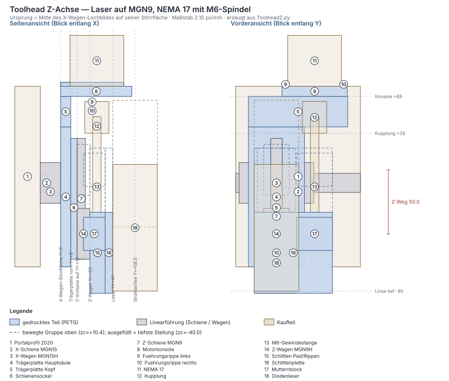

# Toolhead Z-Achse — kompletter Aufbau

Erzeugt von `fusion/ToolheadZ/ToolheadZ.py` (Baugruppe, vier gedruckte Teile).
Geprüft mit `python3 tools/toolhead_check.py`, Layout in
[toolhead-z-layout.svg](toolhead-z-layout.svg).

## Was hier zusammenkommt

Der Toolhead hängt am **MGN15H-Wagen der Portalführung** und bringt seine
eigene Z-Achse mit: eine MGN9-Führung, angetrieben von einem NEMA 17 über eine
flexible Kupplung auf eine M6-Gewindestange. Der Laser sitzt auf dem Z-Schlitten.

| Pos | Teil | Material | Funktion |
|---|---|---|---|
| 1 | **Trägerplatte** mit angeformter **Motorkonsole** | PETG, 8 mm | sitzt auf dem X-Wagen, trägt Schienensockel, Konsole und Führungsrippen |
| 2 | **Schlittenplatte** | PETG | auf dem MGN9H-Z-Wagen, trägt den Laser |
| 3 | **Mutternblock** | PETG | zwei M6-Muttern, federverspannt, schwimmend verschraubt |

Die Motorkonsole ist **Teil der Trägerplatte**, kein eigenes Bauteil — siehe
[Motorbefestigung](#motorbefestigung-alle-vier-schrauben-erreichbar).

## Bezugsebene und Koordinaten

**Ursprung = Mitte des X-Wagen-Lochbildes, auf seiner Stirnfläche.** Das ist die
Passfläche, an der die Trägerplatte anliegt — genau die Ebene, deren Höhe beim
ersten Versuch gefehlt hat. Alles ist von hier aus bemaßt.

* X = quer, längs des Portals
* Y = nach vorn, weg vom Portal
* Z = senkrecht, Verfahrrichtung der Z-Achse

Im Fusion-Modell sind Y und Z getauscht (Modell-Z = Maschine Y), damit alle
Plattenskizzen in einer Ebenenfamilie liegen und es keine
Richtungsverwechslungen beim Extrudieren gibt.

## Y-Kette (ab X-Wagen-Stirnfläche)

| Y | Ebene |
|---|---|
| −16,0 | Portalprofil, Auflage der MGN15-Schiene |
| −6,0 | Oberkante X-Schiene (6 mm Luft zur Trägerplatte) |
| **0** | **X-Wagen-Stirnfläche = Rückseite Trägerplatte** |
| +8,0 | Vorderseite Trägerplatte |
| +13,0 | Sockelfläche = Auflage der MGN9-Z-Schiene |
| +19,5 | Oberkante Z-Schiene |
| +23,0 | Stirnfläche Z-Wagen = Rückseite Auflagepad |
| +35,0 | Rückseite Schlittenplatte (Auflagepad 12 mm) |
| +41,0 | Anschraubfläche des Lasers |
| **+58,5** | **Strahlachse** |

Die MGN9-Schiene sitzt auf einem **Sockel von 5 mm** — nur so sitzen die
M3-Gewindeeinsätze 7 mm tief im Material. Der Sockel ist **genau so breit wie
die Schiene (9 mm)**; wäre er breiter, würden die Schürzen des Wagens daran
streifen. Das prüft `toolhead_check.py` ausdrücklich.

## Z-Kette und Verfahrweg

| Z | Ebene |
|---|---|
| −130,0 | Bettoberfläche (`bett_abstand`) |
| −120,3 | Unterkante Schlittenplatte, tiefste Stellung |
| −110,8 | Laser-Unterkante (Linse), tiefste Stellung |
| −66,0 | Unterkante Trägerplatte |
| −60,0 | Unterkante MGN9-Schiene (**200 mm lang, 10 Schrauben**) |
| −40,1 … +96,0 | Bereich der Wagenmitte `zc` |
| +116,0 … +141,0 | flexible Kupplung |
| +140,0 | Oberkante MGN9-Schiene |
| +145,0 | Unterseite Motorkonsole = Oberkante Trägerplatte |
| +153,0 | Motorflansch |
| +193,0 | Oberkante NEMA 17 |

**Nutzbarer Verfahrweg: 136,1 mm.** Vier Dinge begrenzen ihn; das Skript rechnet
alle vier aus und nennt die bindende:

| Grenze | zc max |
|---|---|
| **Schlittenplatte gegen Kupplung** | **+96,0** ← bindend |
| Mutternblock gegen Kupplung | +100,0 |
| Laser-Oberkante gegen Motorkonsole | +113,2 |
| Wagen am oberen Schienenende | +120,1 |

### Die Schiene sitzt in Z fest — das begrenzt die Werkstückhöhe

Die Z-Schiene hängt an der Trägerplatte am X-Wagen: sie fährt in X und Y mit,
aber **nicht** in Z. Ihr unteres Ende ist damit ein dauerhaftes Hindernis auf
seiner Höhe und muss über dem dicksten Werkstück bleiben — sonst rammt es das
Werkstück beim Verfahren. Dasselbe gilt für die Unterkante der Trägerplatte,
die 6 mm tiefer liegt.

Genau deshalb wächst die 200-mm-Schiene **nach oben**: Unterkante bleibt bei
−60 (20 mm Luft über einem 50-mm-Werkstück), Oberkante geht auf +140, und die
Motorkonsole rückt von +68 auf +145. Nach unten wäre die Schiene mit 200 mm
bis −125 gekommen — 45 mm **in** das Werkstück hinein.

Damit ist nicht mehr der Verfahrweg die Grenze für dicke Werkstücke, sondern
die Plattenunterkante: **59 mm** bei 5 mm Luft (`werkstueck_frei` im Bericht).
Mehr geht nur, indem `traeger_z_unten` steigt — das kostet Weg nach unten und
damit den Fokus auf dünnem Material.

Die Kollisionsprüfung fährt den Weg in 21 Stellungen ab und prüft jedes bewegte
Teil gegen jedes feste, einschließlich Portalprofil und X-Schiene.

## Motorbefestigung: alle vier Schrauben erreichbar

Ein NEMA 17 hat **Gewinde im Flansch**, kein Durchgangsloch. Er wird also
zwangsläufig **von unten** verschraubt — ein Durchstecken von oben ist nicht
möglich. Beide Schraubenreihen brauchen deshalb einen freien senkrechten
Korridor.

Genau daran hängt die Lage der Spindelachse:

* Die hintere Reihe liegt bei `spindel_y − 15,5`. Damit ein Ø6-Korridor an der
  Trägerplatte (Y = 0…8) vorbeikommt, muss `spindel_y ≥ 28` sein.
* Nach vorn begrenzt die Wand vor der Spindelbohrung im Mutternblock:
  `schlitten_y1 ≥ spindel_y + 6,3`.

Gewählt: **`spindel_y` = 28,5 mm**, damit 2,0 mm Luft zum Korridor und 3,2 mm
Wand im Mutternblock. Die Schlittenplatte muss dafür mit nach vorn — über
`pad_hoehe` = 12 mm (statt 6). Damit liegen die hinteren Schrauben bei
Y = +13,0 mm, also **13 mm vor der Trägerplatte**.

Zusätzlich fassen **zwei Führungsrippen** (3 mm hoch) den Motorflansch links und
rechts mit 0,4 mm Spiel: der Motor findet beim Einsetzen selbst seine Lage, und
die Schrauben müssen kein Moment übertragen (bei 0,4 Nm Haltemoment wären es
rund 9 N je Rippe).

`toolhead_check.py` prüft für **jede** der vier Schrauben einen freien
senkrechten Korridor von Ø6 mm gegen alle festen Teile — auch an der Kupplung
vorbei — und prüft die Luft zur Trägerplatte als eigene Größe.

### Was diese Variante kostet

| | vorher | jetzt |
|---|---|---|
| Spindelachse Y | 21,0 | **28,5** mm |
| `pad_hoehe` | 6 | **12** mm |
| Strahlachse | 52,5 | **58,5** mm |
| Z-Wagen-Schraube | M3×8 | **M3×14** |
| Schlittenplatte | ~25 g | **38 g** (gemessen, Rev. 11) |

Trägerplatte, Z-Schiene und Gewindestange bleiben davon unberührt. Der
Verfahrweg lag damals bei 50,45 mm; er ist mit Rev. 14 auf 55,1 mm gewachsen
(Laser tiefer, also nicht mehr die Motorkonsole als Grenze) und mit Rev. 16 auf
136,1 mm (Schiene 200 mm).

**Beim Anziehen beachten:** die Z-Wagen-Schrauben klemmen jetzt **12 mm PETG**
statt 6 (der Kopf sitzt in der Ø6,5-Freibohrung auf der Pad-Vorderseite). Eine
doppelt so lange Kunststoffsäule setzt sich auch doppelt so viel, wenn das
Material kriecht — handfest anziehen und Schraubensicherung verwenden. Die
Freibohrung tiefer ins Pad zu legen (und so nur 6 mm zu klemmen) geht nicht
kostenlos: sie käme dem Ø8-Kopffreiraum der oberen Laserschraube auf 0,8 mm
nahe — zu wenig Wand für PETG.

## Laserhöhe: Langloch statt rechnen

Die Lage des Lasers am Schlitten (`laser_versatz_z`) hängt an zwei Dingen, die
nichts miteinander zu tun haben:

**Montage.** Das Gewinde der Laserbefestigung sitzt im Modul, also wird von
hinten verschraubt. Liegt die obere Lochreihe auf der Wagenmitte, steht der
Z-Wagen davor und der Inbus hat 12 mm Platz — zu wenig. Die Reihe muss weiter
weg als halbe Wagenlänge plus Werkzeugradius (19,95 + 3 = 22,95 mm).

**Fokus.** Gemessen sind **130 mm** von der Bezugsebene bis zur Bettoberfläche
(`bett_abstand`) und **50 mm** dickstes Werkstück (`werkstueck_max`). Mit der
200-mm-Schiene liegt die Gehäuseunterkante des Lasers über dem Bett zwischen
**19,2 und 155,2 mm**. Der Fokusabstand *f* des Moduls steht nicht auf dem
Modul — deshalb sind die vier Laserbefestigungen **senkrechte Langlöcher**,
±8 mm, und die Höhe wird beim Zusammenbau eingestellt:

| f | Langlochstellung | Bemerkung |
|---|---|---|
| 15 mm | 4,2 mm nach unten | die Linse kommt sonst nicht tief genug für dünnes Material |
| 20 … 35 mm | Lochmitte (0) | in beide Richtungen Luft zum Nachstellen |

**Nach oben nutzbar sind +2,8 mm** — nicht weil der Hub endet, sondern weil die
obere Schraubenreihe sonst hinter dem Z-Wagen verschwindet und nicht mehr
verschraubbar ist. Mit 55 mm Verfahrweg (Schiene 95 mm) war das die bindende
Grenze und ergab `f ≤ 27,1 mm`; mit 136 mm Weg ist diese Grenze weg — jeder
Fokusabstand von 13 bis 35 mm geht auf. Du musst *f* also nicht kennen, um die
Platte zu drucken; nur zum Einstellen beim Zusammenbau.

Eine dickere Opferplatte wirkt genau wie eine Langlochstellung nach unten
(1 mm dicker = 1 mm tiefer) — mit dem langen Verfahrweg brauchst du sie für den
Fokus nicht mehr.

## Versteifungsrippen an der Säule

Mit der Konsole auf +145 sitzt der Motor **132,5 mm** über der Verschraubung am
X-Wagen. Sein Gewicht (280 g) biegt die 8 mm dünne Säule dort um **0,57 mm**
durch — ein statischer Versatz, der die Gewindestange schiefstellt. Zwei
Rippen auf der Vorderseite (4 mm breit, 6,5 mm hoch, über die ganze
Säulenhöhe) bringen das auf **0,22 mm**; das Skript rechnet beide Werte im
Bericht mit.

Die Rippen sitzen an den **Kanten** der Säule (X = ±18 … ±22), nicht weiter
innen. Dazwischen ist kein Platz:

* bei X = +14,5 läuft der senkrechte Korridor der hinteren Motorschraube
  durch — eine Rippe dort macht sie unerreichbar (das hat `toolhead_check.py`
  beim ersten Entwurf sofort gemeldet),
* bei |X| < 13 fährt der Z-Wagen vorbei.

An der Kante wirken sie ohnehin am besten, und 6,5 mm Höhe lässt dem
Mutternblock (ab Y = 18) 3,5 mm Luft. Gedruckt wird nichts anders: sie stehen
wie der Schienensockel nach oben, kein Stützmaterial.

## Warum Trägerplatte und Konsole ein Teil sind

Du hast es selbst vorgeschlagen, und es ist die bessere Lösung:

* Die Verschraubung Halter ↔ Platte entfällt komplett — vier Schrauben, vier
  Muttern und zwei Anschraublaschen weniger, und nichts kann sich lösen.
* Die Konsole wird steifer: sie hängt nicht an vier M3, sondern ist
  durchgehendes Material.
* **Es druckt sich sogar besser.** Mit der Rückseite (Passfläche) auf dem Bett
  stehen Platte, Sockel, Konsole *und* Führungsrippen alle auf dem Bett. Die
  Konsole wächst als Wand in Aufbaurichtung mit, ohne Überhang — kein
  Stützmaterial. Das Kragmoment des Motors an der Konsole beträgt 0,04 Nm; die
  Biegespannung quer zur Schicht liegt bei etwa 0,07 MPa, also weit unter allem,
  was PETG in der Schichthaftung kann.

Das Bauteil wird damit 78 × 222 × 56 mm groß und passt liegend in den A1
(Bett 256 mm).

## Massen

| Teil | Volumen | Masse PETG | Bauraum | Quelle |
|---|---|---|---|---|
| Trägerplatte mit Konsole | ≈ 121 cm³ | **≈ 154 g** | 78 × 222 × 56 mm | gerechnet, Rev. 16 |
| Schlittenplatte | 40,1 cm³ | **50,9 g** | 62 × 97 × 18 mm | Fusion-Lauf Rev. 14 |
| Mutternblock | 9,8 cm³ | **12,4 g** | 28 × 26 × 17 mm | Fusion-Lauf Rev. 14 |
| **Druckteile zusammen** | ≈ 171 cm³ | **≈ 217 g** | | |

Die Trägerplatte ist mit Rev. 16 von 145 auf 222 mm gewachsen (Schiene 200 mm,
Konsole auf +145) und wog vorher 98,4 g. Der Wert ist aus dem Querschnitt
gerechnet — **maßgeblich ist der Validierungsbericht des nächsten
Fusion-Laufs**. Schlittenplatte und Mutternblock sind unverändert.

Dazu die drei Bohrlehren aus PLA (1,24 g/cm³), die nur bei Bedarf gedruckt
werden: 6,1 g (X-Wagen) · 3,6 g (Z-Wagen) · 6,7 g (Laser).

Das sind **Vollmaterial-Massen** (100 % Füllung) und damit eine Obergrenze.
Für den Druck selbst ist die Dichte in Fusion ohne Bedeutung — Bambu Studio
rechnet mit der Dichte des gewählten Filamentprofils, das Modell trägt keine
Materialinformation. Mit 4 Wandlinien und 40 % Infill liegt das echte
Druckgewicht rund ein Drittel darunter; maßgeblich ist die Anzeige im Slicer.
Die Werte hier dienen der Plausibilitätskontrolle und der Abschätzung der
bewegten Masse.

Bewegte Masse auf der X-Achse, grob: 217 g Druckteile + 280 g NEMA 17 + 400 g
Laser + 115 g MGN9-Schiene (200 mm) und Wagen + 71 g Gewindestange und
Kupplung ≈ **1,08 kg**. Für einen MGN15H unkritisch (statische Momenttragzahl
im zweistelligen Nm-Bereich, hier rund 1 Nm).

Die Trägerplatte ist mit ≈ 121 cm³ das schwerste Teil, davon etwa 23 cm³
allein die Motorkonsole und 64 cm³ die Säule. Ließe sich mit Taschen in Hauptsäule und Kopfbereich
reduzieren — bisher nicht gemacht, weil die Steifigkeit dort die Genauigkeit
der ganzen Z-Achse bestimmt.

## Z-Antrieb: M6 behalten, aber spielfrei und schwimmend

Die Gewindestange bleibt — geändert ist, **wie** die Mutter angebunden ist. Zwei
Dinge machen den Unterschied:

**Spielfrei durch zwei Muttern mit Feder.** Im Mutternblock sitzen zwei
M6-Muttern in Sechskanttaschen; dazwischen liegt eine Druckfeder (Ø8 × 11 mm)
in einer Kammer. Die Feder drückt die untere Mutter auf den Boden und die obere
unter die Decke des Blocks. Beide Muttern tragen damit auf gegenüberliegenden
Gewindeflanken — das Flankenspiel der Gewindestange ist aufgebraucht, ohne dass
etwas klemmt.

**Die Mutterntaschen halten die Mutter vor dem Festschrauben.** Jede Tasche ist
ein echtes Sechskant mit SW + 0,15 mm, gedreht so, dass die Mutter mit einer
**Flanke** am Taschenboden anliegt und nicht mit einer Ecke — Formschluss auf
allen sechs Flanken, die Mutter kann nicht kippen. Davor sitzt ein um 0,20 mm
**engeres Mundstück** (1,4 mm lang): die Mutter wird einmal hineingedrückt und
rastet hinter einer Stufe von 0,19 mm je Seite ein. Beim Zusammenbauen fällt
sie damit nicht mehr heraus, auch bevor die Schlittenplatte die Tasche
verschließt.

Im Sechskant selbst hat die Mutter bewusst 0,15 mm Spiel und bleibt **in Z
beweglich** — sonst könnte die Feder sie nicht gegen Boden bzw. Decke drücken
und die Spielfreiheit wäre hin. Beide Werte hängen an Parametern
(`tasche_spiel`, `tasche_klemmung`); wird eine Tasche im Druck zu stramm,
reicht eine Änderung im Parameter-Dialog.

Die beiden **M3-Muttern der schwimmenden Verschraubung** sitzen ebenfalls in
Sechskanttaschen (statt vorher quadratischen) und müssen beim Anziehen nicht
von hinten gegengehalten werden. Dafür rücken ihre Bohrungen 5 mm vom Blockrand
ein: über Eck ist die Tasche 6,5 mm breit und braucht noch Wand.

**Schwimmend verschraubt.** Der Block ist mit **zwei M3 durch Ø4,6-Bohrungen**
(statt 3,4) plus großen Scheiben an der Schlittenplatte befestigt. Vorgehen:
Schrauben locker, Z-Achse mehrmals über den ganzen Weg fahren, **dann**
festziehen. Der Block findet dabei die Lage, die die Gewindestange vorgibt —
eine krumme Stange kämpft so nicht gegen die Linearführung. Zusammen mit der
flexiblen Kupplung 5→6 mm bleibt der Rundlauffehler oben, wo er nicht stört.

**Wenn du später doch auf T8/TR8x8 umsteigen willst:** nur der Mutternblock wird
neu gedruckt, alles andere bleibt. Dafür brauche ich das Flanschlochbild deiner
POM-Antibacklash-Mutter — das steht nicht in `hardware.md` und will gemessen
werden.

## Verschraubung

| Verbindung | Schrauben | Hinweis |
|---|---|---|
| Trägerplatte → X-Wagen (MGN15H) | 4 × M3×12 + Scheibe | 3,5 mm Gewindeeingriff bei 4 mm verfügbarer Tiefe |
| Z-Schiene → Sockel | **10 × M3×10 Senkkopf DIN 7991 + 10 × ruthex M3** | Einsätze vor der Montage einschmelzen; Randabstand 10 mm, Lochabstand 20 mm |
| NEMA 17 → Konsole | **4 × M3×12** | 4 mm Eingriff; Führungsrippen zentrieren, Zentrierbund in Ø22,4 |
| Schlittenplatte → Z-Wagen (MGN9H) | 4 × **M3×14** | nur 2 mm Eingriff — MGN9 hat ~2,5 mm Gewinde, **nicht länger**. Länge wird aus `pad_hoehe` abgeleitet |
| Laser → Schlittenplatte | 4 × M3×10 + Scheibe DIN 125 | senkrechtes Langloch 4,0 × ±8 mm; Höhe nach Fokusabstand einstellen, **nach oben max. +2,8 mm** |
| Mutternblock → Schlittenplatte | 2 × M3×16 + Mutter + Scheibe | Ø4,6-Bohrung, ausrichten dann festziehen |

Kaufteile: **MGN9-Schiene 200 mm** + Wagen MGN9H · NEMA 17 (Körper 40 mm,
Welle 5 mm) · M6-Gewindestange, Zuschnitt **190 mm** (187 mm werden gebraucht)
· flexible Kupplung 5→6 mm, 25 mm lang · 2 × M6-Mutter · Druckfeder Ø8 × 11 mm.

## Montagereihenfolge und Werkzeugzugang

`toolhead_check.py`, Abschnitt 6, misst für **jede** Schraube die freie
Werkzeuglänge in einem Korridor Ø6 mm — und zwar in dem Zustand, in dem sie
verschraubt wird (Teile, die es dann noch nicht gibt, blockieren nicht). Unter
**20 mm** ist eine Schraube nicht erreichbar, auch wenn die Bohrung selbst frei
ist: 20 mm ist der kürzeste nutzbare Schenkel eines 2,5-mm-Inbus.

| # | Schritt | Werkzeug | freie Länge |
|---|---|---|---|
| 1 | 10 × ruthex M3 in den Schienensockel einschmelzen | Lötkolben | — |
| 2 | **Trägerplatte an den X-Wagen**, 4 × M3×12 + Scheibe | Inbus von vorn | frei, aber der Korridor streift den Z-Wagen um 0,5 mm → schlanken Schlüssel nehmen, keinen dicken Bit-Halter |
| 3 | Z-Schiene auf den Sockel, 10 × M3×10 Senkkopf DIN 7991 | Inbus von vorn | der Wagen verdeckt je Stellung zwei Schrauben: erst mit dem Wagen unten acht setzen, dann hochschieben und die letzten zwei |
| 4 | **Schlittenplatte auf den Z-Wagen**, 4 × M3×14 | Inbus von vorn durch die Ø6,5-Freibohrungen | frei — **nur solange der Laser nicht dran ist** |
| 5 | Mutternblock bestücken: 2 × M6-Mutter eindrücken, Feder einlegen, 2 × M3-Mutter in die Sechskanttaschen | Finger | — |
| 6 | NEMA 17 zwischen die Führungsrippen, 4 × M3×12 von unten | Inbus von unten | 87 mm mit dem Z-Schlitten unten, 32 mm mit ihm oben — beides reicht, unten ist es bequemer |
| 7 | Kupplung und Gewindestange einsetzen | — | — |
| 8 | Mutternblock an die Schlittenplatte, 2 × M3×16: locker lassen, Achse mehrmals durchfahren, dann festziehen | Inbus von vorn | frei |
| 9 | **Laser zuletzt**, 4 × M3×10 + Scheibe DIN 125, von hinten in die Langlöcher | Inbus von hinten | 27 mm, mit dem Schlitten ganz unten frei |

Schritt 4 und Schritt 9 haben sich bis Rev. 13 gegenseitig zugebaut: das
Gewinde der Laserbefestigung sitzt im Modul, also wird von hinten verschraubt —
lag die obere Lochreihe auf der Wagenmitte, standen der Z-Wagen (12 mm) davor,
und umgekehrt deckte das Lasergehäuse die Ø6,5-Freibohrungen der Wagenschrauben
ab (6 mm). Keine der beiden Reihenfolgen ging auf. Seit der Laser 25,75 mm
tiefer hängt, liegen beide Lochreihen unter Wagen und Trägerplatte: die Platte
kommt zuerst an den Wagen, der Laser zuletzt. Das prüft `toolhead_check.py`
jetzt als eigene Frage — „gibt es überhaupt eine Reihenfolge?" — und nicht mehr
nur „ist der Korridor frei?".

Zwei Dinge, die dabei leicht untergehen:

* Die **Langlochstellung nach oben** ist auf +2,8 mm begrenzt, weil die obere
  Schraubenreihe sonst wieder hinter dem Wagen liegt — siehe
  [Laserhöhe](#laserhöhe-langloch-statt-rechnen).
* Für Schritt 6 und Schritt 9 den **Z-Schlitten nach unten** fahren. Nötig
  ist das nur bei Schritt 9 (die Laserreihen müssen unter der Trägerplatte
  stehen); bei den Motorschrauben wird es damit nur bequemer, 87 statt 32 mm.
  Bis Rev. 13 waren es oben 11 mm — der tiefer hängende Laser hat auch das
  entspannt.

## Zwei Details am Lochbild

**Lochbild des Lasers gegen das des Z-Wagens.** Beide liegen bei X = ±7,5 bzw.
±8,25 mm, können sich also in Z in die Quere kommen. Geprüft wird der Abstand
jeder Laserreihe und jedes Langlochendes zu den Ø6,5-Freibohrungen des Wagens;
der engste Wert ist derzeit 4,50 mm am oberen Langlochende. Bei Rev. 11 war das
der Grund, den Laser genau um `−laser_loch_hoch/2` zu versetzen — heute steuert
`laser_versatz_z` Montagezugang und Fokusfenster, und der Abstand fällt als
Prüfung mit ab.

**Kein Kopf-Freiraum im Pad mehr.** Solange die obere Laserreihe im Auflagepad
lag, brauchte sie dort zwei Ø8-Durchbrüche für Kopf und Scheibe. Seit der Laser
tiefer hängt, liegt die Reihe 15,75 mm unter dem Pad — der Schnitt entfällt
ganz, die Auflage auf dem Wagen wächst von 679 auf **780 mm²**, und das Skript
legt die Durchbrüche nur noch an, wenn `laser_oben_im_pad` es verlangt. Geprüft
wird stattdessen, dass das ganze Langloch samt Scheibe unter dem Pad bleibt
(6,45 mm Luft).

## Rundloch quer, Langloch senkrecht

Die vier Laserbefestigungen waren erst **Langlöcher quer**, weil die Konvention
des `fusion-python`-Skills für Maße mit Status `[?]` Langlöcher verlangt. Mit
der Bestätigung des Bohrbildes am 2026-09-17 fiel dieser Grund weg (Rev. 12:
Rundlöcher Ø4,0). Seit Rev. 14 sind es **Langlöcher senkrecht, 4,0 mm breit,
±8 mm lang** — aus einem anderen Grund: nicht Toleranz, sondern
**Höhenverstellung** für den unbekannten Fokusabstand, siehe
[Laserhöhe](#laserhöhe-langloch-statt-rechnen).

Quer bleibt es damit bei 4,0 mm und bei **±1,0 mm Lochbildtoleranz** je Achse
(Ø4,0 auf Schaft Ø3) — genug für den Schrumpf von 0,2–0,4 mm über 40,5 mm PETG,
und die frühere Messung 40 × 16 liegt noch darin. Verstellweg quer bringt beim
Laser ohnehin nichts: die Querlage ist nur ein Koordinatenversatz, keine
Ausrichtung. Die DIN-125-Scheibe Ø7 deckt das 4-mm-Langloch mit 1,5 mm
Auflage je Seite.

Der Verstellweg quer brachte beim Laser ohnehin nichts: die Querlage ist nur
ein Koordinatenversatz, keine Ausrichtung. Die Umstellung hat dafür an vier
Stellen Luft geschaffen — die Scheibe ist jetzt DIN 125 Ø7 statt DIN 9021 Ø9,
und der Kopffreiraum im Pad konnte von Ø10 auf Ø8 schrumpfen:

| Maß | mit Langloch | mit Rundloch Ø4,0 |
|---|---|---|
| Scheibe ↔ Mittelrippe | 1,25 mm | **2,25 mm** |
| Scheibe ↔ Seitenrippe | 0,75 mm | **1,75 mm** |
| Kopffreiraum ↔ Padrand | 1,75 mm | **2,75 mm** |
| Kopffreiraum ↔ Wagenbohrung | 1,30 mm | **2,30 mm** |
| Restauflage des Pads | 623 mm² | **679 mm²** |

`laser_loch_d` ist ein Parameter: sollte der Schrumpf doch größer ausfallen,
reicht Ø4,5 (±1,25 mm) — die DIN-125-Scheibe deckt das noch.

## Druck (PETG, Bambu Lab A1)

| Teil | Lage aufs Bett | Warum |
|---|---|---|
| Trägerplatte (mit Konsole) | Rückseite (Passfläche) unten | Platte, Sockel, Konsole, Säulen- und Führungsrippen stehen alle auf dem Bett — keine Stützen, alle Kräfte in der Schicht. 222 mm lang, passt liegend in den A1 |
| Schlittenplatte | Laser-Anschraubfläche unten | Brücke 11 mm zwischen den Rippen; die Langlöcher liegen in der Wand, keine Stützen |
| Mutternblock | Unterseite unten | Spindelbohrung wird rund |

4 Wandlinien, ≥ 40 % Infill. An jeder Auflagefläche sitzt eine Fase von
0,4 × 45° — ohne sie hebt der Elefantenfuß der ersten Schicht das Teil von der
Passfläche ab.

## Vor dem Druck prüfen

Das Skript legt drei **ausgeblendete Bohrlehren** an (3 mm, PLA): im Browser
einblenden, drucken, ans reale Teil halten.

| Lehre | prüft |
|---|---|
| `Bohrlehre_XWagen` | 25 × 25 mm — sitzt am Portal wirklich ein MGN15H? |
| `Bohrlehre_ZWagen` | 16 × 15 mm — MGN9H, am 2026-09-17 am Teil bestätigt `[v]` |
| `Bohrlehre_Laser` | 40,5 × 16,5 mm — am 2026-09-17 am Teil bestätigt `[v]` |

**Eine Lehre gibt es nur für Lochbilder von Kaufteilen** — also für Teile, die
dieses Skript nicht selbst erzeugt. Damit weicht das bewusst von der
Konvention des `fusion-python`-Skills ab, die auch für Verbindungen zwischen
zwei getrennt gedruckten Teilen eine Lehre vorsieht. Für Mutternblock ↔
Schlittenplatte wäre sie ohne Nutzen: beide Lochbilder hängen an derselben
Variable (`block_schraube_x`), und die Bohrung in der Platte ist mit Ø4,6
gegen Ø3,4 absichtlich übergroß, damit sich der Block schwimmend ausrichten
lässt. Was eine Lehre dort prüfen würde, ist als Verstellbarkeit eingebaut —
und die prüft `toolhead_check.py` als „Ausrichtspiel der schwimmenden
Verschraubung".

Stand der offenen Punkte aus `hardware-notizen.md`:

* **Z-Führung: geklärt.** MGN9H, am 2026-09-17 mit der Bohrlehre am Wagen
  bestätigt (äußeres Lochpaar, 16 mm längs). Die Lehre hat seitdem nur noch ein
  Lochbild und folgt dem Parameter.
* **X-Wagen: offen.** Die alte Messung „26 × 25 mm am Toolhead-Wagen" gehört
  zu ihm, nicht zur Z-Achse — MGN15H = 25 × 25 passt dazu, ist aber noch nicht
  mit der Lehre bestätigt.
* **Laser-Bohrbild: geklärt.** **40,5 × 16,5 mm**, am 2026-09-17 mit
  `Bohrlehre_Laser` am Modul bestätigt. Das war die dritte Messung (vorher
  39 × 15 und 40 × 16); die Messhistorie bleibt im Bericht stehen.
  Weil die Lehre **Ø3,4-Rundlöcher** hat, ist damit zugleich bewiesen, dass
  Rundlöcher an dieser Stelle passen — umgesetzt, siehe [Warum Rundlöcher statt
  Langlöcher](#warum-rundlöcher-statt-langlöcher).

## Wenn ein Teil an der falschen Stelle landet

Fusion orientiert die Achsen einer Skizzenebene und die Normale einer
Offset-Ebene nicht immer so, wie man es erwartet — und meldet dabei **keinen
Fehler**, das Teil landet einfach gespiegelt oder verschoben. Das Skript
verlässt sich deshalb an drei Stellen nicht auf Annahmen (Rev. 2):

* **Offset-Ebenen messen ihre eigene Lage nach** und korrigieren das
  Vorzeichen selbst, statt es zu raten.
* **Skizzenpunkte** werden über `modelToSketchSpace` aus Maschinenkoordinaten
  umgerechnet, statt die Achsrichtung der Ebene anzunehmen.
* **Durchgangs- und Taschenschnitte sind symmetrisch** um ihre Skizzenebene.
  Damit ist die Normalenrichtung irrelevant — ein einseitiger `ThroughAll`
  bricht sonst mit `EXTRUDE_ZERO_DISTANCE_ERROR` ab, sobald die Normale vom
  Material wegzeigt.

Zusätzlich prüft das Skript nach jedem Teil die **Bounding Box gegen den
erwarteten Bauraum** und schreibt Abweichungen in den Validierungsbericht.
Steht dort eine Zeile wie `Mutternblock: Y liegt -29.0..-12.0, erwartet
12.0..29.0`, ist eine Achse gespiegelt — dann bitte melden, die Zeile sagt
genau, welche.

## Parametrik

Alle Werte aus dem `MASSE`-Block landen als Fusion-User-Parameter im Dialog
*Ändern → Parameter*. Die **absoluten Lagen** rechnet `lage()` in Python aus
diesen Werten — nach einer Parameteränderung also das Skript neu laufen lassen
und `tools/toolhead_check.py` ausführen. Die wichtigsten Stellschrauben:

| Parameter | Wert | Wirkung |
|---|---|---|
| `z_schiene_laenge` | **200 mm** | Länge der Z-Führung (vorhandene Schiene) |
| `z_schiene_randab` | 10 mm | Randabstand des ersten Lochs — muss zur Schiene passen, sonst sitzen die Gewindeeinsätze falsch |
| `konsole_unten` / `konsole_dicke` | **145** / 8 mm | Motorkonsole, 5 mm über dem Schienenende |
| `traeger_kopf_unten` | 115 mm | ab hier wird die Platte breit (trägt die Konsole) |
| `saeule_rippe_x0` / `_x1` / `_tiefe` | 18 / 22 / 6,5 mm | Versteifungsrippen der Säule |
| `spindel_x` / `spindel_y` | 30 / 28,5 mm | Lage der Spindelachse; `spindel_y` bestimmt den Schraubzugang |
| `laser_versatz_z` | −46 mm | Lage des Lasers am Schlitten — bindet Montagezugang **und** Fokusfenster |
| `laser_langloch_hub` | 8 mm | senkrechter Verstellweg je Richtung (nach oben nutzbar: +2,8 mm) |
| `laser_loch_d` | 4,0 mm | Langlochbreite; ±1,0 mm Lochbildtoleranz quer |
| `bett_abstand` | 130 mm | gemessen: Bezugsebene → Bettoberfläche (nur Bericht) |
| `werkstueck_max` | 50 mm | dickstes Werkstück (nur Bericht) |
| `inbus_frei_d` | 6,0 mm | Werkzeugkorridor, begrenzt die Langlochstellung |
| `traeger_dicke` | 8 mm | Dicke der Trägerplatte |
| `motor_rippe_hoehe` | 3 mm | Höhe der Führungsrippen am Motorflansch |
| `m3_uebermass` | 4,6 mm | Ausrichtspiel des Mutternblocks |
| `tasche_spiel` | 0,15 mm | Spiel der Mutterntaschen auf die Schlüsselweite |
| `tasche_klemmung` | 0,20 mm | Untermaß im Mundstück — hält die M6-Mutter |
