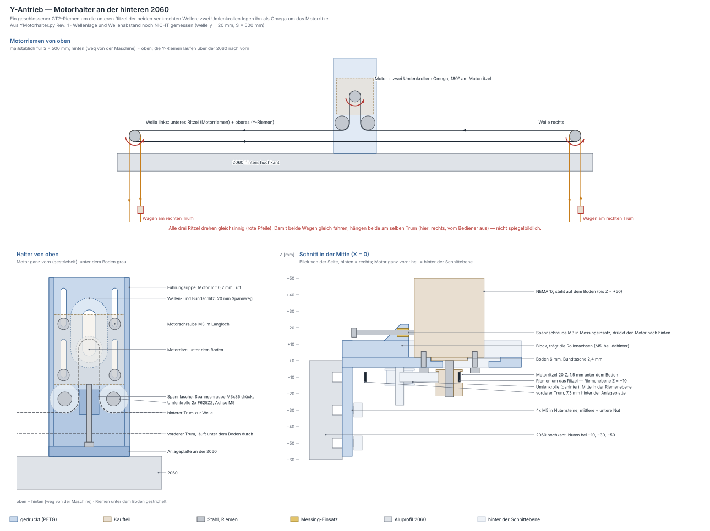

# Y-Motorhalter — Antrieb der Y-Achse

Erzeugt von `fusion/YMotorhalter/YMotorhalter.py` (ein Druckteil, Rev. 3).
Geprüft mit `python3 tools/y_motorhalter_check.py`, Skizze in
[y-antrieb.svg](y-antrieb.svg) (neu erzeugen mit
`python3 tools/y_antrieb_zeichnen.py`).

## Was hier zusammenkommt

So sieht der Y-Antrieb nach deinen Angaben und dem Foto aus (2026-09-26):

* **Zwei NEMA 17, je Seite einer**, jeweils am Ende ihrer 2040. Die 2040
  steht hochkant, liegt auf der hinteren 2060 und steht über sie hinaus.
  Oben auf ihr sitzt die Linearführung.
* Der **Y-Riemen läuft in den oberen Nuten** beider Seitenflächen der 2040
  und am Profilende um das Ritzel.
* Das **Ritzel sitzt direkt auf der Motorwelle**, mittig zur 2040. Der Motor
  hängt unter einer Platte etwa auf Höhe der unteren Nut, die Welle zeigt
  nach oben.
* Befestigt wird mit **Nutensteinen in den unteren Nuten**, weil in den
  oberen der Riemen läuft. Die Schrauben sitzen an **beiden**
  Seitenflächen, der Halter ist also ein U-Bügel.
* Gespannt wird, indem der **Motor in Langlöchern** vom Profilende
  wegrückt.

| Teil | Material | Funktion |
|---|---|---|
| **2× Y-Motorhalter** | PETG, 34 g je Stück (voll gerechnet) | Schenkel an beiden Seitenflächen, Joch vor der Stirnseite, Platte für den Motor, Führungswände |
| 2× NEMA 17 + GT2-Ritzel 20 Z, Bohrung 5 | Kaufteil | Motor hängt unter der Platte, Ritzel auf Höhe der oberen Nut |
| 8× M5×12 + Scheibe + Nutenstein M5 (Nut 6) | Kaufteil | je Halter 4, in den unteren Nuten |
| 8× M3×10 + Scheibe DIN 125 | Kaufteil | je Motor 4, von oben |

Das Teil ist symmetrisch zur Mitte der 2040. **Dasselbe Teil passt links
und rechts**: zweimal drucken, nichts spiegeln.

## Rev. 3: neues Konzept (2026-09-26)

Rev. 1 und 2 beruhten auf einem Missverständnis. Dort saß **ein** Motor
mittig an der hinteren Traverse. Ein geschlossener Riemen trieb über ein
Omega mit zwei Umlenkrollen zwei senkrechte Edelstahlwellen. Dein Foto
zeigt etwas anderes: Der Y-Riemen läuft in den oberen Nuten der 2040 und
kehrt am Profilende um. Genau dort sitzt der Motor, das Ritzel direkt auf
seiner Welle. Rev. 3 ersetzt den alten Halter deshalb ganz. Umlenkrollen,
Motorriemen und Edelstahlwellen braucht der Y-Antrieb nicht mehr.

Deine beiden Korrekturen von vorher gelten weiter:

* **Nutensteine nur in der unteren Nut**, oben läuft der Riemen.
* **Motor in die Profilmitte.** Beim jetzigen Winkel liegt die Motorachse
  rund 15 mm neben der Mitte. Jetzt liegt sie genau auf X = 0, und beide
  Trume laufen gerade in ihre Nut.

## Bezug und Koordinaten

**Y = 0 ist die Stirnseite der 2040, +Y zeigt vom Profil weg. Z = 0 ist
ihre Unterkante, X = 0 ihre Mitte.** Im Fusion-Modell sind Y und Z
getauscht wie im Toolhead (Modell-Z = Maschine Y).

### Y-Kette (ab Stirnseite der 2040)

| Y | Ebene |
|---|---|
| −40 | Schenkel hinten |
| −30 / −10 | M5 in der unteren Nut, je Seite |
| **0** | **Stirnseite der 2040 = Anlage des Jochs** |
| +4 | Joch vorn |
| +5,0 | Motor vorn, ganz innen |
| **+26,15 … +34,15** | **Motorachse**, ganz innen … ganz außen (Spannweg 8 mm) |
| +55,3 | Motor hinten, ganz außen |
| +56,8 | Platte und Führungswände vorn |

### Z-Kette (ab Unterkante der 2040)

| Z | Ebene |
|---|---|
| +40 | Oberkante der 2040, darauf die Linearführung |
| +34,5 | Ritzel oben = Wellenende |
| +33 / +27 | Riemen oben / unten |
| **+30** | **Riemenmitte = Mitte der oberen Nut** |
| +26,9 | untere Kante der oberen Nutöffnung |
| +22 | Madenschraube in der Ritzelnabe |
| +18,5 | Ritzel unten (Nabe) |
| **+16,5** | **Platte oben = Oberkante des ganzen Halters** |
| +12,5 | Zentrierbund oben (steckt in der Platte) |
| +10,5 | Motorflansch = Platte unten |
| **+10** | **M5 in der unteren Nut** |
| +1 | Halter unten |
| 0 | Unterkante der 2040 |
| −37,5 | Motor unten (48er; ein 40er endet bei −29,5) |

## Der Riemen in der Nut — warum 20 Zähne

Liegt das Ritzel mittig, liegen die beiden Trume genau einen
Teilkreisdurchmesser auseinander. Mit 20 Zähnen sind das 12,73 mm, und beide
Trume laufen in der Mitte ihres Nutkanals:

* Riemenrücken **3,26 mm** hinter der Seitenfläche: **1,46 mm** Luft zur
  Lippe (1,8 mm)
* Zahnspitzen **4,64 mm** hinter der Seitenfläche: **1,36 mm** Luft zum
  Nutgrund (6,0 mm)

| Ritzel | Luft zur Lippe | Luft zum Nutgrund | |
|---|---|---|---|
| 16 Z | 2,73 mm | **0,09 mm** | streift |
| 18 Z | 2,09 mm | 0,73 mm | knapp |
| **20 Z** | **1,46 mm** | **1,36 mm** | **mittig** |
| 22 Z | 0,82 mm | 2,00 mm | knapp |
| 24 Z | **0,18 mm** | 2,64 mm | streift |

Die Nutmaße sind Richtwerte für Nut 6 `[w]`. Ist dein Nutgrund flacher,
`nut_tiefe` eintragen und das Prüfwerkzeug laufen lassen. Umschlingung
180 Grad, 10 Zähne im Eingriff, 40 mm je Umdrehung, also 80 Schritte/mm
bei 1/16.

## Aufbau des Halters

**Schenkel.** Zwei Schenkel, 6 mm dick und 40 mm lang, liegen an beiden
Seitenflächen der 2040 an, von Z = 1 bis 16,5. Jeder hat zwei M5 in der
unteren Nut, bei Y = −10 und −30. Oberhalb von Z = 16,5 bleibt die
Seitenfläche frei, also auch die ganze obere Nut. Innen sind 0,2 mm Luft
je Seite, die Schrauben ziehen die Schenkel an.

**Joch.** Eine 4 mm dicke Wand quer vor der Stirnseite verbindet die beiden
Schenkel und liegt an der Stirnseite an. Damit sitzt der Halter längs des
Profils immer an derselben Stelle, und der Riemenzug drückt ihn gegen die
Stirnseite, statt an den Schrauben zu ziehen.

**Platte.** Sie ist 6 mm dick und liegt vor der Stirnseite bei Z = 10,5 bis
16,5. Der Motor hängt darunter, der Flansch liegt an ihrer Unterseite an,
die Welle zeigt nach oben. Zentrierbund und Welle gehen durch ein 22,4 mm
breites Langloch, die vier M3 durch Langlöcher. Alle fünf erlauben ±4 mm.
Dicker geht die Platte nicht: 24 mm Motorwelle = 6 mm Platte + 2 mm Luft
+ 16 mm Ritzel.

**Führungswände.** Unter der Platte stehen links und rechts neben dem Motor
zwei 4 mm dicke Wände, je 1 mm vom Motor entfernt. Sie führen ihn beim
Spannen gerade und steifen die Platte aus.

Alles endet oben bündig bei Z = 16,5. Diese Fläche liegt beim Druck auf dem
Bett.

## Ritzel und Motorwelle

Ritzel **mit der Nabe nach unten** aufschieben, bis seine Oberkante bündig
mit dem Wellenende ist (Z = 34,5). Dann steht die 7 mm breite Spur mittig
auf Z = 30, und der 6 mm breite Riemen läuft gerade in die Nut. Die
Madenschraube (Z = 22) trifft die Abflachung, die bei 15 mm Länge `[w]` auf
Z = 19,5 beginnt. Zwischen Ritzel und Platte bleiben 2 mm.

Läuft der Riemen nicht gerade in die Nut, das Ritzel auf der Welle etwas
verschieben. Bis zu 1 mm über das Wellenende hinaus ist in Ordnung.

## Spannen

1. Halter montiert, Motor ganz innen, die vier M3 lose.
2. Riemen um das Ritzel legen, beide Trume in ihre obere Nut.
3. Motor vom Profil weg nach außen ziehen, zum Beispiel mit einem
   Schraubendreher als Hebel zwischen Joch und Motor. Jeder Millimeter macht
   den Riemenweg 2 mm länger, insgesamt sind es **16 mm**.
4. Richtwert **~20 N je Trum**. Zum Prüfen den freien Trum anzupfen und mit
   einer Stimmgeräte-App messen: f = 1/(2·l) · √(T/μ) mit μ ≈ 8 g/m. Bei
   l = 300 mm freier Länge und 20 N sind das **~83 Hz**.
5. Die vier M3 von oben festziehen. Über den Schraubenköpfen ist Platz für
   den Inbus, Riemen und Ritzel bleiben weit weg.

## Freigänge und engste Stellen

| Stelle | Luft | |
|---|---|---|
| Riemenrücken → Lippe der Nut | **1,46 mm** | siehe [20 Zähne](#der-riemen-in-der-nut--warum-20-zähne) |
| Zahnspitzen → Nutgrund | **1,36 mm** | |
| Motor → Joch, ganz innen | 1,0 mm | Anschlag des Spannwegs |
| Motor → Führungswand, je Seite | 1,0 mm | |
| Zentrierbund → Langloch, je Seite | 0,2 mm | führt quer |
| Ritzel → Platte | 2,0 mm | |
| M3-Kopf → Riemen | 7,0 mm | |
| Halter oben → obere Nutöffnung | 10,4 mm | die obere Nut bleibt frei |
| Ritzel oben → Oberkante der 2040 | 5,5 mm | nichts ragt nach oben heraus |
| Steg Bundschlitz → Motorlangloch | 4,3 mm | engster Steg |

## Kräfte und Steifigkeit

Der Riemen zieht das Ritzel mit 2 × 20 N zum Profil hin. Das nimmt das Joch
als Druck an der Stirnseite auf. Weil der Riemen 13,5 mm über der
Oberkante des Jochs zieht, will er den Halter über diese Kante kippen. Die
Schenkel halten unten an den M5 mit rund **83 N** Reibung dagegen. Die vier
M5 klemmen etwa das Fünffache davon, vorsichtig gerechnet mit 500 N je
Schraube auf PETG und μ = 0,2.

Unter dem Riemenzug kippt der Motor um **0,08 Grad**, das Ritzel weicht um
0,02 mm aus (Platte mit Führungswänden, PETG quer zur Schicht mit
1500 N/mm²). Das Motorgewicht biegt die Platte nicht messbar durch. Das
Haltemoment des Motors (0,45 Nm) halten die vier M3 über Reibung mit
zwölffacher Reserve.

## Verschraubung

| Verbindung | Teile | Hinweis |
|---|---|---|
| Halter → 2040 | **4× M5×12 + Scheibe + Nutenstein M5 (Nut 6)** | je Seite zwei in der unteren Nut; 4,8 mm ragen in die Nut, 3,0 mm Eingriff im Stein |
| NEMA 17 → Platte | **4× M3×10 + Scheibe DIN 125** | von oben durch die Langlöcher, 3,5 mm Eingriff (Gewindetiefe 4,5) |
| Ritzel → Motorwelle | Madenschrauben | Nabe unten, eine auf die Abflachung |

Für beide Seiten zusammen: 8× M5×12, 8 Scheiben M5, 8 Nutensteine, 8× M3×10,
8 Scheiben M3.

## Montage

1. Je Profilende **vier Hammermuttern M5** einsetzen, zwei in die **untere**
   Nut jeder Seitenfläche.
2. **Halter** von vorn über das Profilende schieben, bis das Joch an der
   Stirnseite anliegt. 4× M5×12 mit Scheibe, festziehen.
3. **Motor** von unten zwischen die Führungswände setzen, den Bund in das
   Langloch, ganz nach innen. Den Stecker zur Seite oder nach außen drehen,
   nicht zur 2060. 4× M3×10 mit Scheibe von oben, noch lose.
4. **Ritzel** mit der Nabe nach unten aufschieben, Oberkante bündig mit dem
   Wellenende, Madenschraube auf die Abflachung.
5. **Riemen** um das Ritzel legen, beide Trume in die oberen Nuten.
6. **Spannen** wie oben beschrieben, dann die M3 fest.
7. **Prüfen**, dass der Riemen gerade und ohne die Lippen zu berühren in
   beide Nuten läuft. Wenn nicht, die Ritzelhöhe nachstellen.
8. Dasselbe auf der anderen Seite.
9. **Drehrichtung:** Beide Motoren sind gleich eingebaut. Ob die Wagen
   gemeinsam fahren, hängt davon ab, an welchem Trum jeder Wagen hängt. Vor
   der ersten Fahrt einen Motor von Hand drehen und die Richtung in der
   Firmware je Motor einstellen, oder eine Spule am Stecker tauschen.

## Druck (PETG, Bambu Lab A1)

**Kopfüber drucken: die Oberseite (Z = 16,5) aufs Bett.** Platte, Joch,
Schenkel und Führungswände wachsen dann senkrecht aus der Platte: 15,5 mm
hoch auf 52,3 × 96,8 mm Grundfläche. Das braucht **keine Stützen**, nur die
vier waagerechten M5-Bohrungen (Ø5,5) überbrücken. Die Motorauflage (die
Plattenunterseite) liegt dann oben und wird plan. Anlage am Joch und
Innenseiten der Schenkel sind senkrechte Wände und damit maßhaltig. Eine
Fase von 0,4 mm an der Bettseite hält den Elefantenfuß heraus.

4 Wandlinien, ≥ 40 % Infill. **PETG**, weil der Motor warm wird: PLA
erweicht bei gut 55 °C, das erreicht ein NEMA 17 im Dauerbetrieb.
**Zweimal drucken**, links und rechts ist es dasselbe Teil.

## Keine Bohrlehre

Der Halter verbindet kein zweites Druckteil. Die 2040 wird nicht gebohrt,
die Nutensteine sitzen in den Nuten. Das NEMA-17-Lochbild (31 × 31) passt an
der Z-Achse schon in Konsole und Motoradapter, und die Langlöcher gleichen
längs ohnehin aus. Eine Lehre hätte hier nichts zu prüfen.

## Noch offen

1. **Motorlänge:** 48 mm angenommen, nur für den Freiraum nach unten. Ein
   40er endet 8 mm höher.
2. **Nutmaße** `[w]`: Lippe 1,8 und Nutgrund 6,0 mm bestimmen, wo der
   Riemen in der Nut läuft. Bei anderem Profil `nut_lippe` und `nut_tiefe`
   anpassen und prüfen.
3. **Nutensteine** `[w]`: gerechnet mit 1,8 mm Lippe, 4 mm Gewinde und 6 mm
   Platz. Setzt die M5×12 hinten auf, eine Scheibe mehr unter den Kopf.
4. **Endschalter:** Sie gehören nicht zum Halter. Mit zwei Y-Motoren braucht
   jede Seite einen, wenn die Firmware das Portal beim Referenzieren
   ausrichten soll.
5. **Alte Teile:** Die Umlenkrollen (F625ZZ), der Motorriemen und die
   Edelstahlwellen aus Rev. 1/2 braucht der Y-Antrieb nicht mehr.

## Parametrik

Alle Werte aus `MASSE` landen als User-Parameter im Dialog *Ändern →
Parameter*. Die Zähnezahl ist einheitenlos. Die Lagen rechnet `lage()` in
Python: nach einer Änderung das Skript neu laufen lassen und
`tools/y_motorhalter_check.py` ausführen.

| Parameter | Wert | Wirkung |
|---|---|---|
| `nut_unten` / `nut_oben` | 10 / 10 mm | untere Nut über der Unterkante (Nutensteine), obere unter der Oberkante (Riemen) |
| `nut_lippe` / `nut_tiefe` | 1,8 / 6,0 mm `[w]` | wo der Riemen im Nutkanal läuft, Länge der M5 |
| `ritzel_z` | 20 | Zähnezahl: Abstand der Trume, 40 mm je Umdrehung |
| `motor_welle_l` | 24 mm | legt mit dem Ritzel die Höhe von Motor und Platte fest |
| `platte_dicke` | 6 mm | höchstens 7, sonst stößt das Ritzel an |
| `wange_laenge` | 40 mm | so weit reichen die Schenkel am Profil entlang |
| `schraube_y` / `schraube_abstand` | 10 / 20 mm | Lage der M5 hinter der Stirnseite |
| `joch_dicke` | 4 mm | Anschlag an der Stirnseite, schiebt den Motor nach außen |
| `spann_weg` | 8 mm | Weg des Motors; der Riemenweg ändert sich um das Doppelte |
| `motor_laenge` | 48 mm | nur Freiraum nach unten |
